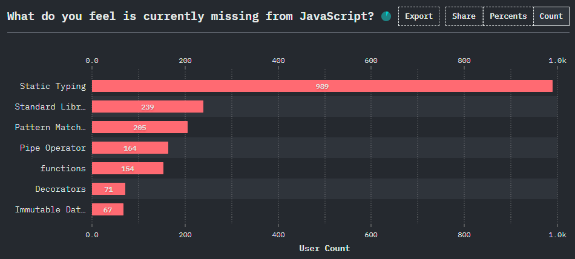
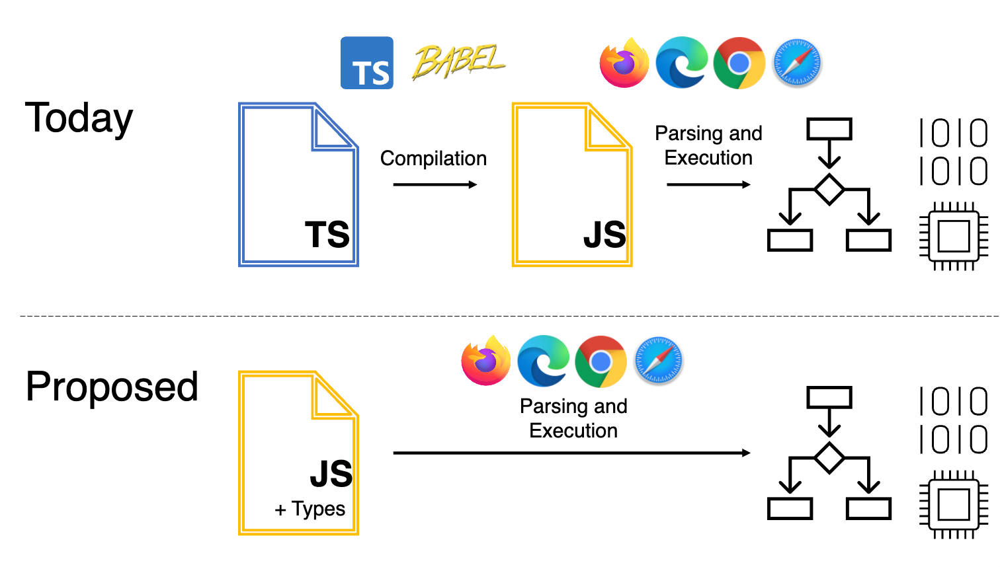
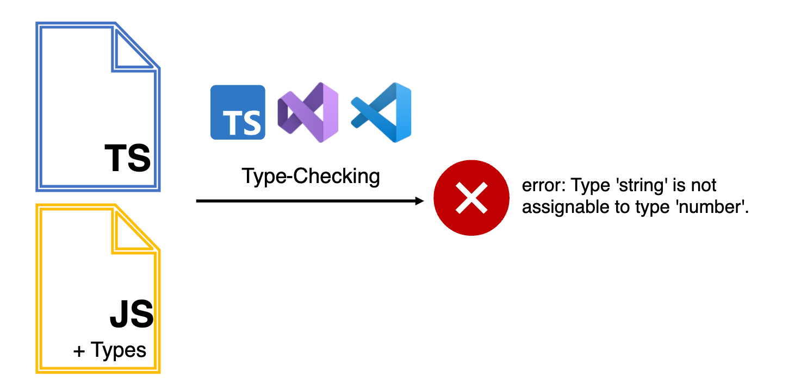

Recentemente uma [notícia](https://devblogs.microsoft.com/typescript/a-proposal-for-type-syntax-in-javascript/) causou um burburinho muito grande na comunidade de desenvolvimento do JavaScript, com um foco especial no TypeScript.

A grande notícia foi a apresentação de uma [proposta](https://github.com/giltayar/proposal-types-as-comments/) cunhada pelo Gil Tayar sobre como poderia ser possível a inclusão de tipos de dados iguais aos do TypeScript de forma nativa no JavaScript, ou seja, essencialmente removendo a etapa de compilação to TypeScript.

Isso deixou muitas pessoas muito estressadas falando que o JavaScript sempre deveria ser uma linguagem dinâmica e sem tipos nativos, no entanto, uma grande parcela da comunidade também ficou a favor dessa proposta! Vamos entender como tudo isso funciona!

## Contexto

Para podermos entender por que essa proposta é tão importante, primeiro temos que entender o contexto na qual ela está se baseando e por que ela foi criada.

### Como tudo começou

Na última década como um todo, várias pessoas e empresas tentam adicionar tipagem estática para o JavaScript em uma tentativa de fazer com que o desenvolvimento de sistemas mais complexos consiga se manter estável e escalável ao longo do tempo.

Inicialmente, o _JSDoc_ fez um ótimo papel em explicar o que estava acontecendo no código, principalmente no que diz respeito aos parâmetros que estavam chegando e aos que estavam saindo de uma função. Muito da popularidade do JSDoc vem do fato de que você não precisa fazer nada extra no seu pipeline ou no seu runtime para poder incluir os tipos, eles eram lidos como comentários:

```js
/**
* Função para somar dois números
* 
* @param {number} n1 Primeiro valor a ser adicionado
* @param {number} n2 Segundo valor a ser adicionado
* @returns {number} A soma dos dois valores
*/
function add (n1, n2) {
  return n1+n2
}
```

A ideia era muito boa, mas o JSDoc sofria com dois principais problemas:

-   O suporte ao JSDoc em editores de texto de forma nativa era escasso e não eram muitos que levavam em conta as regras desses comentários para poder, de fato, tipar o código. Ele funcionava como uma forma bacana de gerar documentações automaticamente, mas os tipos não eram forçados, então erros em runtime eram muito comuns
-   A documentação gerada pelo JSDoc não era parte do código, então você não precisava, de fato, atualizar um comentário do JSDoc se você alterasse a função, ou seja, os tipos acabavam ficando desatualizados muito rápido e muitas vezes, assim como documentações, acabavam não servindo para nada depois de muito tempo sem atualização

> Existe um terceiro problema. O JSDoc não permite todas as convergências de tipos e funcionalidades que o TypeScript suportaria, além do mais, é extremamente verboso escrever tipos complexos usando JSDoc.  
>   
> Se você quiser saber mais, [essa pergunta](https://github.com/giltayar/proposal-types-as-comments/#why-not-stick-to-existing-js-comment-syntax) responde várias dúvidas sobre o JSDoc.

A ideia do JSDoc era que você pudesse apenas comentar para fins de documentação, mas a proposta nunca foi a de forçar os tipos de dados sobre nenhum código.

### Sistemas de tipos

Com o passar do tempo, outras empresas como a Google, Facebook e Microsoft começaram a desenvolver seus próprios sistemas. E daí surgiram, respectivamente, o **Closure Compiler, Flow e o TypeScript**. Sendo o último o que teve mais tração e mais sucesso.

Esses sistemas de tipos, em especial o TypeScript, resolveram os dois principais problemas  que o JSDoc tinha, porque agora os tipos se tornavam parte do código, ou seja, você não conseguia atualizar os tipos sem atualizar o código e vice-versa. Da mesma forma que eles agora eram forçados sobre o código que você estava escrevendo, então não havia forma de você "passar por cima" e retornar um tipo diferente do definido.

Enquanto o Closure Compiler e o Flow tinham uma proposta menos invasiva na linguagem, o TypeScript deixou de lado todos os antigos costumes e, de fato, substituiu o JavaScript por sua própria sintaxe, se tornando um **superset** da linguagem original, ou seja, todo código JavaScript é um código TypeScript válido, mas o contrário não é sempre verdadeiro.

```js
function add (n1, n2) {
	return n1+n2
} // Funciona no TypeScript

function add (n1: number, n2: number): number {
	return n1+n2
} // Não funciona no JavaScript
```

Isso sozinho causou uma bagunça grande na comunidade, porque agora o pessoal precisaria usar o compilador do TypeScript (o `tsc`) para poder compilar o código antes de rodar, ou seja, adicionando mais uma etapa na, já complexa, pipeline de códigos JavaScript, mas tudo bem!

Isso não era um grande problema em 2012 porque muitos browsers não tinham atualizações constantes, outros browsers implementavam suas próprias versões do compilador do JS, e tínhamos ainda o problema do Internet Explorer, que eu nem vou entrar em detalhes. Então etapas de compilação eram normais, você tinha que compilar o seu código para suportar as N versões mais antigas do browser atual e também a última versão do Internet Explorer em algum momento.

Então não era um grande problema adicionar mais um componente para essa compilação, inclusive, a etapa de criar um bundle de código em um único arquivo super otimizado era bastante comum, não era nenhum problema completar a pipeline com mais uma etapa que, na maior parte, ia só remover os tipos do seu código para fazer com que ele fosse um código JavaScript válido de novo.

Mas com o passar do tempo, os browsers começaram a ficar ainda mais estáveis e começaram a ter suporte nativos a [módulos](/os-ecmascript-modules-estao-aqui/) então a etapa de bundling se tornou mais uma etapa opcional de otimização do que uma etapa necessária de compatibilidade, então o TypeScript acabou se tornando a pedra no sapato porque agora ele adicionava uma etapa que talvez não precisava existir.

Isso foi mitigado com a funcionalidade já presente do TypeScript poder checar tipos de arquivos JavaScript também, sem precisar de um arquivo com extensão diferente, se tornando mais um linter do que um type checker de verdade. Então você poderia escrever um código igual a esse:

```js
/**
* Função para somar dois números
* 
* @param {number} n1 Primeiro valor a ser adicionado
* @param {number} n2 Segundo valor a ser adicionado
* @returns {number} A soma dos dois valores
*/
function add (n1, n2) {
  return n1+n2
}
```

E adicionar um pequeno comentário `//@ts-check` no topo do arquivo para fazer com que o TypeScript checasse o seu código para inconsistencias de tipo. Mas se você só quisesse adicionar o suporte de tipos ao IDE, isso era totalmente possível usando o VSCode.

### Como estamos hoje

Como podemos ver na própria [proposta](https://github.com/giltayar/proposal-types-as-comments/), nos anos de 2020 e 2021 a pesquisa de satisfação [State of JS](https://stateofjs.com/), a mais importante e ampla pesquisa da comunidade sobre a linguagem, mostrou que a funcionalidade mais pedida na linguagem eram tipos estáticos.



Além disso, como também podemos ver na própria proposta que o TypeScript está entre as 10 "linguagens" mais usadas do mundo nos últimos anos consecutivos.

Então por que não ter o melhor dos dois mundos? Tanto a tipagem estática do TypeScript como parte do código (com a sintaxe e tudo) quanto não ter que adicionar algo em uma pipeline nova? E se o JavaScript fosse capaz de, sozinho, ignorar os tipos para que você pudesse rodar o seu código diretamente? Isso de forma completamente opcional, claro.

## Qual é a ideia

Um dos grandes problemas – que inclusive contribuiram para a demora dessa proposta – é o de que quando devs tinham que responder à pergunta: "Como deveriam ser os tipos no JavaScript?", algumas pessoas simplesmente falavam que eles deveriam ser completamente ignoráveis, comentários, outros falavam que eles deveriam ter algum tipo de significado para que o compilador pudesse saber como melhor otimizar o sistema.

Existiram ideias mais radicais dizendo que o sistema de tipos deveria alterar a semântica do programa e ditar o que poderia ou não ser feito, tornando o JS uma linguagem fortemente tipada.

Com o passar do tempo, a comunidade vem convergindo cada vez mais para a ideia de checagem de tipos em tempo te compilação, mas ignorar tipos em tempo de execução, ou seja, os tipos seriam como se fossem comentários no código, dariam uma ideia para quem estivesse desenvolvendo, mas não seriam forçados no browser, onde rodariam como se fossem um código JavaScript normal. A imagem a seguir explica muito bem o que seria essa ideia.



E então, para quem **quisesse** ter os seus tipos checados, poderiam utilizar as ferramentas como o TypeScript hoje.



Mas ai você deve estar se perguntando: E qual é a vantagem disso tudo? Se os tipos vão ser opcionais, porque já não deixamos tudo como está hoje?

A resposta é que ter tipos no JavaScript de forma nativa pode reduzir ainda mais a barreira que devs tem em entrar na linguagem sem precisar entender o que é TypeScript depois, ou seja, ficaria natural para qualquer pessoa desenvolvendo JS que existem tipos opcionais – isso foi feito antes inclusive, com o PHP na sua versão 7 – só de não exigirmos alguém conhecer algo completamente novo, reduzimos dramáticamente a barreira para entrada e uso da linguagem.

## Como tudo vai funcionar

Como estamos simplesmente adicionando uma possibilidade de transformar notação de tipos em algo nativo da linguagem, mas em forma de comentários, estamos essencialmente falando da possibilidade de adicionarmos novas regras de tokenização e interpretação ao JavaScript. Então essa proposta se resume, basicamente, a incluir a capacidade do JavaScript em entender e ignorar tipos no código.

Para isso algumas partes fundamentais do TypeScript precisam ser adicionadas ao engine do JavaScript:

-   Suporte a sintaxes como declarações de tipos com `:` em variáveis, argumentos e funções
-   O modificador de opcionalidade `?`, tornando um argumento opcional, por exemplo `(arg?: number)`
-   Declarações externas de tipos com `interface` e `type`, bem como extensões de tipos como `Pick`, `Omit` (não confirmado)
-   Suporte a generics `export type T<G>`
-   Modificadores de assertividade como `!` em `const a = foo!`, e `as` como em `const b = foo as string`

E então caímos em funcionalidades que são um pouco mais complicadas de separar do código, porque elas contém um significado mais profundo e mais amplo, por exemplo, modificadores de visibilidade como `private`, `public` e `protected` e até mesmo classes e métodos abstratos com `abstract`.

Esses [estão abertos para debates](https://github.com/giltayar/proposal-types-as-comments/#class-and-field-modifiers) para serem inclusos no escopo da linguagem mas, pelo menos ao meu ver, não vejo uma forma boa o suficiente de transformar essas estruturas em comentários, já que elas essencialmente estão incluindo mais semântica no código só por estarem lá.

### Tipos não suportados

No entanto, alguns tipos do TypeScript não vão poder ser suportados porque eles essencialmente contém comportamento de código, como é o caso do `enum`, que essencialmente cria um bloco de código novo no final da compilação.

Outro tipo não suportado seriam `namespaces`, que estão criando um outro escopo fora do escopo atual da função ou até mesmo do tipo.

E o terceiro tipo não suportado seria o que são chamados de propriedades como parâmetros (_Parameter Properties)_, que é o ato de declararmos propriedades que são inicializadas junto com a classe diretamente no construtor, por exemplo, em JavaScript, isso:

```js
class foo {
    #privado
    publico

	constructor (privado = 0, publico = 1) {
    	this.#privado = privado
        this.publico = publico
    }
}
```

Seria o equivalente a isso em TypeScript:

```typescript
class foo {
	constructor (
    	private privado: number = 0,
        public publico: number = 1
    ) { }
}
```

No entanto, declarações de campos dentro de classes usando anotações de tipos [são suportados](https://github.com/giltayar/proposal-types-as-comments/#classes-as-type-declarations).

> Para uma lista de todos os tipos suportados, dê uma olhada [na proposta oficial](https://github.com/giltayar/proposal-types-as-comments/#type-annotations).

### Tipos abertos para debate

Alguns tipos são suportados pela ideia de "tipos como comentários", mas aumentariam muito o escopo original da proposta, portando elas estão abertas para debate [no repositório oficial](https://github.com/giltayar/proposal-types-as-comments/#up-for-debate).

-   **Declarações de ambiente** com `declare` servem para informar type checkers como o TS que alguns tipos existem no escopo, ou até mesmo algum módulo, mesmo quando esse tipo ou módulo não tenha tipos declarados. São os famosos arquivos `.d.ts`.
-   [**Overloads**](https://github.com/giltayar/proposal-types-as-comments/#function-overloads) **de funções** é algo que pode ser implementado no sistema de tipos através do uso da redeclaração da assinatura da função mas omitindo seu corpo.

## Conclusão

Enquanto [é improvável a ideia de que o JavaScript vai aceitar checar tipos em runtime](https://github.com/giltayar/proposal-types-as-comments/#how-could-runtime-checked-types-be-added-in-future), essa proposta ainda cria uma certa esperança de que podemos, no futuro, ver algum tipo de opção de checagem interna opcional nativa.

No entanto, mesmo que [hajam pesquisas](http://goto.ucsd.edu/~pvekris/docs/safets.pdf) que mostram que a checagem de tipos no JavaScript adiciona um tempo irrisório de computação, ainda sim, não é do feitio da linguagem e (historicamente falando) não acredito que esse tipo de funcionalidade um dia vai estar disponível.

Para finalizar, quero lembrar que essa é uma proposta de **estágio 0**, ou seja, ela é só um rascunho que pode mudar a qualquer momento.

Se você não sabe como o JavaScript evolui e quer entender um pouco mais sobre o sistema de propostas, dê uma olhada no meu vídeo sobre esse assunto:


Enquanto ela não chegar pelo menos no **estágio 3** não temos como dizer que ela vai ou não ser no futuro, e essa resposta pode demorar **anos**. Como foi, por exemplo, o caso [da proposta do temporal](/temporal-api/) que está aberta há pelo menos 4 anos.

Então só nos resta esperar e, claro, comentar e ajudar na discussão da proposta lá no Github!
