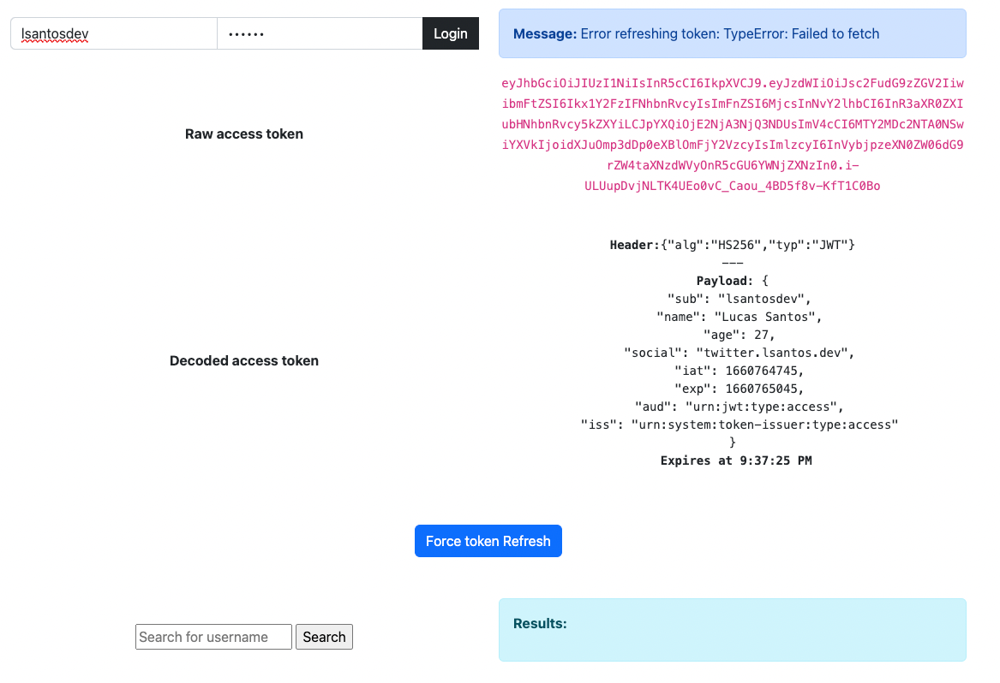
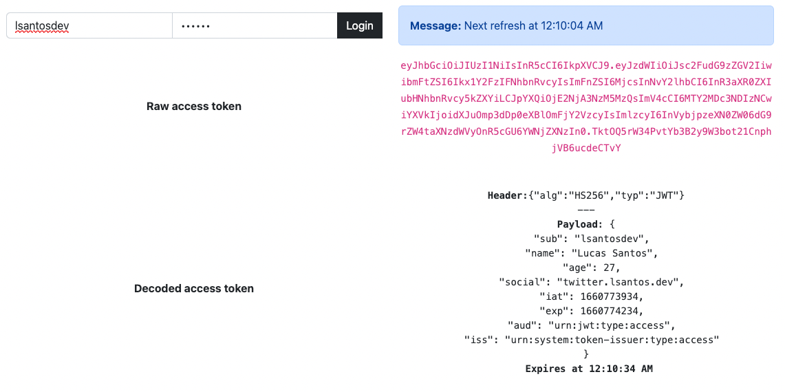
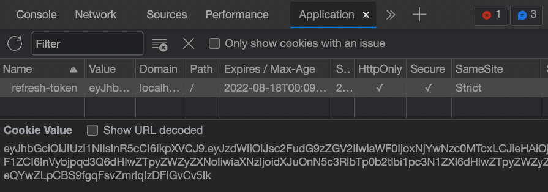
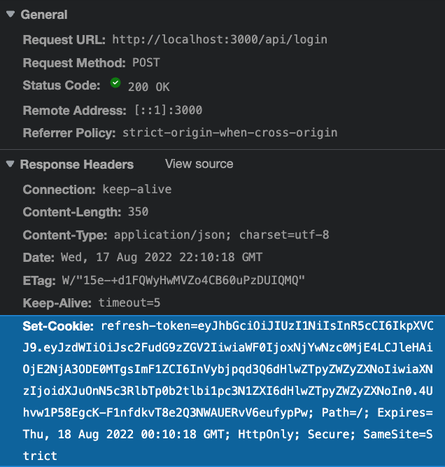
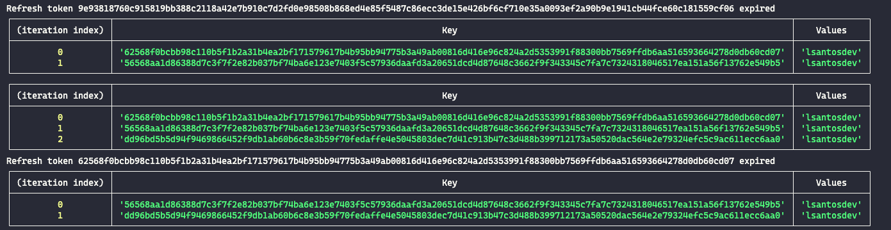

Segurança na Web é uma preocupação que deveria ser de todas as pessoas, principalmente as que estão atrás de projetos de desenvolvimento de software. Para devs, é muito mais preocupante criar sistemas que não seguem regras de segurança, pois qualquer tipo de ação maliciosa pode escalar muito rápido.

Se você já leu meus conteúdos, sabe que eu sou um grande fã do padrão da RFC7519, o famoso [JWT](https://jwt.io), tanto é que há um bom tempo eu cheguei a [escrever um artigo](https://medium.com/trainingcenter/jwt-usando-tokens-para-comunicação-eficiente-cf0551c0dd99) sobre como tudo funciona e explicar todos os detalhes da implementação de um token desse tipo.

O problema é que essa implementação é inerentemente **insegura**, e eu vou te dizer o por quê.<MarginNote>O código usado nesse exemplo pode ser encontrado [no meu GitHub](https://github.com/khaosdoctor/secure-jwt-tokens)</MarginNote>

https://github.com/khaosdoctor/secure-jwt-tokens

## O problema

Durante todo o período que os tokens JWT existem, eles já foram alvos de [diversas controvérsias](http://cryto.net/~joepie91/blog/2016/06/13/stop-using-jwt-for-sessions/), grande parte delas diz que os tokens são sujeitos a um tipo de ataque específico chamado XSS Attack.

> Se você ainda não sabe o que é um ataque XSS, deixo esse vídeo que fiz em parceria com o Código Fonte TV


Na maioria das aplicações, quando recebemos um token JWT do servidor, por via de regra pensamos:

> "Onde eu vou armazenar esse token para evitar ter que logar o usuário todas as vezes?" – Praticamente todo mundo

E, na maioria das vezes, o `LocalStorage` é o local escolhido. Ele é uma API de uso extremamente simples, armazena dados entre sessões e entre abas, então desde que a aba esteja no mesmo domínio, o browser vai armazenar o token e permitir que ele seja usado. É uma das formas mais eficientes de se fazer um login.

O maior problema é que ele pode ser acessado facilmente via JS, então qualquer site com uma vulnerabilidade a XSS, ou seja, a possibilidade de fazer um script malicioso ser executado no domínio, vai fazer com que o token seja automaticamente inseguro, porque qualquer pessoa pode ler esse token usando scripts.

## As soluções

Existem uma miríade de soluções para contornar esse problema, vamos explorar algumas delas.

### Token em memória

Para contornar esse problema, podemos usar uma outra técnica, ao invés de armazenar o token direto no `LocalStorage`, podemos deixá-lo apenas na memória, ou seja, a gente nunca armazena ele em lugar nenhum. Por exemplo:

```js
const _token = null

fetch('/login', {
    method: 'POST',
    headers: { 'Content-Type': 'application/json' },
    body: JSON.stringify({ username: 'usuario', password: 'senha' })
})
.then(data => data.json())
.then(token => { _token = token })
```

Fazer isso deixa o token virtualmente invisível para qualquer script já que não está no mesmo escopo do outro script e vive apenas na memória, mesmo que ele ainda seja acessível com um **memory dump**, mas para isso o atacante precisa estar com acesso ao computador da vítima.

Porém temos um lado negativo bastante forte, se o usuário recarregar a página ou trocar de aba, não vamos ter o token salvo nesse novo ambiente, então precisaríamos pedir o login do usuário a cada momento, o que não é uma excelente UX.

> Existe uma forma de contornar esse impecilho com o uso de tokens de longa duração, vamos falar sobre eles mais a frente.

### HttpOnly cookies

Para nivelar o conhecimento sobre cookies, um cookie é um pedaço de informação até 4kb que fica salvo no browser entre abas desde que as mesmas estejam no mesmo domínio. É uma outra forma de persistir dados mesmo quando a sessão do usuário terminou, uma vez que, mesmo que o usuário feche o browser, os cookies continuarão lá para um futuro uso.

> Cookies são muito usados naquelas caixas de seleção "Lembrar de mim" durante logins de usuário.

A outra opção aqui seria armazenar o token de acesso em um cookie com a flag `httpOnly` ativada. Cookies com essa propriedade não são acessíveis pelo JavaScript, apenas pelo browser e pelas requisições.

```js
const express = require('express');
const app = express();

// preparação de middlewares e etc...

app.post('/login', (req, res) => {
  // realiza o login...
  res.cookie('token', '12345', { maxAge: 5*60*1000, httpOnly: true, sameSite: 'strict' });
  res.send('OK')
})
```

Pela própria forma padrão como browsers funcionam, temos que eles enviam de volta para o servidor todos os cookies setados por esse mesmo domínio a cada requisição, ou seja, em todas as chamadas subsequentes a essa para nosso backend iríamos ter um cookie com o nosso token de usuário por lá e ai poderíamos validar através deles ao invés de usar um header `Authorization: Bearer` como é o comum.

O problema é que tokens JWT podem armazenar muita informação e, muitas vezes, esses tokens ultrapassam os 4kb de limite, então é um pouco arriscado usar esses Cookies para armazenar tokens de acesso, fora que eles ficam salvos no computador do usuário e, apesar de não serem alvo de XSS, poderiam ser vítimas de um outro tipo de ataque chamado **Cross Site Requet Forgery** ou CSRF.

> O CSRF pode ser mitigado e prevenido com o uso de outros tokens anti-CSRF, que é um assunto para o próximo artigo.

## Um misto de ideias

Existem outras soluções possíveis que vou falar no final deste artigo e também vou explorar em mais detalhes nos artigos futuros, mas e se a gente usasse uma mistura das duas soluções que eu propus antes?

A ideia é que façamos o login do usuário, armazenamos o token de acesso direto na memória, ninguém vai ter acesso a ele, mas como lidamos com a questão de manter os logins?

### Refresh Tokens

Uma das saídas que temos para lidar com o caso de tokens voláteis como é o caso de armazenamento em memória são os chamados **refresh tokens**. A ideia é que um token de acesso seja de curta duração (no máximo 15 minutos) enquanto um token de refresh tenha uma duração mais longa (algumas horas ou dias).

Um token de refresh tem como objetivo somente te dar um novo token de acesso, então ele não tem nenhuma informação interna, e nem deveria ter. Por isso ele é um token extremamente leve que pode ser armazenado em um Cookie.

Basicamente se tivermos uma rota como essa, qualquer token de refresh válido poderia criar um novo token de acesso:

```js
router.post('/refresh', withRefreshAuth, (_, res) => {
  const accessToken = createAccessToken(user)
  const refreshToken = createRefreshToken(user)

  setRefreshCookie(res, refreshToken)
  res.json({ accessToken })
})
```

Note que também estamos recriando o token de refresh para evitar de ter outro endpoint para isso, então quando rotacionamos um, já rotacionamos os dois.

Essa solução ainda sim não é a ideal, porque ainda sim temos um token que pode produzir outros tokens. A maior diferença é que podemos manter um controle maior sobre os tokens de acesso que foram criados e podemos diminuir a superfície de ataque ao ter esses tokens com uma duração muito menor.

### Fingerprinting

Uma forma que podemos manter os tokens de refresh seguros é o uso do que chamamos de _fingerprints_, eles se parecem bastante com tokens CSRF. A ideia é ter um valor único que é gerado do lado do servidor e armazenado como um Cookie seguro.

Além disso a fingerprint é incluída no token, de forma que ela não possa ser alterada sem invalidar o token.<MarginNote>O código para este exemplo está no branch `fingerprinting` do [repositório do GitHub](https://github.com/khaosdoctor/secure-jwt-tokens). Veja o arquivo `handlers.ts` e `index.js` para as [diferenças](https://github.com/khaosdoctor/secure-jwt-tokens/compare/fingerprinting)</MarginNote>

Quando o usuário fizer uma request para um refresh, a fingerprint irá junto com o token de refresh, podemos então decodificar o token e verificar se a fingerprint do token é a mesma do Cookie, se por algum motivo a fingerprint do Cookie for diferente da que está no token, teremos um acesso inválido.

Além disso, podemos criar um hash do nosso refresh token e armazenar esse hash em um banco de dados temporário (como o Redis) para poder invalidar sessões ou tokens comprometidos como medida de proteção adicional.

> Para não deixar esse artigo muito longo, vou escrever um outro somente sobre como foi feito o processo de fingerprinting.

## Implementação

Para implementarmos uma solução desse tipo vamos simular um app que realiza buscas de usuário, vamos ter alguns usuários em um banco de dados local e vamos usar dois tokens diferentes para poder realizar a autenticação. O código deste repositório está no meu GitHub:

https://github.com/khaosdoctor/secure-jwt-tokens

### Backend

Vamos começar com o backend e, para simular uma aplicação no browser, eu construí um pequeno app usando somente JavaScript e HTML pra que seja muito mais fácil de ver o que acontece por baixo dos panos.

> **Nota:** Lembrando que, nesse exemplo, estou deixando intencionalmente de fora algumas boas práticas em prol da didática.

> **Nota 2:** Não vou descrever os arquivos básicos (package.json, tsconfig.json, etc) você pode ir até o repositório para copiá-los.

Para essa aplicação vamos usar algumas bibliotecas como dependências diretas, então rode o comando de instalação:

```bash
npm i cookie-parser dotenv express jsonwebtoken
```

Eu instalei algumas bibliotecas de desenvolvimento, principalmente pelo uso do TypeScript:

```bash
npm i -D @types/cookie-parser @types/node @types/express @types/jsonwebtoken copyfiles rimraf ts-node ts-node-dev typescript
```

No meu `package.json` eu também criei alguns scripts para facilitar o desenvolvimento, o arquivo ficou assim:

```json
{
  "name": "jwt",
  "version": "0.0.1",
  "description": "",
  "main": "dist/backend.js",
  "scripts": {
    "dev": "tsnd src/index.ts",
    "build": "rimraf ./dist && tsc && copyfiles -u 1 \"./src/frontend/**/*.*\" ./dist",
    "start": "node dist/index.js"
  },
  "keywords": [],
  "author": "Lucas Santos <hello@lsantos.dev> (https://lsantos.dev/)",
  "license": "MIT",
  "dependencies": {
    "cookie-parser": "^1.4.6",
    "dotenv": "^16.0.1",
    "express": "^4.18.1",
    "jsonwebtoken": "^8.5.1"
  },
  "devDependencies": {
    "@types/cookie-parser": "^1.4.3",
    "@types/express": "^4.17.13",
    "@types/jsonwebtoken": "^8.5.8",
    "@types/node": "^18.7.3",
    "copyfiles": "^2.4.1",
    "rimraf": "^3.0.2",
    "ts-node": "^10.9.1",
    "ts-node-dev": "^2.0.0",
    "typescript": "^4.7.4"
  }
}
```

Pulando a criação básica do app, vamos criar uma pasta `src` e dentro dela vamos começar criando nosso banco de dados de usuários:

```ts
export type User = {
  username: string
  name: string
  age: number
  social: string
  password: string
}

export const users: User[] = [
  {
    name: 'Lucas Santos',
    age: 27,
    social: 'twitter.lsantos.dev',
    username: 'lsantosdev',
    password: '123456'
  },
  {
    name: 'Rosa Barnett',
    age: 33,
    social: 'http://ko.st/wa',
    username: 'rosabarnett',
    password: '123456'
  },
  {
    name: 'Russell Spencer',
    age: 66,
    social: 'http://egki.tp/ecbu',
    username: 'russellspencer',
    password: '123456'
  }
]
```

Agora, vamos criar nosso ponto de entrada para a nossa aplicação, que vai ser o arquivo `index.ts`, vamos começar importando tudo que a gente precisa usar e definindo os middlewares globais:

-   Vamos usar o `cookie-parser` para poder parsear os headers `Cookie` que o browser vai enviar de volta pra gente, caso contrário não teremos a chave `req.cookies`
-   Para fazer o parsing do corpo da requisição (para a rota de login), estou usando o `express.json()`

```ts
import path from 'path'
import dotenv from 'dotenv'
import express from 'express'
import cookieParser from 'cookie-parser'

dotenv.config()

const app = express()
app.use(express.json())
app.use(cookieParser())
```

Primeiro vamos carregar as nossas variáveis do nosso arquivo `.env` que deve estar na raiz da nossa aplicação e tem o seguinte conteúdo:

```bash
ACCESS_TOKEN_SECRET=secret_access_token
REFRESH_TOKEN_SECRET=secret_refresh_token
ACCESS_TOKEN_DURATION_MINUTES=5
REFRESH_TOKEN_DURATION_MINUTES=120
```

> Esse arquivo está também no repositório, mas lembre-se que não é uma boa prática mandar variáveis de ambiente para o repositório público. Além disso, os secrets de cada token devem ser muito mais seguros do que os que coloquei aqui.

Para ficar mais fácil de entender, vou separar os handlers de cada rota em outro arquivo chamado `handlers.ts`, que vamos criar depois, mas já podemos importar ele aqui também:

```ts
import path from 'path'
import dotenv from 'dotenv'
import express from 'express'
import cookieParser from 'cookie-parser'

import { apiRoutes } from './handlers'

dotenv.config()

const app = express()
app.use(express.json())
app.use(cookieParser())
```

Nosso frontend precisa estar no mesmo domínio da nossa aplicação então vou usar o próprio express para servir os arquivos HTML através do `express.static()`. Vamos colocar todo o site atrás de um caminho `/site` para poder separar ele da API:

```ts
// Código anterior

app.use('/site', 
  express.static(
    	path.resolve(__dirname, './frontend'), 
    	{ cacheControl: false }
  )
)
```

Depois vamos usar um `Router` para poder trazer as nossas rotas da API:

```ts
app.use('/api', apiRoutes)
```

E por fim vamos ouvir a porta 3000:

```ts
app.listen(3000, () => console.log('JWT example listening on port 3000!'))
```

Agora vamos criar um novo arquivo chamado `handlers.ts` onde vamos criar toda a nossa lógica. Primeiro vamos importar as funções que vamos utilizar:

```ts
import { createHmac } from 'crypto'
import { 
  NextFunction, 
  Request, 
  RequestHandler, 
  Response, 
  Router 
} from 'express'
import jwt, { JwtPayload } from 'jsonwebtoken'
import { User, users } from './users'
```

Então se você estiver usando TypeScript, vamos estender duas interfaces. A primeira vai ser a própria `Response` do Express para podermos adicionar a tipagem ao objeto `res.locals` que é um objeto onde podemos incluir qualquer informação para passar para os próximos middlewares.

No nosso caso, vamos ter um objeto que vai conter o nosso usuário (que já está tipado no nosso "banco de dados") e o hash do nosso refresh token:

```ts
interface ExtendedResponse extends Response<any, { user: Partial<User>; refreshHash: string }> {}
```

Vamos criar um outro tipo que será o payload do nosso token, que é todo o objeto de usuário excluindo a senha e o username (que está na chave `sub`):

```ts
interface AccessTokenPayload extends JwtPayload, Omit<User, 'username' | 'password'> {}
```

Além disso vamos simular um banco de dados de sessões usando um `Map`, onde vamos armazenar os nossos tokens de refresh junto com a qual usuário eles pertencem:

```ts
const refreshTokenDB = new Map<string, string>()
```

Por fim vamos criar o nosso router para começar a criação das rotas:

```ts
const router = Router()
```

#### Login

Nossa API vai ter 3 rotas, a primeira será a rota de login, que será completamente aberta, a ideia dessa rota é que a gente receba o usuário e a senha no corpo da requisição, verifique se o usuário existe no banco de dados, se sim vamos gerar um token de acesso e um token de refresh para esse usuário, setar os cookies necessário e retornar o token de acesso direto no corpo da requisição para poder ser salvo pelo front-end.

```ts
router.post('/login', (req, res: ExtendedResponse) => {
  const { username, password } = req.body
  const user = users.find((user) => user.username === username && user.password === password)
  if (!user) return res.status(401).send('Unauthorized')

  const accessToken = createAccessToken(user)
  const refreshToken = createRefreshToken(user)

  setRefreshCookie(res, refreshToken)
  res.json({ accessToken })
})
```

Estou usando algumas funções auxiliares para podermos criar os tokens, vamos criá-las, começando pelas funções de criação de tokens.

A criação do token de acesso é bastante simples, vamos apenas assinar um novo jwt com todos os dados do usuário (exceto a senha) e fazer com que ele dure apenas 5 minutos:

```ts
const createAccessToken = (user: User) => {
  return jwt.sign(
    { sub: user.username, name: user.name, age: user.age, social: user.social },
    process.env.ACCESS_TOKEN_SECRET!,
    {
      audience: 'urn:jwt:type:access',
      issuer: 'urn:system:token-issuer:type:access',
      expiresIn: `${process.env.ACCESS_TOKEN_DURATION_MINUTES}m`
    }
  )
}
```

> Perceba que estou usando o `audience` e `issuer` com URNs, isso é uma boa prática para poder identificar quem está gerando o token e para quem ele se destina.

O token de refresh é um pouco mais complicado porque temos que adicionar ele ao nosso banco de dados e criar um timeout para expirar este token. Em bancos como o Redis, esse tipo de função (chamado de TTL) já é implementado por padrão.

Primeiro vamos criar um token assinado, o `sub` do token será o username do usuário, o tipo de token é definido na `audience` e ele dura 120 minutos:

```ts
const createRefreshToken = (user: User) => {
  const token = jwt.sign({ sub: user.username }, process.env.ACCESS_TOKEN_SECRET!, {
    audience: 'urn:jwt:type:refresh',
    issuer: 'urn:system:token-issuer:type:refresh',
    expiresIn: `${process.env.REFRESH_TOKEN_DURATION_MINUTES}m`
  })
}
```

Depois vamos criar um hash do nosso token para salvar no banco de dados, salvar a sessão e criar o timeout, depois disso vamos retornar o token:

```ts
const createRefreshToken = (user: User) => {
  const token = jwt.sign({ sub: user.username }, process.env.ACCESS_TOKEN_SECRET!, {
    audience: 'urn:jwt:type:refresh',
    issuer: 'urn:system:token-issuer:type:refresh',
    expiresIn: `${process.env.REFRESH_TOKEN_DURATION_MINUTES}m`
  })
  const tokenHash = createHmac('sha512', process.env.REFRESH_TOKEN_SECRET!).update(token).digest('hex')

  refreshTokenDB.set(tokenHash, user.username)
  setTimeout(() => {
    refreshTokenDB.delete(tokenHash)
    console.log(`Refresh token ${tokenHash} expired`)
    console.table(refreshTokenDB.entries())
  }, 5 * 60 * 1000)

  console.table(refreshTokenDB.entries())
  return token
}
```

Outra função que estou usando bastante é um utilitário só para evitar a repetição de código para criar os cookies, ela só faz a criação do Cookie de forma segura:

```ts
const setRefreshCookie = (res: ExtendedResponse, token: string) => {
  res.cookie('refresh-token', token, {
    httpOnly: true,
    secure: true,
    sameSite: 'strict',
    expires: new Date(Date.now() + Number(process.env.REFRESH_TOKEN_DURATION_MINUTES) * 60 * 1000)
  })
}
```

Para ficar mais fácil, vou descrever os objetos que a gente está usando para configurar os cookies:

-   `httpOnly`: Impede que o token seja acessível pelo JS
-   `secure`: Impede o uso do cookie fora de ambientes HTTPS
-   `sameSite`: Os cookies só podem ser usados no mesmo domínio
-   `expires`: Data de expiração do token

#### Refresh

A próxima rota que temos que criar é a rota de refresh, que vai receber o cookie com o refresh token e irá fazer a lógica para criar um novo token de acesso. Mas essa rota só pode ser acessível se o token de refresh estiver presente, então para isso vou criar um middleware de autenticação.

A ideia desse middleware é que a gente primeiro pegue o Cookie de dentro da request e verifique se ele existe, se não vamos retornar um erro:

```ts
const withRefreshAuth = (req: Request, res: ExtendedResponse, next: NextFunction) => {
  const token = req.cookies['refresh-token']
  if (!token) return res.status(401).send('Unauthorized')
}
```

Depois disso vamos ver se o token é válido, para isso vamos usar a função `jwt.verify` que, ao mesmo tempo, valida e decodifica o token. Se o processo correu com sucesso devemos cair dentro do nosso `try`, se não, vamos retornar um erro de token inválido, perceba que eu estou passando a audience para o verificador para que ele também possa atestar a validade desse token:

```ts
const withRefreshAuth = (req: Request, res: ExtendedResponse, next: NextFunction) => {
  const token = req.cookies['refresh-token']
  if (!token) return res.status(401).send('Unauthorized')
  try {
    jwt.verify(token, process.env.ACCESS_TOKEN_SECRET!, {
      audience: 'urn:jwt:type:refresh'
    })
  } catch (error) {
    return res.status(401).send('Unauthorized')
  }
}
```

Dentro do nosso bloco de sucesso, vamos então gerar um hash desse token e inclui-lo dentro de `res.locals`:

```ts
const withRefreshAuth = (req: Request, res: ExtendedResponse, next: NextFunction) => {
  const token = req.cookies['refresh-token']
  if (!token) return res.status(401).send('Unauthorized')
  try {
    jwt.verify(token, process.env.ACCESS_TOKEN_SECRET!, {
      audience: 'urn:jwt:type:refresh'
    })
    const tokenHash = createHmac('sha512', process.env.REFRESH_TOKEN_SECRET!).update(token).digest('hex')
    res.locals.refreshHash = tokenHash
    next()
  } catch (error) {
    return res.status(401).send('Unauthorized')
  }
}
```

Agora podemos criar a nossa rota com o middleware de autenticação:

```ts
router.post('/refresh', withRefreshAuth, (_, res) => {})
```

A ideia da rota é simples, vamos fazer o seguintes passos:

1.  Já validamos o token, então temos que verificar se ele existe no nosso banco de dados
2.  Se existir, vamos buscar o usuário com o qual ele está relacionado
3.  Geramos um novo token de acesso e um novo token de refresh
4.  Enviamos o token de refresh via cookie e retornamos o token de acesso

O código final fica assim:

```ts
router.post('/refresh', withRefreshAuth, (_, res) => {
  const username = refreshTokenDB.get(res.locals.refreshHash)
  const user = users.find((user) => user.username === username)
  if (!username || !user) return res.status(403).send('Could not find user for this refresh token')

  const accessToken = createAccessToken(user)
  const refreshToken = createRefreshToken(user)

  setRefreshCookie(res, refreshToken)
  res.json({ accessToken })
})
```

#### Uma rota protegida

Agora vamos criar a nossa rota de usuário, a rota que será protegida pelo nosso token JWT, ela vai retornar um dos nossos usuários do banco de dados, mas ela precisa estar protegida pelo token de acesso (não o de refresh), vamos fazer outro middleware para ele.

A ideia é mais simples ainda, só precisamos buscar o token de dentro do header `Authorization` e, se ele for válido, então podemos decodificar o mesmo e criar um objeto de usuário dentro de `res.locals`:

```ts
const withAccessAuth = (req: Request, res: ExtendedResponse, next: NextFunction) => {
  const token = req.headers['authorization']?.split('Bearer ')[1]
  if (!token) return res.status(401).send('Unauthorized')
  try {
    const { sub, name, age, social } = jwt.verify(token, process.env.ACCESS_TOKEN_SECRET!, {
      audience: 'urn:jwt:type:access'
    }) as AccessTokenPayload

    res.locals.user = { username: sub!, name, age, social }
    next()
  } catch (error) {
    return res.status(401).send('Unauthorized')
  }
}
```

> Lembrando que para esse tipo de rota protegida, é padrão enviarmos um header do tipo `Authorization: Bearer <token>`, por isso que estamos quebrando a string.

Já podemos criar a nossa rota protegida:

```ts
router.get('/users/:username', withAccessAuth, (req, res) => {
  const user = users.find((user) => user.username === req.params.username)
  if (!user) return res.status(404).send('User not found')

  res.json(user)
})
```

A ideia é simplesmente buscar um dado no banco e retornar esse dado, sempre validando se o token passado é válido.

Com isso terminamos a criação das nossas rotas, precisamos só exportar o nosso router:

```ts
export const apiRoutes = router
```

### Front end

Agora que terminamos o back end da nossa aplicação, vamos começar a trabalhar no front end. Para facilitar, não usei nenhum tipo de framework, mas criei tudo do zero usando somente o bootstrap como CSS e um arquivo JS onde vamos colocar nossa lógica.

Para o arquivo HTML, não faz muito sentido explicar o que está acontecendo nele, até porque ele só tem a marcação da página, então vou apenas deixar o código que está no arquivo `index.html` dentro de uma pasta `src/frontend` por aqui para podermos olhar:

```html
<!DOCTYPE html>
<html lang="en">
  <head>
    <meta charset="UTF-8" />
    <meta http-equiv="X-UA-Compatible" content="IE=edge" />
    <meta name="viewport" content="width=device-width, initial-scale=1.0" />
    <!-- CSS only -->
    <link
      href="https://cdn.jsdelivr.net/npm/bootstrap@5.2.0/dist/css/bootstrap.min.css"
      rel="stylesheet"
      integrity="sha384-gH2yIJqKdNHPEq0n4Mqa/HGKIhSkIHeL5AyhkYV8i59U5AR6csBvApHHNl/vI1Bx"
      crossorigin="anonymous"
    />
    <title>Safe JWT</title>
  </head>
  <body class="m-3">
    <div class="container">
      <div class="row align-items-center">
        <div class="col text-center">
          <form id="loginForm" class="input-group mb-3">
            <input
              required
              type="text"
              name="username"
              class="form-control"
              autocomplete="username"
              placeholder="Username"
              value="lsantosdev"
            />
            <input
              required
              type="password"
              class="form-control"
              autocomplete="current-password"
              name="password"
              placeholder="Password"
              value="123456"
            />
            <input id="loginAction" class="btn btn-dark" type="submit" value="Login" />
          </form>
        </div>
        <div class="col text-left">
          <div class="alert alert-primary show fade" role="alert">
            <strong>Message:</strong> <span class="login-result"></span>
          </div>
        </div>
      </div>

      <div class="row mb-5 align-items-center">
        <div class="col-6 text-center"><strong>Raw access token</strong></div>
        <div class="col-6 text-center"><code id="rawToken"></code></div>
      </div>

      <div class="row align-items-center">
        <div class="col-6 text-center"><strong>Decoded access token</strong></div>
        <div class="col-6 text-center"><pre id="decodedToken"></pre></div>
      </div>

      <div class="row align-items-center mt-5 mb-5">
        <div class="col-12 text-center"><button type="button" class="btn btn-primary" id="refreshAction" disabled>Force token Refresh</button></div>
      </div>

      <div class="row align-items-center">
        <div class="col-6 text-center">
          <form id="userForm">
            <input required type="text" name="username" autocomplete="username" placeholder="Search for username" />
            <input id="userAction" type="submit" value="Search" />
          </form>
        </div>
        <div class="col-6 text-left">
          <div class="alert alert-info show fade" role="alert">
            <strong>Results:</strong>
            <pre class="user-result"></pre>
          </div>
        </div>
      </div>
    </div>

    <script src="index.js"></script>
    <script
      src="https://cdn.jsdelivr.net/npm/bootstrap@5.2.0/dist/js/bootstrap.bundle.min.js"
      integrity="sha384-A3rJD856KowSb7dwlZdYEkO39Gagi7vIsF0jrRAoQmDKKtQBHUuLZ9AsSv4jD4Xa"
      crossorigin="anonymous"
    ></script>
  </body>
</html>
```

No final, esse HTML e CSS deve nos dar uma página assim (não sou tão bom com design):



Dentro da mesma pasta `frontend` vamos criar um arquivo `index.js` e fazer algumas preparações.

Primeiro, para podermos trabalhar mais facilmente, eu criei uma função para atualizar as mensagens de erro no app:

```js
function updateMessage(message, selector = '.login-result') {
  const infoBox = document.querySelector(selector)
  infoBox.innerHTML = message
}
```

Depois, vamos criar um ambiente seguro para guardar o nosso token de acesso. Sei que é tentador colocar essa informação no objeto `document`, mas infelizmente esse é um objeto global que está acessível por qualquer script dentro da página, vamos tentar manter ele mais restrito.

Além disso, uma ideia bacana seria que, quando esse token fosse atualizado, a tela fosse automaticamente atualizada também, por isso vamos usar um [Proxy](https://developer.mozilla.org/en-US/docs/Web/JavaScript/Reference/Global_Objects/Proxy) junto com um [Symbol](https://medium.com/trainingcenter/javascript-symbols-decifrando-o-mist%C3%A9rio-383e359e64e3).

Vamos começar criando o Symbol:

```js
const tokenSymbol = Symbol.for('accessToken')
```

Agora vamos criar um Proxy, o Proxy é um objeto que intercepta chamadas a outros objetos, como ele não trabalha sobre primitivos (como strings) vamos criar um objeto e usar o Symbol como chave para poder acessar o nosso access token:

```js
const internalToken = new Proxy({ [tokenSymbol]: null }, {})
```

O valor inicial vai ser nulo, e o segundo objeto serão as configurações do nosso Proxy, o primeiro deles vai ser a configuração do `getter`, que é quando alguém tenta trazer o valor desse objeto.

Como estou trabalhando com o objeto do token, não tenho como retornar o proxy em si, então vou usar a API de [Reflection](https://medium.com/trainingcenter/reflection-em-javascript-73fc0e702e2) para poder obter a propriedade que está sendo chamada, se for uma função, vamos retornar ela já com o `this` correto, se não, vamos retornar apenas o valor:

```js
const internalToken = new Proxy({ [tokenSymbol]: null }, {
    get(target, prop) {
      const primitive = Reflect.get(target, tokenSymbol)
      const value = primitive[prop]
      return typeof value === 'function' ? value.bind(primitive) : value
    },
})
```

O próximo é o `setter` que é onde vamos fazer a mágica:

```js
const internalToken = new Proxy(
  { [tokenSymbol]: null },
  {
    get(target, prop) {
      const primitive = Reflect.get(target, tokenSymbol)
      const value = primitive[prop]
      return typeof value === 'function' ? value.bind(primitive) : value
    },
    set(target, _, value) {
      document.querySelector('#rawToken').innerHTML = value

      const header = atob(value.split('.')[0])
      const payload = JSON.parse(atob(value.split('.')[1]))
      document.querySelector(
        '#decodedToken'
      ).innerHTML = `<strong>Header:</strong>${header}<br>---<br><strong>Payload</strong>: ${JSON.stringify(
        payload,
        null,
        2
      )}<br> <b>Expires at ${new Date(payload.exp * 1000).toLocaleTimeString()}</b>`
      document.querySelector('#refreshAction').disabled = false
      return Reflect.set(target, tokenSymbol, value)
    }
  }
)
```

Basicamente o que estamos fazendo é atualizando a nossa página com as informações que recebemos e, no final, estamos usando novamente a api de reflection, só que dessa vez para setar o valor do Symbol com o novo token.

#### Login

Vamos fazer a ação de login ao clicar no botão, para isso vamos adicionar um event listener que vai converter os dados do nosso formulário em um `FormData` e depois em JSON para podermos usar o `fetch` para mandar para a nossa rota:

```js
document.querySelector('#loginForm').addEventListener('submit', async (e) => {
  e.preventDefault()
  updateMessage('Logging in...')

  const form = new FormData(e.target)
  const data = Object.fromEntries(form.entries())
  const result = await fetch('/api/login', {
    method: 'POST',
    headers: { 'Content-Type': 'application/json' },
    body: JSON.stringify(data)
  })
})
```

Depois de receber a resposta, vamos tratar o resultado e atualizar a variável do token com o nosso token de acesso:

```js
document.querySelector('#loginForm').addEventListener('submit', async (e) => {
  e.preventDefault()
  updateMessage('Logging in...')

  const form = new FormData(e.target)
  const data = Object.fromEntries(form.entries())
  const result = await fetch('/api/login', {
    method: 'POST',
    headers: { 'Content-Type': 'application/json' },
    body: JSON.stringify(data)
  })

  updateMessage(result.ok ? 'Login successful' : `Login failed with ${result.status}`)
  if (result.status === 200) {
    const response = await result.json()
    internalToken[tokenSymbol] = response.accessToken
  }
})
```

#### Silent Refresh

Uma outra tecnica que é bastante usada com tokens de refresh é o _silent refresh_, que é o ato de fazer o refresh do token de acesso antes de o mesmo estar vencido, então digamos que nosso token de acesso dure por 5 minutos, a cada 4 minutos e meio faremos uma requisição silenciosamente ao endpoint de `/refresh` e ele nos dará um novo token de acesso bem como um novo refresh token.

Para fazer isso é bastante simples, basta usarmos a nossa ação de fazer login para setar um intervalo que irá chamar uma função que irá fazer o refresh dos tokens. Vamos alterar o nosso código do login para incluir duas outras linhas:

```js
document.querySelector('#loginForm').addEventListener('submit', async (e) => {
  e.preventDefault()
  updateMessage('Logging in...')

  const form = new FormData(e.target)
  const data = Object.fromEntries(form.entries())
  const result = await fetch('/api/login', {
    method: 'POST',
    headers: { 'Content-Type': 'application/json' },
    body: JSON.stringify(data)
  })

  updateMessage(result.ok ? 'Login successful' : `Login failed with ${result.status}`)
  if (result.status === 200) {
    const response = await result.json()
    internalToken[tokenSymbol] = response.accessToken
    setInterval(refreshToken, refreshIntervalMinutes)
    updateMessage('Next refresh at ' + new Date(Date.now() + refreshIntervalMinutes).toLocaleTimeString())
  }
})
```

E vamos adicionar uma nova variável no topo do arquivo para dizer quando queremos fazer o refresh:

```js
const refreshIntervalMinutes = 4.5 * 60 * 1000
```

E vamos, claro aproveitar para fazer a função de refresh que vai só fazer uma chamada com o `fetch`:

```js
function refreshToken() {
  updateMessage('Refreshing token...')
  fetch('/api/refresh', {
    method: 'POST'
  })
    .then((res) => res.json())
    .then(({ accessToken }) => {
      internalToken[tokenSymbol] = accessToken
      updateMessage('Next refresh at ' + new Date(Date.now() + refreshIntervalMinutes).toLocaleTimeString())
    })
}
```

### Buscando o usuário

Para fazer a chamada de busca ao usuário vamos usar a mesma técnica, enviando os dados do formulário para a nossa rota protegida com um cabeçalho `Authorization`:

```js
document.querySelector('#userForm').addEventListener('submit', async (e) => {
  e.preventDefault()
  if (!internalToken) return updateMessage('Login first', '.user-result')
  updateMessage('Searching user...', '.user-result')

  const form = new FormData(e.target)
  const data = Object.fromEntries(form.entries())
  const result = await fetch(`/api/users/${data.username}`, {
    headers: {
      Authorization: `Bearer ${internalToken}`
    }
  })
  updateMessage(result.ok ? 'User found' : `Search failed with ${result.status}`, '.user-result')
  if (result.status === 200) {
    const response = await result.json()
    updateMessage(JSON.stringify(response, null, 2), '.user-result')
  }
})
```

### Force refresh

O último passo é dar vida ao botão de forçar o refresh, que é basicamente chamar a nossa função de refresh que fizemos antes:

```js
document.querySelector('#refreshAction').addEventListener('click', refreshToken)
```

## Resultado

O resultado pode ser visto quando clicamos no botão de login:



Vamos ter os dados do token de acesso disponíveis pelo JavaScript através da memória, mas não conseguimos o refresh token a não ser que abramos o DevTools na guia `application`:



Também é possível ver que fizemos a requisição que retornou o cookie para nós:



Do lado do servidor, podemos ver que os tokens estão sendo setados e expirados conforme o tempo vai passando:



Veja como ficou o resultado final animado:

<Video src="/videos/jwt-seguro/Kap-Recording---2022-08-18-0.05.51.mp4" />

## Conclusão

Essa saga ainda não terminou! Vamos explorar muito mais sobre como podemos armazenar e utilizar tokens de forma segura nos próximos artigos! Duas leituras que recomendo bastante são [as do blog da Hasura sobre tokens](https://hasura.io/blog/best-practices-of-using-jwt-with-graphql/) e [esse artigo super legal do Ryan Chenkie](https://medium.com/@ryanchenkie_40935/react-authentication-how-to-store-jwt-in-a-cookie-346519310e81).

Não deixa de voltar para ver e [assinar a newsletter](https://news.lsantos.dev) para conteúdo novo e exclusivo!
