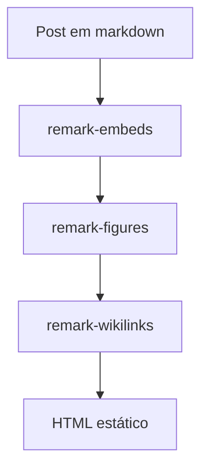
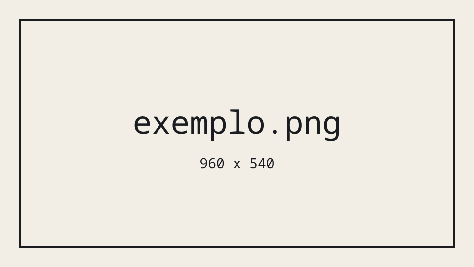
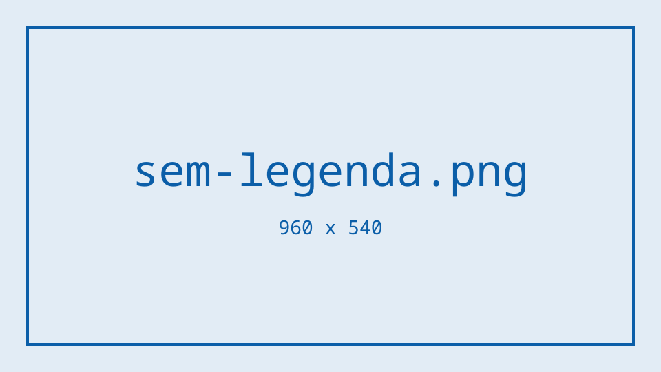

Esta página existe para ser aberta no navegador. Cada seção abaixo nomeia um recurso, explica em uma ou duas frases para que ele serve, mostra o código exato que você digitaria e, logo em seguida, o resultado renderizado. Se algo aqui aparecer quebrado, o recurso está quebrado.

As duas ilhas interativas do final são a única seção sem um bloco de código igual ao que se digita: `<LabDemo>` e `<HtmlLab>` nomeiam o arquivo com `src`, e um plugin remark lê esse arquivo na hora do build, monta a importação que a diretiva de cliente precisa e aponta o `ver o código` para a página onde esse arquivo aparece destacado. Os dois arquivos moram em `components/`, dentro da pasta deste post. Nenhum post sem ilha importa nada, porque todos os outros componentes já são injetados em todos os posts.

## Frontmatter

O frontmatter é o cabeçalho YAML que define título, data, seção e tudo mais.

```yaml
---
title: "Laboratório: tudo o que este blog consegue renderizar"
pubDate: 2026-08-13
lang: "pt"
category: "meta"
tags: ["meta", "escrita"]
description: "Uma página de bancada com todos os recursos de escrita do site."
draft: false
noindex: true
---
```

O resultado está no topo da página: o título e a linha de data e seção. O `noindex: true` mantém esta página fora dos mecanismos de busca e do sitemap, que é exatamente o que uma bancada precisa.

## Títulos

O título do post já é o `h1` da página, então o texto começa em `##` e desce um nível de cada vez. Pular de `##` para `####` quebra a estrutura de leitura para quem usa leitor de tela.

```markdown
## Um título de segundo nível

### Um título de terceiro nível
```

### Este é um título de terceiro nível

E este parágrafo está dentro dele, para você ver o espaçamento entre os dois níveis.

## Ênfase e código inline

Negrito para o que precisa ser lido mesmo em leitura diagonal, itálico para ênfase leve, riscado para mostrar o que mudou, e código inline para nomes de arquivos, funções e comandos.

```markdown
Texto **em negrito**, texto _em itálico_, texto ~~riscado~~ e `código inline`.
```

Texto **em negrito**, texto _em itálico_, texto ~~riscado~~ e `código inline`.

## Links

Links normais, e links com título que aparece ao passar o mouse. Links internos para outros posts têm uma sintaxe própria, mostrada mais adiante.

```markdown
Um [link comum](https://blog.lsantos.dev) e um [link com título](https://blog.lsantos.dev "Aparece no hover").
```

Um [link comum](https://blog.lsantos.dev) e um [link com título](https://blog.lsantos.dev "Aparece no hover").

## Citação

Uma citação em bloco para trechos de outra pessoa ou de outro documento. Com autor, é um callout `[!quote]`, mostrado mais abaixo.

```markdown
> Toda abstração vaza, a questão é apenas quando.
>
> Um segundo parágrafo dentro da mesma citação.
```

> Toda abstração vaza, a questão é apenas quando.
>
> Um segundo parágrafo dentro da mesma citação.

## Listas

Listas sem ordem para conjuntos, com ordem para passos, aninhadas quando um item tem detalhes próprios, e listas de tarefas quando o post é um checklist.

```markdown
- Um item
- Outro item
  - Um item aninhado
  - E outro
- O terceiro item

1. Primeiro passo
2. Segundo passo
   1. Um sub-passo
   2. Outro sub-passo
3. Terceiro passo

- [x] Uma tarefa feita
- [ ] Uma tarefa pendente
```

- Um item
- Outro item
  - Um item aninhado
  - E outro
- O terceiro item

1. Primeiro passo
2. Segundo passo
   1. Um sub-passo
   2. Outro sub-passo
3. Terceiro passo

- [x] Uma tarefa feita
- [ ] Uma tarefa pendente

## Tabela

Tabelas do GitHub Flavored Markdown, com alinhamento por coluna. Servem para comparações curtas; qualquer coisa maior fica melhor como lista.

```markdown
| Recurso  | Sintaxe        | Alinhado à direita |
| -------- | -------------- | -----------------: |
| Negrito  | `**texto**`    |                  1 |
| Itálico  | `_texto_`      |                 22 |
| Riscado  | `~~texto~~`    |                333 |
```

| Recurso  | Sintaxe        | Alinhado à direita |
| -------- | -------------- | -----------------: |
| Negrito  | `**texto**`    |                  1 |
| Itálico  | `_texto_`      |                 22 |
| Riscado  | `~~texto~~`    |                333 |

## Régua horizontal

Uma separação visual entre duas partes do texto que não merecem um título novo.

```markdown
---
```

---

## Notas de rodapé

Uma nota de rodapé para a fonte de uma afirmação, ou para um detalhe que interromperia a frase. Ela vira um link para o pé da página, com um link de volta.

```markdown
Uma afirmação que precisa de fonte.[^1]

[^1]: A fonte, no pé da página.
```

Uma afirmação que precisa de fonte.[^1]

## Callouts

A mesma sintaxe do Obsidian, então o que você vê enquanto escreve é o que vai para o site. Os cinco mais usados estão abaixo, e todo o vocabulário do Obsidian funciona: `question`, `example`, `success`, `failure`, `danger`, `bug`, `abstract`, `todo`, `quote` e o resto.

```markdown
> [!NOTE]
> Algo que vale saber, mas que não muda o que você vai fazer.

> [!TIP]
> Um atalho, uma alternativa mais rápida.

> [!WARNING]
> Algo que vai te morder se você ignorar.

> [!CAUTION]
> Algo irreversível: apagar dados, publicar uma chave.

> [!IMPORTANT]
> O ponto que, se você ler só uma coisa, deveria ser esta.
```

> [!NOTE]
> Algo que vale saber, mas que não muda o que você vai fazer.

> [!TIP]
> Um atalho, uma alternativa mais rápida.

> [!WARNING]
> Algo que vai te morder se você ignorar.

> [!CAUTION]
> Algo irreversível: apagar dados, publicar uma chave.

> [!IMPORTANT]
> O ponto que, se você ler só uma coisa, deveria ser esta.

## Blocos de código

Um bloco cercado com a linguagem declarada ganha destaque de sintaxe. Use uma linguagem que o destacador conhece: `dockerfile`, `text` e `bash`, não `Dockerfile`, `output` ou `ssh`.

````markdown
```ts
export function soma(a: number, b: number): number {
  return a + b
}
```
````

```ts
export function soma(a: number, b: number): number {
  return a + b
}
```

### Com nome de arquivo e linhas destacadas

O `title` coloca o nome do arquivo na moldura do bloco, e as chaves com um intervalo destacam as linhas que importam na explicação.

````markdown
```ts title="src/soma.ts" {2-3}
export function soma(a: number, b: number): number {
  if (Number.isNaN(a) || Number.isNaN(b)) throw new TypeError('argumento inválido')
  return a + b
}
```
````

```ts title="src/soma.ts" {2-3}
export function soma(a: number, b: number): number {
  if (Number.isNaN(a) || Number.isNaN(b)) throw new TypeError('argumento inválido')
  return a + b
}
```

### O nome do arquivo vindo do primeiro comentário

Você não precisa escrever `title`. Se a primeira linha do bloco for um comentário que parece um caminho de arquivo, ela vira a aba e sai do código. Se não parecer, nada acontece: o comentário fica onde está.

````markdown
```ts
// src/soma.ts
export const soma = (a: number, b: number) => a + b
```
````

```ts
// src/soma.ts
export const soma = (a: number, b: number) => a + b
```

Um shebang é um comentário na primeira linha e **não** é um nome de arquivo, então continua sendo código:

````markdown
```bash
#!/usr/bin/env bash
echo "continua no código"
```
````

```bash
#!/usr/bin/env bash
echo "continua no código"
```

E um comentário comum também fica:

````markdown
```ts
// isto é só uma observação, não um arquivo
export const dois = 2
```
````

```ts
// isto é só uma observação, não um arquivo
export const dois = 2
```

### Com linhas inseridas e removidas

Os marcadores `ins` e `del` mostram um diff sem sair do bloco de código, o que é melhor que colar duas versões inteiras do arquivo.

````markdown
```ts title="src/soma.ts" del={2} ins={3}
export function soma(a: number, b: number): number {
  return a + b
  return Number(a) + Number(b)
}
```
````

```ts title="src/soma.ts" del={2} ins={3}
export function soma(a: number, b: number): number {
  return a + b
  return Number(a) + Number(b)
}
```

### Terminal

Blocos de shell ganham uma moldura de terminal automaticamente, sem precisar de nenhuma opção.

````markdown
```bash
npm run build
node scripts/check-output.ts
```
````

```bash
npm run build
node scripts/check-output.ts
```

## Matemática

Fórmulas em LaTeX, renderizadas por KaTeX. Use um par de sinais de dólar para uma fórmula no meio da frase, e dois pares em linhas próprias para uma fórmula em bloco. As chaves do LaTeX se escrevem normalmente, sem escape.

```markdown
A energia de repouso é $E = mc^2$, e uma fração entre $a$ e $b$ se escreve $\frac{a}{b}$.

$$
\lambda(n) = \frac{|(p-1)(q-1)|}{mdc((p-1),(q-1))}
$$
```

A energia de repouso é $E = mc^2$, e uma fração entre $a$ e $b$ se escreve $\frac{a}{b}$.

$$
\lambda(n) = \frac{|(p-1)(q-1)|}{mdc((p-1),(q-1))}
$$

## Diagramas

Um bloco com a linguagem `mermaid` vira um diagrama desenhado no navegador. O script do Mermaid só é carregado nas páginas que têm pelo menos um diagrama.

````markdown

````


## Imagens

Uma imagem sozinha em um parágrafo vira uma `figure` de verdade, e o título entre aspas vira a legenda. Imagens locais são redimensionadas e servidas em webp automaticamente.

```markdown

```


Sem o título entre aspas, você fica com a `figure` mas sem legenda. Aqui o texto alternativo é o que descreve a imagem, porque não há legenda para fazer isso.

```markdown

```


E uma imagem no meio de uma frase continua sendo só uma imagem, sem moldura nem legenda:  esta frase continua depois dela.

### Imagens de outro lugar

Se você colar a URL de uma imagem remota no lugar do caminho local, o passo de `prebuild` baixa o arquivo para a pasta do post e reescreve a referência para o arquivo local antes de o site ser gerado. Depois disso o post não depende mais do servidor de ninguém.

Este é o recurso único desta página que não consegue mostrar a fonte literal: o script que baixa as imagens remotas lê o arquivo `.mdx` inteiro, inclusive o que está dentro dos blocos de código, então uma URL remota escrita como exemplo aqui seria baixada de verdade. Depois do build, a linha fica assim:

```markdown

```

## Vídeo local

Um `.mp4` hospedado por você precisa do componente, porque ele aceita um frame de pôster e uma legenda. O arquivo vive em `public/videos/`.

```mdx
<Video src="/videos/deno-1-38/deno-hmr.mp4" caption="Legenda opcional" />
```

<Video src="/videos/deno-1-38/deno-hmr.mp4" caption="O HMR do Deno 1.38, um arquivo que já existe no repositório" />

## Imagem que morreu

Quando um host remoto para de servir uma imagem, a URL entra em `content/dead-images.json` e o post continua igual: só a renderização muda, para uma moldura que preserva a legenda e o nome do host. Aqui o componente está escrito à mão, porque a lista de imagens mortas está vazia hoje.

```mdx
<MissingImage src="https://i.imgur.com/exemplo.png" caption="A legenda sobrevive à imagem" />
```

<MissingImage src="https://i.imgur.com/exemplo.png" caption="A legenda sobrevive à imagem" />

## YouTube

Uma URL do YouTube sozinha em uma linha. O Obsidian mostra o player enquanto você escreve, e o site troca por uma fachada que só contata o YouTube quando alguém aperta o play.

```markdown

```


## Vimeo

Mesma coisa, com uma URL do Vimeo.

```markdown

```


## Speaker Deck

Slides do Speaker Deck. A URL precisa ser a de player, que é o que o botão de embed do deck te dá.

```markdown

```


## Spotify

Um episódio, faixa, álbum, playlist ou show do Spotify. O player carrega em lazy e não contata nada até entrar na tela.

```markdown

```


## Tweet

Um tweet se escreve como uma citação cuja última linha é o link do status. Assim o texto sobrevive mesmo se o embed não carregar, o que acontece cada vez mais.

```markdown
> O texto do tweet, colado.
>
> — 
```

> Node.js é single-threaded, mas isso não significa o que a maioria das pessoas acha que significa.
>
> — 

## Cartão de bookmark

Qualquer outra URL sozinha em uma linha vira um cartão com título, descrição e nome do site, mas só se `content/bookmarks.json` já tiver os metadados dela. O build nunca busca nada na rede, então uma URL nova continua sendo um link comum até alguém capturar os metadados.

```markdown
https://news.lsantos.dev
```

https://news.lsantos.dev

## Notas na margem

Uma `Sidenote` é numerada e ancorada na palavra que ela segue. Uma `MarginNote` é igual, mas sem número. As duas aceitam só conteúdo inline: texto, negrito, itálico, links e código.

```mdx
Alguma afirmação no texto.<Sidenote>Uma nota numerada, na margem.</Sidenote>

Outra frase.<MarginNote>Igual, mas sem número.</MarginNote>
```

Toda abstração vaza.<Sidenote>Uma nota numerada, que fica na margem em telas largas e vira um popover em telas estreitas, sem JavaScript nos dois casos. Aceita **negrito**, `código` e [links](https://blog.lsantos.dev).</Sidenote> E esta segunda frase carrega uma nota sem número.<MarginNote>Igual à de cima, mas sem a marca numerada no meio do texto.</MarginNote>

## Ênfase

Um trecho que merece peso, sem fingir que é citação: sem aspas de fundo, sem
autor e sem botão de copiar. Um parágrafo escrito só com `==destaque==`, a marca
do Obsidian, vira um bloco de ênfase. No vault ele já aparece destacado, então a
mesma linha serve nos dois lugares.

O bloco usa a mesma borda dupla do resto do site, com as laterais sólidas na cor
de destaque e a capitular que a citação também tem. É a única regra: só funciona
se o parágrafo inteiro estiver entre `==`.

```md
==O FORTRAN foi feito para cientistas, e é por isso que ele era difícil.==
```

==O FORTRAN foi feito para cientistas, e é por isso que ele era difícil.==

E o texto continua normalmente depois, para dar para ver o espaçamento entre o
bloco e o parágrafo seguinte.

## Citação com autor

Epígrafe deixou de existir: era a mesma coisa que uma citação com outro nome. Uma citação com autor é um callout do Obsidian cujo título é o autor, que é exatamente como você já escreve no vault.

```markdown
> [!quote] Phil Karlton
> Só existem dois problemas difíceis em computação: invalidação de cache e dar nome às coisas.
```

> [!quote] Phil Karlton
> Só existem dois problemas difíceis em computação: invalidação de cache e dar nome às coisas.

Sem autor, é uma citação comum, e o cartão vem sem a linha de autoria.

```markdown
> Toda abstração vaza, mais cedo ou mais tarde.
```

> Toda abstração vaza, mais cedo ou mais tarde.

## Links para outros posts

Um wikilink aponta para a pasta de outro post. O Obsidian autocompleta e o grafo enxerga, e o site transforma em um link comum. Sem rótulo, o link usa o título do post de destino. Um wikilink para um post que não existe quebra o build de propósito, então um erro de digitação nunca chega ao site.

```markdown
[[error-cause]]
[[error-cause|leia o artigo sobre error.cause]]
[[error-cause#Conclusão]]
[[hashes]]
```

- [[error-cause]]
- [[error-cause|leia o artigo sobre error.cause]]
- [[error-cause#Conclusão]]
- [[hashes]]

O último aponta para um rascunho: o link continua funcionando, mas vem seguido da marca de que o texto ainda não foi escrito.

## Uma ilha interativa em Vue

O componente mora na pasta do próprio post, em `components/`, junto com as imagens. `src` aponta para o arquivo, e é a única coisa que se escreve à mão: o plugin resolve o caminho, importa o componente de verdade (é disso que a diretiva de cliente precisa) e liga o `ver o código` à página onde esse arquivo aparece destacado como qualquer outro bloco do site, baixada só quando alguém clica. `client:visible` significa que o JavaScript do contador só é baixado quando ele entra na tela; o resto da página continua sendo HTML estático.

```mdx
<LabDemo src="./components/Counter.vue" client:visible />
```

<LabDemo src="./components/Counter.vue" client:visible />

Some, subtraia, zere, e navegue pelos três botões com Tab e Espaço para confirmar que a ilha hidratou. Abra `ver o código` para ver o arquivo inteiro.

## Uma ilha que é só HTML

Quando a demonstração já é uma página HTML completa, com script e estilo próprios, ela entra inteira. O arquivo também mora em `components/` e é embutido em um iframe, então o CSS dele não briga com o do post e o script dele não vê nada desta página.

```mdx
<HtmlLab src="./components/counter.html" title="um contador em HTML puro" />
```

<HtmlLab src="./components/counter.html" title="um contador em HTML puro" />

[^1]: A fonte, no pé da página. Note o link de volta para o ponto de origem no texto.
