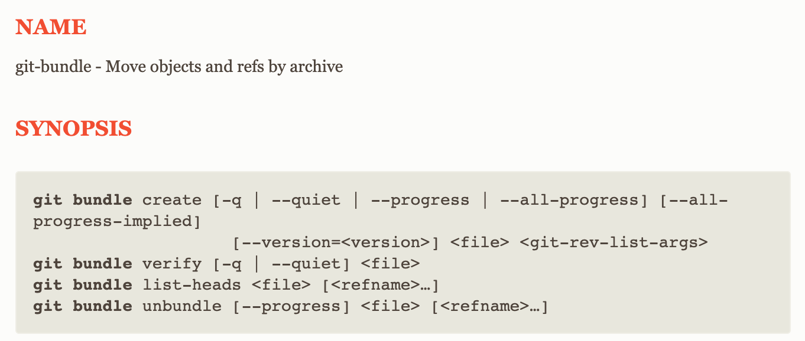

import figureImage1 from './ls-news-1/image-4.png'

Olá! Lucas por aqui e, conforme prometido, seja bem vindo ou bem vinda de volta a uma versão NOVINHA da minha newsletter! Como essa é a primeira edição, bora trocar uma ideia sobre ela rapidinho e depois seguir com o conteúdo! Mas prometo que vai ser só dessa vez, os próximos vão ter somente conteúdo!

## Uma newsletter nova?

Isso mesmo! quem me acompanha aqui há algum tempo sabe que eu mantinha uma outra newsletter com as novidades e notícias de tecnologia. Com o passar do tempo, por falta de tempo e também problemas pessoais resolvi parar a produção.

Agora, resolvi retomar o conteúdo que eu tanto gosto de escrever sob um novo nome e com um conteúdo mais estruturado! Por isso que escolhi o nome `ls -news`! Primeiro, porque é a marca e também a marca do blog, e segundo porque **esse é um comando totalmente válido de sistemas \*nix**. E ele representa muito do que eu vou colocar por aqui

<Figure src={figureImage1} priority alt="" caption="ls -news é um comando totalmente válido" />

O `ls` é o utilitário de listagem de arquivos em sistemas baseados em unix e, assim como eu pretendo fazer aqui, ele lista as informações mais importantes de forma **concisa**! Se quiser saber mais sobre o nome e os parâmetros desse comando é só esperar a próxima newsletter que vou explicar tudinho!

Muito obrigado por assinar e espero que você goste do conteúdo! Não esqueça de preencher o feedback no final da newsletter para eu saber o que você quer ver por aqui nas próximas edições!

---

## Tudo sobre o novo test runner do Node.js

[Tudo o que você precisa saber sobre o novo test runner do Node.js](/node-test-runner/)

A cada nova edição um novo conteúdo **fresquinho** que você vai descobrir primeiro aqui! Para começar, por que não falar do novo Test Runner do Node.js?

Nesse artigo trago exemplos de uso e a API completa para você poder ir testando e já atualizar suas aplicações!

## As novidades do Node 18

E que tal descobrir um pouco mais do que vem junto com o Test Runner no Node 18?

[As novidades do Node.js 18!](/node-18/)

## Você já criou aplicações em camadas no Node.js?

Se você ainda não fez isso, esse vídeo vai te ajudar demais! Aqui eu passo por todas as camadas mais comuns de projetos e, é claro, mão na massa!

<YouTube id="OoTJkhRPxGg" />

---


### Você já pensou em uma carreira internacional?

> Conteúdo feito em parceria com a [Turing](http://turing.com/s/2qCpJ5)

Você já pensou em ganhar em dólares trabalhando remotamente para as maiores empresas do mundo? A [**Turing**](http://turing.com/s/2qCpJ5) pode te ajudar a fazer isso! Basta acessar [este link](http://turing.com/s/2qCpJ5) e se inscrever nas dezenas de vagas abertas para as mais variadas áreas e dar aquele empurrão internacional da sua vida profissional!

---

# Links do mês

> Todos os meses vou trazer até 10 artigos super interessantes e curados para você! E como eu sei que todo mundo tem pressa, vou resumir esses artigos para que você só precise ler o necessário!

### [Como Chaos Engineering pode ser a diferença para um sistema resiliente](https://bit.ly/3lKgbSm)

Esse artigo é super interessante porque ele mostra como o Chaos Engineering, uma técnica desenvolvida pela Netflix, pode ajudar não só a entender o seu sistema e como todas as partes funcionam, mas também a preparar os times de DevOps para o inesperado!

---

### [Por que você não precisa de frameworks front-end](https://bit.ly/3wPwzat)

Nesse artigo o autor fala uma das coisas que eu sempre pensei sobre front-end. Muitas vezes as pessoas incluem muita complexidade em um projeto desnecessariamente. Alguns pontos interessantes:

1.  Usar um framework de componentes não vai automaticamente fazer seu app ficar bonito (vide qualquer componente com material design) porque você não tem o conhecimento que o time que criou aquele componente
2.  O tempo gasto em criar um componente do jeito que você quer de primeira, é geralmente superestimado, demora muito menos do que você pensa e dá muito mais resultado do que tentar dobrar algum código existente para o que você quer fazer

---

### [Por que nomear as coisas é tão difícil?](https://bit.ly/3NIEpbP)

Nesse artigo muito legal o autor dá 3 razões por que devs não conseguem chegar a um consenso sobre os nomes das coisas no código.

1.  A gente geralmente não relê nossos códigos depois que escreve
2.  Falta de conhecimento de negócio do produto
3.  Não damos a devida importância à nomes

Além disso ele faz umas perguntas super interessantes como: A qual funcionalidade essa variável está relacionada? Como eu posso mapear esse termo para o meu código?

---

### [7 One-liners em JavaScript que são super úteis](https://bit.ly/3aqN2JF)

Essa pequena listinha de 7 funções de uma única linha no JavaScript vão te ajudar demais! Principalmente quando você quer fazer coisas simples que não são muito comuns na linguagem!

---

### [O que devemos considerar quando integramos com sistemas de terceiros](https://bit.ly/3sZBhQK)  
Nesse post, Shekhar discute o que temos que levar em consideração quando estamos lidando com sistemas de terceiros, ele resume em 8 principais fatores:

1.  Modelo de deploy
2.  Coesão das tecnologias
3.  NFRs e SLAs
4.  Infraestrutura e necessidades de hardware
5.  API e documentação
6.  APIs idempotentes
7.  Possibilidade de mover os dados para fora da plataforma
8.  Comunidade

---

### [Jest é transferido para a OpenJS Foundation](https://bit.ly/3aje19P)

Depois de muito tempo, o framework de testes Jest, criado pelo Facebook, está sendo oficialmente transferido para a OpenJS foundation, para que ela possa dar continuidade ao trabalho que já vem sendo feito há alguns anos.

---

### [Ataques em cadeias de dependências podem ser o próximo problema do século](https://bit.ly/3wOv3p6)

Nesse artigo, Feross – o autor do StandardJS – explica como grande parte dos problemas de segurança hoje vem das dependências que instalamos em nossas aplicações. Por sermos capazes de instalar pacotes muito fácilmente, estamos mais expostos do que nunca a problemas de segurança sérios em nossas aplicações através de códigos que não temos controle e explica como mitigar e melhorar os chamados ataques de cadeia de dependência

---

### [Tao of Node - O guia de Node para design, arquitetura e boas práticas](https://bit.ly/3GoHqLR)

Nesse artigo (que mais parece um livro) o autor faz um apanhado de tudo que eu já vi sobre design e arquitetura de código voltado a Node.js e compila em um guia bastante completo sobre como você pode desenvolver aplicações seguindo boas práticas em 2022

## Pílulas de aprendizado

> Aqui vou trazer mensalmente um conteúdo que pode te ensinar a fazer algo simples, mas muito legal!

Você sabia que você pode mover seu repositório Git **inteiro** com um único arquivo chamado `git bundle`?



Os chamados `bundle` files são análogos a "zipar" seu repositório Git, mas não só os arquivo, também o histórico e os commits! Fica super simples para poder mandar para outra pessoa até mesmo via email!

Para criar um bundle é só entrar na pasta do seu repositório e rodar: `git bundle create <nome do arquivo> <branch>`, por exemplo:

```bash
git bundle create main.bundle main
```

Vai criar um arquivo `main.bundle` com todo o conteúdo e arquivos do meu branch `main`. Depois, é só enviar e a outra pessoa pode clonar com: `git clone -b main main.bundle` e ela vai ter um repositório novinho!

Gostou dessa newsletter? Dê seu [feedback neste link](https://bit.ly/3wOrUpb)
