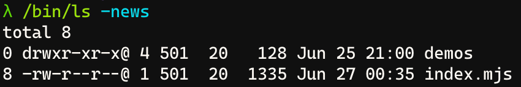

Muito obrigado por assinar e espero que você goste do conteúdo! Não esqueça de preencher o feedback no final da newsletter para eu saber o que você quer ver por aqui nas próximas edições!

---

## Você está medindo o tempo errado!

Nesse artigo eu vou te mostrar porque o `Date.now()` é muito problemático, principalmente quando a gente precisa fazer contagem de tempo ou medições de duração com JavaScript e por que você precisa parar de usá-lo.

[Por que você deveria repensar o uso do Date.now](/por-que-nao-usar-date-now/)

## JavaScript ShadowRealms

Uma das propostas mais interessantes do JavaScript nos últimos tempos está dando o que falar. Saiba o que são os shadow realms e como será possível executar códigos de maneira mais segura.

[Código mais seguro com Shadow Realms no JavaScript](/shadow-realms/)

## Tudo que há de novo no TypeScript 4.7

Fique por dentro das principais novidades da versão 4.7 do TypeScript. Que, entre muitas coisas, inclui a possibilidade de uso de ESModules nativos!

[O que há de novo no TypeScript 4.7](/typescript-47/)

---

### Você já pensou em uma carreira internacional?

> Conteúdo feito em parceria com a [Turing](http://turing.com/s/2qCpJ5)

Você já pensou em ganhar em dólares trabalhando remotamente para as maiores empresas do mundo? A [**Turing**](http://turing.com/s/2qCpJ5) pode te ajudar a fazer isso! Basta acessar [este link](http://turing.com/s/2qCpJ5) e se inscrever nas dezenas de vagas abertas para as mais variadas áreas e dar aquele empurrão internacional da sua vida profissional!

---

# Links do mês

### [The Art Of Code - Uma das melhores palestras que já assisti](https://www.youtube.com/watch?v=6avJHaC3C2U)

Nessa palestra um pouco antiga, o MVP Dylan Beattie cria uma linguagem de programação do zero que também é uma musica de rock! Essa provavelmente é uma das melhores palestras que eu já vi que, ao mesmo tempo, divertem e ensinam muito sobre como computadores funcionam por baixo dos panos.

---

### [Novidades do CSS em 2022](https://www.youtube.com/watch?v=Xy9ZXRRgpLk)

Em mais um extrato do Google IO 2022, dessa vez sobre CSS, a gente consegue ver muitas novidades que vão chegar por ai, uma das mais legais são os accent colors, os @containers e funcionalidades que já existiam em pré processadores como o SASS e o LESS, principalmente relacionadas a cores, como extrair cores a partir de outras cores. Além disso temos um aumento do número de cores que podemos usar na web!

---

### [Novidades na web como um todo](https://www.youtube.com/watch?v=5b4YcLB4DVI)

Esse vídeo é um fragmento do Google IO 2022 comentando sobre as principais mudanças na plataforma web para esse e os próximos anos! Vale muito a pena dar uma olhada nas novidades do Chrome e funcionalidades como:

-   CHIPS: Cookies que funcionam, até que enfim
-   API do conta gotas
-   API de navegação
-   Cascade Layers
-   Structured Cloning

---

### [Linux Insides - Um livro aberto sobre o Kernel do Linux](https://github.com/0xAX/linux-insides)

Esse projeto já existe há um bom tempo (mais ou menos 5 anos), mas foi revivido agora com commits mais novos. O Linux Insides é um livro open source sobre os detalhes do Kernel do Linux. Nele temos todas as informações sobre como o SO funciona e por que ele toma as decisões que ele toma, vale demais a leitura! E a contribuição para a língua portuguesa!

---

### [Forgit um CLI completo para quem quer um Git mais útil](https://github.com/wfxr/forgit)

Essa é uma ferramenta super legal que eu descobri ao longo das semanas e estou usando fortemente! Eu sou um grande adepto da linha de comando do Git, e detesto qualquer tipo de interface gráfica que já foi criada para ele, mas as vezes, eu preciso fazer algum tipo de modificação que exigiria muitos comandos, e acabo recorrendo ao VSCode, ou melhor, recorria!

---

### [Web Scrapping pode se tornar factível de novo com Heap Snapshots](https://www.adriancooney.ie/blog/web-scraping-via-javascript-heap-snapshots)

Nesse artigo curto, mas muito útil, o autor descreve uma ferramenta que ele criou para poder fazer com que web scrappers possam parar de depender da aparência de sites e começar a confiar nos dados que eles servem. Ao invés de pegar elementos HTML, é possível extrair uma parte da memória do computador onde aquele site está armazenado, e ler as variáveis internas! Isso é o chamado Heap Snapshot.

---

### [Por que softwares nunca são entregues](https://www.jamessimone.net/blog/joys-of-apex/the-life-and-death-of-software/)

Nesse artigo super legal, James Simone conta os principais motivos pelos quais softwares não são entregues, dentre eles:

-   Perder pessoas-chave no time por várias razões
-   Processos super complicados de review de código
-   Fricção entre valores da empresa e colaboradores (ele aponta vários tipos)

---

### [A gente precisa começar a pensar em UX para CLIs](https://lucasfcosta.com/2022/06/01/ux-patterns-cli-tools.html)

Nesse artigo o Lucas mostra algumas boas práticas que a gente deve começar a pensar quando fizermos aplicações de linha de comando (CLI):

-   Usar um “Get started” logo que a CLI for executada para diminuir a resistencia de novos usuários
-   Aplicar um modo interativo, com perguntas e respostas ao invés só de flags
-   Validar o tipo de dado do input e sugerir comandos baseados no erro do usuário
-   Erros com descrições humanas e não um monte de tecniquês
-   Se preocupe com a UI, use emojis, cores, layout
-   Use indicadores de carregamento ao invés de “carregando”
-   Use contextos, como arquivos de configuração e inteligencia local
-   Use exit codes
-   Tenha uma forma de fazer o CLI “pipeavel”, ou seja, aceitar dados de entrada automaticamente via stdin
-   Mantenha uma ordem de comandos que seja intuitiva

## Pílulas de aprendizado

Eu prometi dizer o que significa o comando `ls -news` linha por linha na outra newsletter, certo? Então vamos lá!

O comando `ls` é o utilitário para listar os arquivos do sistema, mas e cada uma das opções?

-   `-n`: Mostra o usuário e o grupo como IDs e não com os seus respectivos nomes
-   `-e`: Printa a lista de controle de acesso (ACL) associada com o arquivo
-   `-w`: Força que caracteres que não sejam printáveis sejam exibidos na forma `raw`
-   `-s`: Mostra o número de blocos usado no sistema de arquivos para cada arquivo

## Repositórios interessantes

<Bookmark url="https://github.com/dragonflydb/dragonfly" title="GitHub - dragonflydb/dragonfly: A modern replacement for Redis and Memcached" description="A modern replacement for Redis and Memcached. Contribute to dragonflydb/dragonfly development by creating an account on GitHub." publisher="dragonflydb" />

<Bookmark url="https://github.com/PlasmoHQ/plasmo" title="GitHub - PlasmoHQ/plasmo: The browser extension framework" description="The browser extension framework. Contribute to PlasmoHQ/plasmo development by creating an account on GitHub." publisher="PlasmoHQ" />

<Bookmark url="https://github.com/payloadcms/payload" title="GitHub - payloadcms/payload: Free and Open-source Headless CMS and Application Framework built with TypeScript, Node.js, React and MongoDB" description="Free and Open-source Headless CMS and Application Framework built with TypeScript, Node.js, React and MongoDB - GitHub - payloadcms/payload: Free and Open-source Headless CMS and Application Framew..." publisher="payloadcms" />

Gostou dessa newsletter? Dê seu [feedback neste link](https://forms.gle/5gJ3BvZkmfUbEQGn6)
