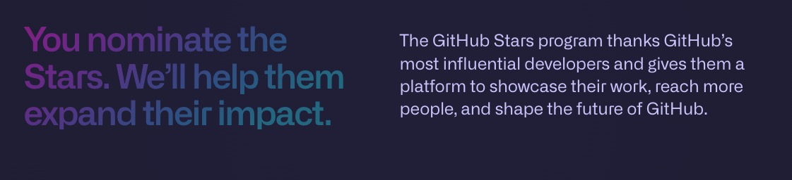

---

### Recomende a newsletter

O pedido de recomendação hoje é **especial**! O programa **GitHub Stars** voltou a aceitar nomeações para devs brasileiros. Se você nunca ouviu falar, este programa é um programa do _GitHub_ para premiar e ajudar as pessoas que criam conteúdo a atingir mais pessoas e terem mais novidades para compartilhar com a sua audiência. Esse programa leva em consideração conteúdos como: [blog posts](/), [vídeos e podcasts](https://youtube.lsantos.dev), e [contribuições em projetos open source](https://github.com/nodejs/node/pull/48638).

Então, se você gosta do meu conteúdo e me acompanha, sabe que ensino de tecnologia é uma das coisas que eu mais gosto de fazer, e fazer parte dessa comunidade vai me ajudar muito a atingir ainda mais pessoas para poder espalhar esse conhecimento! Desde 2015 venho criando conteúdo e não pretendo parar tão cedo, na verdade eu **não pretendo parar**.

Para nomear é bem simples, é só entrar no [link do programa](https://stars.github.com/nominate) e colocar o meu [nome de usuário](https://github.lsantos.dev) (que é **khaosdoctor**) no "@" (ele deve te ajudar a completar) e então escrever o motivo pelo qual você acha que eu mereço a nomeação. Posso contar com você? 🥰

[Me ajude a alcançar mais gente! 🥺](https://stars.github.com/nominate)

Muito obrigado por me ajudar nessa jornada, eu não seria nada sem a comunidade e fico muito grato pela sua ajuda!

---

## O que vem por ai!?

Essa é uma newsletter diferente! Não estou trazendo as novidades do blog (e tem muito post novo por lá hein!), mas quero trazer novidades sobre a newsletter em si.

Não tenho muita coisa concreta ainda, mas posso dizer que ela vai sofrer uma **mudança completa**, a ideia é transformar essa newsletter em um cantinho mais pessoal, onde mando coisas que fiz curadoria, novidades do mundo de tecnologia (e do blog) e muito mais.

Eu ainda não tenho uma data de quando isso vai acontecer, mas a newsletter provavelmente vai ganhar seu próprio canto nas interwebs e vai ter sua própria página com tudo que é necessário, eu também estou cogitando a possibilidade de utilizar outras plataformas (inclusive, se você conhece boas plataformas, estou aberto a sugestões!) e também estou cogitando a possibilidade de abrir uma seção diferente da newsletter que será por assinatura, onde vou compartilhar artigos exclusivos de opiniões que eu tenho sobre vários temas, além de prévias dos meus próximos artigos!

Mas quero a sua opinião nisso tudo! Afinal, você que vai saber se o conteúdo é válido! Então se você tiver ideias para a newsletter ou ideias de outras coisas que você quer ver por aqui, me manda um alô em [qualquer uma das minhas redes](https://lsantos.dev) ou no [meu email](\<mailto:hello@lsantos.dev?subject=Tenho uma idéia para a LSNews!>) hello@lsantos.dev!

Aguardo a sua opinião!

Valeu!
