Quando trabalhamos com microsserviços, sempre ouvimos falar que o **monitoramento** e a **observabilidade** são métricas chave para que possamos ter sucesso em manter nosso ecossistema coeso, funcional e não ficarmos loucos com o que está acontecendo. Falamos isto no [podcast #FalaDev que participei junto de vários convidados](/podcast-faladev-vamos-falar-de-microsservicos/).

Afinal, em sistemas distribuídos, a complexidade não está na unidade, mas sim em como essas unidades interagem umas com as outras. E, se não soubermos o que está acontecendo no nosso ecossistema, não podemos diagnosticar, entender e muito menos responder a incidentes em tempo hábil.

Mas como podemos resolver estes problemas? A resposta é bem simples, temos que começar o monitoramento de nossas aplicações.

## Azure Monitor For Containers

Para esse tipo de situação temos ferramentas como o [Azure Monitor](https://docs.microsoft.com/azure/azure-monitor/insights/container-insights-overview?WT.mc_id=containers-12310-ludossan). Essa é uma ferramenta disponibilizada pela Azure para o monitoramento de diversos de seus produtos, um deles é o AKS.

A ideia deste artigo é entender um pouco mais do Azure Monitor primeiro, depois vamos criar uma pequena aplicação que irá extrair algumas métricas customizadas de alguns de nossos serviços. Então vamos começar entendendo como ele funciona!

### Como funciona o Azure Monitor For Containers?

Conforme este [artigo incrível](https://trstringer.com/native-azure-logging-aks/) do Thomas Stringer diz, o Azure Monitor é uma solução que inclui várias facetas, uma delas é a visualização de dados que é obtida através da captura de métricas pelo que chamamos de `agent`.

")

Um `agent` é um pequeno serviço que roda dentro do nosso cluster como um `daemonset`, ou seja, um serviço que cria um pod em cada nó do nosso cluster para poder capturar as métricas de recursos de máquina, como CPU, RAM e etc.

> Por padrão, este recurso vem desabilitado quando criamos um novo cluster do AKS, então temos que habilitá-lo – vamos aprender como fazer isso no próximo capítulo.

Uma vez que o recurso está habilitado, o DaemonSet chamado `omsagent` é instalado no cluster e um deployment chamado `omsagent-rs` é criado em cada um dos nós do cluster. Este deployment é o responsável por agregar métricas e enviá-las ao que chamamos de [Log Analytics workspace](https://docs.microsoft.com/azure/azure-monitor/learn/quick-create-workspace?WT.mc_id=containers-12310-ludossan), ou seja, o local onde todas as nossas métricas vão ficar armazenadas para podermos lê-las.

")

Uma vez que temos todos os serviços rodando, vamos ser capazes de obter as métricas do nosso cluster acessando ou o próprio painel da Azure, ou então uma ferramenta chamada [Azure Data Explorer](https://dataexplorer.azure.com).

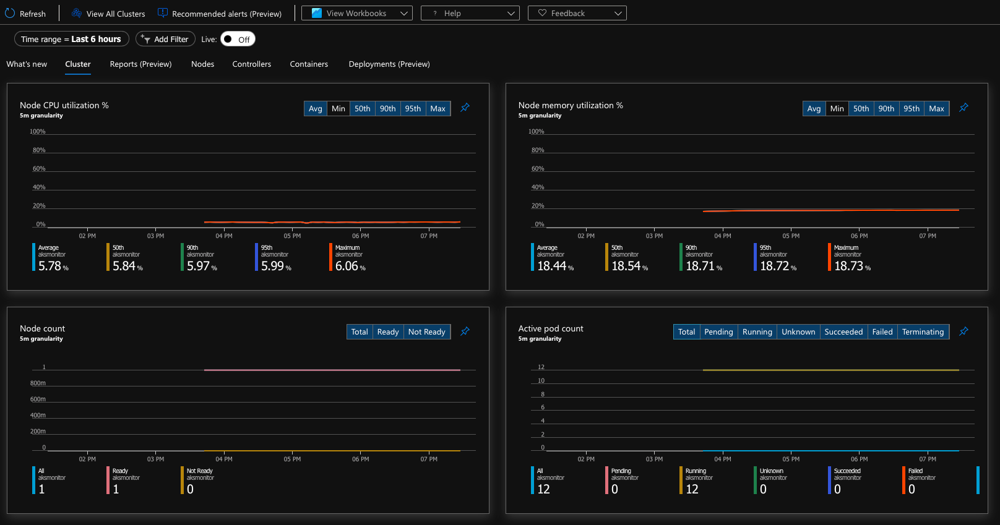

## Monitorando um cluster

Primeiramente, precisamos criar um cluster AKS para que possamos monitorar, para isso, precisamos registrar duas extensões em nosso [Azure CLI](https://docs.microsoft.com/cli/azure/install-azure-cli?WT.mc_id=containers-12310-ludossan) (se você ainda não possui o Azure CLI instalado, então instale ele na sua máquina).

Vamos verificar se já temos os providers instalados com os seguintes comandos:

```bash title="Verificando se já temos os providers instalados"
az provider show -n Microsoft.OperationsManagement -o table && \
az provider show -n Microsoft.OperationalInsights -o table
```

Se tivermos saídas dese tipo:

```output
Namespace                       RegistrationPolicy    RegistrationState
------------------------------  --------------------  -------------------
Microsoft.OperationsManagement  RegistrationRequired  Registered

Namespace                      RegistrationPolicy    RegistrationState
-----------------------------  --------------------  -------------------
Microsoft.OperationalInsights  RegistrationRequired  Registered
```

Significa que os provedores estão instalados e funcionando (veja o `Registered`), porém, se precisarmos instala-los, vamos ter que rodar os seguintes comandos:

```bash
az provider register --namespace Microsoft.OperationsManagement && \
az provider register --namespace Microsoft.OperationalInsights
```

O processo pode demorar alguns minutos para completar, rode o primeiro comando novamente para ter certeza de que o provedor foi registrado. Vamos agora criar um novo Resource Group e armazenar o valor tanto dele quando o nome do nosso novo cluster em uma variável:

```bash
export RESOURCE_GROUP=aksmonitor
export CLUSTER_NAME=aksmonitor
az group create -n $RESOURCE_GROUP -l eastus
```

Então podemos criar um novo cluster do AKS habilitado para monitoramento através do comando:

```bash
az aks create \
  -g $RESOURCE_GROUP \
  -n $CLUSTER_NAME \
  --node-count 1 \
  --generate-ssh-keys \
  --enable-addons monitoring,http_application_routing
```

> Se você já tem um cluster AKS criado, pode habilitar o monitoramento através do comando `az aks enable-addons -a monitoring -n $CLUSTER_NAME -g $RESOURCE_GROUP`

### Criando um teste

Vamos criar alguns pods de teste para que possamos monitorar o uso do sistema, primeiramente vamos criar um deployment simples que vai expor uma pequena API em Node.js. Para isso vamos criar um novo arquivo `simple_api.yaml` e criar nossas instruções:

```yaml
apiVersion: apps/v1
kind: Deployment
metadata:
  name: simple-api
spec:
  selector:
    matchLabels:
      app: simple-api
  template:
    metadata:
      labels:
        app: simple-api
    spec:
      containers:
      - name: simple-api
        image: khaosdoctor/scalable-node-api:2.0.0
        resources:
          limits:
            memory: "128Mi"
            cpu: "100m"
        ports:
        - containerPort: 8080
          name: http
        env:
          - name: PORT
            value: "8080"
---
apiVersion: v1
kind: Service
metadata:
  name: simple-api
spec:
  type: LoadBalancer
  selector:
    app: simple-api
  ports:
  - port: 80
    targetPort: http
```

Este serviço vai nos dar um endereço externo de IP que poderá ser obtido usando `kubectl get svc` na coluna `EXTERNAL-IP`:

```output
NAME         TYPE           CLUSTER-IP    EXTERNAL-IP     PORT(S)        
simple-api   LoadBalancer   10.0.50.182   xxx.xxx.xxx.xxx   80:30287/TCP
```

Acesse o endereço após alguns instantes para ver o pod sendo executado. Nesta versão teremos um delay de 2 segundos gerando uma pequena carga para podermos ver o consumo de recursos. Vamos ao nosso portal da Azure e selecionaremos nosso cluster AKS, então vamos no menu "Insights":

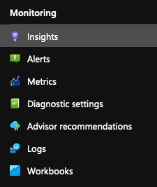

Vamos utilizar o comando `scale` do kubectl para poder escalar os pods e ver que temos monitoramento constante:

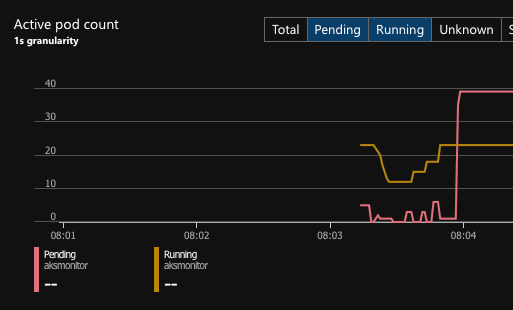

Se rodarmos um teste de stress, veremos que teremos um aumento gradativo do uso de memória e CPU:

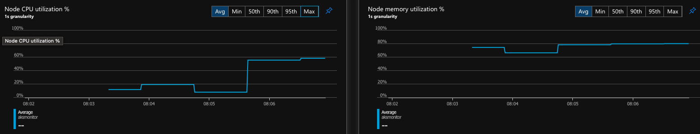

Além disso temos diversos `workbooks` que são dashboards já prontos que nos permitem ver alguns dados:

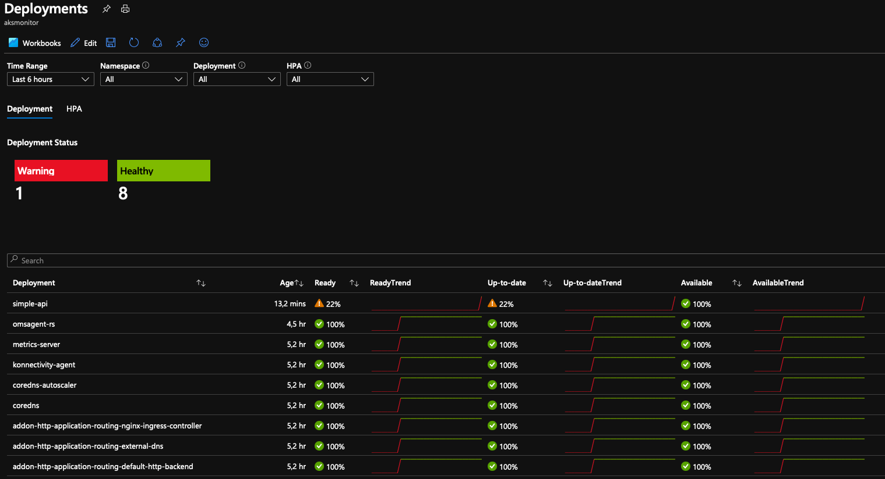

Podemos também obter os logs dos nossos containers através do menu `logs` no canto esquerdo do painel:

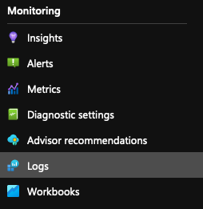

Aqui iremos ter uma visão inicial com um modal que irá nos perguntar se queremos ver algumas queries prontas, vamos para a aba "Audit" e então vamos clicar em "Run" abaixo de "List containers logs per namespace":

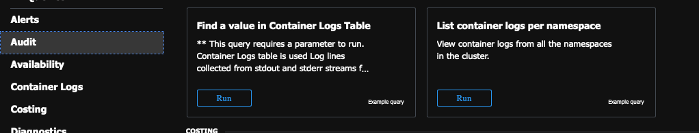

Veja um exemplo de uma query no formato [Kusto](https://docs.microsoft.com/azure/data-explorer/kusto/query/?WT.mc_id=containers-12310-ludossan):

```kusto
// List container logs per namespace 
// View container logs from all the namespaces in the cluster. 
ContainerLog
| join(KubePodInventory
    | where TimeGenerated > startofday(ago(1h)))//KubePodInventory Contains namespace information
    on ContainerID
| where TimeGenerated > startofday(ago(1h))
| project TimeGenerated, Namespace, LogEntrySource, LogEntry
```

Vamos ter uma lista de todos os logs gerados pela nossa aplicação:

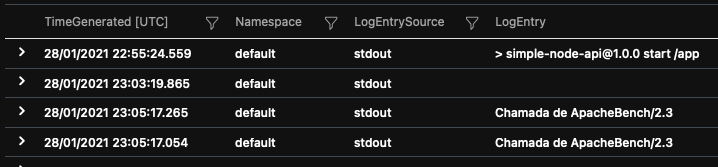

Mas e se quisermos gerar mais informações e buscar mais dados? Como fazemos para criar uma métrica customizada no Azure Monitor?

## Criando métricas customizadas

Para podermos entender um pouco do que vamos fazer a seguir, precisamos entender sobre como o Kubernetes trabalha com métricas.

### Prometheus

Atualmente, o [Prometheus](https://prometheus.io/) é o líder de mercado quando se trata de armazenamento e coleta de métricas para aplicações distribuídas. O Prometheus funciona em um modelo de scrapping, ou seja, de tempos em tempos ele acessa uma URL definida em seus endpoints cadastrados e busca os dados em um formato específico. A camada de abstração que roda entre um serviço e o Prometheus é chamado de **exporter**.

Os exporters buscam as métricas das APIs e aplicações e as formatam para que sejam consumidas pelo Prometheus de forma correta, por isso eles geralmente são executados dentro do mesmo pod, em outro container, acessando a aplicação localmente. Como esta imagem do blog do Thomas Stringer nos mostra:

")

### Exporters

Quando estamos trabalhando com uma tecnologia que ainda não tem [um exporter pronto](https://prometheus.io/docs/instrumenting/exporters/#third-party-exporters), ou então quando queremos fazer o scrapping de métricas de aplicações que nós mesmos escrevemos (que é o nosso caso aqui) nós podemos escrever o nosso próprio através de uma [lista de clientes](https://prometheus.io/docs/instrumenting/clientlibs/) disponíveis.

O trabalho de um exporter é basicamente rodar um loop onde ele:

1.  Inicia um servidor HTTP
2.  Busca as métricas da aplicação alvo
3.  Trata as métricas e as formata
4.  Devolve as métricas para o prometheus quando forem necessárias
5.  Dorme por um determinado tempo antes de começar de novo

A aplicação que vamos estar utilizando é uma simples aplicação de votação feita em Go, você pode ver o código fonte [neste repositório](https://github.com/khaosdoctor/go-vote-api). Temos uma imagem hospedada em meu [Docker Hub pessoal](https://hub.docker.com/r/khaosdoctor/go-vote-api).

Como criei a aplicação do zero, construi um pequeno exporter em Node.js para ela que você pode checar [neste repositório](https://github.com/khaosdoctor/nodejs-go-vote-exporter) com [esta imagem](https://hub.docker.com/r/khaosdoctor/go-vote-api-exporter). Basicamente a aplicação só possui um arquivo `index.js` que inicia um servidor do Koa usando uma biblioteca de cliente do Prometheus.

```javascript
const Koa = require('koa')
const app = new Koa()
const axios = require('axios').default

const prometheus = require('prom-client')
const PrometheusRegistry = prometheus.Registry
const registry = new PrometheusRegistry()

const PREFIX = `go_vote_api_`
const pollingInterval = process.env.POLLING_INTERVAL_MS || 5000
registry.setDefaultLabels({ service: 'go_vote_api', hostname: process.env.POD_NAME || process.env.HOSTNAME || 'unknown' })

// METRICS START

const totalScrapesCounter = new prometheus.Counter({
  name: `${PREFIX}total_scrapes`,
  help: 'Number of times the service has been scraped for metrics'
})
registry.registerMetric(totalScrapesCounter)

const scrapeResponseTime = new prometheus.Summary({
  name: `${PREFIX}scrape_response_time`,
  help: 'Response time of the scraped service in ms'
})
registry.registerMetric(scrapeResponseTime)

const localResponseTime = new prometheus.Summary({
  name: `${PREFIX}exporter_response_time`,
  help: 'Response time of the exporter in ms'
})
registry.registerMetric(localResponseTime)

const totalVotes = new prometheus.Gauge({
  name: `${PREFIX}total_votes`,
  help: 'Total number of votes computed until now',
  async collect () {
    const total = await scrapeApplication()
    this.set(total)
  }
})
registry.registerMetric(totalVotes)

// --Utility Function-- //

async function scrapeApplication () {
  const id = Date.now().toString(16)
  console.log(`Scraping ${process.env.SCRAPE_URL}:${process.env.SCRAPE_PORT}/${process.env.SCRAPE_PATH} [scrape id: ${id}]`)
  const start = Date.now()
  const metrics = await axios.get(`${process.env.SCRAPE_URL}:${process.env.SCRAPE_PORT}/${process.env.SCRAPE_PATH}`)
  scrapeResponseTime.observe(Date.now() - start)
  totalScrapesCounter.inc()
  console.log(`Scraped data [scrape id: ${id}]`)
  return metrics.data.total
}

// --Servers start-- //

app.use(async (ctx, next) => {
  console.log(`Received scrape request: ${ctx.method} ${ctx.url} @ ${new Date().toUTCString()}`)
  const start = Date.now()
  await next()
  localResponseTime.observe(Date.now() - start)
})

app.use(async ctx => {
  ctx.set('Content-Type', registry.contentType)
  ctx.body = await registry.metrics()
})

// start loop
if (pollingInterval > 0) {
  setInterval(async () => {
    const total = await scrapeApplication()
    totalVotes.set(total)
  }, pollingInterval)
}

console.log(`Listening on ${process.env.SCRAPER_PORT || 9837}`)
app.listen(process.env.SCRAPER_PORT || 9837)
```

O que esta aplicação está fazendo é registrar uma série de métricas em um registrador padrão do Prometheus, as métricas que estamos pegando são:

-   Número total de votos
-   Quantidade vezes que buscamos as métricas
-   Tempo de resposta do exporter e também da API na rota `/total`

> Obviamente que estas métricas não são tão importantes quanto outras métricas que podem ser obtidas através da instrumentação direta na aplicação, para isso uma boa prática é ter uma rota `/metrics` que serve as métricas de instrumentação da aplicação, como CPU, RAM e outras, além do exporter.

Se acessarmos o exporter, teremos uma saída como esta:

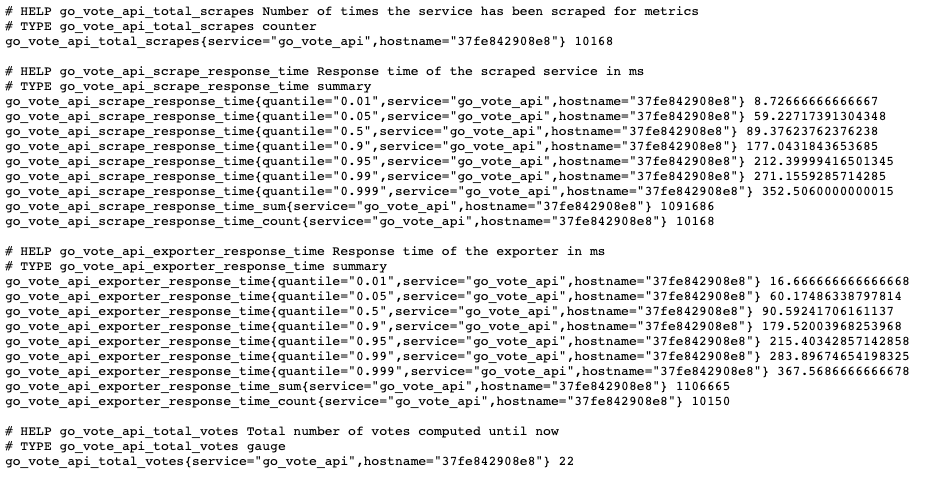

## Extraindo métricas da aplicação

Para podermos extrair as métricas da aplicação, o que vamos fazer é rodar os dois containers lado a lado, dessa forma não oneramos a aplicação original com a busca e parsing de métricas e ainda mantemos a velocidade de conexão por estarem na mesma rede. Nosso arquivo de deployment anterior vai mudar um pouco:

```yaml
apiVersion: apps/v1
kind: Deployment
metadata:
  name: vote-api
spec:
  selector:
    matchLabels:
      app: vote-api
  template:
    metadata:
      labels:
        app: vote-api
    spec:
      containers:
      - name: vote-api
        image: khaosdoctor/go-vote-api
        resources:
          limits:
            memory: "128Mi"
            cpu: "200m"
        ports:
        - containerPort: 8080
          name: http
      - name: vote-api-exporter
        image: khaosdoctor/go-vote-api-exporter
        resources:
          limits:
            memory: "128Mi"
            cpu: "100m"
        ports:
        - containerPort: 9837
          name: exporter
        env:
          - name: SCRAPE_PORT
            value: "8080"
          - name: SCRAPE_PATH
            value: total
          - name: SCRAPE_URL
            value: "http://localhost"
      - name: vote-api-voter
        image: curlimages/curl
        command: ["/bin/sh"]
        args: [
          "-c",
          "while true; do wget -O- http://localhost:8080/votes/Lucas; sleep 3; done"
        ]
        resources:
          limits:
            memory: "128Mi"
            cpu: "100m"
---
apiVersion: v1
kind: Service
metadata:
  name: vote-api
spec:
  type: LoadBalancer
  selector:
    app: vote-api
  ports:
  - port: 80
    targetPort: http
---
apiVersion: v1
kind: Service
metadata:
  name: vote-api-exporter
spec:
  selector:
    app: vote-api
  ports:
  - port: 9837
    targetPort: exporter
```

O que estamos fazendo é subir três containers junto com a aplicação, um deles é o exporter e o outro é uma simples aplicação que ficará votando a cada 3 segundos para simular o aumento dos votos. Note que estamos definindo `localhost` como a url de scrapping porque todos os containers estão na mesma rede local.

Podemos verificar os logs de cada container criado depois com o comando `kubectl  logs deploy/vote-api -c <nome-do-container>`, se quisermos ver nosso exporter em ação basta executarmos `kubectl port-forward svc/vote-api-exporter 9837:9837` e acessarmos `localhost:9837` em nossa máquina:

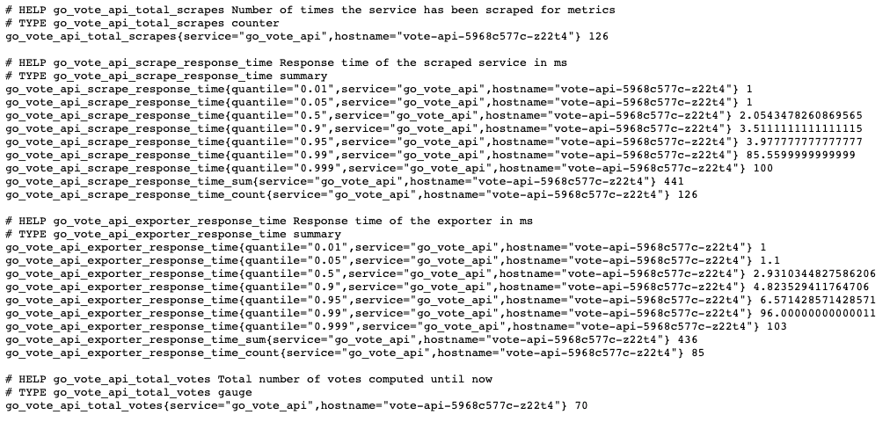

Veja que agora temos mais labels, como o `hostname` que antes não era buscado.

## Preparando o Azure Monitor

Agora que temos nossa API pronta, vamos preparar o Azure Monitor para poder buscar as métricas. Para isso, vamos criar um simples ConfigMap que irá configurar o nosso agente dentro do Node. A própria Microsoft tem um modelo padrão de configuração que podemos baixar com o comando abaixo

```bash
$ curl -Lo agent-config.yaml https://aka.ms/container-azm-ms-agentconfig
```

Salve o arquivo e veja que ele está bastante comentado, é um arquivo longo, mas a parte que nos interessa é esta aqui:

```yaml
        # When monitor_kubernetes_pods = true, replicaset will scrape Kubernetes pods for the following prometheus annotations:
        # - prometheus.io/scrape: Enable scraping for this pod
        # - prometheus.io/scheme: If the metrics endpoint is secured then you will need to
        #     set this to `https` & most likely set the tls config.
        # - prometheus.io/path: If the metrics path is not /metrics, define it with this annotation.
        # - prometheus.io/port: If port is not 9102 use this annotation
        monitor_kubernetes_pods = false
```

Vamos alterar `monitor_kubernetes_pods` para `true`, isto fará com que quaisquer deployments que tiverem as annotations `prometheus.io/scrape` e `prometheus.io/scheme` sejam buscados pelo agent como se fosse o Prometheus buscando métricas. Agora vamos criar a configuração com `kubectl apply -f agent.yaml`.

Vamos agora adicionar as annotations no nosso arquivo de deployment:

```yaml
apiVersion: apps/v1
kind: Deployment
metadata:
  name: vote-api
spec:
  selector:
    matchLabels:
      app: vote-api
  template:
    metadata:
      labels:
        app: vote-api
      annotations:
        prometheus.io/scrape: "true"
        prometheus.io/path: /
        prometheus.io/port: "9837"
    spec:
      containers:
      - name: vote-api
        image: khaosdoctor/go-vote-api
        resources:
          limits:
            memory: "128Mi"
            cpu: "200m"
        ports:
        - containerPort: 8080
          name: http
      - name: vote-api-exporter
        image: khaosdoctor/go-vote-api-exporter
        resources:
          limits:
            memory: "128Mi"
            cpu: "100m"
        ports:
        - containerPort: 9837
          name: exporter
        env:
          - name: SCRAPE_PORT
            value: "8080"
          - name: SCRAPE_PATH
            value: total
          - name: SCRAPE_URL
            value: "http://localhost"
      - name: vote-api-voter
        image: curlimages/curl
        command: ["/bin/sh"]
        args: [
          "-c",
          "while true; do wget -O- http://localhost:8080/votes/Lucas; sleep 3; done"
        ]
        resources:
          limits:
            memory: "128Mi"
            cpu: "100m"
---
apiVersion: v1
kind: Service
metadata:
  name: vote-api
spec:
  type: LoadBalancer
  selector:
    app: vote-api
  ports:
  - port: 80
    targetPort: http
---
apiVersion: v1
kind: Service
metadata:
  name: vote-api-exporter
spec:
  selector:
    app: vote-api
  ports:
  - port: 9837
    targetPort: exporter
```

Agora podemos buscar as métricas através do nosso portal, vamos clicar em `Logs` que nem fizemos antes, e agora podemos buscar dentro da tabela de `InsightsMetrics`, pela seguinte query:

```kusto
InsightsMetrics
| where Namespace == "prometheus"
| where Name in ("go_vote_api_total_votes")
| summarize sum(Val) by TimeGenerated, Name
| order by TimeGenerated asc
```

Isso vai nos dar todos os votos que foram computados separados por horário que eles foram gerados:

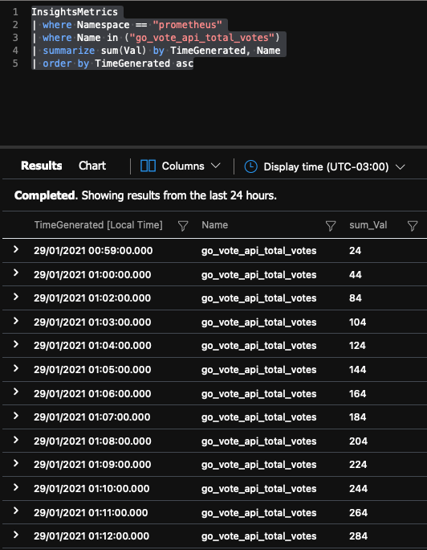

Se clicarmos em **Chart** teremos um grafico que pode ser configurado para podermos ver o crescimento da métrica:

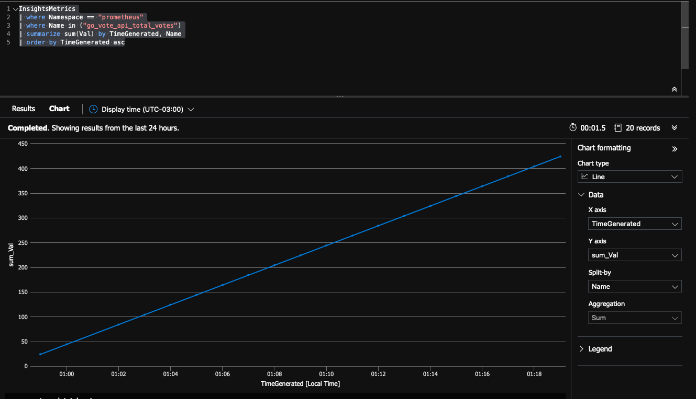

## Conclusão

Extrair métricas é importante e necessário para que possamos ter uma melhor visão do nosso sistema. Com o Azure Monitor fica muito mais fácil de fazermos essas medições porque não precisamos instalar nada externo como o Prometheus e também não precisamos gerenciar bancos de dados ou qualquer outra coisa.
