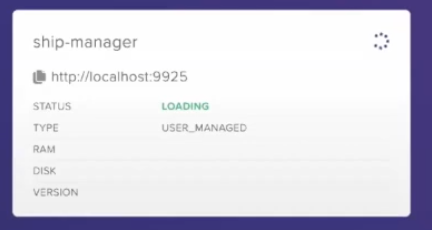
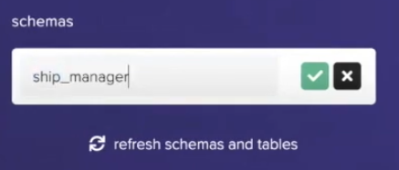
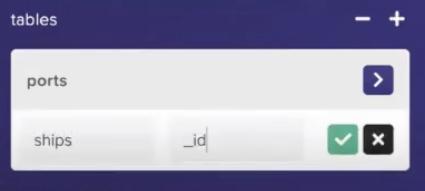
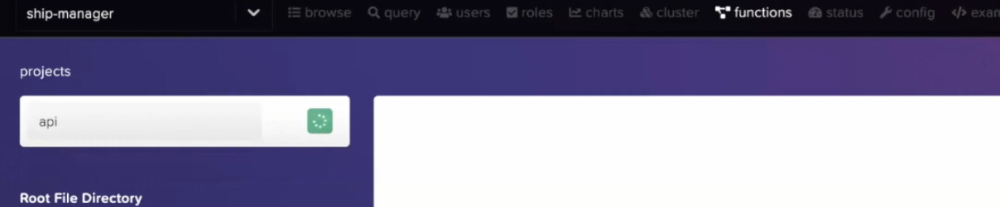
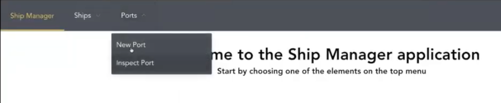
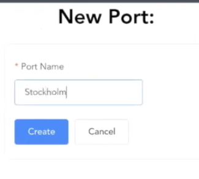
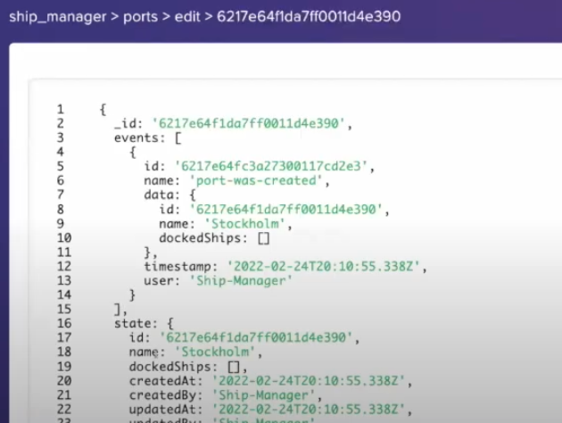
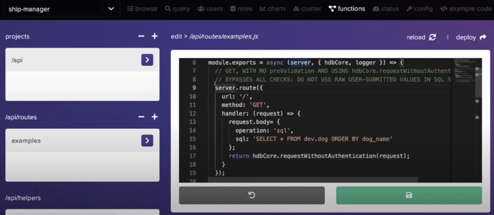

A few weeks ago I gave a talk at the HarperDB channel about how we can migrate a legacy application from MongoDB to HarperDB. If you didn't see it, you can watch it here:


This post will be a written tutorial on the process. So if you can't watch the video, or want to save the content for another time, then this is your thing.

- [Objective](#objective)
- [Setup](#setup)
- [Setting up the database](#setting-up-the-database)
- [Migrating the code](#migrating-the-code)
  - [Understanding the application](#understanding-the-application)
  - [Create the client](#create-the-client)
  - [Migrating repositories](#migrating-repositories)
  - [Final touches](#final-touches)
- [Testing](#testing)
- [Custom Functions](#custom-functions)

## Objective

I created this tutorial because this is a real scenario. Lots of people deal with legacy applications in a daily basis, and some of the changes they have to make include migrations from a tech stack to another.

This is why this application was especifically chosen, because it is a real example of how we can migrate a legacy application from one technology stack to another. It's old, uses old libraries and sets our standards on where we **don't** want to touch.

In this case, the objective is to perform the full migration without touching a lot of code, and without having to touch any of the code that we don't want to touch. Luckily, this application is implemented using a MVC-ish architecture, so there are layers on top of layers, which makes easier to abstract most of the funcionality to separated places and to make the code more readable. Also, it allows us to change only the code that we want to change, and not the whole application.

## Setup

I won't explain exactly what HarperDB is or how it works, but I will show you how to get started with the basics.

So, the first thing you need to do is to create an account at the [HarperDB website](http://www.harperdb.com/). This will give you the possibility to use the Harper Studio, which will be the tool we will use to create and manage the database.

The second thing is to clone the [application repository](https://github.com/khaosdoctor/harperdb-migration-demo), the application has three branches:

- `main` is the branch where we'll do our work.
- `migrated` is the branch with all the work done, if you need to peek something at the end of the process, you can use this branch.
- `migrated-custom-functions` is the branch that contains the migrated code, plus the custom functions implementation.

After cloning it, the first thing you need to do is to go to the `backend` directory and run `npm install`. This will install all the dependencies needed to run the application.

> It's a good thing to have [Docker](https://docker.com) installed as well, since we'll be fidling around with a frontend, backend and a database. And we'll use everything inside a container using Docker Compose.

## Setting up the database

The first thing we need to do is to set up the database, in this case, Harper. So we'll go to the `docker-compose.yml` file, it looks like this now:

```yml
version: '3.7'

services:
  backend:
    build: ./backend
    environment:
      DATABASE_MONGODB_URI: mongodb://database:27017
      DATABASE_MONGODB_DBNAME: ship_manager
      NODE_ENV: ${NODE_ENV:-development}
    ports:
      - '3000:3000'
    depends_on:
      - database

  # ... frontend stuff we don't care about ...

  database:
    image: mvertes/alpine-mongo
    ports:
      - '27017:27017'
    volumes:
      - mongodb:/data/db

volumes:
  mongodb:
```

We need to change the database to use Harper and the backend to reflect this change. First we'll change the `services.database` to be like this:

```yml
database:
  image: harperdb/harperdb
  ports:
    - '9925:9925'
    - '9926:9926'
  volumes:
    - db:/opt/harperdb/hdb
  environment:
    - HDB_ADMIN_USERNAME=admin
    - HDB_ADMIN_PASSWORD=admin
    - CUSTOM_FUNCTIONS=true
```

First we change the image, so we can download the latest version of Harper. Then open up both the ports for the database connection and the custom functions (which works on 9926); after that, we set our volumes so we don't lose the data in case we need to delete the container; and lastly, we set the environment variables for the database.

> I'm using plain passwords here, but the ideal is to set these in runtime.

Then, we'll change the `services.backend` to be like this:

```yml
backend:
  build: ./backend
  environment:
    DATABASE_URI: http://database:9925
    DATABASE_DBNAME: ship_manager
    DATABASE_USERNAME: admin
    DATABASE_PASSWORD: admin
    NODE_ENV: ${NODE_ENV:-development}
  ports:
    - '3000:3000'
  depends_on:
    - database
```

The only real change we made here is to change the database URI to use the port of the database, and to set the username and password for the database.

And in the end, we need to change the name of our volume – was `mongodb` – to `db`.

```yml
volumes:
  db:
```

The final file looks like this:

```yml
version: '3.7'

services:
  backend:
    build: ./backend
    environment:
      DATABASE_URI: http://database:9925
      DATABASE_DBNAME: ship_manager
      DATABASE_USERNAME: admin
      DATABASE_PASSWORD: admin
      NODE_ENV: ${NODE_ENV:-development}
    ports:
      - '3000:3000'
    depends_on:
      - database

  frontend:
    build: ./frontend
    ports:
      - '80:80'
    depends_on:
      - backend

  database:
    image: harperdb/harperdb
    ports:
      - '9925:9925'
      - '9926:9926'
    volumes:
      - db:/opt/harperdb/hdb
    environment:
      - HDB_ADMIN_USERNAME=admin
      - HDB_ADMIN_PASSWORD=admin
      - CUSTOM_FUNCTIONS=true

volumes:
  db:
```

Now go to [the HarperDB studio](https://studio.harperdb.io), open up your organization and add a new Instance. On the modal menu, select "Register User-installed Instance" and fill in the following information:

- **Name**: ship-manager
- **Username and password**: admin
- **Host**: localhost
- **Port**: 9925
- **SSL**: No

Don't click "Instance Deails" yet, we'll need to spin up our containers first. So go to your terminal and type `docker compose up -d database` to spin up only the database instance, wait a few seconds and run `docker compose logs database` to check the log, it should be ready. Then you can click "Instance Details", select the free tier and confirm.

It'll take a few minutes for the connection to be made:



Once the status is "OK", open up the DB and create a new schema (the same thing you used on the backend environment variable `DATABASE_DBNAME`).



After the creation, we'll create two tables, one named `ports` and other named `ships`, both of them will have the "Hash Attribute" as `_id`:



Next up, go to the "functions" tab on the black strip on the top of the page, and create a new project named `api`:



This will enable and activate the custom functions.

This is all we need to do, now we can start coding the migration.

## Migrating the code

To migrate the existing code we need to understand a bit of the architecture behind it. You have some documentation on the README file, but it doesn't explain all the parts. So we'll go through the code and see what we need to do.

### Understanding the application

The application is divided into three parts in `backend/src`:

- `data`: Is the equivalent of `model`, here's where we connect to the database, have clients to bring data from external sources, and have the logic to interact with the database. Ideally, this is the only place we need to change, since all the documents here are returned as instances of domain objects like `Ship` and `Port`.
- `domain`: Is the equivalent of `entity`, here's where we define the domain objects, like `Ship` and `Port`.
- `services`: Is the equivalent of `controller`, here's where we define the services that interact with the domain objects.
- `presentation`: Is the equivalent of `view`, here's where we define the presentation layer, ReST routes and all the interactive parts of the application.

We also have two important files, the entrypoint of our app in `backend/src/app.ts` and the configuration file in `backend/src/app-config.ts`. We'll need to change the `app-config.ts` file to reflect the changes we made to the database first, this is what we should write:

```typescript
import env from 'sugar-env'

export const config = {
  cors: {
    exposedHeaders: ['x-content-range']
  },
  database: {
    harperdb: {
      uri: env.get('DATABASE_URI')!,
      dbName: env.get('DATABASE_DBNAME')!,
      username: env.get('DATABASE_USERNAME')!,
      password: env.get('DATABASE_PASSWORD')!
    }
  }
}
```

Next thing we're gonna do is to change the `app.ts` file to reflect what we want to have in the end. So this is the current file:

```ts
import routes from './routes'
import mongodb from '../data/connections/mongodb'
// Other imports...

export const app = expresso(async (app: Express, appConfig: typeof config) => {
  const connection = await mongodb.createConnection(appConfig.database.mongodb)

  const portRepository = new PortRepository(connection)
  const portService = new PortService(portRepository)

  const shipRepository = new ShipRepository(connection)
  const shipService = new ShipService(shipRepository, portService)

  // Routes...
})
```

As you can see, we're importing a MongoDB connection, and passing it throught to the repositories, so this is the part we need to change, we'll need to remove mongo altogether and replace it with the harperdb client.

The way we want to do this is to have a `HarperDBClient` class, which will be the equivalent of the `mongodb` connection, and we'll use it to give the repositories a valid connection to the Harper API.

This client should only take the HarperDB config present on `app-config.ts` and give us a valid connection to the API. So let's write that:

```ts
import routes from './routes'
import type { config } from '../app-config'
import { HarperDBClient } from '../data/clients/HarperDBClient'
// Other imports...

export const app = expresso(async (app: Express, appConfig: typeof config) => {
  const client = new HarperDBClient(appConfig.database.harperdb)

  const portRepository = new PortRepository(client)
  const portService = new PortService(portRepository)

  const shipRepository = new ShipRepository(client)
  const shipService = new ShipService(shipRepository, portService)

  // Routes...
})
```

And we can completely remove the `mongodb` import, and replace it with the `HarperDBClient` class.

After that, we can start coding our client!

### Create the client

To start creating our client, we'll need to first delete the `mongodb` file under `data/connections` and replace it with a `HarperDBClient` under `data/clients`. This file will be a class that will implement the `HarperDBClient` interface.

The first thing we'll do is install the `axios` package with `npm install axios`. Then we'll start by creating a class that receives the HarperDB config and implements the `HarperDBClient` interface:

```ts
import { config } from '../../app-config'
import Axios, { AxiosInstance } from 'axios'

export class HarperDBClient {
  #client: AxiosInstance
  #schema: string = ''

  constructor(connectionConfig: typeof config.database.harperdb) {
    this.#client = Axios.create({
      baseURL: connectionConfig.uri,
      url: '/',
      auth: {
        username: connectionConfig.username,
        password: connectionConfig.password
      },
      headers: {
        'Content-Type': 'application/json'
      }
    })
    this.#schema = connectionConfig.dbName
  }
}
```

What we're doing here is just creating the initial client that will be used to all the internal ReST calls on the API.

> **Note:** You can use `import type { config } from '../app-config'` to import only the types as well.

We'll now create the first function, which will be used to list all the entities of a given entity. This will be done using our plain old SQL. But we want to also type it nicely! So let's create a function that will return a list of entities:

```ts
async SQLFindAll<Entity> (tableName: string, projection: string = '*', whereClause: string = '') {
  const { data } = await this.#client.post<Entity[]>('/', {
    operation: 'sql',
    sql: `SELECT ${projection} FROM ${this.#schema}.${tableName} ${whereClause ? `WHERE ${whereClause}` : ''}`
  })
  return data
}
```

In this function we're receiving a type parameter which is the entity we're returning. The other parameters specify the table name, the fields we want to return, and the where clause.

All Harper API calls are to the root route, and they're all POST requests. What really defines our action is the payload of that request, so we'll use the `post` method on the `client` to make the call. Which will return a list of the given entity.

The next thing we'll do is to create a function that will return a single entity, it's pretty similar to the one above, but in this case we'll use a HarperDB built-in function called `search_by_hash`:

```ts
async NoSQLFindByID<Entity> (recordID: string | number, tableName: string, projection: string[] = ['*']) {
  const { data } = await this.#client.post<Entity[]>('/', {
    operation: 'search_by_hash',
    table: tableName,
    schema: this.#schema,
    hash_values: [recordID],
    get_attributes: projection
  })
  return data[0]
}
```

In this function, we'll just receive the record ID, the table name, and the fields we want to return. As you can see, the payload of the request has changed a lot. We'll also receive a list of fields to return, but we'll use the `*` to get all the fields by default.

Another important point to notice is that, even though we're returning a single entity, Harper returns an array of that entity in the response. So we'll need to slice the array to get the first element.

For the next function we'll need to create some intricate types, these are the `update` and `upsert` functions, the difference between them and the others is that they have a different return type for each call. So what we'll do is to create a base type and extend it as needed.

Let's add this on the top of our file:

```ts
interface HarperNoSQLReturnTypeBase {
  message: string
  skipped_hashes: string[]
}

interface HarperNoSQLUpsertType extends HarperNoSQLReturnTypeBase {
  upserted_hashes: any[]
}

interface HarperNoSQLUpdateType extends HarperNoSQLReturnTypeBase {
  updated_hashes: any[]
}
```

Now we have the base and extended types, all we need to do is to create a type that will join them together, and choose the right one based on the function call:

```ts
type HarperNoSQLReturnType<T> = T extends 'upsert'
  ? HarperNoSQLUpsertType
  : T extends 'update'
  ? HarperNoSQLUpdateType
  : never
```

This type will check if a given type parameter is `upsert` or `update`, and will return the right type based on that.

And we can use it on our functions:

```ts
async NoSQLUpsert (records: Object[], tableName: string) {
  const { data } = await this.#client.post<HarperNoSQLReturnType<'upsert'>>('/', {
    operation: 'upsert',
    table: tableName,
    schema: this.#schema,
    records
  })
  return data
}

async NoSQLUpdate (records: Record<string, any>, tableName: string) {
  const { data } = await this.#client.post<HarperNoSQLReturnType<'update'>>('/', {
    operation: 'update',
    table: tableName,
    schema: this.#schema,
    records
  })
  return data
}
```

> Even though we won't be using the `update` function, I thought it'd be nice to add it here so we can see how it works.

And this is it, our client is now ready to be used! This is how it looks:

```ts
import { config } from '../../app-config'
import Axios, { AxiosInstance } from 'axios'

interface HarperNoSQLReturnTypeBase {
  message: string
  skipped_hashes: string[]
}

interface HarperNoSQLUpsertType extends HarperNoSQLReturnTypeBase {
  upserted_hashes: any[]
}

interface HarperNoSQLUpdateType extends HarperNoSQLReturnTypeBase {
  updated_hashes: any[]
}

type HarperNoSQLReturnType<T> = T extends 'upsert'
  ? HarperNoSQLUpsertType
  : T extends 'update'
  ? HarperNoSQLUpdateType
  : never

export class HarperDBClient {
  #client: AxiosInstance
  #schema: string = ''

  constructor(connectionConfig: typeof config.database.harperdb) {
    this.#client = Axios.create({
      baseURL: connectionConfig.uri,
      url: '/',
      auth: {
        username: connectionConfig.username,
        password: connectionConfig.password
      },
      headers: {
        'Content-Type': 'application/json'
      }
    })
    this.#schema = connectionConfig.dbName
  }

  async SQLFindAll<Entity>(tableName: string, projection: string = '*', whereClause: string = '') {
    const { data } = await this.#client.post<Entity[]>('/', {
      operation: 'sql',
      sql: `SELECT ${projection} FROM ${this.#schema}.${tableName} ${whereClause ? `WHERE ${whereClause}` : ''}`
    })
    return data
  }

  async NoSQLUpsert(records: Object[], tableName: string) {
    const { data } = await this.#client.post<HarperNoSQLReturnType<'upsert'>>('/', {
      operation: 'upsert',
      table: tableName,
      schema: this.#schema,
      records
    })
    return data
  }

  async NoSQLUpdate(records: Record<string, any>, tableName: string) {
    const { data } = await this.#client.post<HarperNoSQLReturnType<'update'>>('/', {
      operation: 'update',
      table: tableName,
      schema: this.#schema,
      records
    })
    return data
  }

  async NoSQLFindByID<Entity>(recordID: string | number, tableName: string, projection: string[] = ['*']) {
    const { data } = await this.#client.post<Entity[]>('/', {
      operation: 'search_by_hash',
      table: tableName,
      schema: this.#schema,
      hash_values: [recordID],
      get_attributes: projection
    })
    return data[0]
  }
}
```

### Migrating repositories

If you take a close look at the `data/repositories` directory, you'll see that there are two repositories, one for the `Ship` entity and one for the `Port` entity. If you open one of them you see that they're mostly like each other:

```ts
import { Db } from 'mongodb'
import { MongodbEventRepository } from '@irontitan/paradox'
import { Port } from '../../domain/port/entity'

export class PortRepository extends MongodbEventRepository<Port> {
  constructor(connection: Db) {
    super(connection.collection(Port.collection), Port)
  }

  async getAll(): Promise<Port[]> {
    const documents = await this._collection.find({ 'state.deletedAt': null }).toArray()
    return documents.map(({ events }) => {
      const port = new Port()
      return port.setPersistedEvents(events)
    })
  }
}
```

The only change is the entity name. So why don't we leverage class inheritance to make this easier? Let's create a `BaseRepository` class that will be extended by the `PortRepository` and `ShipRepository` classes.

First, we need to comply with the event sourcing libraries that we're using, [paradox](https://github.com/irontitan/paradox) is a library that has a `MongodbEventRepository` class that we can extend in the original code, since we're not using Mongo anymore, we need to check how the library extends the code, and if you look [at its code](https://github.com/irontitan/paradox/blob/master/src/classes/repositories/MongodbEventRepository.ts#L13) you'll see that it uses a type parameter to specify the entity type, and extends the `EventRepository` class with that type:

```ts
export abstract class MongodbEventRepository<TEntity extends IEventEntity> extends EventRepository<TEntity>
```

We can't extend the `EventRepository` class directly because it's meant for NoSQL databases, so we'll extend the entity directly:

```ts
export class BaseRepository<Entity extends IEventEntity> {}
```

Our constructor is simple, we'll just create three protected variables. One will be the entity we're working with, because we need to know what type of class to create; the second will be the database client, which is our HarperDB client; and the last is the table name.

```ts
import { HarperDBClient } from '../clients/HarperDBClient'
import { IEventEntity } from '@irontitan/paradox'
import { IEntityConstructor } from '@irontitan/paradox/dist/interfaces/IEntityConstructor'

export class BaseRepository<Entity extends IEventEntity> {
  protected database: HarperDBClient
  protected tableName: string
  protected entity: IEntityConstructor<Entity>
  constructor(client: HarperDBClient, tableName: string, entity: IEntityConstructor<Entity>) {
    this.database = client
    this.tableName = tableName
    this.entity = entity
  }
}
```

Then we need to take a look on the functions that are used by the services, we'll see that we have three main ones: `getAll`, `save`, and `findById`. Let's create them in our base repository, these are the rules:

- `getAll` will return all the entities in the table.
- `save` will save a new entity or update an existing one.
- `findById` will return an entity by its ID.

Starting with the simplest one, `getAll`, we'll just call the `SQLFindAll` function on the database client, and we'll pass the table name and the projection.

```ts
async getAll (): Promise<Entity[]> {
  const documents = await this.database.SQLFindAll<{ events: Entity['events'] }>(this.tableName, 'events', `search_json('deletedAt', state) IS NULL`)
  return documents.map((document) => new this.entity().setPersistedEvents(document.events))
}
```

In the end of the function, we need to get the list of events we returned and add them to its entity, then return the entity, which will contain the reducer to apply the events to the entity.

The only catch here, is the typings, since we're only interested in the events, we'll use `{ events: Entity['events'] }` as the type of the document. And then we'll use the `search_json` function to filter out the deleted entities.

> This second part is important because, on event sourcing, we never truly delete something, we just add a delete event which will fill a `deletedAt` field on the entity. So, if we want to get all the entities, we'll need to filter out the deleted ones.

Next, we go to the `findById` function. This will be a bit trickier since we're using MongoDB with ObjectIDs, so we're expecting these sorts of objects in our code. So we need to continue to use them.

> It's a good practice to remove all the OIDs from the code and use other type of identifiers, such as UUIDs, so that we can easily switch between databases. Mostly because Harper doesn't understand OIDs as an Object, but as a string.

Our function will need to call the `NoSQLFindByID` function on the database client, and we'll pass the table name, the record ID, and the projection, and it should return null in case the entity doesn't exist.

```ts
async findById (id: string | ObjectId): Promise<Entity | null> {
  if (!ObjectId.isValid(id)) return null

  const document = await this.database.NoSQLFindByID<Entity>(id.toString(), this.tableName, ['state', 'events'])
  if (!document) return null

  return new this.entity().setPersistedEvents(document.events)
}
```

The last function is the `save` function, which will be a bit more complicated. We'll need to call the `NoSQLUpsert` function on the database client, and we'll pass the table name, and the entity to be upserted. But we can't just use the entity directly, we need to clone it, so we'll install `lodash.clonedeep` using `npm install lodash.clonedeep`.

Then, we'll import it as `import cloneDeep from 'lodash.clonedeep'`. And use it as this:

```ts
async save (entity: Entity): Promise<Entity> {
  const localEntity = cloneDeep(entity)
  const document = {
    _id: entity.id,
    state: localEntity.state,
    events: localEntity.persistedEvents.concat(localEntity.pendingEvents)
  }
  const result = await this.database.NoSQLUpsert([document], this.tableName)
  if (!result.upserted_hashes.includes(document._id.toString())) throw new Error(result.message)
  return localEntity.confirmEvents()
}
```

We're building the document inside the function, then concatenating the pending events (events that are on the entity, but not yet persisted on the database) to the persisted events (events that are already persisted on the database). Then we'll call the `NoSQLUpsert` function on the database client, and we'll pass the table name, and the document to be upserted.

We can also check for the inserted ID to be sure and, in the end, we'll confirm the events, which will essentially concatenate the pending events to the persisted events, and clear the pending events array.

The final code looks like this:

```ts
import { HarperDBClient } from '../clients/HarperDBClient'
import { ObjectId } from 'mongodb'
import { IEventEntity } from '@irontitan/paradox'
import { IEntityConstructor } from '@irontitan/paradox/dist/interfaces/IEntityConstructor'
import cloneDeep from 'lodash.clonedeep'

export class BaseRepository<Entity extends IEventEntity> {
  protected database: HarperDBClient
  protected tableName: string
  protected entity: IEntityConstructor<Entity>
  constructor(client: HarperDBClient, tableName: string, entity: IEntityConstructor<Entity>) {
    this.database = client
    this.tableName = tableName
    this.entity = entity
  }

  async findById(id: string | ObjectId): Promise<Entity | null> {
    if (!ObjectId.isValid(id)) return null

    const document = await this.database.NoSQLFindByID<Entity>(id.toString(), this.tableName, ['state', 'events'])
    if (!document) return null

    return new this.entity().setPersistedEvents(document.events)
  }

  async save(entity: Entity): Promise<Entity> {
    const localEntity = cloneDeep(entity)
    const document = {
      _id: entity.id,
      state: localEntity.state,
      events: localEntity.persistedEvents.concat(localEntity.pendingEvents)
    }
    const result = await this.database.NoSQLUpsert([document], this.tableName)
    if (!result.upserted_hashes.includes(document._id.toString())) throw new Error(result.message)
    return localEntity.confirmEvents()
  }

  async getAll(): Promise<Entity[]> {
    const documents = await this.database.SQLFindAll<{ events: Entity['events'] }>(
      this.tableName,
      'events',
      `search_json('deletedAt', state) IS NULL`
    )
    return documents.map((document) => new this.entity().setPersistedEvents(document.events))
  }
}
```

Then we just need to extend this class in our other repositories, like this:

```ts
import { HarperDBClient } from '../clients/HarperDBClient'
import { BaseRepository } from './BaseRepository'
import { Port } from '../../domain'

export class PortRepository extends BaseRepository<Port> {
  constructor(client: HarperDBClient) {
    super(client, 'ports', Port)
  }
}
```

And the ship repository will be like this:

```ts
import { Ship } from '../../domain/ship/entity'
import { HarperDBClient } from '../clients/HarperDBClient'
import { BaseRepository } from './BaseRepository'

export class ShipRepository extends BaseRepository<Ship> {
  constructor(client: HarperDBClient) {
    super(client, 'ships', Ship)
  }
}
```

### Final touches

As I mentioned before, we're using MongoDB with ObjectIDs, so we're expecting these sorts of objects in our code. But Harper doesn't understand these OIDs as Objects, but strings.

The problem is that the `ObjectId` library has two functions, the `equals` and `toHexString`, and these don't exist in strings, so we need to change every occurrence of these functions to `.toString()`.

If you search in your editor for the word: `.equals` you'll find three files with 4 occurrences. We'll replace them with `.toString()` and the comparison with `equals` will turn into the plain old `===` comparison.

`domain/port/events/ShipDockedEvent.ts`:

**Before:**

```ts
import { Event } from '@irontitan/paradox'
import { Port } from '../entity'
import { ObjectId } from 'mongodb'

interface IEventCreationParams {
  shipId: ObjectId
}

export class ShipDockedEvent extends Event<IEventCreationParams> {
  // ...

  static commit(state: Port, event: ShipDockedEvent): Port {
    if (!state.dockedShips.find((shipId) => shipId.equals(event.data.shipId))) state.dockedShips.push(event.data.shipId)
    state.updatedAt = event.timestamp
    state.updatedBy = event.user
    return state
  }
}
```

**After:**

```ts
import { Event } from '@irontitan/paradox'
import { Port } from '../entity'
import { ObjectId } from 'mongodb'

interface IEventCreationParams {
  shipId: ObjectId
}

export class ShipDockedEvent extends Event<IEventCreationParams> {
  // ...

  static commit(state: Port, event: ShipDockedEvent): Port {
    if (!state.dockedShips.find((shipId) => shipId.toString() === event.data.shipId.toString()))
      state.dockedShips.push(event.data.shipId)
    state.updatedAt = event.timestamp
    state.updatedBy = event.user
    return state
  }
}
```

---

`/domain/ship/events/ShipUndockedEvent.ts`:

**Before:**

```ts
import { Event } from '@irontitan/paradox'
import { Port } from '../entity'
import { ObjectId } from 'mongodb'

interface IEventCreationParams {
  shipId: ObjectId
  reason: string
}

export class ShipUndockedEvent extends Event<IEventCreationParams> {
  // ...

  static commit(state: Port, event: ShipUndockedEvent): Port {
    state.dockedShips = state.dockedShips.filter((shipId) => !event.data.shipId.equals(shipId))
    state.updatedAt = event.timestamp
    state.updatedBy = event.user
    return state
  }
}
```

**After:**

```ts
import { Event } from '@irontitan/paradox'
import { Port } from '../entity'
import { ObjectId } from 'mongodb'

interface IEventCreationParams {
  shipId: ObjectId
  reason: string
}

export class ShipUndockedEvent extends Event<IEventCreationParams> {
  // ...

  static commit(state: Port, event: ShipUndockedEvent): Port {
    state.dockedShips = state.dockedShips.filter((shipId) => event.data.shipId.toString() !== shipId.toString())
    state.updatedAt = event.timestamp
    state.updatedBy = event.user
    return state
  }
}
```

---

`services/PortService.ts`:

**Before:**

```ts
import { ObjectId } from 'mongodb'
import { Port, Ship } from '../domain'
import { PortRepository } from '../data/repositories/PortRepository'
import { PortNotFoundError } from '../domain/port/errors/PortNotFoundError'
import { IPortCreationParams } from '../domain/structures/IPortCreationParams'

export class PortService {
  // ...

  async undockShip(ship: Ship, reason: string, user: string): Promise<void> {
    if (!ship.currentPort) return

    const port = await this.repository.findById(ship.currentPort)
    if (!port) return
    if (!port.dockedShips.find((dockedShip) => dockedShip.equals(ship.id as ObjectId))) return

    port.undockShip(ship, reason, user)

    await this.repository.save(port)
  }

  async dockShip(ship: Ship, user: string): Promise<void> {
    if (!ship.currentPort) return

    const port = await this.repository.findById(ship.currentPort)

    if (!port) throw new PortNotFoundError(ship.currentPort.toHexString())
    if (port.dockedShips.find((dockedShip) => dockedShip.equals(ship.id as ObjectId))) return

    port.dockShip(ship, user)
    await this.repository.save(port)
  }

  // ...
}
```

**After:**

```ts
import { ObjectId } from 'mongodb'
import { Port, Ship } from '../domain'
import { PortRepository } from '../data/repositories/PortRepository'
import { PortNotFoundError } from '../domain/port/errors/PortNotFoundError'
import { IPortCreationParams } from '../domain/structures/IPortCreationParams'

export class PortService {
  // ...

  async undockShip(ship: Ship, reason: string, user: string): Promise<void> {
    if (!ship.currentPort) return

    const port = await this.repository.findById(ship.currentPort)
    if (!port) return
    if (!port.dockedShips.find((dockedShip) => dockedShip.toString() === ship.id?.toString())) return

    port.undockShip(ship, reason, user)

    await this.repository.save(port)
  }

  async dockShip(ship: Ship, user: string): Promise<void> {
    if (!ship.currentPort) return

    const port = await this.repository.findById(ship.currentPort)

    if (!port) throw new PortNotFoundError(ship.currentPort.toString())
    if (port.dockedShips.find((dockedShip) => dockedShip.toString() === ship.id?.toString())) return

    port.dockShip(ship, user)
    await this.repository.save(port)
  }

  // ...
}
```

## Testing

Now we're finished! Let's test the application by executing the docker compose file with `docker compose up` and navigating to `localhost`:



Let's create a new port and see how it looks like:



And check on harper:



## Custom Functions

To include the custom functions, we'll change the `functions` tab on Harper Studio to include the following code:

```js
'use strict'

// eslint-disable-next-line no-unused-vars,require-await
module.exports = async (server, { hdbCore }) => {
  server.route({
    url: '/ships',
    method: 'GET',
    preParsing: (request, _, done) => {
      request.body = {
        operation: 'sql',
        sql: 'SELECT events FROM ship_manager.ships WHERE search_json("deletedAt", state) IS NULL'
      }
      done()
    },
    preValidation: hdbCore.preValidation,
    handler: hdbCore.request
  })

  server.route({
    url: '/ports',
    method: 'GET',
    handler: (request) => {
      request.body = {
        operation: 'sql',
        sql: 'SELECT events FROM ship_manager.ports WHERE search_json("deletedAt", state) IS NULL'
      }
      return hdbCore.requestWithoutAuthentication(request)
    }
  })
}
```

We'll place this under the example file within the project we created before:



What this is going to do is to add a new route to the server that will allow us to query the ships and ports directly, without the need of the SQL query under `/ships` or `/ports`.

After we save the file, we'll go back to our HarperDB client and change the `findAll` function to call the new port and the new entity route:

```ts
async SQLFindAll<Entity> (tableName: string) {
  const url = `${this.#client.defaults.baseURL?.replace('9925', '9926')}/api/${tableName}`
  const { data } = await Axios.get<Entity[]>(url, { auth: this.#client.defaults.auth })
  return data
}
```

Now we can spin up our server with `docker compose up --build=backend` and navigate to `localhost` to see that everything is just working as expected.