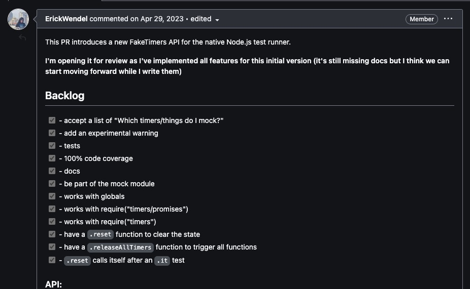
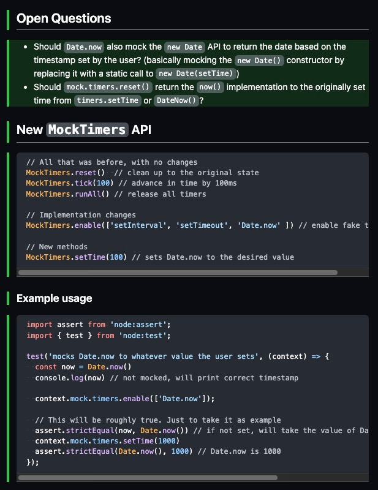
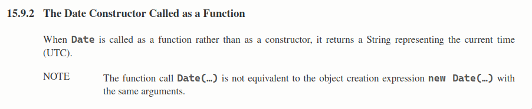
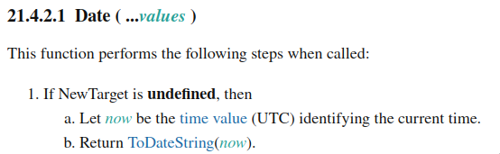
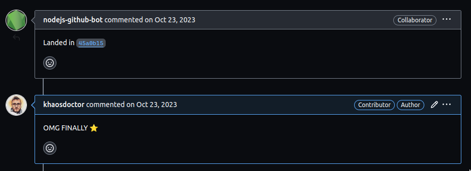

Há um pouco mais de um ano, eu tive o grande prazer de trabalhar no [core do Node.js](https://github.com/nodejs/node/pull/48638), e foi uma das experiências mais interessantes que eu já tive (então se você tá usando Node hoje, tem código meu ai!), tanto que agora estou voltando a trabalhar e ajudar a comunidade a crescer em volta dele também, porém, o que eu quero te contar aqui é como funcionam os [Date mocks](/node-test-runner-mocks/) dentro do [Node Test Runner](/comecando-com-o-node-js-test-runner/), parte a parte!

O objetivo desse artigo é tanto documentar o que foi feito nesta funcionalidade, mas também mostrar como não é tão complexo entender o código open source que temos por ai, e que você também pode contribuir para o projeto que mais curte.

## O objetivo

Tudo isso é muito bonito, mas o que são os mocks e para que a gente usaria algo assim?<MarginNote>Eu não vou entrar no conceito do que são mocks aqui em detalhe, mas você pode entender mais sobre eles nesse [artigo](https://medium.com/trainingcenter/testes-unit%C3%A1rios-mocks-stubs-spies-e-todas-essas-palavras-dif%C3%ADceis-f2765ac87cc8) (antigo, porém relevante)</MarginNote>

Eu queria poder fazer algo assim:

```js
import assert from 'node:assert';
import { test } from 'node:test';

test('mocks Date.now to whatever value the user sets', (context) => {
  const now = Date.now()
  console.log(now) // data atual, o tempo continua correndo

  // iniciamos os mocks
  context.mock.timers.enable({ apis: ['Date'] });

  // agora a data está fixa em 1000ms depois da época inicial
  context.mock.timers.setTime(1000)
  assert.strictEqual(Date.now(), 1000) // true
});
```

Praticamente, mocks de datas são muito utilizados para testar funcionalidades que são sensíveis a tempo, por exemplo, uma rotina ou cronjob que rodaria depois de X dias de um evento. Isso era muito comum na Klarna (e também é na maioria das empresas) quando tínhamos que lidar com ciclos de vida de cartões de crédito, então, por exemplo, a cada dia temos que pegar os cartões que venceram há 30 dias e rodar algum processo. Como se testa isso? Substituindo a data do computador pela sua própria, fazendo o Node pensar que ele está em uma data específica.

Graças à natureza dinâmica do JavaScript, isso não é tão complexo, mas eu descobri que você tem que conhecer bem a fundo a especificação para poder entender as consequências do que você pode fazer.

## O começo

Para a gente entender mais como funcionam os mocks, a gente precisa voltar um pouco para algumas PRs anteriores. O trabalho na minha PR começou com uma dica de um grande amigo, [Erick Wendel](https://github.com/ErickWendel), que tinha feito uma [PR](https://github.com/nodejs/node/pull/47775) alguns meses antes implementando os mocks para os timers (`setTimeout`, `setInterval` e etc).



Quando eu comecei a usar o test runner nos meus projetos, logo eu já tive um grande problema: por mais que a gente pudesse fazer mocks de timers, eu não conseguia fazer mocks de datas! Ou seja, eu não podia resetar o relógio do meu teste e controlar como eu queria que ele se comportasse... Algo precisava ser feito.

Eu sugeri essa ideia para o pessoal antes (poderia ter simplesmente feito, mas resolvi primeiro perguntar) e a maioria da galera gostou. Como outros test runners (Jest, Ava, Vitest, mocha, jasmine...) já tinham essa funcionalidade, seria interessante também tê-la implementada no NTR, isso traria mais adoção a plataforma.

## O planejamento

A ideia é que os mocks de datas se comportassem bem parecidos com a implementação do [Sinon](https://github.com/sinonjs/fake-timers/blob/main/src/fake-timers-src.js?rgh-link-date=2023-07-02T19%3A29%3A31Z), que também é a implementação usada no Jest, então significa que é uma API já conhecida da galera.

Eu comecei a pesquisar quais seriam os métodos principais e como eu poderia integrar essa nova API na API já existente de mocks e cheguei a conclusão que seria mais fácil implementar somente o método `now` da data, que era mais simples e poderia ser mais útil, essa era a versão inicial da minha PR:



Perceba que eu já estava pensando que talvez fosse melhor mockar todo o objeto de data, e não só o `now`, o que é consideravelmente mais complexo do que só o módulo.

> Eu não vou ir passo a passo do que eu fiz aqui, mas o contexto inicial é importante para entender as decisões futuras.

No final, depois de muitos comentários, a integração com a API de timers criada antes pelo Erick ficou assim:

```js
// Tudo que a API já tinha antes
MockTimers.reset()
MockTimers.tick(100)
MockTimers.runAll()

// Implementações que foram alteradas
MockTimers.enable({ timersToEnable: ['setInterval', 'setTimeout', 'Date' ], now: 1000 })

// Novos métodos
MockTimers.setTime(100)
```

Eu iria manter o principal uso, já que ela já estava em produção, mas modificar o parâmetro de `MockTimers.enable` que antes era um array de strings, para um objeto, porque agora poderíamos passar configurações para as datas.

Além disso, o MockTimers teria um novo método `setTime`, que iria alterar a data no mock. Mas, como é de costume no Node, os parâmetros iniciais da maioria das APIs são opcionais, então eu modifiquei a ideia para que ele também funcionasse assim:

```js
MockTimers.enable({ now: 1000 }) // sem uma lista, iriamos mockar todos os métodos

// ou

MockTimers.enable() // começa com a época 0
```

Com a API inicial decidida, vem a questão principal: **Como eu consigo mockar uma das principais APIs da linguagem sem quebrar nada?**

## O código

Por incrível que pareça, toda a adição do date mock no Node foi feita em um único [arquivo](https://github.com/nodejs/node/blob/74ddce8853e8c3de90f1037940ee5dcf38201b65/lib/internal/test_runner/mock/mock_timers.js) chamado `mock_timers.js` dentro de `lib/internal/test_runner/mock`. Isso é uma prática bastante comum em projetos mais antigos e estabelecidos porque faz com que PRs sejam bem menores já que o arquivo é grande mas tem todas as alterações necessárias.

> Houve uma pequena alteração em outro arquivo, mas isso eu vou falar mais tarde.

Quando eu comecei a codar essa funcionalidade eu pensei: "Mas como raios eu crio um mock", na real é bem simples, um mock nada mais é do que um objeto com uma interface **idêntica** ao objeto original, mas com o comportamento diferente. Então, por exemplo, se você quisesse manualmente fazer um mock do método `now` do `Date`, basta você fazer algo assim:

```js
const original = Date.now
Date.now = () => 0

console.log(Date.now()) // 0
console.log(original()) // 1720812736744
```

Claro que um método não é um objeto, então como fazemos isso? Primeiro, temos que criar as nossas propriedades novas, no caso é a data inicial, que vai ser `0`, que é a uma propriedade privada chamada `#now`:

```js
//https://github.com/nodejs/node/blob/bb7fc653e9199c5b65a7ed268f9e827d049d7a81/lib/internal/test_runner/mock/mock_timers.js#L123

class MockTimers {
  // ... inicio do código aqui
  #now = kInitialEpoch;
}
```

`kInitialEpoch` é uma constante (por isso que começa com `k`) definida na [linha 50](https://github.com/nodejs/node/blob/bb7fc653e9199c5b65a7ed268f9e827d049d7a81/lib/internal/test_runner/mock/mock_timers.js#L50) como `0`.

> Constantes como essa são muito comuns no core do Node, principalmente quando são usadas com Symbols, já que temos que garantir propriedades não enumeráveis internas, vamos ver mais sobre isso aqui.

Além dessa propriedade, como fizemos no nosso mock manual, temos que salvar o método original, dentro do MockTimers, o Node já faz isso com várias outras propriedades privadas:

```js
// https://github.com/nodejs/node/blob/bb7fc653e9199c5b65a7ed268f9e827d049d7a81/lib/internal/test_runner/mock/mock_timers.js#L99
class MockTimers {
  #realSetTimeout;
  #realClearTimeout;
  #realSetInterval;
  #realClearInterval;
  #realSetImmediate;
  #realClearImmediate;

  #realPromisifiedSetTimeout;
  #realPromisifiedSetInterval;

  #realTimersSetTimeout;
  #realTimersClearTimeout;
  #realTimersSetInterval;
  #realTimersClearInterval;
  #realTimersSetImmediate;
  #realTimersClearImmediate;
  #realPromisifiedSetImmediate;
}
```

Elas estão aqui porque, quando chamamos o `reset`, esses mocks precisam deixar de existir, ou seja, temos que atualizá-los pelos métodos originais. Então todo o `MockTimers` nada mais é do que uma classe que troca `globalThis.<seu objeto>` por um mock idêntico e guarda o valor original até você mandar ele recuperar. Agora as coisas ficaram mais simples.

Vamos adicionar uma outra propriedade ali que será o descritor do objeto `Date`:

```js
//https://github.com/nodejs/node/blob/bb7fc653e9199c5b65a7ed268f9e827d049d7a81/lib/internal/test_runner/mock/mock_timers.js#L118

class MockTimers {
  // ... inicio do código aqui
  #nativeDateDescriptor // L118
  #now = kInitialEpoch; // L123
}
```

> [!IMPORTANT] 💡
> É importante notar que `Date` não é uma função, então a gente não pode armazenar só o valor dele, como ele é um objeto, o JavaScript vai passar essa variável por referência, então temos que armazenar o descritor que pegamos com `Object.getOwnPropertyDescriptor`

Quando comecei a ver a forma que os timeouts estavam implementados, eu tive uma ideia. Hoje eles estão sendo criados cada um por uma função, dessa forma:

```js
  #setTimeout = FunctionPrototypeBind(this.#createTimer, this, false);
  #clearTimeout = FunctionPrototypeBind(this.#clearTimer, this);
  #setInterval = FunctionPrototypeBind(this.#createTimer, this, true);
  #clearInterval = FunctionPrototypeBind(this.#clearTimer, this);
  #clearImmediate = FunctionPrototypeBind(this.#clearTimer, this);
```

> Um detalhe importante é que o Node não pode usar os [primordiais](https://github.com/nodejs/node/blob/bb7fc653e9199c5b65a7ed268f9e827d049d7a81/typings/primordials.d.ts#L49) (como `umaFuncao.bind(this)` diretamente, já que isso é implementado pelo engine. Então existem funções internas que vão diretamente na raiz de onde esses métodos são executados (lá no V8) e fazem a mesma coisa, porém com um nome diferente, então o `bind` seria `FunctionPrototypeBind`, mas a ideia é a mesma

Então eu iria seguir o mesmo padrão, e é aí que a nossa história começa.

### É só uma função

A nossa função que cria um objeto de data é relativamente simples:

```js
#createDate() { // L279
    kMock ??= Symbol('MockTimers');
    const NativeDateConstructor = this.#nativeDateDescriptor.value;
}
```

Criamos dois objetos iniciais, o primeiro vai ser uma constante associada a um [Symbol](https://medium.com/trainingcenter/javascript-symbols-decifrando-o-mist%C3%A9rio-383e359e64e3) que vai representar o objeto de mocks como um todo, a gente vai precisar disso mais pra frente porque precisamos retornar o timestamp atual quando [ela não é usada como um construtor](https://262.ecma-international.org/5.1/#sec-15.9.2) (tipo `Date()`, lembra?), porque a gente precisa acessar as propriedades que o usuário definiu, como o `kInitialEpoch`. Essa propriedade aparece bem no início, mas ela só vai ser usada lá no final da nossa função.

A segunda é o construtor nativo do Date sem mudanças, porque a gente vai ter que retornar algumas funções que não precisam de mocks, por exemplo `toString`.

Logo depois vamos criar uma função dentro dessa função, a ideia é que a gente possa criar nosso objeto de mock dentro dessa função e retorná-la para o usuário, a gente só faz isso porque ele precisa ser capaz de criar a data como uma instância com `new Date`, e isso só é possível se a gente cria uma classe ou uma função, além disso, closures como essa permitem que a gente encapsule o nosso código interno dos mocks deixando ele privado:

```js
#createDate() { // L279
    kMock ??= Symbol('MockTimers');
    const NativeDateConstructor = this.#nativeDateDescriptor.value;
    // Nossa função que será o mock
    function MockDate(year, month, date, hours, minutes, seconds, ms) {
      const mockTimersSource = MockDate[kMock];
      const nativeDate = mockTimersSource.#nativeDateDescriptor.value;
      ...
    }
}
```

Dentro dela a gente já puxa a nossa constante nova que foi definida lá em cima e cria um objeto com o valor dele.

> Toda essa parte sobre o Symbol e o kMock vai ser explicada em uma seção a parte mais pra frente, então não precisa se preocupar em entender aqui.

Vamos tratar já o primeiro e único caso de uso diferente que temos, quando a gente chama a propriedade estática `now`, ou seja, a data não é uma instância, e a gente precisa conseguir identificar isso.

> [!NOTE] 🥵
> Essa foi uma das partes mais difíceis de programar nesse código porque é um tipo de meta programação onde estamos olhando para a propriedade de um objeto como se fossemos o agente externo, ou seja, o próprio objeto tem que saber se ele foi chamado como uma instância ou como um método estático

Eu olhei bastante a [implementação](https://github.com/sinonjs/fake-timers/blob/a4c757f80840829e45e0852ea1b17d87a998388e/src/fake-timers-src.js#L456) do Sinon pra isso, juntamente com duas partes da spec do ECMA, primeiro o [ECMA 262 edicão 5.2 - Seção 15.9.2](https://262.ecma-international.org/5.1/#sec-15.9.2) que basicamente descreve o comportamento quando a gente chama a função como `Date()`, ela precisa retornar **a data completa por extenso em UTC**



Ótimo, mas como eu sei que ela foi chamada como uma função? Podemos usar `if (!(this instanceof MockDate))`, certo? Isso deve funcionar porque se a data não for uma instância do nosso objeto de mock, ela então é uma função, que é a única outra forma de chamada, daí é só a gente implementar o nosso resultado, que é a data como string:

```js
#createDate() { // L279
    kMock ??= Symbol('MockTimers');
    const NativeDateConstructor = this.#nativeDateDescriptor.value;
    // Nossa função que será o mock
    function MockDate(year, month, date, hours, minutes, seconds, ms) {
      const mockTimersSource = MockDate[kMock];
      const nativeDate = mockTimersSource.#nativeDateDescriptor.value;

      if (!(this instanceof MockDate)) {
        return DatePrototypeToString(new nativeDate(mockTimersSource.#now))
      }
    }
}
```

O que queremos fazer é só retornar a data real como uma string, mas em uma época específica, a época que definimos como inicial ou o `now` que o usuário passa no mock, por isso que precisamos do `kMock` e também do `NativeDateConstructor`, dessa forma a gente pode pegar o objeto REAL de data e construir ele como se fosse `new Date(Date.now())`, e ai pegar a representação como string.

[Pena que isso não funciona.](https://github.com/nodejs/node/pull/48638#discussion_r1255170017) Por vários motivos, dentro da nossa função vamos ter um grande problema com `this` porque ele vai entrar em um estado inconsistente, mas o mais gritante disso é que `instanceof` [não é confiável](https://developer.mozilla.org/en-US/docs/Web/JavaScript/Reference/Operators/instanceof#:~:text=Note%20that%20the%20value%20of%20an%20instanceof%20test%20can%20change%20if%20constructor.prototype%20is%20re%2Dassigned%20after%20creating%20the%20object%20\(which%20is%20usually%20discouraged\).%20It%20can%20also%20be%20changed%20by%20changing%20object%27s%20prototype%20using%20Object.setPrototypeOf.). A gente pode falsificar a instância de um objeto se a gente substituir o prototype dele pelo que a gente quiser.

> Na verdade esse é um de mais de uma dúzia de comentários onde a gente só discute isso. E também foi o último problema que eu resolvi antes de fazer o merge do código, mesmo sendo a primeira coisa que a função faz.

Depois de pesquisar _MUITO_ eu achei uma outra parte da especificação mais recente ([edição 14 seção 21.4.2.1](https://262.ecma-international.org/14.0/#sec-date)) que diz mais ou menos como ela deve ser implementada:



> A versão 5.2 e a versão 14.0 da especificação são extensões uma da outra, a versão 14 é a mais nova de 2023 enquanto a 5.2 é bem antiga. Por conta disso todas as especificações da 5.2 mudaram de lugar, mas todo o conteúdo da 5.2 existe na 14.

Aqui temos uma pista do que fazer. O que é o `NewTarget`? Ele é justamente uma propriedade nativa de qualquer função ou classe que permite que a gente saiba o **contexto de execução** de tal objeto, ele é representado como `new.target`, ou seja, é o objeto que está na frente da keyword `new`. Quando a gente chama o Date como `new Date` o `new.target` vai ser um construtor de Date, já quando a gente executa `Date()` como uma função, `new.target` é `undefined` porque não existe um `new` para ter um target ([documentação aqui](https://developer.mozilla.org/en-US/docs/Web/JavaScript/Reference/Operators/new.target#syntax)). Então agora é simples, vamos só substituir nosso `instanceof`:

```js
#createDate() { // L279
    kMock ??= Symbol('MockTimers');
    const NativeDateConstructor = this.#nativeDateDescriptor.value;
    // Nossa função que será o mock
    function MockDate(year, month, date, hours, minutes, seconds, ms) {
      const mockTimersSource = MockDate[kMock];
      const nativeDate = mockTimersSource.#nativeDateDescriptor.value;

      if (!new.target) {
        return DatePrototypeToString(new nativeDate(mockTimersSource.#now))
      }
    }
  }
```

Daqui para frente a implementação fica consideravelmente mais simples. O próximo passo é saber qual [das 11 formas de chamar o date](https://developer.mozilla.org/en-US/docs/Web/JavaScript/Reference/Global_Objects/Date/Date#syntax) estamos usando, para isso eu simplesmente copiei a implementação do Sinon para isso e fiz algumas modificações:

```js
#createDate() { // L279
    kMock ??= Symbol('MockTimers');
    const NativeDateConstructor = this.#nativeDateDescriptor.value;
    // Nossa função que será o mock
    function MockDate(year, month, date, hours, minutes, seconds, ms) {
      const mockTimersSource = MockDate[kMock];
      const nativeDate = mockTimersSource.#nativeDateDescriptor.value;

      if (!(this instanceof MockDate)) {
        return DatePrototypeToString(new nativeDate(mockTimersSource.#now))
      }
      switch (arguments.length) {
        case 0:
          return new nativeDate(MockDate[kMock].#now);
        case 1:
          return new nativeDate(year);
        case 2:
          return new nativeDate(year, month);
        case 3:
          return new nativeDate(year, month, date);
        case 4:
          return new nativeDate(year, month, date, hours);
        case 5:
          return new nativeDate(year, month, date, hours, minutes);
        case 6:
          return new nativeDate(year, month, date, hours, minutes, seconds);
        default:
          return new nativeDate(year, month, date, hours, minutes, seconds, ms);
      }
    }
}
```

Lembrando que a gente tem que contar a quantidade de argumentos e que eles são todos posicionais e a gente só precisa tratar os argumentos específicos, porque se o usuário está passando uma data específica para a gente, não precisamos retornar a data que ele colocou, já que ele está criando um novo objeto, portanto, quando temos 1 argumento, ele vale tanto para quando criarmos um objeto de um objeto como `new Date(new Date())`, ou uma string `new Date('2024-05-10')` e qualquer outro, porque estamos delegando para a data original a execução dessa função.

Agora que já terminamos a nossa função `MockDate`, temos que definir todas as propriedades extras que o Date tem (`toString`, `toISOString`, etc) porque elas vão se manter iguais e eu não quero ter que implementar tudo na mão. Porém o nosso objeto de data não pode substituir o protótipo do nosso objeto atual, por isso vamos remover o protótipo e associar somente as propriedades:

```js
#createDate() { // L279
    kMock ??= Symbol('MockTimers');
    const NativeDateConstructor = this.#nativeDateDescriptor.value;
    // Nossa função que será o mock
    function MockDate(year, month, date, hours, minutes, seconds, ms) {
      const mockTimersSource = MockDate[kMock];
      const nativeDate = mockTimersSource.#nativeDateDescriptor.value;

      if (!(this instanceof MockDate)) {
        return DatePrototypeToString(new nativeDate(mockTimersSource.#now))
      }
      
      switch (arguments.length) {
        case 0:
          return new nativeDate(MockDate[kMock].#now);
        case 1:
          return new nativeDate(year);
        case 2:
          return new nativeDate(year, month);
        case 3:
          return new nativeDate(year, month, date);
        case 4:
          return new nativeDate(year, month, date, hours);
        case 5:
          return new nativeDate(year, month, date, hours, minutes);
        case 6:
          return new nativeDate(year, month, date, hours, minutes, seconds);
        default:
          return new nativeDate(year, month, date, hours, minutes, seconds, ms);
      }
  }

    // removemos o protótipo
    const { prototype, ...dateProps } = ObjectGetOwnPropertyDescriptors(NativeDateConstructor);
    // associamos as propriedades
    ObjectDefineProperties(MockDate, dateProps);

}
```

O único método que temos que substituir é o `now` que tem sempre que retornar o que o usuário colocou no mock, mas isso é bastante simples porque now é um método estático então podemos simplesmente fazer `MockDate.now = ...`:

```js
#createDate() { // L279
    kMock ??= Symbol('MockTimers');
    const NativeDateConstructor = this.#nativeDateDescriptor.value;
    // Nossa função que será o mock
    function MockDate(year, month, date, hours, minutes, seconds, ms) {
      const mockTimersSource = MockDate[kMock];
      const nativeDate = mockTimersSource.#nativeDateDescriptor.value;

      if (!(this instanceof MockDate)) {
        return DatePrototypeToString(new nativeDate(mockTimersSource.#now))
      }
      
      switch (arguments.length) {
        case 0:
          return new nativeDate(MockDate[kMock].#now);
        case 1:
          return new nativeDate(year);
        case 2:
          return new nativeDate(year, month);
        case 3:
          return new nativeDate(year, month, date);
        case 4:
          return new nativeDate(year, month, date, hours);
        case 5:
          return new nativeDate(year, month, date, hours, minutes);
        case 6:
          return new nativeDate(year, month, date, hours, minutes, seconds);
        default:
          return new nativeDate(year, month, date, hours, minutes, seconds, ms);
      }
  }

  // removemos o protótipo
  const { prototype, ...dateProps } = ObjectGetOwnPropertyDescriptors(NativeDateConstructor);
  // associamos as propriedades
  ObjectDefineProperties(MockDate, dateProps);

  // mantém o this correto dentro da função
  MockDate.now = function now() {
    return MockDate[kMock].#now
  }

}
```

O próximo passo é uma pequena alteração para evitar que, quando você fizer `Date.toString()`, você receba o código real nativo que é `'function Date() { [native code] }'`, e não a implementação do nosso código de Mock, lembre-se ela precisa ser **INDISTINGUÍVEL** de um Date. Pra isso a gente sobrescreve a função `toString` com o código original:

```js
#createDate() { // L279
    kMock ??= Symbol('MockTimers');
    const NativeDateConstructor = this.#nativeDateDescriptor.value;
    // Nossa função que será o mock
    function MockDate(year, month, date, hours, minutes, seconds, ms) {
      const mockTimersSource = MockDate[kMock];
      const nativeDate = mockTimersSource.#nativeDateDescriptor.value;

      if (!(this instanceof MockDate)) {
        return DatePrototypeToString(new nativeDate(mockTimersSource.#now))
      }
      
      switch (arguments.length) {
        case 0:
          return new nativeDate(MockDate[kMock].#now);
        case 1:
          return new nativeDate(year);
        case 2:
          return new nativeDate(year, month);
        case 3:
          return new nativeDate(year, month, date);
        case 4:
          return new nativeDate(year, month, date, hours);
        case 5:
          return new nativeDate(year, month, date, hours, minutes);
        case 6:
          return new nativeDate(year, month, date, hours, minutes, seconds);
        default:
          return new nativeDate(year, month, date, hours, minutes, seconds, ms);
      }
  }

  // removemos o protótipo
  const { prototype, ...dateProps } = ObjectGetOwnPropertyDescriptors(NativeDateConstructor);
  // associamos as propriedades
  ObjectDefineProperties(MockDate, dateProps);

  // mantém o this correto dentro da função
  MockDate.now = function now() {
    return MockDate[kMock].#now
  }
  
  MockDate.toString = function toString() {
      return FunctionPrototypeToString(MockDate[kMock].#nativeDateDescriptor.value);
    };

}
```

Estamos chegando no fim, o que a gente precisa fazer agora é definir a única propriedade que já usamos bastante mas ainda não foi definida, o `kMock`, você chegou a perceber isso?

### kMock

O `kMock` é um símbolo dentro da nossa implementação que, basicamente, é uma referência ao nosso objeto geral de Mocks para que a gente possa pegar as propriedades privadas como `#now` e o construtor original da data. Mas ele não foi definido até agora, isso não vai dar um problema sério?

Na verdade não, porque sempre que chamamos o `MockDate[kMock]` estávamos dentro de uma função, e `MockDate` não vai existir até o final da nossa função `#createDate`, então é seguro que a gente defina ele só no final, até porque a gente precisa tanto do MockDate, quanto do símbolo para isso. A gente só definiu o símbolo lá em cima para segurar a referência que vamos usar, porque agora podemos fazer isso aqui:

```js
  ObjectDefineProperties(MockDate, {
    __proto__: null,
    [kMock]: {
      __proto__: null,
      enumerable: false,
      configurable: false,
      writable: false,
      value: this,
    },

    isMock: {
      __proto__: null,
      enumerable: true,
      configurable: false,
      writable: false,
      value: true,
    },
  });
```

O que estamos fazendo aqui são duas coisas, estamos pegando a nossa função `MockDate` e criando propriedades nela, primeiramente definindo o protótipo como nulo para evitar problemas de herança, e depois dizendo que `[kMock]` é outro objeto que não é enumerável, não é modificável e não pode ser configurado, ou seja, ele é totalmente imutável e está apontando para `MockTimers`, que é o `this` no contexto de `#createDate`.

Depois temos uma outra propriedade que é meu toque pessoal nesse código, uma forma de saber se essa data é uma instância de um mock chamando `MockDaData.isMock`, esse valor é enumerável porém não é alterável. Isso é necessário as vezes quando estamos lidando com testes que estão usando múltiplos mocks de data.

Até agora nossa função está assim:

```js
#createDate() { // L279
    kMock ??= Symbol('MockTimers');
    const NativeDateConstructor = this.#nativeDateDescriptor.value;
    // Nossa função que será o mock
    function MockDate(year, month, date, hours, minutes, seconds, ms) {
      const mockTimersSource = MockDate[kMock];
      const nativeDate = mockTimersSource.#nativeDateDescriptor.value;

      if (!(this instanceof MockDate)) {
        return DatePrototypeToString(new nativeDate(mockTimersSource.#now))
      }
      
      switch (arguments.length) {
        case 0:
          return new nativeDate(MockDate[kMock].#now);
        case 1:
          return new nativeDate(year);
        case 2:
          return new nativeDate(year, month);
        case 3:
          return new nativeDate(year, month, date);
        case 4:
          return new nativeDate(year, month, date, hours);
        case 5:
          return new nativeDate(year, month, date, hours, minutes);
        case 6:
          return new nativeDate(year, month, date, hours, minutes, seconds);
        default:
          return new nativeDate(year, month, date, hours, minutes, seconds, ms);
      }
  }

  // removemos o protótipo
  const { prototype, ...dateProps } = ObjectGetOwnPropertyDescriptors(NativeDateConstructor);
  // associamos as propriedades
  ObjectDefineProperties(MockDate, dateProps);

  // mantém o this correto dentro da função
  MockDate.now = function now() {
    return MockDate[kMock].#now
  }
  
  MockDate.toString = function toString() {
      return FunctionPrototypeToString(MockDate[kMock].#nativeDateDescriptor.value);
    };
  
  ObjectDefineProperties(MockDate, {
    __proto__: null,
    [kMock]: {
      __proto__: null,
      enumerable: false,
      configurable: false,
      writable: false,
      value: this,
    },

    isMock: {
      __proto__: null,
      enumerable: true,
      configurable: false,
      writable: false,
      value: true,
    },
  });
}
```

### Toques finais

O toque final é definir o protótipo da nossa `MockDate` para o protótipo original do Date, dessa forma não quebramos aplicações de quem está fazendo `instanceof Date`, além disso, definimos os métodos estáticos globais comuns que não vamos substituir e retornamos todo o nosso trabalho:

```js
#createDate() { // L279
    kMock ??= Symbol('MockTimers');
    const NativeDateConstructor = this.#nativeDateDescriptor.value;
    // Nossa função que será o mock
    function MockDate(year, month, date, hours, minutes, seconds, ms) {
      const mockTimersSource = MockDate[kMock];
      const nativeDate = mockTimersSource.#nativeDateDescriptor.value;

      if (!(this instanceof MockDate)) {
        return DatePrototypeToString(new nativeDate(mockTimersSource.#now))
      }
      
      switch (arguments.length) {
        case 0:
          return new nativeDate(MockDate[kMock].#now);
        case 1:
          return new nativeDate(year);
        case 2:
          return new nativeDate(year, month);
        case 3:
          return new nativeDate(year, month, date);
        case 4:
          return new nativeDate(year, month, date, hours);
        case 5:
          return new nativeDate(year, month, date, hours, minutes);
        case 6:
          return new nativeDate(year, month, date, hours, minutes, seconds);
        default:
          return new nativeDate(year, month, date, hours, minutes, seconds, ms);
      }
  }

  // removemos o protótipo
  const { prototype, ...dateProps } = ObjectGetOwnPropertyDescriptors(NativeDateConstructor);
  // associamos as propriedades
  ObjectDefineProperties(MockDate, dateProps);

  // mantém o this correto dentro da função
  MockDate.now = function now() {
    return MockDate[kMock].#now
  }
  
  MockDate.toString = function toString() {
      return FunctionPrototypeToString(MockDate[kMock].#nativeDateDescriptor.value);
    };
  
  ObjectDefineProperties(MockDate, {
    __proto__: null,
    [kMock]: {
      __proto__: null,
      enumerable: false,
      configurable: false,
      writable: false,
      value: this,
    },

    isMock: {
      __proto__: null,
      enumerable: true,
      configurable: false,
      writable: false,
      value: true,
    },
  });
  
  MockDate.prototype = NativeDateConstructor.prototype;
  MockDate.parse = NativeDateConstructor.parse;
  MockDate.UTC = NativeDateConstructor.UTC;
  MockDate.prototype.toUTCString = NativeDateConstructor.prototype.toUTCString;
  return MockDate;
}
```

## Métodos do mock

Agora que temos o mock principal, podemos definir as outras funções que vem junto dele, primeiro temos que modificar o nosso método [`enable`](https://github.com/khaosdoctor/node/blob/8991402b81d24e7479dff2e076147c19ecc07bb8/lib/internal/test_runner/mock/mock_timers.js#L644), para que ele também possa aceitar a nova API. A modificação que vamos fazer aqui é basicamente de validação:

```js
// criamos o `now` como parâmetro nas opções
enable(options = { __proto__: null, apis: SUPPORTED_APIS, now: 0 }) {
  // clonamos o objeto de options
  const internalOptions = { __proto__: null, ...options };

  // ... código original

  // setamos o valor caso ele não exista
  if (!internalOptions.now) {
    internalOptions.now = 0;
  }

  // Se APIs não for passado, vamos ter todos habilitados
  if (!internalOptions.apis) {
    internalOptions.apis = SUPPORTED_APIS;
  }

  // ... Código original

  // Now pode ser uma instancia de Date então checamos isso
  if (this.#isValidDateWithGetTime(internalOptions.now)) {
    this.#now = DatePrototypeGetTime(internalOptions.now);
  } 
  // Caso contrário é um número
  else if (validateNumber(internalOptions.now, 'initialTime') === undefined) {
    this.#assertTimeArg(internalOptions.now);
    this.#now = internalOptions.now;
  }

  this.#toggleEnableTimers(true);
}
```

A nossa função [`#isValidDateWithGetTime`](https://github.com/khaosdoctor/node/blob/8991402b81d24e7479dff2e076147c19ecc07bb8/lib/internal/test_runner/mock/mock_timers.js#L512) não checa _realmente_ se é uma instância de Date, na verdade ele só checa se esse objeto tem uma propriedade `getTime` que é o que a gente precisa usar:

```js
#isValidDateWithGetTime(maybeDate) { // L512
  try {
    DatePrototypeGetTime(maybeDate);
    return true;
  } catch {
    return false;
  }
}
```

A nossa função [`#toggleEnableTimers`](https://github.com/khaosdoctor/node/blob/8991402b81d24e7479dff2e076147c19ecc07bb8/lib/internal/test_runner/mock/mock_timers.js#L522) é basicamente um objeto grande com duas propriedades: `toFake` e `toReal`, que contém as funções necessárias para que possamos converter o objeto em mock e de volta para o nativo:

```js
#toggleEnableTimers(activated) { // L522
  const options = {
    __proto__: null,
    toFake: {
      __proto__: null,
      // ... código dos timeouts original
      Date: () => {
        this.#nativeDateDescriptor = ObjectGetOwnPropertyDescriptor(globalThis, 'Date')
        // a mágica acontece aqui
        globalThis.Date = this.createDate()
      }
    },
    toReal: {
      __proto__: null,
      // ... timers
      Date: () => {
        ObjectDefineProperty(globalThis, 'Date', this.#nativeDateDescriptor)
      }
    }
  }

  const target = activate ? options.toFake : options.toReal
  ArrayPrototypeForEach(this.#timersInContext, (timer) => target[timer]())
  this.#isEnabled = activate
}
```

Além disso temos outros três métodos dos mocks de tempo: `setTime`, que é exclusivo para as datas, `tick` e `runAll`.

O [`setTime`](https://github.com/khaosdoctor/node/blob/8991402b81d24e7479dff2e076147c19ecc07bb8/lib/internal/test_runner/mock/mock_timers.js#L690C1-L696C4) vai trocar o valor de `#now`, então é bastante direto:

```js
setTime(time = kInitialEpoch) { // L690
  validateNumber(time, 'time');
  this.#assertTimeArg(time);
  this.#assertTimersAreEnabled();

  this.#now = time;
}
```

O [`tick`](https://github.com/khaosdoctor/node/blob/8991402b81d24e7479dff2e076147c19ecc07bb8/lib/internal/test_runner/mock/mock_timers.js#L613) já existia, mas a gente tem que fazer uma pequena modificação. Esse método avança o tempo em um número determinado de milisegundos, então temos que avançar o `#now` também:

```js
tick(time = 1) { // L613
  // ... código de validação 

  this.#now += time;
  
  // ... restante do código não modificado
}
```

O último método é o [`runAll`](https://github.com/khaosdoctor/node/blob/8991402b81d24e7479dff2e076147c19ecc07bb8/lib/internal/test_runner/mock/mock_timers.js#L728) que teve uma pequena alteração em outro arquivo. A ideia desse método é rodar todos os timers agendados, para isso a gente usa uma estrutura chamada de `PriorityQueue`, que é basicamente uma fila ordenada por tempo, ou seja, o timer com o menor timeout está no topo e o com maior timeout no final.

A PriorityQueue está definida no caminho `lib/internal/priority_queue.js`, ela continha já um método chamado `peek` que pega o primeiro item da fila sem tirar ele de lá, a gente precisa pegar o último, porque agora temos que saber qual é o timer que tem o maior tempo, subtrair do tempo que já passou (o nosso `#now`) e chamar o método `tick` com essa subtração, dessa forma vamos rodar todos os timers sem adicionar tempo a mais na nossa data (porque agora o `tick` está adicionando milissegundos no nosso `#now`), para isso eu criei um método chamado [`peekBottom`](https://github.com/nodejs/node/pull/48638/files#diff-21786c167d9eed3034877e03e9bc8640bf6bcf2b7c5b33980226d76e3a69d4bdR41-R44).<MarginNote>Eu não vou colocar essa implementação da PriorityQueue aqui, mas o [link](https://github.com/nodejs/node/pull/48638/files#diff-21786c167d9eed3034877e03e9bc8640bf6bcf2b7c5b33980226d76e3a69d4bdR41-R44) acima vai te levar pra lá</MarginNote>

A implementação em si é bem direta:

```js
runAll() { // L728
  this.#assertTimersAreEnabled();
  const longestTimer = this.#executionQueue.peekBottom();
  if (!longestTimer) return; // fila vazia
  // Avança o tempo
  this.tick(longestTimer.runAt - this.#now);
}
```

## E acaba por ai?

Essa foi a final da implementação dos timers, mas o trabalho não acabou. Como o artigo está longo eu não vou postar muito mais sobre isso. Os testes para essa funcionalidade foram outro tempo a parte, no total devo ter gasto pelo menos 13 horas nesse projeto, além de uns 3 meses em comentários, resoluções e tudo mais. No final, essa funcionalidade foi implementada na versão 21.2 do Node (tem até um [post](/node-21-2/) explicando como usar).



Além disso, se você olhar no histórico da PR, vai ver que eu passei dias lutando com o CI do GitHub porque existiam os chamado _flaky tests_, que foram corrigidos pelo Yagiz um tempo depois.


Esses flaky tests estavam impedindo que minha aplicação tivesse sinal verde, mas os erros não tinham nada a ver com o código que eu mudei. Por isso que é tão importante que contribuidores como nós possamos ajudar com a cobertura de testes e verificação do processo.

## Conclusão

Foi um artigo longo, mas eu quis trazer esse conteúdo aqui porque eu quero mostrar para você que é sim possível participar de projetos open source grandes e fazer a diferença mesmo em pequenas contribuições como essa.

O processo de contribuir para um projeto grande é complexo, envolve muitas e muitas variáveis e muitos dias e semanas de conversa com todo mundo, mas é extremamente desafiador e recompensador quando tudo termina!

Espero que você tenha se sentido inspirado(a) a tentar contribuir para o Open Source!

Até mais!
