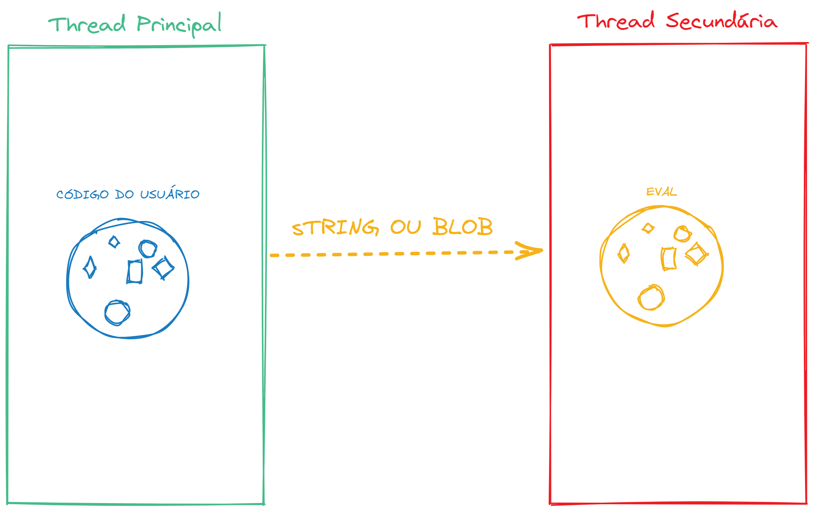
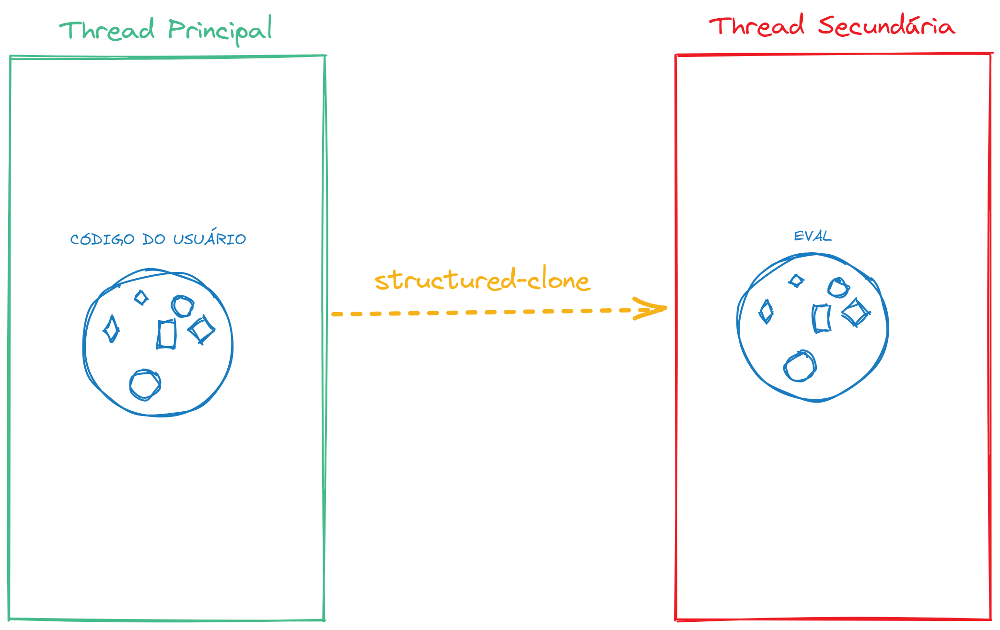

A gente cresceu ouvindo como devs que o JavaScript é uma linguagem _single-threaded_, ou seja, a gente só tem um único processo e não podemos sair dele. Isso se provou errado de alguns anos para cá quando novas APIs como os [Web Workers](https://developer.mozilla.org/en-US/docs/Web/API/Web_Workers_API/Using_web_workers) e [Service Workers](https://developer.mozilla.org/en-US/docs/Web/API/Service_Worker_API) foram criados.

Além disso, todas as extensões do JavaScript foram consideradas como _single-threaded_, quantas vezes você já ouviu alguém falar que o Node.js é single-threaded? E isso também não é verdade, embora o conjunto de APIs e a infraestrutura por trás do Node não sejam as mesmas da Web.

Agora estamos dando um passo à frente com essa ideia com a proposta de **[Module Expressions](https://github.com/tc39/proposal-module-expressions)** que chegou no estágio 3! Se você não sabe como funciona o JavaScript, nesse vídeo eu explico um pouco mais sobre o processo de lançamento de novas funcionalidades do JavaScript, se você ainda não assistiu, eu recomendo fortemente para poder entender melhor como tudo funciona!


## O problema

Quando queremos rodar algum tipo de computação assíncrona em JavaScript, usando alguma API (ou até mesmo em outra janela do browser) encontramos um problema que é essencialmente inerente a como o JavaScript foi construído. Por ser um ambiente que foi pensado para ser executado em um único thread, muitas vezes essas APIs não permitem o compartilhamento de memória entre, por exemplo, um Web Worker e a página principal.

Um exemplo disso é quando precisamos rodar um código do usuário dentro de um ambiente controlado, um sandbox, para isso podemos criar um web worker (ou até mesmo um [Shadow Realm](/shadow-realms/) que vai garantir que o mesmo espaço de memória não seja compartilhado, isso é algo bom. Mas como passamos essa função para esse novo "realm"?

Algumas bibliotecas que implementam padrões de execução multi-thread, como o [ParallelJS](https://github.com/parallel-js/parallel.js) e o [Greenlet](https://github.com/developit/greenlet), usam uma estratégia interessante: Transformar o código em uma string ou um blob para que ele possa ser enviado via mensagem para o executor.

Uma vez que o código está do outro lado, é necessário fazer um `eval` desse código para poder obter o resultado. Mas isso traz alguns problemas, principalmente, como você pode imaginar, de segurança através das [CSPs (Content Security Policies)](https://developer.mozilla.org/en-US/docs/Web/HTTP/CSP) que já são complexas naturalmente e acabam ficando ainda mais complicadas com mais de uma thread.



Além desse problema, temos outro que é ainda maior: **O código perde o contexto de execução**. Isso significa que um código como esse do exemplo da proposta:

```js title="Exemplo da proposta"
import greenlet from 'greenlet'

const API_KEY = "...";

let getName = greenlet(async username => {
  let url = `https://api.github.com/users/${username}?key=${API_KEY}`
  let res = await fetch(url)
  let profile = await res.json()
  return profile.name
});
```

Tenha um problema sério de execução, que é a perda da referência para a variável `API_KEY` devido ao fato de que, quando o código for executado do outro lado, ele não vai saber qual é esse valor porque ele não existe naquele contexto. E como o Greenlet passa tudo para uma string, ele também não faz a verificação do arquivo para substituir o valor de um lado no outro.

Entre outros problemas, a solução mais comum é utilizar outro arquivo com o código necessário e executar o que está descrito lá, o que não funcionaria no nosso contexto acima e também é um problema grande de experiência de desenvolvimento porque temos bundlers, que no final vão juntar tudo em um só lugar de novo.

## A solução

E se a gente pudesse empacotar um módulo, literalmente criar uma sequência de linhas de código que teriam contexto e semântica, e passar para o nosso worker ou nossa thread de forma que não precisássemos de nenhum tipo de string ou blob?

É ai que entram as Module Expressions.

A ideia das Module Expressions é bastante simples e muito parecida com as [Do Expressions](/do-expressions/) que eu já cobri aqui no blog. Esse seria um exemplo de implementação:

```js title="Exemplo da proposta"
let mod = module {
  export let y = 1;
};
let moduleExports = await import(mod);
assert(moduleExports.y === 1);

assert(await import(mod) === moduleExports);
```

A grande sacada é que, ao invés de termos que enviar o conteúdo via string, podemos enviar um módulo que vai sofrer uma atribuição do outro lado como um objeto de um módulo, e não através de uma string. E é isso, não existe muito mais o que falar.



Alguns pormenores que temos sempre que lembrar é que esse tipo de objeto só pode ser importado através de **dynamic imports**, quando usamos `import()` e não através dos `import` statements que temos no topo do arquivo porque não podemos usar uma string pra acessar o conteúdo desse módulo, já que ele está sendo criado em runtime.

Além disso, por conta de só poderem ser importados em tempo de execução, eles contam com a natureza assíncrona dos `import()` porque um módulo pode importar outro módulo pela rede.

### Contexto

O contexto de um Module Expression é o contexto onde eles estão sintaticamente localizados, ou seja, o local onde o código está dentro do arquivo. Esse exemplo ajuda a clarificar tudo:

```js title="Exemplo da proposta"
// main.js
const mod = module {
	export async function main(url) {
		return import.meta.url;
	}
}
const worker = new Worker("./module-executor.js");
worker.postMessage(mod);
worker.onmessage = ({data}) => assert(data == import.meta.url);

// module-executor.js
addEventListener("message", async ({data}) => {
	const {main} = await import(data);
	postMessage(await main());
});
```

Veja que estamos declarando uma expression que usa `import.meta.url`, no contexto dessa expression, o valor vai ser a url do arquivo `main.js`. Quando criamos um novo worker a partir de outro arquivo e enviamos o módulo via mensagem, vamos ver que o retorno de `await main()` vai ser a mesma url porque não estamos em outro contexto.

> Uma extensão da proposta está prevista [aqui](https://github.com/tc39/proposal-module-expressions#worker-constructor) com a criação de workers podendo receber Module Expressions.

Essencialmente, a ideia é poder transportar código com o contexto local, para outro contexto sem perder nenhum tipo de informação, em conjunto com os ShadowRealms temos uma API bastante poderosa que permite executa o código de onde estamos sem ter o problema de perder informação:

```js title="Exemplo da proposta"
globalThis.flag = true;

let mod = module {
  export let hasFlag = !!globalThis.flag;
};

let m = await import(mod);
assert(m.hasFlag === true);

let realm = new ShadowRealm();
let realmHasFlag = await r1.importValue(mod, "hasFlag");
assert(realmHasFlag === false);
```

## Conclusão

Um dos usos mais interessantes dessa proposta é criar o que é chamado de _off-thread scheduler_, uma função que recebe um módulo e executa esse módulo em outra thread, sem compartilhar recursos.

A sintaxe proposta para isso é a seguinte:

```js
let workerModule = module {
  onmessage = async function({data}) {
    let mod = await import(data);
    postMessage(mod.default());
  }
};

let worker = new Worker({type: "module"});
worker.addModule(workerModule);
worker.onmessage = ({data}) => alert(data);
worker.postMessage(module { export default function() { return "hello!" } });
```

Preste atenção em `new Worker({type: 'module'})` e na declaração do worker já com a module expression dentro na última linha.

Com isso fechamos mais esse resumão sobre as **Block Expressions** mas infelizmente, como a proposta é longa, muito conteúdo ficou de fora para não ser um artigo super comprido. Então eu sugiro que você leia a proposta original também para poder ter uma ideia ainda melhor!
