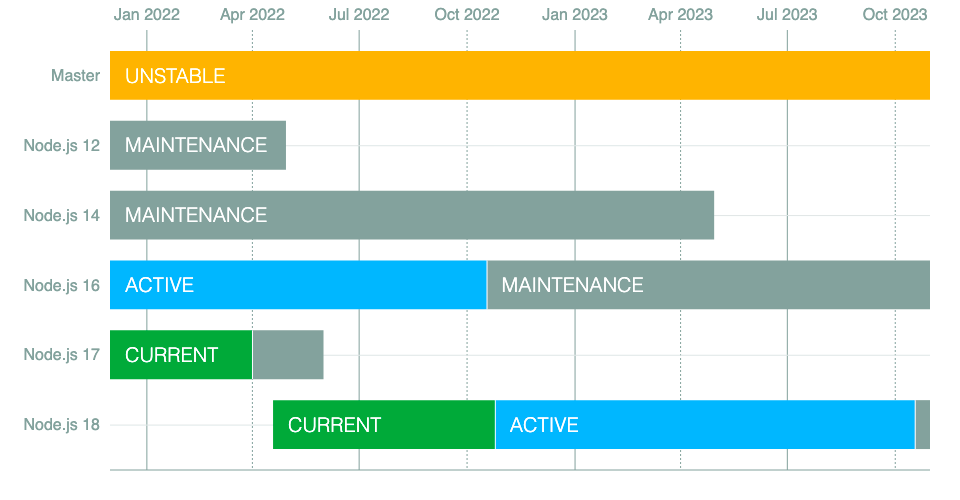

Como eu [sempre faço por aqui](/veja-o-que-ha-de-novo-no-node-js-16/), vamos falar de mais um lançamento sensacional do Node.js, a **versão 18 foi anunciada em Abril de 2022**! E você deve estar se perguntando: E dai?

Para você que é dev JavaScript ou não, essa versão do Node.js trouxe uma série de mudanças muito interessantes para o runtime em si, e algumas dessas mudanças são tão importantes que podem inspirar outros runtimes a fazerem o mesmo, então bora dar uma olhada em tudo que a gente tem por ai!

Mas antes, como eu sempre faço em artigos desse tipo, bora explicar um pouco mais sobre esse processo de lançamento do Node.js.

## O processo de releases do Node.js

Assim como muitos outros grandes projetos que tem uma dependência muito forte da comunidade, o Node.js possui um calendário e organização de novas versões e releases extremamente organizado.

Todas as versões pares são consideradas versões "prontas para produção", enquanto as versões ímpares são as versões de teste e desenvolvimento. Em outras palavras, versões ímpares são como o ambiente de _staging,_ ou seja, testes mais estruturados, para dar lugar a uma versão de produção. Geralmente novas funcionalidades são testadas com a comunidade nessas versões e, depois de um tempo, elas são promovidas a uma versão estável.



Versões pares são lançadas em **Abril** e ficam designadas como _Current_ até Outubro, quando se tornam a versão ativa, depreciando a versão par anterior para o estado de **manutenção**.

A diferença entre uma versão **Active** e **Current** é que as versões ativas são consideradas **LTS** ou **Long Term Support**, que recebem updates de segurança e manutenções por 3 anos, sempre existem 3 versões em estado de manutenção e uma versão LTS, todas as versões mais antigas do que 3 anos são depreciadas, que é o que aconteceu com a **versão 10** agora que a versão 18 foi lançada.

Você pode ver todas as datas e todos planos para as versões anteriores e as próximas versões [no site oficial das releases](https://github.com/nodejs/Release#release-schedule).

Atualmente este é o estado do ambiente:

-   **Node v12:** alcançou o fim de sua vida em Abril de 2022
-   **Node v14**: Continua em manutenção até Abril de 2023, depois será abandonado
-   **Node v16:** Atualmente é a versão LTS até Outubro de 2022, depois entra em manutenção até Abril de 2024, quando será abandonado.
-   **Node v18:** É a versão _Current_ até Outubro de 2022 quando se torna a próxima LTS até Abril de 2025.

## Global Fetch disponível por padrão

Na versão 17 do Node, foi anunciado que a API `fetch`, já presente na maioria dos browsers para JavaScript, chegaria também ao Node. De forma que a gente não iria mais precisar de pacotes externos como o famoso `axios` e `got` para poder fazer requisições HTTP de uma forma mais fácil, sem precisar o client HTTP nativo do Node – que é, digamos... Um pouco complexo.

Esse client é implementado usando uma das bibliotecas mais interessantes já feitas para Node, o [undici](https://undici.nodejs.org/#/), um client HTTP/1.1 escrito **do zero**, completamente em JavaScript para Node.js.

Essa implementação foi originalmente adicionada através de uma flag experimental no Node que ativava a funcionalidade, mas agora temos o `fetch` habilitado por padrão.

Veja como podemos usar esse novo cliente:

```js
const res = await fetch('https://nodejs.org/api/documentation.json');
if (res.ok) {
  const data = await res.json();
  console.log(data);
}
```

Além do `fetch`, outras variáveis globais foram adicionadas: `Headers`, `Request`, `Response` e `FormData`

> Cuidado para não confundir os tipos nativos `Request` e `Response` com os mesmos tipos do Express quando estamos usando TypeScript

## Outras APIs globais

-   Uma versão experimental da API de [WebStreams](https://developer.mozilla.org/en-US/docs/Web/API/Streams_API) foi adicionada, permitindo o uso de streams nativamente em ambientes Web sem o uso de integrações locais
-   Um novo tipo de `Buffer` experimental, o [`Blob`](https://nodejs.org/api/buffer.html#class-blob), foi também colocado nas APIs globais
-   Para uma adição nas `worker_threads`, o [`BroadcastChannel`](https://nodejs.org/api/worker_threads.html#class-broadcastchannel-extends-eventtarget) agora também é uma API global exposta

## Test runner nativo

Uma das APIs mais legais que eu, pessoalmente, estava esperando há anos, é o suporte a rodar testes nativamente. Isso mesmo, sem mais `mocha`, `jest`, `ava` e outros.

Agora você pode rodar nativamente todos os testes de software que você já possui através do módulo `test`, que só pode ser carregado se denotado com o prefixo `node:`:

```js
import test from 'node:test'
import assert from 'node:assert'

test('top level test', async (t) => {
  await t.test('subtest 1', (t) => {
    assert.strictEqual(1, 1);
  });

  await t.test('subtest 2', (t) => {
    assert.strictEqual(2, 2);
  });
});
```

A [API está totalmente documentada](https://nodejs.org/dist/latest-v18.x/docs/api/test.html), claro que vai demorar um tempo até que ela alcance o nível de outra bibliotecas como o `jest`, se é que um dia ela vai alcançar.

Eu digo isso porque a ideia principal dessa biblioteca não é que ela substitua as principais libs que já utilizamos, como as que eu falei anteriormente, mas sim diminua a barreira de entrada para a criação de testes automatizados usando Node.js. Dessa forma mais sistemas poderão contar com testes automatizados e ficarão muito mais seguros.

No entanto, existem **algumas considerações de implementações** que precisamos considerar:

-   O Node vai executar todos os arquivos de teste quando você inicializar o runtime com a flag `--test`, cada teste será rodado em seu próprio processo isolado.
-   Os testes podem ser síncronos ou assíncronos, testes síncronos vão ser considerados válidos se não derem nenhuma exceção. Os assíncronos, como era esperado, se não rejeitarem uma [Promise](https://dev.to/khaosdoctor/series/1993)
-   Subtestes criados com o contexto `t`, que estamos passando no exemplo, vão ser executados da mesma forma que o teste pai
-   Se você quiser pular um teste, é só mandar um objeto de opções com a flag `{ skip: 'mensagem' }` para o objeto de teste como nesse exemplo:

```js
test('pulado', { skip: 'Esse teste foi pulado' }, (t) => {
    // nunca executado
})
```

Atualmente o objeto de opções aceita três tipos de chaves:

-   `concurrency`: Define quantos testes rodam em paralelo
-   `skip`: Pode ser um boolean ou uma string, se for um boolean `true`, o teste será pulado sem nenhuma mensagem, caso contrário, a mensagem será exibida
-   `todo`: Mesma coisa do anterior, aceita um boolean ou uma string, se ele for convertido para `true`, o teste será marcado como To-Do.

O test runner ainda está em caráter experimental e rodando atrás de flags, mas isso deve ser alterado nas próximas versões.

## O prefixo `node:`

Vamos fazer um contorno para explicar uma funcionalidade que não é necessariamente algo que veio com o Node 18 propriamente dito, porém foi uma alteração importante que cria um precedente que pode ser seguido no futuro para todos os demais módulos.

No exemplo que dei sobre o test runner acima, você pode notar que estamos importando os módulos `assert` e `test` com um prefixo `node:`. Isso é o início do que é chamado de **prefix-only core modules**.

Isso já existia antes, porém não era obrigatório, até hoje todos os módulos nativos como o `fs`, `assert` e outros funcionavam da mesma forma queiram eles fossem importados com o prefixo `node:` ou não. Hoje isso não é mais o caso.

O `node:test` é o primeiro módulo nativo que só pode ser importado se utilizado com o prefixo `node:`, se você não utilizar o prefixo, o runtime vai tentar carregar um módulo chamado `test` que é considerado um _userland module_, ou seja, um módulo feito pela comunidade.

Isso é uma mudança incrível porque com o prefixo `node:` chegando nos novos módulos (e provavelmente como breaking change em alguma versão futura para módulos mais antigos), vamos ter a capacidade de ter dois módulos com o mesmo nome, um no _userland_ e outro no _core_ do Node.

Dessa forma, como módulos do _core_ tem precedência sobre módulos de usuários, será possível para quem colabora com o Node criar módulos sem se importar se o nome do módulo já existe no NPM por exemplo.

Por outro lado, isso cria dois problemas, o primeiro deles é que temos ai uma inconsistência clara entre os módulos que já existem, como o `fs` e `http`, e os módulos novos que só usam o prefixo. A solução para isso teria de ser a obrigação do uso do prefixo para todos os módulos, e não só para os mais novos.

Além disso, um problema de segurança acaba surgindo: o **typosquatting**, quando alguém cria um módulo no NPM com o mesmo nome ou um nome muito parecido com um pacote original – algo como chamar `express` de `expres` no NPM – para que devs desavisados possam baixar o pacote malicioso ao invés do pacote original. Esses problemas não são do time do Node, até porque o NPM já possui algumas travas de segurança contra isso, mas de qualquer forma, é algo que vale a pena ser mencionado.

## Userland snapshots

Algo super interessante que surgiu na versão 18 é o uso de snapshots para build time do runtime do Node. Isso é algo bastante interessante para quem tem muitos times de desenvolvimento e precisa sincronizar e até mesmo melhorar a performance em um produto entre times.

A partir dessa nova versão, será possível compilar um binário do Node.js com um snapshot customizado de inicialização usando a flag `--node-snapshot-main`. Por exemplo:

```bash
$ cd /path/to/node/source
$ ./configure --node-snapshot-main=marked.js
# Build do binário
$ make node
```

Construir o binário do Node passando um entrypoint como o `marked.js` que é um renderer de Markdown vai inicializar o módulo e carregá-lo no `globalThis` e você vai poder usar ele nativamente como:

```js
const html = globalThis.marked(process.argv[1]);
console.log(html);
```

E executar o binário construído com:

```bash
$ out/Release/node render.js test.md
```

Claro, isso é para casos de uso bastante específicos onde você precisa, de fato, recompilar todo o runtime do Node para incluir um ou mais entrypoints de módulos diretamente no binário para melhorar o tempo de compilação.

Como follow-up, o time está trabalhando nas PRs [#42617](https://github.com/nodejs/node/issues/42617) e [#38905](https://github.com/nodejs/node/pull/38905), que respectivamente:

-   Permite que o módulo seja carregado sem um script de inicialização, o que vai transformar o binário inteiro na aplicação do usuário, dessa forma seu binário final seria executado como `$ out/Release/markedNode test.md`, um passo mais próximo de binários completos do Node como o próprio Golang faz
-   Permite a adição de entrypoints sem a necessidade de recompilar todo o runtime com um compilador.

## Mudanças no V8 e outros pontos

A versão 10 do v8 traz algumas novidades:

-   Suporte para os novos métodos `findLast` e `findLastIndex` nos arrays, que fazem exatamente a mesma coisa do `find`, porém encontrando o último valor ao invés do primeiro
-   Melhorias na API do `Intl.Locale`
-   Melhorias de performance para inicialização de propriedades de classe e métodos privados para que eles sejam tão rápidos quanto propriedades normais.
-   O import de módulos JSON foi oficialmente [removido da flag experimental](https://github.com/tc39/proposal-import-assertions)
