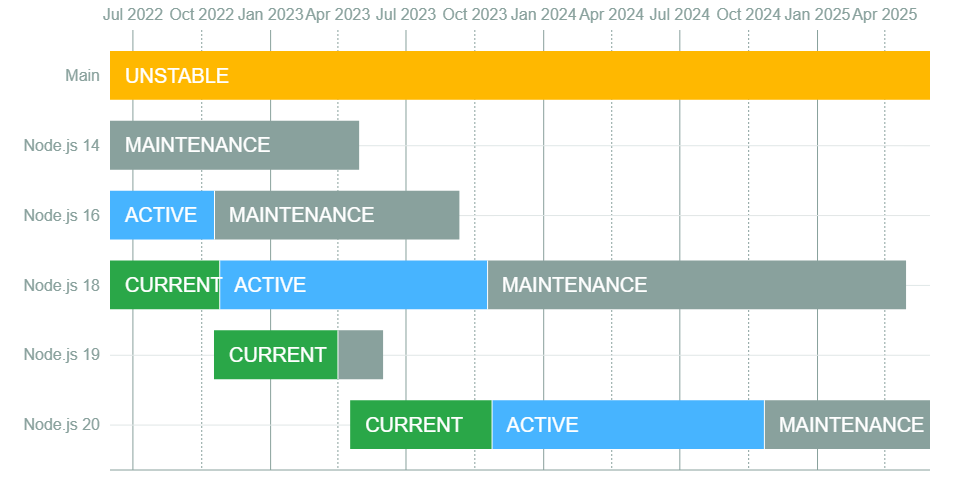

Mais um ano, mais uma versão do Node está disponível! E, como é de costume, vou deixar todas as novidades mais legais aqui nesse post pra que você não perca nada!

O Node v20 é uma versão bastante importante porque, por ser uma versão par, essa vai ser a versão que vai se tornar a próxima LTS daqui um tempo!



Atualmente, nós temos a versão 18 sendo a versão ativa atual até outubro de 2023, depois temos a versão 19 que atua como sendo uma versão intermediária para testes que fica liberada até o release da nova versão 20, que vai substituir a versão 18 como ativa em Outubro.

## Sistema de permissões

O Node segue nos passos do [Deno](/deno/) mais uma vez. Para dar um contexto, o Deno possui um sistema de permissões de arquivos, onde cada executável tem permissões específicas para poder executar tarefas, como ler arquivos, rede, variáveis de ambiente e etc.

Então, por exemplo, se quisermos rodar um programa que leia um arquivo, vamos precisar executar esse programa com uma flag chamada `--allow-read`. Da mesma forma, o Node acabou de implementar de forma experimental um sistema de permissões para os programas em execução.

Inicialmente, as permissões implementadas são:

-   Acesso ao FS com a flag `--allow-fs-read` e `--allow-fs-write`
-   Restrição de acesso a spawn de child processes com `--allow-child-process`
-   O mesmo vale para worker threads com `--allow-worker`

Você precisa iniciar o Node com a flag `--experimental-permission` junto com as permissões desejadas quando iniciar o seu programa. Então por exemplo, um programa que possa ler e escrever em todo o sistema de arquivos seria algo assim:

```bash
$ node --experimental-permission --allow-fs-read=* --allow-fs-write=* index.js
```

Da mesma forma do Deno, você pode especificar qual é a pasta e o arquivo que este programa pode ler:

```bash
$ node --experimental-permission --allow-fs-write=/tmp/ --allow-fs-read=/home/index.js index.js
```

E, também igual o Deno, você pode checar pelas permissões programaticamente, se você habilitar a flag `--experimental-permission`, você terá acesso ao objeto `permission` presente em `process`. Com ele você pode checar se as permissões existem e foram dadas. Por exemplo:

```js
process.permission.has('fs.write'); // true
process.permission.has('fs.write', '/home/nodejs/protected-folder'); // true
```

A adição desse sistema de permissões é super importante porque move o runtime para uma visão mais focada em segurança, que é uma das grandes falhas do Node hoje em dia.

## Test runner está estável

Finalmente temos um test runner estável no Node.js! E não precisaremos mais de outras bibliotecas como o Jest, Ava, Mocha e etc. A versão 20 inclui modificações que tornaram o runner estável, sendo possível rodar seus testes em produção!

Eu [escrevi um artigo sobre o test runner do Node](/node-test-runner/) há um tempo, nele eu falo um pouco de tudo que o runner tinha, porém agora temos mais funcionalidades como o **watch mode**, **mocking** e a capacidade do `node --test` rodar os arquivos de forma paralela.

Esse é um exemplo tirado do site do Node com todas as novas funcionalidades dele:

```js
import { test, mock } from 'node:test';
import assert from 'node:assert';
import fs from 'node:fs';

mock.method(fs, 'readFile', async () => "Hello World");
test('synchronous passing test', async (t) => {
  // Teste passa porque não dá nenhuma exceção
  assert.strictEqual(await fs.readFile('a.txt'), "Hello World");
});
```

## Performance

Como uma forma geral, o Node está ficando mais rápido. Com a mudança de versão do Ada, uma biblioteca de parsing de URLs escrita em C++, o custo de se parsear uma URL e realizar outras operações básicas caiu bastante. Por exemplo, o custo de inicializar um objeto `EventTarget` caiu pela metade, o que significa que todas a bibliotecas e códigos que usam ele vão ficar mais rápidos.

Da mesma forma, outras APIs estão sendo otimizadas e modificadas a fim de ficar ainda mais rápidas para que o runtime como um todo seja melhorado.

## Single Executable Applications (SEA)

Também nos passos do `deno compile`, o Node está trazendo um suporte inicial a arquivos que são compilados como um único executável, contendo todas as ferramentas necessárias para poder rodar o runtime e o seu código mesmo se o Node não estiver instalado na máquina.

Isso é sensacional porque permite que a instalação de aplicações com Node seja muito mais rápida e muito mais segura, já que você pode, por exemplo, iniciar um container _[from scratch](/um-mergulho-em-imagens-de-containers-parte-3/)_ somente com a sua aplicação rodando dentro. O que reduz drásticamente a área de ataques.

O problema é que ainda não conseguimos mandar mais do que um único arquivo para ser executado como um SEA, mas já temos um suporte inicial que exige um blob preparado e um arquivo inicial de configuração como esse:

```json
{
  "main": "hello.js",
  "output": "sea-prep.blob"
}
```

E depois a execução como:

```bash
$ node --experimental-sea-config sea-config.json
```

Usar um arquivo de configuração é ao mesmo tempo bom e ruim porque, enquanto precisamos passar um arquivo todo para o Node, ainda podemos abrir novos casos de uso onde múltiplos recursos podem co-existir no mesmo binário.

## Outras novidades

-   Suporte oficial ao ARM64 para Windows
-   A implementação da Web Crypto API agora está validando argumentos de acordo com a especificação da WebIDL
-   O suporte a interface WASM no Node está crescendo
