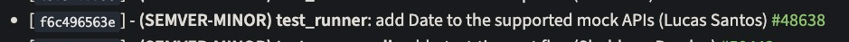

I recently posted [an article](/node-21/) about the news in Node's version 21, but one of these updates got left out!

And that's exactly the [21.2 release](https://nodejs.org/en/blog/release/v21.2.0) of the runtime that, to me, is the most special version of all, because this time I was there helping make Node even better!



That's right! After almost 3 years away from the open source world, I decided to get back into the ecosystem once more, and this time straight into Node.js!

> [!TIP] 💡
> I made [a LinkedIn post](https://www.linkedin.com/posts/lsantosdev_opensource-mocks-javascript-activity-7131061453322649600-qmc9?utm_source=share&utm_medium=member_desktop) about it, if you want to check it out later! But here I'll focus on the update itself!

## Why is it special?

Because I'm in it! 😎 Just kidding! Of course this version is special to me, but it's also special for another reason, **this is going to be the first time we have the ability to test 100% of an application with Node's native test runner!**

Node added support for a [native test runner](/node-test-runner/) a few versions back, but unfortunately the tool's support was pretty... weird. We had no way to do mocks, there was no decent way to do code assertions, and the output was pretty questionable.

Little by little, the test runner kept improving and it's becoming more and more important in the ecosystem. So much so that by version 20 you can already use it normally to test a good chunk of the applications we build.

But we still had a problem: we couldn't test applications that depend on time. We simply had no way to mock anything related to date or time, so any application that depends on timers like `setTimeout` or others couldn't be tested. With the [addition of timers to the mocking system](https://github.com/nodejs/node/pull/47775) we started getting support for timers, so `setTimeout`, `setInterval` and `setImmediate` were covered.

Except we still didn't have support for dates, we couldn't mock a date object like `Date`. And that's when I had the idea to build on top of Erick's implementation and extend it with `Date` support, and now every date option is covered!

## Date mocks

The complete documentation for the module is already live in the newest version [of the Node docs](https://nodejs.org/dist/latest-v21.x/docs/api/test.html#dates), but I'll walk through a few examples here:

https://nodejs.org/dist/latest-v21.x/docs/api/test.html#dates

Before anything else, it's important that you read my [original article about the test runner](/node-test-runner/) to understand how it works, but essentially, we have a `--test` flag that can be passed to the Node command, this flag will run whatever files are passed after it as a test and will report in text format.

```shell
node --test arquivo.test.js
```

To set up a test file we can simply create any file with a `.js`, `.mjs` or `.cjs` extension. And then import Node's test module, let's create a simple test for example:

```js
import assert from 'node:assert';
import { test } from 'node:test';

test('mocks the Date object', (context) => {
  assert.ok(true) // ok
});
```

You can also use the `describe` and `it` model:

```js
import assert from 'node:assert';
import { describe, it } from 'node:test';

describe('mocks the Date object', () => {
  it('should pass', () => {
    assert.ok(true)
  })
});
```

So far we're only testing our test, but let's create a function that depends on our date object, for example, a function that tells us what the current day of the week is:

```js
const dayIndex = [
  'Domingo', 
  'Segunda', 
  'Terça', 
  'Quarta', 
  'Quinta', 
  'Sexta', 
  'Sábado'
]

function getWeekDay() {
  const today = new Date()
  return dayIndex[today.getDay()]
}
```

How can we test a function that depends on today's date, without needing to replace its behavior? The answer is **Date mocks!**

A bit further down, we'll start a simple test that will make sure we're mocking our date object, we can do this through the test context in an object called `mock.timers` using the `enable` function.

```js
import { describe, it } from 'node:test'
import assert from 'node:assert'

describe('getWeekDay', () => {
  it('should replace the date object', (c) => {
    c.mock.timers.enable({ apis: ['Date'] })
    assert.strictEqual(Date.now(), 0)
    c.mock.timers.reset()
  })
})
```

Notice we call the `enable` function, we pass an object `{ apis: ['Date'] }`, this object holds the config for which APIs are enabled for the mocks, you can see all the options [in the official docs](https://nodejs.org/dist/latest-v21.x/docs/api/test.html#timersenableenableoptions).

> [!CAUTION] ⚠️
> If you're using version 21.2, the TypeScript typings aren't correct because [my PR to add the types](https://github.com/DefinitelyTyped/DefinitelyTyped/pull/67035) hasn't been merged yet, but it should land in the next even version (22).
>
> So if your VSCode doesn't give you the correct typing, don't worry, just make sure you're using version 21.2 or later.

Also notice we're using an object `c`, which is the test context. Time mocks are only enabled at the local context level, to keep you from enabling a mock and not fully disabling it at a global context for other tests. And, at the end of the test, it's just as important that we reset the mocks with `reset` so we can go back to the original state.

> When we initialize the date mock with no parameters, we're saying we want to start the date at epoch 0, that is, January 1st, 1970.

Now that we know we're mocking things correctly, let's test for every day of the week. To do that we'll build a loop, setting our clock to a specific date each time, one test per day of the week:

```js
  it('should return the correct day of the week', (c) => {
    c.mock.timers.enable({ apis: ['Date'] })
    const dates = [
      new Date('2023-11-12T00:00:00.000Z'),
      new Date('2023-11-13T00:00:00.000Z'),
      new Date('2023-11-14T00:00:00.000Z'),
      new Date('2023-11-15T00:00:00.000Z'),
      new Date('2023-11-16T00:00:00.000Z'),
      new Date('2023-11-17T00:00:00.000Z'),
      new Date('2023-11-18T00:00:00.000Z'),
    ]

    for (const [i, date] of dates.entries()) {
      c.mock.timers.setTime(date.getTime())
      assert.strictEqual(getWeekDay(), dayIndex[i])
    }
    c.mock.timers.reset()
  })
```

Notice that now we're creating an array of dates that represent one week, this week will be handed to our mock's date object through `setTime`, which is the method that sets what the current system date is!

This method always takes a positive integer, unlike the `now` key on the `enable` method (as in `enable({ apis: ['Date'], now: new Date() })`), so we need to call `getTime` and, at the very end, call `reset`.

If we run `node --no-warnings --test date.mjs`, we'll get a successful test run!

```bash
❯ node --no-warnings --test date.mjs
▶ getWeekDay
  ✔ deve substituir o objeto de data (0.423292ms)
  ✔ deve retornar o dia da semana correto (0.765291ms)
▶ getWeekDay (2.142209ms)

ℹ tests 2
ℹ suites 1
ℹ pass 2
ℹ fail 0
ℹ cancelled 0
ℹ skipped 0
ℹ todo 0
ℹ duration_ms 58.35425
```

## Dates and timers

Unlike timers, dates are a global object, that is, if you run `enable` with a `Date`, **every date will be mocked**, this also includes the internal clock used by timers like `setTimeout` and `setInterval`, meaning if you move the date forward, you'll move the timers forward too.

So imagine the following situation: you have a mocked date object, and also a timer set to run in 1 second. If you move the date object forward using `setTime` by, say, 1 hour, you'll **necessarily trigger the timer's function**, since it'll be as if time had jumped 1 hour into the future.

Luckily this test is pretty simple to write, we just need to start mocking our timers (which will stop Node's internal clock) and create a 1 second timeout, then move time forward by more than that:

```js
import assert from 'node:assert';
import { test } from 'node:test';

test('runs the timers once the date moves forward', (context) => {
  context.mock.timers.enable({ apis: ['setTimeout', 'Date'] });
  const fn = context.mock.fn(); // We create a mock function
  setTimeout(fn, 1000);

  context.mock.timers.setTime(800);
  // 1s hasn't passed yet, the timer hasn't run
  assert.strictEqual(fn.mock.callCount(), 0);
  // The date was moved forward
  assert.strictEqual(Date.now(), 800);

  // We move the date forward some more
  context.mock.timers.setTime(1200);
  // Now our timer runs
  assert.strictEqual(fn.mock.callCount(), 1);
  assert.strictEqual(Date.now(), 1200);
});
```

It's important to keep in mind that timers are independent from the date when mocked, meaning you can control them individually, but when you turn on mocks for both dates AND timers, then both will work together because they share the same internal clock.

## Conclusion

This is a very special post to me because, for the first time, I'm describing and teaching how to use a feature that I built myself.

The test runner is still a work in progress and there's a lot to improve, but we're taking it one step at a time and, little by little, we'll end up with one of the best native runners out there!
