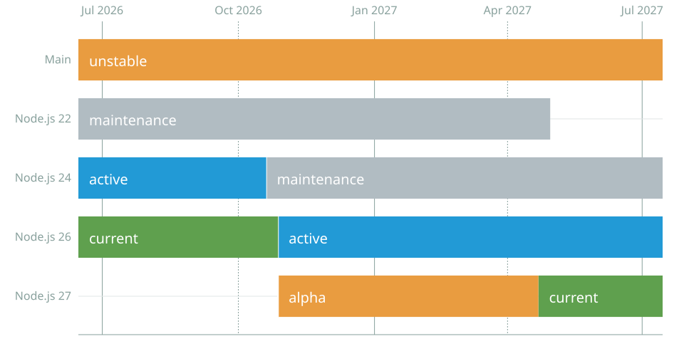

Mais uma versão do Node.js acabou de sair! Então bora trocar uma ideia sobre as principais novidades que temos nessa nova versão.

Lembrando que as releases ímpares **não** são as recomendadas para produção, mas sim releases experimentais para que você possa fazer testes e dar feedbacks para a galera!



Atualmente estamos na versão 20 até Outubro do ano que vem, o Node 21 vai estar disponível até Abril de 2024 e depois vamos ter a versão 22 que será a nova versão LTS!

> [!NOTE] 💡
> Nesse artigo vamos cobrir tanto a [versão 21](https://nodejs.org/en/blog/announcements/v21-release-announce) quanto a versão [21.1](https://nodejs.org/en/blog/release/v21.1.0) que é a nova versão com bugfixes e atualizações.

## Websockets nativos

A versão 21 começa com uma novidade muito bem vinda! Uma implementação compatível com os websockets do browser foi adicionada na nova release como uma flag experimental. Para usar é só iniciar a sua aplicação com uma flag `--experimental-websocket`.

Atualmente a implementação permite abrir e fechar conexões, além de enviar dados. Ela disponibiliza quatro eventos: `open`, `close`, `message` e `error`. E isso é incrível porque a gente logo mais não vai mais precisar utilizar implementações como o Socket.io para poder fazer com que aplicações se comuniquem em canais bidirecionais.<Sidenote>Além disso essa discussão [está no ar desde 2018](https://github.com/nodejs/node/issues/19308)</Sidenote>

Mais informações estão na [documentação do MDN](https://developer.mozilla.org/en-US/docs/Web/API/WebSocket).

## Array grouping

Com a inclusão do V8 na versão 11.8, agora temos os métodos de [agrupamento de arrays](https://github.com/tc39/proposal-array-grouping), eu já [escrevi sobre eles antes](/array-groupby-stage-3/) aqui no blog, mas houve uma pequena mudança na API, ao invés de ser um método do [protótipo](https://medium.com/trainingcenter/heran%C3%A7a-e-prot%C3%B3tipos-no-javascript-2c1e60e005a2) do array, o `groupBy` agora é um método estático que pode ser usado como:

```js
const array = [1, 2, 3, 4, 5];

Object.groupBy(array, (num, index) => {
  return num % 2 === 0 ? 'par': 'impar';
});
// =>  { impar: [1, 3, 5], par: [2, 4] }
```

E o mesmo vale para [maps](https://medium.com/trainingcenter/javascript-maps-entendendo-o-conceito-8654d5eb1314), a diferença é que o resultado será retornado em um Map pela chave, o que é útil para poder agrupar itens por uma chave de algum objeto:

```js
const par  = { odd: true };
const impar = { even: true };
Map.groupBy(array, (num, index) => {
  return num % 2 === 0 ? par: impar;
});
// =>  Map { {odd: true}: [1, 3, 5], {even: true}: [2, 4] }
```

## writeFile Flush

A adição de uma nova propriedade chamada `{ flush: true }` na função `writeFile` agora permite que você force que os dados sendo escritos em um arquivo sejam escritos diretamente após o sucesso da escrita.

Essa funcionalidade foi adicionada porque, em alguns casos, era possível que quando estávamos lendo um arquivo, essa operação de leitura obtivesse dados antigos, que ainda não tinham sido escritos devido à natureza assíncrona das operações de escrita.

Agora as funções:

-   `fileHandle.createWriteStream`
-   `fsPromises.writeFile`
-   `fs.createWriteStream`
-   `fs.writeFile`
-   `fs.writeFileSync`

Todas podem receber uma propriedade no objeto de opções no modo `{ flush: true }` mas ela não vem ativada por padrão.

## Adição do window.navigator

Essa release também tem a inclusão de um objeto global chamado `navigator` que é idêntico ao `window.navigator` que temos no browser, o Node está caminhando cada vez mais para a compatibilidade direta com a web e os navegadores.

Por enquanto, o `navigator` não tem muita coisa ainda, mas isso abre bastante caminho para a inclusão de outras propriedades no futuro.

## Detecção automática de módulos

Uma nova flag chamada `--experimental-detect-module` foi adicionada e pode ser usada para detectar automaticamente se o arquivo é um CommonJS ou ESM. Finalmente não precisamos mais identificar qual é o tipo de módulo no nosso `package.json`.

Mas tome cuidado, essa flag causa um início mais lento do que o normal, então se você mantém alguma biblioteca, ainda é recomendado que você inclua o `type: module` no seu package.json porque dessa forma o startup da aplicação pode ser mais rápido já que o node não vai verificar o tipo de módulo.

## Outras mudanças

-   Fetch e WebStreams agora estão estáveis!
-   Melhorias de performance
-   Adição da flag `--experimental-default-type` que permite mudar o tipo padrão de módulos para ESM (não precisa mais de `type: module` no package.json)
-   O test runner agora suporta globs
