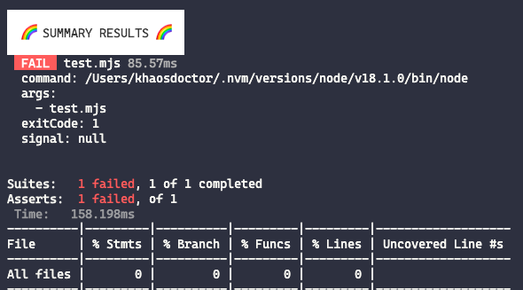
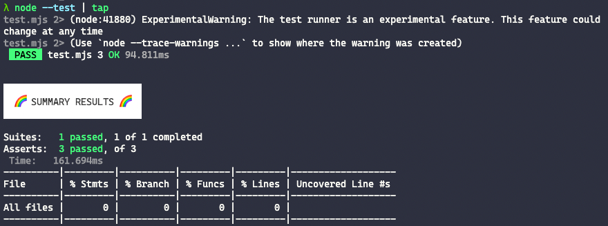

Like I mentioned [in this other article](/node-18/), Node.js 18 came packed with new stuff, among them the global availability of the `fetch` command and the start of adopting the `node:` prefix for importing system modules, which we're going to need to talk about another addition: the system's native **test runner**.

## What's a test runner

Before I start, I want to give a quick introduction to what a test runner is and why it's so necessary in pretty much any development environment.

Any code can be tested automatically, which means writing another chunk of code, ironically one that isn't tested itself, that contains a call to the original function and stores the result of that call to be compared against an expected success or error output, depending on the case being tested.

The libraries for doing the assertion (testing whether a result is what you expect) already ship natively with Node.js's `assert` module, so we could have a file like this:

```js
const add = (a, b) => a + b
export { add }
```

And test that simple function using the `assert` module:

```js
import { add } from './function.mjs'
import assert from 'node:assert'

let result = add(1, 2)
assert.equal(result, 3, 'add(1, 2) should return 3')

result = add(1, '2')
assert.equal(result, 3, 'add(1, "2") should not return 3')
```

Running it is as simple as `node addTest.mjs`. But what would happen if we had hundreds or thousands of tests? Would we keep running the same file? Split it into several? How would we handle growing and automating the test base?

And that's where test runners come in. Their job is to orchestrate test runs so they're as efficient as possible while also being informative, providing data like code coverage and internal errors.

### Why a test runner?

Tools like Mocha, Jest, Jasmine and Ava are already super well known in the market for existing since... well... since forever, so why would Node's test runner make any difference? We already have great tools out there.

The answer is simple: standardization. One of the biggest problems, at least in my opinion, is that all these tools behave differently and have different APIs (otherwise we wouldn't have different tools in the first place), and that keeps shrinking the number of people who run automated tests on their code.

Not writing tests leads to a larger amount of untested systems that are susceptible not only to security failures (in the worst case), but also to critical system failures, and a lot of critical systems don't have tests.

With native ecosystem tools instead of third-party ones, we lower the barrier for devs to start writing tests natively, and we also standardize the API so other tools can be swapped in and out of each other.

## `node:test`

The test module is the solution to the problem I just mentioned. It's been available since Node.js version 18, although you need version 18.1.0 to actually run the tool successfully from the command line (don't ask me why).

Even though it's present in the LTS version, the testing API's status is still described as **experimental**, meaning the API is close to final compatibility with the rest of the system, but it's possible future versions will change things around or even drop some commands, so it's still not advisable for production environments.

### Using `node:test`

Starting with the import, we already see a big difference: we need to import the module with the `node:` prefix. If the `test` module isn't imported with the prefix, Node will try to load a local module called `test`.

> Right now only this module has that requirement, but I believe it's part of a long-term plan to move every native module under the `node:` prefix.

The most common lines will be:

```js
import test from 'node:test'
```

The module exports a function called `test` (which we could very well call whatever we want, the most common being `describe`). The function has the following signature:

```ts
type Options = { 
  concurrency: number, 
  only: boolean, 
  skip: boolean | string, 
  todo: boolean | string 
}

type test = (name: string, options?: Options | Function, fn: Function) => Promise<any>
```

-   `name`: the test's name, this is where you'll describe what the test is testing
-   `options`: an optional options object. If it's not passed, the second argument will be the test function to run
    -   `concurrency`: the number of tests that can run at the same time within this scope. If not specified, subtests will inherit from the closest parent
    -   `only`: if `true`, when the CLI runs in `--only` mode this test will run, otherwise it'll be skipped
    -   `skip`: defaults to `false`. If it's `true` or a string, it skips the test (with the string being the reason)
    -   `todo`: the same as `skip`, but the test is marked as a to-do instead
-   `fn`: the function to run as the test, it's only the third parameter if there's an options object. It can be a sync or async function.

A test can be one of 3 types:

-   **Synchronous**: a sync function that fails the test if it throws

```js
test('sync test passing', (context) => {
  // No exceptions thrown, so the test passes
  assert.strictEqual(1, 1);
});

test('sync test failing', (context) => {
  // Throws an exception and produces a failure
  assert.strictEqual(1, 2);
});
```

-   **Async with [Promises](https://dev.to/_staticvoid/series/1993):** an async function in the shape of a Promise that fails if the promise is [rejected](https://dev.to/_staticvoid/series/1993)

```js
test('async passing', async (context) => {
  // No exceptions, the Promise resolves, success!
  assert.strictEqual(1, 1);
});

test('async failing', async (context) => {
  // Any exception makes the promise reject, so: error
  assert.strictEqual(1, 2);
});

test('failing manually', (context) => {
  return new Promise((resolve, reject) => {
    setImmediate(() => {
      reject(new Error('we can reject the promise directly too'));
    });
  });
});
```

-   **Async with callbacks:** the same as the previous one, but the test function gets a second callback parameter (usually called `done`) which, if called with no parameters, makes the test pass. Otherwise, the first parameter will be the error.

```js
test('callback passing', (context, done) => {
  // Done() is the callback function, no parameters, it passes!
  setImmediate(done);
});

test('callback failing', (context, done) => {
  // Done is invoked with an error parameter
  setImmediate(() => {
    done(new Error('Test error message'));
  });
});
```

To keep things closer to what we already use today, like I mentioned at the start, we can call the `test` function as `describe`:

```js
import describe from 'node:test'

describe('My test here', (context) => {})
```

### Subtests

Just like the most famous testing frameworks, the Node test runner also has the ability to run subtests.

By default the `test` function accepts a second parameter, as you probably noticed in the previous examples, which is a function that takes two parameters, a `context` and, if passed, a `callback` called `done`.

The context object is a class of type `TextContext` and has the following properties:

-   `context.diagnostic(message: string)`: you can use this function to write text output to the TAP protocol, which we'll cover further ahead. Think of it as a debug output. Instead of a `console.log`, you can use `diagnostic` to get that information in the final test report.
-   `context.runOnly(shouldRunOnlyTests: boolean)`: a programmatic way of running the test runner with the `--test-only` flag. If the function's parameter is `true`, this context will only run tests that have the `only` option set. If you run Node with `--test-only`, this function has no effect.
-   `context.skip([message: string])` and `context.todo([message: string])`: the same as passing the `skip` and `todo` parameters to the function
-   `context.test([name][, options][, fn])`: it's recursively the same function, so tests can keep being nested this way

To create a subtest, just call `context.test` inside a higher-level `test`:

```js
test('top level', async (context) => {
  await context.test('subtest 1', (context) => {
    	assert.strictEqual(1,1)
  })
    
  await context.test('subtest 2', (context) => {
    	assert.strictEqual(1,1)
  })
})
```

It's important to note that subtests need to be async, otherwise the functions won't run.

### Skip, only and todo

Tests can receive special flags as parameters. Right now there are 3 flags:

-   `skip` will be skipped if the `skip` option resolves to `true`, meaning a string or any other truthy value. If it's a string, like I mentioned before, the message will show up in the test output at the end:

```js
// Skip with no message
test('skip', { skip: true }, (t) => {
  // Never runs
});

// Skip with a message
test('skip with message', { skip: 'this is skipped' }, (t) => {
  // Never runs
});

test('skip()', (t) => {
  // Always try to return the function call
  return t.skip();
});

test('skip() with message', (t) => {
  // Always try to return the function call
  return t.skip('this is skipped');
});
```

-   `only` is a flag used when the test runner runs with the `--test-only` flag on the command line. When that flag is passed, only tests with the `only` property set to `true` will run. It's a pretty dynamic way to skip or run only specific tests.

```js
// Let's assume we run the node command with the --test-only flag
test('this one will run', { only: true }, async (t) => {
  // All the subtests inside this test will run
  await t.test('will run');

  // We can update the context to stop running
  // in the middle of the function
  t.runOnly(true);
  await t.test('the subtest will be skipped');
  await t.test('this will run', { only: true });

  // Going back to the previous state
  // where we run every test
  t.runOnly(false);
  await t.test('now this one will run too');

  // Explicitly not running any of these
  await t.test('skipped 3', { only: false });
  await t.test('skipped 4', { skip: true });
});

// The `only` option isn't set so the test won't run
test('not executed', () => {
  // Will never run
  throw new Error('fail');
});
```

-   `todo` is simply a message that marks the test as "to do" instead of running or skipping it. It works exactly like the other flags and can also be set in the options object.

## Running from the command line

To run it, we can simply run the `node` command followed by the `--test` flag. If we want to run specific files, we just pass them to the command as the last parameter:

```bash
$ node --test file.js other.cjs other.mjs directory/
```

If we don't pass any parameters, the runner follows these steps to figure out which files are the test files to run:

1.  With no path passed, the cwd, or working directory, will be the current directory, which gets searched recursively for the following:
    1.  The directory is **not** `node_modules` (unless specified)
    2.  If a directory called `test` is found, every file inside it is treated as a test file
    3.  For every other directory, any file with the extension `.js`, `.cjs` or `.mjs` is treated as a test if:
        -   It's called `test` following the `^test$` regex, like `test.js`
        -   It's a file starting with `test-` following the `^test-.+` regex, like `test-example.cjs`
        -   It's a file with `.test`, `-test` or `_test` at the end of its basename (without the extension), following the `.+[\.\-\_]test$` regex, like `example.test.js` or `other.test.mjs`

Each test runs in its own child process using `child_process`. If the process finishes with exit code 0 (no error), it's counted as passing, otherwise it's a failure.

> The most interesting part is that any kind of test that emits TAP output can be run by Node's test runner, even if it doesn't use `node:test` internally.

### Using TAP for a more readable output

The test runner uses a pretty famous protocol called TAP (_Test Anything Protocol_). It's great, but it's extremely ugly and hard to read when you run it from the command line. On top of that, the default output doesn't have some of the analysis you'd want, like code coverage.

For that, there are packages like [node-tap](https://www.npmjs.com/package/tap), which parse that protocol to show a much friendlier output to the user. To use it, just install it locally or globally:

```bash
$ npm i [-g] tap
```

`tap` accepts any input from _stdin_, so we just pipe it in when running the tests with: `node --test | tap`, and then we get a much easier output both for errors:



And for successes:



## Conclusion

Node's test runner is going to be one of the tools that can impact code flows the most across pretty much every application, which means it's possible other packages and other systems will start using these assumptions to define the testing standard across every JavaScript environment.

And remember, the package's documentation [is already up](https://nodejs.org/api/test.html) on Node's site!
