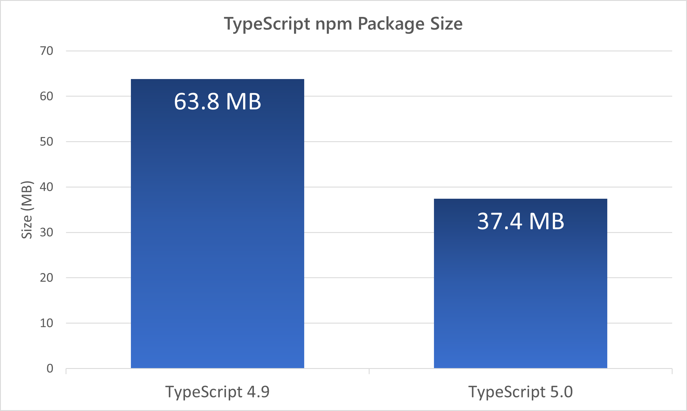
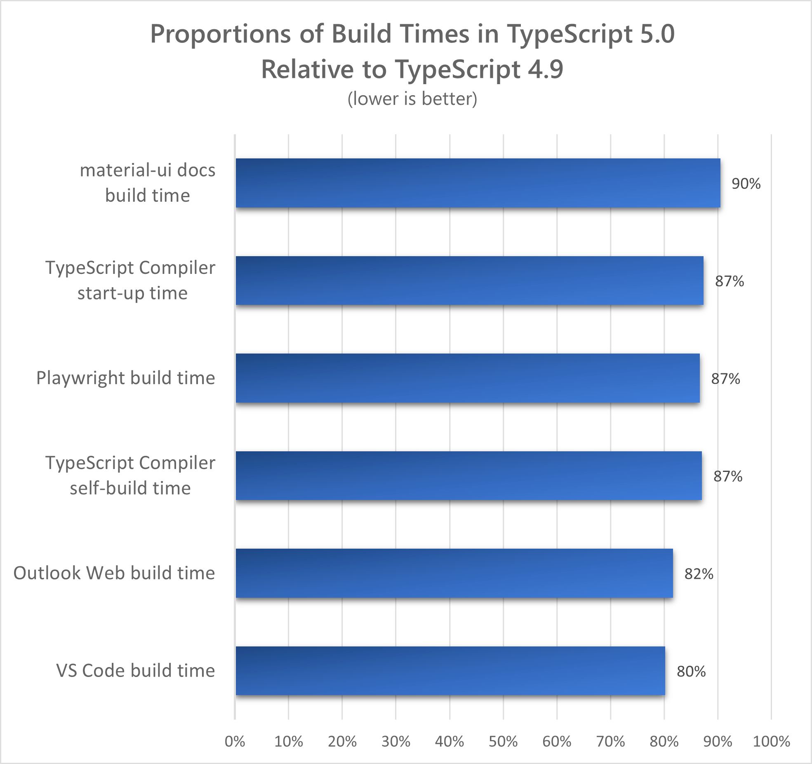

Agora é oficial! No meu [último post](/typescript-5/) sobre esse assunto, eu tratei o lançamento semi-oficial do TS 5.0. A versão beta estava quase pronta mas ainda não estava totalmente 100%, por isso estou cobrindo um novo lançamento aqui com todas as funcionalidades oficiais que foram lançadas na última versão do nosso amigo azul!

A grande maioria das funcionalidades se manteve, então o [post](/typescript-5/) ainda é válido e eu não vou me repetir aqui, mas vou mostrar as principais diferenças desde o RC beta e a release oficial.

## Decorators

A primeira mudança veio nos decorators. Se você se lembra bem, decorators são pequenas funções que podem ser usadas como constructos da linguagem que vão adicionar comportamento a uma função já existente como, por exemplo, adicionar um log de debug:

```ts
class Person {
    name: string;
    constructor(name: string) {
        this.name = name;
    }

    @loggedMethod
    greet() {
        console.log(`Hello, my name is ${this.name}.`);
    }
}

const p = new Person("Ron");
p.greet();

// Output:
//
//   LOG: Entering method.
//   Hello, my name is Ron.
//   LOG: Exiting method.
```

Decorators tem uma sintaxe própria (com o `@`), mas são funções simples, o decorator que estamos chamando nessa função tem a seguinte implementação:

```ts
function loggedMethod(originalMethod: any, context: ClassMethodDecoratorContext) {
    const methodName = String(context.name);

    function replacementMethod(this: any, ...args: any[]) {
        console.log(`LOG: Entering method '${methodName}'.`)
        const result = originalMethod.call(this, ...args);
        console.log(`LOG: Exiting method '${methodName}'.`)
        return result;
    }

    return replacementMethod;
}
```

Basicamente é uma função que retorna uma função. A diferença entre o RC e a versão final é que decorators agora podem ser usados antes de declarações como `export` e `export default`, antes você só poderia usar um decorator em uma declaração direta e, só então, exportar a função.

## Module Resolution = Bundler

Uma outra mudança que foi introduzida no TypeScript 5.0 na verdade é uma adição a uma modificação criada no 4.7. Nessa versão, a chave `module` recebeu duas novas opções, `node16` e `nodenext` que modelavam precisamente a forma como o Node.js tratava os [ESModules](/os-ecmascript-modules-estao-aqui/). No entanto, o Node tem várias restrições que não existem em outras ferramentas, a principal delas sendo que os arquivos importados precisam ter a extensão explicitamente descrita:

```ts
import * as utils from './utils.mjs'
```

Isso não era verdade para a maioria dos bundlers ou outros toolings que tem uma resolução mais relaxada e mais parecida com o que o `node` já oferecia, mas o outro problema é que a implementação estava antiga. Por isso uma nova opção de `moduleResolution` foi incluída, a `bundler`.

Para essa modificação, a diferença entre o RC e a versão final é que o tipo `bundler` agora só poderá ser usado se a flag `module` for `esnext`. Isso foi feito, segundo o time, para garantir que todos os `import`s não sejam transformados em require antes de o bundler resolver as dependências.

## Mudanças no compilador

Enquanto tivemos várias modificações legais nessa versão, o compilador foi o que mais teve ganhos! Todo o compilador foi movido para módulos, como [o time descreveu aqui](https://devblogs.microsoft.com/typescript/typescripts-migration-to-modules/) e isso acarretou algumas coisas:

-   O TS só roda em versões do Node superiores à 12, porque é a primeira que suporta ESM
-   O tamanho do pacote foi reduzido em 46%
-   O tempo de build dos projetos aumentou de 10% a 25%.

Essas otimizações ficam ainda mais evidentes quando lemos [estes gráficos](https://devblogs.microsoft.com/typescript/announcing-typescript-5-0/#speed-memory-and-package-size-optimizations) mostrando que o pacote saiu de 64mb para 37mb:



Além disso, a migração para módulos transformou o TS em um foguete, tendo o aumento de performance não só na execução mas também na instalação, como mostra o benchmark em relação a versão anterior:



## Conclusão

Todas as demais modificações continuaram iguais, então eu fortemente recomendo que você leia o artigo original sobre as mudanças que vieram no RC, porque elas são muito úteis e podem te ajudar a ter mais ferramental para criar suas aplicações.

[Novidades do TypeScript 5.0 Beta](/typescript-5/)

Esse foi um artigo curto, mas que vale a pena ser destacado, principalmente pelos ganhos de performance e modificações notáveis no coração do TypeScript.
