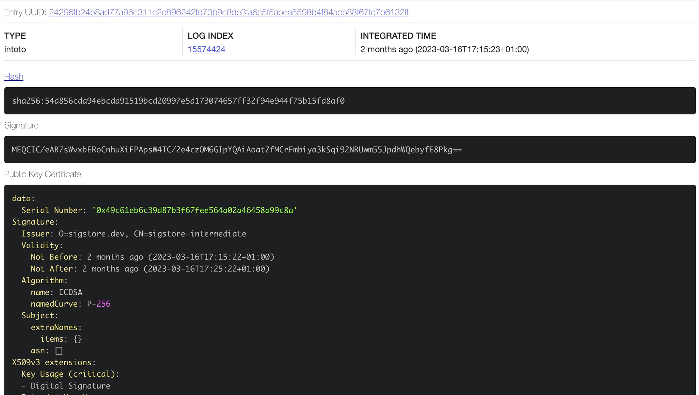
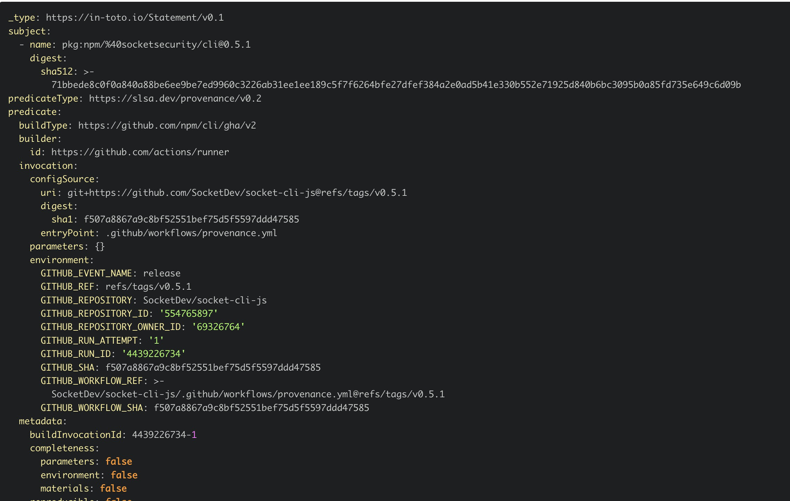

Quando estamos falando de desenvolvimento web, um dos maiores problemas que enfrentamos é a segurança. Ainda mais quando estamos falando de desenvolvimento Node.js com pacotes distribuídos através do NPM.

Uma das maiores fontes de ataques à sistemas empresariais vem através de pacotes externos que são instalados sem o devido cuidado. Isso já foi [testado algumas vezes](https://medium.com/@alex.birsan/dependency-confusion-4a5d60fec610) e ainda continua sendo um problema.

O problema não é nem baixar o pacote, mas sim não ter como ter certeza de que aquele pacote veio do lugar que você espera ou que ele foi publicado por quem você espera. Mas isso está prestes a mudar.

## NPM Package Provenance

[Recentemente](https://github.blog/2023-04-19-introducing-npm-package-provenance/) a NPM anunciou uma novidade, o package provenance. Que vai ser a forma que você pode identificar que um pacote foi feito por quem diz que o criou, e também foi publicado de uma fonte confiável.

O objetivo do provenance não é só assinar o código, mas sim criar um link do pacote com o local de onde ele veio e qual foi o artefato original que gerou aquele pacote. Uma das formas seria ancorar o pacote a quem o criou através de uma chave privada, dessa forma quem quer que tenha feito o pacote pode assinar esse pacote com a chave privada e distribuir uma chave pública para verificação.

No entanto, essa abordagem é um problema, porque o ponto de falha é justamente a chave. Se ela vazar, então toda a segurança vai por água abaixo. Por isso eles pensaram em uma forma bastante inteligente de validar a propriedade do pacote: ancorar a identidade ao servidor de onde ele saiu.

Isso cria um ponto de segurança muito mais forte, já que você precisa replicar uma estrutura inteira para poder replicar a assinatura do pacote, o que não é tão trivial quanto roubar uma chave.

### Qual é o segredo?

Para isso, eles estão usando algumas soluções da [Sigstore](https://www.sigstore.dev/), especialmente uma que aceita tokens no formato OpenID Connect para criar certificados que tem uma vida bastante curta e são usados somente para assinar as requisições da provenance.

E essa é a grande sacada, porque para cada publicação do pacote, é gerado um par de chaves que é usado para assinar o certificado, essas chaves são jogadas fora e substituídas por um certificado de validade. Ninguém mais pode assinar o código, mas todo mundo que tiver o certificado público pode validar que ela foi gerada por uma fonte confiável, ou seja, ninguém tem uma chave.

")

A segunda parte desse processo é a verificação, que é feita em um serviço chamado Rekor, que é um log de transações públicas, basicamente todos os provenances vão parar lá e são totalmente públicos para todos verem. Então você pode baixar o log que contém todo o ambiente do CI/CD assinado e verificar se é verdadeiro com o comando:

```
npm audit signatures
```

## A importancia do CI/CD

Para que tudo isso funcione, é preciso que os metadados do CI/CD sejam confiáveis, até porque a informação que estamos tentando assinar é justamente o local de onde o pacote foi construído.

Essas informações que eu estou falando são, por exemplo, dados únicos do container que o processo de CI foi iniciado, como hostnames, variáveis de ambiente e etc. No caso do Github Actions, esse é o documento de provenance que é assinado:

```yaml
_type: https://in-toto.io/Statement/v0.1
subject:
- name: pkg:npm/sigstore@1.2.0
  digest:
    sha512: 16bf7e5b59e40522190a425047b8c39ffcc8d145cdb15a69fbb9834240a764e2311bda7ac8d5c1c7dc67b47b1f532607139e570e4915577fab61bae4cc079eb0
predicateType: https://slsa.dev/provenance/v0.2
predicate:
  buildType: https://github.com/npm/cli/gha/v2
  builder:
    id: https://github.com/actions/runner
  invocation:
    configSource:
      uri: git+https://github.com/sigstore/sigstore-js@refs/heads/main
      digest:
        sha1: 5b8c0801d1f5d105351a403f58c38269de93f680
      entryPoint: ".github/workflows/release.yml"
    environment:
      GITHUB_EVENT_NAME: push
      GITHUB_REF: refs/heads/main
      GITHUB_REPOSITORY: sigstore/sigstore-js
      GITHUB_REPOSITORY_ID: '495574555'
      GITHUB_REPOSITORY_OWNER_ID: '71096353'
      GITHUB_RUN_ATTEMPT: '1'
      GITHUB_RUN_ID: '4503589496'
      GITHUB_SHA: 5b8c0801d1f5d105351a403f58c38269de93f680
      GITHUB_WORKFLOW_REF: sigstore/sigstore-js/.github/workflows/release.yml@refs/heads/main
      GITHUB_WORKFLOW_SHA: 5b8c0801d1f5d105351a403f58c38269de93f680
  materials:
  - uri: git+https://github.com/sigstore/sigstore-js@refs/heads/main
    digest:
      sha1: 5b8c0801d1f5d105351a403f58c38269de93f680
```

Para gerar o seu próprio arquivo de provenance, o NPM criou uma flag chamada `--provenance`, então basta rodar `npm publish --provenance` que o seu pacote vai ser assinado.<Sidenote>Dá uma olhada [na documentação](https://docs.npmjs.com/generating-provenance-statements) também que existe bastante coisa interessante lá</Sidenote>

Mas aí temos o questionamento: Por que obter dados do CI? Simplesmente porque não é simples alterar esses dados. Principalmente porque, mesmo se você tentar modificar o processo da máquina com um `child_process` sendo injetado, ainda sim, servidores conhecidos como os do GitHub vão ter informações que você não pode tirar, como os endereços de IP, por exemplo, dessa forma o NPM pode fazer um cross-check dos dados no provenance enviado, versus os dados que o próprio GitHub devolve.

> Por causa disso que não podemos gerar provenances localmente, ou seja, você não vai conseguir usar o `npm publish --provenance` na sua máquina local porque, diferente do GitHub, a sua máquina não é uma fonte confiável de dados.

### O que acontece localmente?

A Socket publicou um [artigo bastante interessante](https://socket.dev/blog/npm-provenance#) sobre como o processo de instalação ou publicação de um pacote funciona. Vou tentar resumir ele aqui.

**Quando você publica um pacote com provenance:**

1.  O pacote é compactado em um `.tar`
2.  O NPM verifica suas credenciais e o token de acesso
3.  O pacote é enviado para seu registro normalmente
4.  O registro vai buscar os metadados a partir da conexão (não do pacote)
5.  O NPM obtém um certificado para assinar seu pacote que é populado com as informações que o GitHub vai providenciar direto da infraestrutura deles
6.  O NPM usa esse certificado para criar uma assinatura única do tarball
7.  Essa assinatura é registrada no Rekor
8.  O tarball é salvo no registro
9.  O NPM inclui todos os metadados e a localização no Rekor dentro do pacote em `https://registry.npmjs.org/$PACKAGE/$VERSION#dist`

**Quando você instala um pacote que tem um provenance**

1.  O NPM obtém os metadados do pacote
2.  Baixa a assinatura do pacote (o checksum)
3.  Baixa as informações de registro do provenance do Rekor
4.  Baixa o pacote
5.  Tenta bater o checksum com o checksum baixado
6.  Tenta bater os metadados do rekor com os dados previamente baixados

Um dos pacotes que você pode verificar isso é justamente o da própria [Socket](https://registry.npmjs.org/-/npm/v1/attestations/@socketsecurity%2fcli@0.5.1), bastando acessar o link [https://registry.npmjs.org/-/npm/v1/attestations/@socketsecurity%2Fcli@0.5.1](https://registry.npmjs.org/-/npm/v1/attestations/@socketsecurity%2fcli@0.5.1)

Lá, você consegue entrar no documento até encontrar `attestations[predicateType ===` [`https://slsa.dev/provenance/v0.2`](https://slsa.dev/provenance/v0.2)`].bundle.verificationMaterial.tlogEntries[0].logIndex`, que é um número de log que você pode verificar no [Rekor](https://search.sigstore.dev/?logIndex=15574424).



Lá você pode descer até a seção **Data** e ver que todos os metadados relacionados ao CI estão ali:



## Conclusão

O processo de provenance é bastante interessante por si só, e é uma excelente forma de proteger a cadeia de pacotes que é essencial para o desenvolvimento moderno, mas também é uma das forma mais fáceis de alguém ser hackeado.

Atualmente, só o GitHub Actions possui a verificação para ter um provenance, mas, segundo o NPM, outros CIs estão sendo adicionados.
