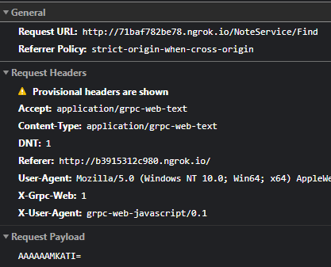
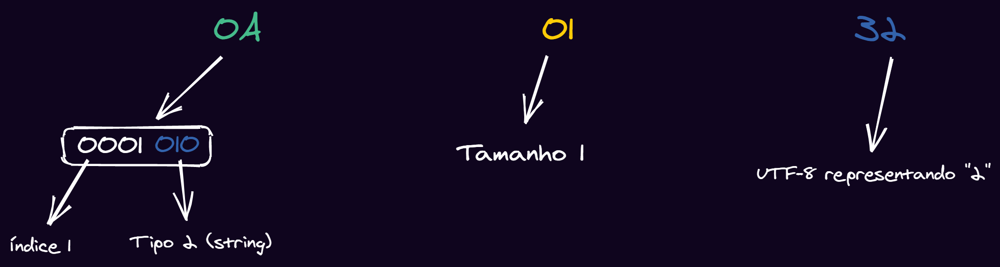

---

Chegamos à **segunda parte da nossa série** sobre o que é o gRPC e como podemos utilizá-lo de forma eficiente para substituir o que utilizamos hoje com o ReST. Na [primeira parte desta série](/guia-grpc-1/) dei toda a explicação de como funciona o gRPC por dentro e como ele é montado em uma requisição HTTP/2 padrão com um payload binário usando o **protobuf** como camada de encoding.

Nesta parte da série, vamos mergulhar nas implementações de como o gRPC funciona para **JavaScript**. Vamos então dar uma passada rápida pela nossa agenda de hoje.

## Agenda

-   Quais são as ferramentas existentes para gRPC no JavaScript hoje em dia
-   Como funciona o modelo cliente/servidor e os modelos disponíveis que podemos usar
-   Criando seu primeiro arquivo `.proto`
-   Vantagens e desvantagens dos modelos estáticos e dinâmicos
-   Hora do código!

## As ferramentas que trabalhamos

Como dito por Russel Brown em sua [incrível série "The Weird World of gRPC Tooling for Node.js"](https://medium.com/expedia-group-tech/the-weird-world-of-grpc-tooling-for-node-js-part-1-40a442966876), a documentação do protobuf **especialmente para JavaScript** ainda não é totalmente bem documentada, e isso é um tema recorrente. Todo o protobuf foi feito com foco em trabalhar com várias linguagens de mais baixo nível como Go e C++. Para estas linguagens, a documentação é muito boa, porém quando chegamos no JavaScript e TypeScript, começamos a ver um problema de documentação onde ela ou não está totalmente completa ou então não existe de forma nenhuma.

Felizmente este cenário está mudando muito, grande parte graças a Uber, que está trabalhando em ferramentas incríveis como o [Buf](https://github.com/bufbuild/buf) e também uma série de boas práticas criadas em outra incrível ferramenta chamada [Prototool](https://github.com/uber/prototool).

Para este artigo vamos nos manter nas ferramentas tradicionais criadas pela própria equipe do gRPC e, em um futuro artigo, vamos explorar ainda mais este mundo com outras ferramentas de suporte.

## Proto Compiler, ou, `protoc`

A nossa principal ferramenta de manipulação de protofiles, chamada [protoc](https://github.com/protocolbuffers/protobuf) faz parte do mesmo pacote dos protocolbuffers, podemos pensar nela como sendo o CLI do protobuf.

Esta é a implementação principal do gerador de códigos e parser do protobuf em diversas linguagens, que estão descritas no README do repositório. Existe uma [página com os principais tutoriais](https://developers.google.com/protocol-buffers/docs/tutorials), mas, como esperado para nós, ela não cobre JavaScript...

Podemos utilizar o `protoc` como uma linha de comando para poder converter os nossos arquivos `.proto` de definição de contratos em um arquivo `.pb.js` que contém o código necessário para podermos serializar e desserializar nossos dados no formato binário usado pelo protobuf e enviar pelo protocolo de transporte HTTP/2.

Em teoria, podemos criar uma request manual para um serviço gRPC utilizando somente um client HTTP/2, sabendo a rota que queremos mandar o nosso dado e os headers necessários. Todo o resto do payload pode ser identificado como a representação binária do que o protobuf produz no final da compilação. Vamos ver sobre isto mais futuramente.

## `protobufjs`

É a [implementação alternativa](https://github.com/protobufjs/protobuf.js) do `protoc` feita inteiramente em JavaScript, é ótima para lidar com os arquivos protobuf como **mensagens**, ou seja, se você está utilizando o protobuf como sistema de envio de mensagens entre filas, por exemplo, como já demonstramos no artigo anterior, ele é excelente para poder gerar uma implementação mais amigável para ser utilizada em JavaScript.

O problema é que ele não tem suporte ao gRPC, ou seja, não podemos definir serviços e nem RPCs em cima de arquivos protobuf, o que faz deste pacote, essencialmente, o decoder de mensagens.

## `@grpc/proto-loader`

É a peça que faltava para o `protobufjs` conseguir gerar as definições de stub e skeletons de forma dinâmica a partir de arquivos `.proto`. Hoje é a implementação recomendada para o que vamos fazer no resto do artigo, que é a implementação de forma dinâmica dos arquivos de contrato, sem que precisemos pré-compilar todos os protofiles antes.

## `grpc` e `grpc-js`

O core que faz o gRPC funcionar dentro de linguagens dinâmicas como o JS e o TS. O pacote original `grpc` possui duas versões, uma [versão implementada como uma lib em C](https://github.com/grpc/grpc) que é mais utilizada para quando estamos escrevendo ou o client ou o server em C ou C++.

> **Nota importante**: Desde que este artigo foi publicado, a biblioteca `grpc` foi marcada para depreciação, então a partir de agora, use **sempre** a versão mantida e mais nova que é a `@grpc/grpc-js`.

Para o nosso caso, o ideal é utilizarmos a [implementação como um pacote do NPM](https://github.com/grpc/grpc-node/tree/master/packages/grpc-native-core) que, essencialmente, pega a implementação em C que falamos anteriormente, utiliza o `node-gyp` para compilar esta extensão como um [native module](https://medium.com/the-node-js-collection/native-extensions-for-node-js-767e221b3d26) do Node.js, de forma que todos os bindings entre o C e o Node são feitos utilizando a [N-API](https://nodejs.org/api/n-api.html) que faz o intermédio entre os código C++ e os códigos JavaScript, permitindo que possamos integrar código JavaScript com código C++ em runtime.[^n1]

Atualmente, o pacote do NPM para o gRPC é o mais utilizado para criar clientes gRPC, embora, atualmente, muitas pessoas estejam migrando para o [`grpc-js`](https://github.com/grpc/grpc-node/tree/master/packages/grpc-js), uma implementação feita completamente em JS do client do gRPC.

## O modelo cliente servidor no gRPC

O modelo cliente e servidor que temos no gRPC não é nada mais do que uma comunicação HTTP/2 padrão, a diferença são os headers que estamos enviando. Como expliquei na primeira parte da série, toda a comunicação via gRPC é, na verdade, uma chamada HTTP/2 com um payload binário encodado em base64.

Para ilustrar essa comunicação, junto com o [código que vamos fazer por aqui](https://github.com/khaosdoctor/grpc-guide-part2-javascript-sample), coloquei um pequeno exemplo de uma chamada gRPC utilizando uma ferramenta chamada `grpc-web` que permite a conexão do browser diretamente com um client gRPC, pois o browser, apesar de suportar HTTP/2, não expõe essa configuração para que os clients das aplicações possam fazer requests usando o protocolo.[^n2]

O problema é que, devido às regras de CORS mais restritas e a falta de um servidor que me permita alterar estas opções, a chamada foi bloqueada de retornar, porém para o que quero mostrar por aqui (que é apenas a request) vai servir.



Veja que nossa URL de requisição é `/{serviço}/{metodo}`, isso é válido para qualquer coisa que tenhamos que executar, inclusive, se tivermos serviços com namespaces como, por exemplo, `com.lsantos.notes.v1` nossa URL se comportará de forma diferente, sendo uma expressão do nosso serviço completo, por exemplo `http://host:porta/com.lsantos.notes.v1.NoteService/Find`.

Neste serviço vamos criar um sistema de notas que possui apenas dois métodos, o `List` e `Find`. O método `List` não recebe nenhum parâmetro, já o `Find` recebe um parâmetro `id` que estamos enviando no payload como podemos ver na imagem. Veja que ele está encodado como base64 com o valor `AAAAAAMKATI=`.

Dentro do repositório do código, temos um arquivo [`request.bin`](https://github.com/khaosdoctor/grpc-guide-part2-javascript-sample/blob/main/web/request.bin), que é o resultado de um `echo "AAAAAAMKATI=" | base64 -d > request.bin`. Se abrirmos este arquivo com algum Hex Editor (como o que mostramos no primeiro artigo da série, no VSCode), vamos ver os seguintes bytes: `00 00 00 00 03 0A 01 32`. Removemos todos os `00` e também o `03` já que ele é apenas um marcador do encoding para o `grpc-web`. No final vamos ter `0A 01 32` e podemos passar pelo mesmo modelo de análise que fizemos antes no outro artigo da série:



Podemos ver que estamos mandando uma string com o valor "2" como payload, que é o primeiro índice.

## Proto files

Vamos colocar a mão na massa e desenvolver o nosso primeiro arquivo `.proto` que vai descrever como toda a nossa API vai funcionar.

Primeiramente, vamos criar um novo projeto em uma pasta com o `npm init -y`, você pode chamá-lo como quiser. Em seguida vamos instalar as dependências que vamos precisar com `npm i -D google-protobuf protobufjs`.

Agora vamos criar uma pasta `proto` e dentro dela um arquivo chamado `notes.proto`. Este vai ser o arquivo que vai descrever a nossa API e todo o nosso serviço. Sempre vamos começar utilizando uma notação de sintaxe:

```protobuf
// notes.proto
syntax = "proto3";
```

Existem duas versões de sintaxe do protobuf, você pode ver mais sobre estas versões [neste artigo](https://ywjheart.wordpress.com/2018/08/17/proto2-vs-proto3/). Para nós, as partes mais importantes é que, agora, todos os campos do protobuf se tornam opcionais, não temos mais a notação `required` que existia na versão 2 da sintaxe, e também não temos mais os valores padrões para propriedades (que, essencialmente, as torna opcionais).

Agora, vamos começar com a organização do arquivo, eu geralmente organizo um arquivo protobuf seguindo a ideia de `Serviço -> Entidades -> Requests -> Responses`. De acordo com as boas práticas da Uber, também é interessante utilizarmos um marcador de namespace como `com.seuusername.notes.v1` caso precisemos manter mais de uma versão ao mesmo tempo, porém, para facilitar o desenvolvimento aqui, vamos utilizar a forma mais simples sem nenhum namespace.

> O protobuf também permite importação de pacotes de outros namespaces e reutilização de definições entre diferentes arquivos.

Vamos definir primeiramente o nosso serviço, ou RPC, que é a especificação de todos os métodos que nossa API vai aceitar:

```protobuf
// notes.proto
syntax = "proto3";

service NoteService {
  rpc List (Void) returns (NoteListResponse);
  rpc Find (NoteFindRequest) returns (NoteFindResponse);
}
```

Alguns detalhes são importantes quando estamos falando de `services`:

-   Cada `rpc` é uma rota e, essencialmente, uma ação que pode ser feita na API.
-   Cada RPC só pode receber **um** parâmetro de entrada e **um** de saída.
-   O tipo `Void` que definimos, pode ser substituido pelo tipo [`google.protobuf.Empty`](https://developers.google.com/protocol-buffers/docs/reference/csharp/class/google/protobuf/well-known-types/empty), que é um chamado `Well-Known` type, porém ele exige que a biblioteca com estes tipos esteja instalada em sua máquina.
-   Uma outra boa prática da Uber é colocar `Request` e `Response` nos seus parâmetros, essencialmente criando um wrapper deles em volta de um objeto maior.

Vamos então definir as entidades que queremos, primeiro vamos definir o tipo `Void`, que é nada mais do que um objeto vazio:

```protobuf
// notes.proto
syntax = "proto3";

service NoteService {
  rpc List (Void) returns (NoteListResponse);
  rpc Find (NoteFindRequest) returns (NoteFindResponse);
}

// Entidades
message Void {}
```

Cada tipo de objeto é definido com a keyword `message`, pense em cada `message` como sendo um objeto JSON. Nossa aplicação é uma lista de notas, então vamos definir a entidade de notas:

```protobuf
// notes.proto
syntax = "proto3";

service NoteService {
  rpc List (Void) returns (NoteListResponse);
  rpc Find (NoteFindRequest) returns (NoteFindResponse);
}

// Entidades
message Void {}

message Note {
  int32 id = 1;
  string title = 2;
  string description = 3;
}
```

Aqui estamos definindo todos os nossos tipos para a nossa entidade principal, a própria nota. Temos [diversos tipos escalares](https://developers.google.com/protocol-buffers/docs/proto3#scalar) no protobuf, assim como [enumeradores](https://developers.google.com/protocol-buffers/docs/proto3#enum) e outros tipos bem definidos na documentação da linguagem.

Perceba também que definimos a mensagem e seus campos no modelo `tipo nome = indice;`. Temos **obrigatoriamente** que passar os indices para a mensagem, caso contrário o protobuf não saberá decodificar o binário.

> Note que mudamos um pouco a definição do nosso tipo para não receber mais uma string e sim um inteiro, diferente do que fizemos no grpc-web anteriormente. Você consegue descobrir qual é o binário gerado?

Agora vamos especificar os tipos `Request` e `Response` que criamos na nossa definição de serviço no início do arquivo. Primeiro vamos começar com os mais simples, a request para o método `Find` leva somente um ID, então vamos especificar o `NoteFindRequest`:

```protobuf
// notes.proto
syntax = "proto3";

service NoteService {
  rpc List (Void) returns (NoteListResponse);
  rpc Find (NoteFindRequest) returns (NoteFindResponse);
}

// Entidades
message Void {}

message Note {
  int32 id = 1;
  string title = 2;
  string description = 3;
}

// Requests
message NoteFindRequest {
  int32 id = 1;
}
```

Partimos para a resposta deste mesmo método, que deve devolver uma nota caso ela for encontrada. Para isto vamos criar a `NoteFindResponse` e entender porque é uma boa prática este modelo.

```protobuf
// notes.proto
syntax = "proto3";

service NoteService {
  rpc List (Void) returns (NoteListResponse);
  rpc Find (NoteFindRequest) returns (NoteFindResponse);
}

// Entidades
message Void {}

message Note {
  int32 id = 1;
  string title = 2;
  string description = 3;
}

// Requests
message NoteFindRequest {
  int32 id = 1;
}

// Responses
message NoteFindResponse {
  Note note = 1;
}
```

Por que estamos criando uma response ao invés de utilizar diretamente o tipo `Note` como resposta? Poderíamos alterar o nosso serviço para receber o `Note` como resposta:

```protobuf
service NoteService {
  rpc List (Void) returns (NoteListResponse);
  rpc Find (NoteFindRequest) returns (Note);
}
```

O problema é que se fizermos assim, teremos mais problemas para buscar estes detalhes diretamente do cliente, como uma boa prática é sempre interessante envolvermos a resposta de algum tipo composto (como o `Note`) em um índice de mesmo nome, essencialmente nosso retorno passa de:

```json
{
  "id": 1,
  "title": "titulo",
  "description": "descrição"
}
```

Para:

```json
{
  "note": {
    "id": 1,
    "title": "titulo",
    "description": "descrição"
  }
}
```

É muito mais semântico, não acha?

Para finalizar, vamos criar a resposta do nosso serviço de listagem:

```protobuf
// notes.proto
syntax = "proto3";

service NoteService {
  rpc List (Void) returns (NoteListResponse);
  rpc Find (NoteFindRequest) returns (NoteFindResponse);
}

// Entidades
message Void {}

message Note {
  int32 id = 1;
  string title = 2;
  string description = 3;
}

// Requests
message NoteFindRequest {
  int32 id = 1;
}

// Responses
message NoteFindResponse {
  Note note = 1;
}

message NoteListResponse {
  repeated Note notes = 1;
}
```

Aqui temos uma keyword nova, a `repeated`, ela identifica um array do tipo subsequente, neste caso um array de `Note`.

Este será o nosso arquivo de definição de contrato. Pense que podemos também usar ele para, se tivéssemos um serviço de fila, por exemplo, codificar uma Nota exatamente como é utilizada em outros sistemas de forma binária, e enviarmos pela rede sem ter medo de que o outro lado não entenda o que estamos enviando. Ou seja, podemos padronizar todas as entradas e saídas de todas as APIs de um grande sistema somente com arquivos declarativos.

## Estático ou dinâmico

O gRPC sempre terá duas formas de ser compilado, a primeira forma é o modelo estático de compilação.

Neste modelo, executamos o `protoc` para poder compilar os arquivos em arquivos `.js` que contém as definições de tipo e de encoding das nossas mensagens. A vantagem deste modelo é que podemos utilizar os tipos como uma lib ao invés de ler eles diretamente, porém eles são muito mais complexos de se trabalhar do que se simplesmente tentarmos gerar dinamicamente o conteúdo dos pacotes.[^n3]

Não vou me estender no modelo de geração estática neste artigo, mas novamente o Russel Brown tem [um artigo excelente sobre a criação de serviços estáticos usando gRPC](https://medium.com/expedia-group-tech/the-weird-world-of-grpc-tooling-for-node-js-part-2-daafed94cc32).

O que vamos fazer é a **geração dinâmica**, neste modelo não temos que, manualmente, encodar e decodar _todas_ as mensagens. O modelo dinâmico também suporta melhor pacotes importados. Porém, como tudo tem um lado ruim, o contra de se usar a geração dinâmica é que vamos **sempre** precisar ter as fontes originais, ou seja, temos que importar e baixar os arquivos `.proto` juntamente com os arquivos do nosso projeto. Isso pode ser um problema em alguns casos:

-   Quando temos diversos sistemas interconectados, temos que ter um repositório central onde vamos buscar todos os protofiles.
-   Sempre que atualizarmos um arquivo `.proto` vamos ter que identificar esta mudança e atualizar todos os serviços correspondentes.

Os problemas são facilmente resolvidos com um sistema de gerenciamento de pacotes como o NPM, porém mais simples. Além disso, ou próprio Buf, que citamos anteriormente, já está trabalhando para trazer esta funcionalidade ao protobuf.

## Servidor

Para começarmos a criar o servidor, vamos instalar os pacotes necessários do gRPC, começando pelo próprio `grpc` e o `proto-loader` com o comando `npm i grpc @grpc/proto-loader`.

Crie uma pasta `src` e um arquivo `server.js`. Vamos começar importando os pacotes e carregando a definição do protobuf dentro do servidor gRPC:

```javascript
//server.js
const grpc = require('grpc')
const protoLoader = require('@grpc/proto-loader')
const path = require('path')

const protoObject = protoLoader.loadSync(path.resolve(__dirname, '../proto/notes.proto'))
const NotesDefinition = grpc.loadPackageDefinition(protoObject)
```

O que estamos fazendo aqui é essencialmente a ideia do que comentamos sobre geração dinâmica. O arquivo `proto` será carregado na memória e parseado em tempo de execução, e não pré-compilado. Primeiramente o `protoLoader` carrega um objeto a partir de um arquivo `.proto`, pense nele como uma representação intermediária entre o serviço real e o que você pode manipular com o JavaScript.

Depois passamos esta interpretação para o `grpc`, essencialmente gerando uma definição válida que podemos utilizar para criar um serviço e, consequentemente, uma API. Tudo o que vier daqui para frente agora é a implementação específica da nossa regra de negócio. Vamos começar criando o nosso "banco de dados".

Como queremos algo simples, vamos criar apenas um objeto e um array de notas que serão manipuladas pelas nossas funções:

```javascript
const grpc = require('grpc')
const protoLoader = require('@grpc/proto-loader')
const path = require('path')

const protoObject = protoLoader.loadSync(path.resolve(__dirname, '../proto/notes.proto'))
const NotesDefinition = grpc.loadPackageDefinition(protoObject)

const notes = [
  { id: 1, title: 'Note 1', description: 'Content 1' },
  { id: 2, title: 'Note 2', description: 'Content 2' }
]
```

Vamos agora criar e iniciar nosso servidor adicionando o serviço que acabamos de ler do arquivo `.proto`:

```javascript
//server.js
const grpc = require('grpc')
const protoLoader = require('@grpc/proto-loader')
const path = require('path')

const protoObject = protoLoader.loadSync(path.resolve(__dirname, '../proto/notes.proto'))
const NotesDefinition = grpc.loadPackageDefinition(protoObject)

const notes = [
  { id: 1, title: 'Note 1', description: 'Content 1' },
  { id: 2, title: 'Note 2', description: 'Content 2' }
]

const server = new grpc.Server()
server.addService(NotesDefinition.NoteService.service, { List, Find })

server.bind('0.0.0.0:50051', grpc.ServerCredentials.createInsecure())
server.start()
console.log('Listening')
```

Veja que estamos adicionando a `NotesDefinition.NoteService.service`, que é uma classe que contém o nosso servidor HTTP que irá responder pelas requisições enviadas, depois disso estamos mandando um objeto `{List, Find}`, estas são as implementações dos nossos dois métodos que ainda temos que fazer.

Além disso, estamos ouvindo na porta 50051, esta porta pode ser qualquer uma que você possuir livre no seu computador até 65535. Embora, é uma boa prática escolher as portas acima de 50000 para deixarmos uma boa diferença das portas comuns como `8080`, `443`, `9090`, `3000` e etc.

Por fim, estamos utilizando o `createInsecure` porque, por padrão, o HTTP/2 exige um certificado digital para ser iniciado, então estamos somente passando uma certificação vazia para não termos que criar um localmente. Se você for colocar este serviço em produção, você deve utilizar um novo certificado digital para as comunicações.

## Implementação

Para podermos ter o nosso servidor executando, precisamos implementar cada um dos RPCs que definimos nele. Neste caso criamos um RPC `List` e outro `Find`. A implementação deles é simplesmente uma função que leva um erro e um callback como assinatura. Porém, elas precisam **ter o mesmo nome dos RPCs** obrigatoriamente.

Vamos aprender com o exemplo mais simples, a implementação do método `List`. O que ele faz é sempre devolver a lista total de notas.

```javascript
function List (_, callback) {
  return callback(null, { notes })
}
```

Veja que também temos que seguir o mesmo modelo de resposta, se dizemos no nosso protofile que estamos esperando que o retorno seja uma lista de `Note` dentro de um índice chamado `notes`, temos que devolver um objeto `{ notes }`.

O `callback` é uma função que vamos chamar no modelo `callback (err, response)`, ou seja, se tivermos erros, vamos mandá-los no primeiro parâmetro e a resposta como nula e vice-versa.

Para fazermos o método `Find` temos que tratar alguns erros e realizar um find dentro do nosso array. O método é bastante simples, porém ele leva um parâmetro `id`, para buscar este parâmetro vamos utilizar o primeiro parâmetro da função - que ignoramos no `List` com o `_` - para pegar um objeto `request`, dentro do qual haverá o nosso parâmetro `id` enviado:

```javascript
function Find ({ request: { id } }, callback) {
  const note = notes.find((note) => note.id === id)
  if (!note) return callback(new Error('Not found'), null)
  return callback(null, { note })
}
```

É importante dizer que, se tivermos um erro dentro do gRPC e não o retornamos como o primeiro parâmetro (se simplesmente dermos um `return` ou um `throw`) isso fará com que nosso client não receba as informações corretas, por isso que devemos criar uma estrutura de erro e retorná-la no callback.

Da mesma forma, quando chamamos a função `callback` no final da execução, estamos passando o erro como nulo, o que indica que tudo correu bem, e também estamos mandando um objeto `{ note }`, conforme nossa `NoteFindResponse` especificou.

O arquivo completo do servidor fica assim:

```javascript
//server.js
const grpc = require('grpc')
const protoLoader = require('@grpc/proto-loader')
const path = require('path')

const protoObject = protoLoader.loadSync(path.resolve(__dirname, '../proto/notes.proto'))
const NotesDefinition = grpc.loadPackageDefinition(protoObject)

const notes = [
  { id: 1, title: 'Note 1', description: 'Content 1' },
  { id: 2, title: 'Note 2', description: 'Content 2' }
]

function List (_, callback) {
  return callback(null, { notes })
}

function Find ({ request: { id } }, callback) {
  const note = notes.find((note) => note.id === id)
  if (!note) return callback(new Error('Not found'), null)
  return callback(null, { note })
}

const server = new grpc.Server()
server.addService(NotesDefinition.NoteService.service, { List, Find })

server.bind('0.0.0.0:50051', grpc.ServerCredentials.createInsecure())
server.start()
console.log('Listening')
```

## Client

O client não é muito diferente, as primeiras linhas são exatamente as mesmas do servidor, afinal estamos carregando o mesmo arquivo de definição. Vamos codá-lo na mesma pasta `src` em um arquivo `client.js`:

```javascript
//client.js
const grpc = require('@grpc/grpc-js')
const protoLoader = require('@grpc/proto-loader')
const path = require('path')

const protoObject = protoLoader.loadSync(path.resolve(__dirname, '../proto/notes.proto'))
const NotesDefinition = grpc.loadPackageDefinition(protoObject)
```

Aqui estou usando, para fins de explicação, o pacote `@grpc/grpc-js`, a grande diferença entre ele e o pacote `grpc` original, além da implementação, é que ele não possui um método `bind` para o servidor, então você precisa utilizar o `bindAsync` (caso você queira utilizar ele para fazer o server também). No cliente, você pode substituir ele tranquilamente pelo pacote `grpc` assim como no servidor. Se você quiser seguir este tutorial e utilizar os dois, então instale o `grpc-js` com o comando `npm i @grpc/grpc-js`.

A grande diferença entre o servidor e o cliente é que, no cliente, ao invés de carregarmos o serviço inteiro para poder subir um servidor, vamos apenas carregar a definição do serviço de notas. Afinal só precisamos da chamada de rede e do que ele vai responder.

```javascript
//client.js
const grpc = require('@grpc/grpc-js')
const protoLoader = require('@grpc/proto-loader')
const path = require('path')

const protoObject = protoLoader.loadSync(path.resolve(__dirname, '../proto/notes.proto'))
const NotesDefinition = grpc.loadPackageDefinition(protoObject)

const client = new NotesDefinition.NoteService('localhost:50051', grpc.credentials.createInsecure())
```

Veja que estamos inicializando uma nova instancia de `NoteService` e não adicionando um `NoteService.service`. Ainda sim temos que passar o mesmo endereço do servidor para podermos ter uma comunicação feita.

A partir daqui já temos tudo que precisamos, nosso cliente possui todos os métodos definidos no nosso RPC e podemos chamá-lo como se fosse uma chamada de objeto local:

```javascript
//client.js
const grpc = require('@grpc/grpc-js')
const protoLoader = require('@grpc/proto-loader')
const path = require('path')

const protoObject = protoLoader.loadSync(path.resolve(__dirname, '../proto/notes.proto'))
const NotesDefinition = grpc.loadPackageDefinition(protoObject)

const client = new NotesDefinition.NoteService('localhost:50051', grpc.credentials.createInsecure())

client.list({}, (err, notes) => {
  if (err) throw err
  console.log(notes)
})
```

Esta chamada fará com que o servidor nos envie a lista de notas, assim como chamarmos o endpoint de `Find` fará a busca pelas notas:

```javascript
//client.js
const grpc = require('@grpc/grpc-js')
const protoLoader = require('@grpc/proto-loader')
const path = require('path')

const protoObject = protoLoader.loadSync(path.resolve(__dirname, '../proto/notes.proto'))
const NotesDefinition = grpc.loadPackageDefinition(protoObject)

const client = new NotesDefinition.NoteService('localhost:50051', grpc.credentials.createInsecure())

client.list({}, (err, notes) => {
  if (err) throw err
  console.log(notes)
})

client.find({ id: 2 }, (err, { note }) => {
  if (err) return console.error(err.details)
  if (!note) return console.error('Not Found')
  return console.log(note)
})
```

> Perceba que, no client, a chamada para as funções estão em letras minúsculas, porém existem as duas versões dentro do mesmo objeto.

Já estamos tratando o erro de não haver uma nota com o ID informado, bem como enviando o parâmetro `{ id: 2 }` como especificado na nossa `NoteFindRequest`.

## Indo além

Trabalhar com callbacks é meio ruim então podemos converter as chamadas para um formato mais atual com `async` desta forma:

```javascript
function callAsync (client, method, parameters) {
  return new Promise((resolve, reject) => {
    client[method](parameters, (err, response) => {
      if (err) reject(err)
      resolve(response)
    })
  })
}
```

E chamar seu cliente desta forma:

```javascript
callAsync(client, 'list', {}).then(console.log).catch(console.error)
```

Uma outra possibilidade é também retornar todos os métodos como funções assíncronas, essencialmente tornando o cliente inteiro assíncrono. Podemos pegar todas as propriedades enumeráveis do objeto e, para cada uma, criar uma variante `{propriedade}Async`:

```javascript
function promisify (client) {
  for (let method in client) {
    client[`${method}Async`] = (parameters) => {
      return new Promise((resolve, reject) => {
        client[method](parameters, (err, response) => {
          if (err) reject(err)
          resolve(response)
        })
      })
    }
  }
}
```

E modificar o nosso arquivo para ser assim:

```javascript
const client = new NotesDefinition.NoteService('localhost:50051', grpc.credentials.createInsecure())
promisify(client)

client.listAsync({}).then(console.log)
```

Como saída, vamos ter nosso objeto `Note`.

## Conclusão

Chegamos ao fim do nosso segundo artigo da série, aqui discutimos um pouco sobre como podemos criar nosso serviço gRPC usando JavaScript, descobrimos como podemos transformar ele em algo assíncrono e também entendemos melhor os conceitos e ferramentas por trás do desenvolvimento de uma aplicação gRPC utilizando JavaScript.

No próximo artigo, vamos melhorar ainda mais esta aplicação trazendo os tipos do TypeScript!

Se você curtiu este post, compartilhe com seus amigos e, se você não quiser ficar por fora dos demais lançamentos e dicas, assine a newsletter :D!

Até mais!

[^n1]: Se você quiser saber mais sobre a integração do Node com o C++ e como tudo funciona por baixo dos panos, eu tenho uma [série de 10 partes sobre os internals do Node.js](https://dev.to/khaosdoctor/node-js-por-baixo-dos-panos-1-conhecendo-nossas-ferramentas-34b6) que recomendo a leitura.

[^n2]: Se você quiser saber um pouco mais sobre como ele funciona, [este artigo do Mark Kose](https://medium.com/@Mark.io/how-to-get-a-browser-communicate-with-containerd-using-grpc-fd44f7cf7512) tem um bom overview de como uma comunicação deste tipo pode ser feita.

[^n3]: Veja o script `compile` dentro [do arquivo package no repositório deste projeto](https://github.com/khaosdoctor/grpc-guide-part2-javascript-sample/blob/main/package.json#L8) para entender como podemos compilar os arquivos e como eles ficam depois de compilados.
