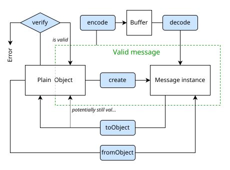
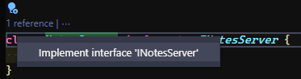
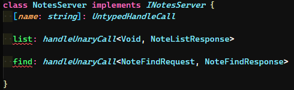

---

No nosso [artigo anterior do guia](/o-guia-do-grpc-2/) vimos como podemos integrar o gRPC com JavaScript de uma forma bem simples e rápida. Agora chegou a hora de subirmos mais um nível e adicionarmos os tipos à esta aplicação! E, quando eu falo de tipos automaticamente pensamos em **TypeScript**!

Para este artigo vamos converter a nossa [API gRPC de notas](https://github.com/khaosdoctor/grpc-guide-part2-javascript-sample) para utilizar TypeScript. Mas primeiro, vamos entender o que significa "converter para TypeScript" e o que queremos dizer quando fazemos isso usando gRPC, ainda mais quando usamos gRPC com JavaScript.

## O que é converter?

Como já mencionei [na primeira parte deste guia](/guia-grpc-1/), o gRPC, apesar de ser uma tecnologia estabelecida, não tem uma documentação e nem um conjunto de ferramentas muito boa para algumas linguagens, infelizmente uma dessas linguagens é o [JavaScript](https://docs.microsoft.com/javascript/?WT.mc_id=opensource-0000-ludossan)...

No entanto, o ferramental que temos para [JS](https://docs.microsoft.com/javascript/?WT.mc_id=opensource-0000-ludossan) funciona muito bem, apesar de ser um pouco complicado e meio obscuro de ser usado. Com uma base mais sólida basta que adicionemos as declarações de tipos para aqueles arquivos que já foram gerados pelo compilador.

Com isso, "converter" uma aplicação para TypeScript, em suma, significa que temos que adicionar arquivos `.d.ts` a todos os arquivos `.js` que são gerados pelo compilador. A tarefa em si não é muito complicada, uma vez que temos [bibliotecas oficiais](https://github.com/Microsoft/dts-gen) que fazem esse tipo de coisa. Então está tudo certo, não é?

Infelizmente o problema que temos volta-se novamente às ferramentas que temos para JavaScript. Por exemplo, temos dois pacotes oficiais, um mais antigo, chamado apenas de `grpc` que foi o primeiro pacote de implementação gRPC para JavaScript, mas este pacote está aos poucos sendo substituído pelo pacote `@grpc/grpc-js`, que não possui o loader de arquivos `.proto`, deixando o pacote mais leve e com menos dependências, já que ele terceiriza essa funcionalidade para outro pacote específico chamado `@grpc/proto-loader`.

> Usamos ambos os pacotes no [artigo anterior dessa série](/o-guia-do-grpc-2/)

As diferenças entre estes pacotes vão além de serem somente um uma variação do outro, ou então terem menos coisas juntas. A realidade é que o pacote `grpc` é mais bem implementado porque está conosco há muito mais tempo, enquanto, por exemplo, o pacote `@grpc/grpc-js` não possui algumas implementações, como a `grpc.Server.bind()`.

## Trabalhando com as diferenças

Já sabemos que estes pacotes possuem diferenças, mas é possível trabalhar com elas? Sim, é totalmente possível mas temos que tomar cuidado com alguns pormenores que não estão muito bem documentados e são, em grande parte, o motivo pelo qual estou montando este guia. Nosso ecossistema de JavaScript para gRPC é extremamente disperso e esparso em diversos níveis, o que torna a implementação na linguagem muito complicada para quem está começando.

Como tivemos um pacote, o `grpc`, na maioria do tempo que o gRPC existiu, começamos a ter bibliotecas que foram sendo criadas para ele, como o [Protobuf.js](https://github.com/protobufjs/protobuf.js), uma ferramenta oficial que compreende basicamente a criação de arquivos para englobar as classes de geração de mensagens no gRPC, ou seja, podemos gerar classes para as nossas mensagens e utilizá-las dessa forma:

```js
const pbjs = require('protobuf.js')
pbjs.load('notes.proto', (err, root) => {
  if (err) throw err

  const NoteFindRequest = root.lookupType('NoteFindRequest')
  const payload = { id: 1 }

  const isValid = NoteFindRequest.verify(payload)
  if (!isValid) throw new Error(isValid)

  const message = NoteFindRequest.create(payload)
  const buffer = NoteFindRequest.encode(message).finish()
})
```

Como você pode perceber, temos um modelo de reflexão, ou seja, temos que fazer um lookup dentro do nosso arquivo `.proto`, mas é possível também gerar arquivos de forma estática, assim teremos classes prontas para isso. Adicionalmente, o `protobuf.js` inclui também o conceito de `verify`, de forma que podemos verificar as mensagens para saber se elas estão corretas, seguindo um fluxo como este:



E, além de tudo isso, ela também gera definições para TypeScript, já que o `grpc` e o `@grpc/grpc-js` possuem tipagem estática junto com seus pacotes. Assim podemos realizar basicamente as mesmas funcionalidades porém com nossos tipos definidos.

Conseguiu perceber o problema que temos aqui? Apesar de muito boa, essa biblioteca não possui uma forma boa e simples de gerarmos um código TypeScript que seja auto-contido, ou seja, que possamos instanciar como uma instância de um serviço sem precisar confiar no carregamento dinâmico de um arquivo `.proto`, ou seja, temos que usar `.load` no nosso arquivo de definição e confiar que ele estará completo e válido e, em um superset estáticamente tipado como o TypeScript, qualquer coisa dinâmica é um problema.

Então, apesar de o `protobuf.js` gerar tipos válidos, ele é muito melhor para quando estamos fazendo um client do que quando estamos realizando a criação de um server, já que ele provê muito mais ferramental para mensagens do que para inferência dos tipos internos do servidor. Mas ele também pode ser utilizado como [gerador de tipos em tempo de execução](https://github.com/protobufjs/protobuf.js#using-decorators) com decorators.

## O que queremos

Vamos pensar um pouco, temos um arquivo de definição completo que é o seguinte:

```protobuf
syntax = "proto3";

service Notes {
  rpc List (Void) returns (NoteListResponse);
  rpc Find (NoteFindRequest) returns (NoteFindResponse);
}

// Entities
message Note {
  int32 id = 1;
  string title = 2;
  string description = 3;
}

message Void {}

// Requests
message NoteFindRequest {
  int32 id = 1;
}

// Responses
message NoteFindResponse {
  Note note = 1;
}

message NoteListResponse {
  repeated Note notes = 1;
}
```

Com isso nós já sabemos basicamente tudo que precisamos para poder criar nosso servidor. Um servidor gRPC possui duas principais interfaces, a primeira é a interface base que contém todos os métodos que podem ser criados e a segunda é a implementação do servidor. Então o ideal é que pudéssemos fazer algo assim:<MarginNote>Todos os tipos que estamos usando na chamada anterior, como o `ServerUnaryCall` e o `sendUnaryData` são [provenientes do `@grpc/grpc-js` nativamente](https://github.com/grpc/grpc-node/blob/master/packages/grpc-js/src/server-call.ts#L84-L86), já que a lib é escrita em TypeScript, veja mais dos tipos [no repositório oficial](https://github.com/grpc/grpc-node/blob/master/packages/grpc-js/src).</MarginNote>

```typescript
class NotesServer implements NotesServerInterface {
  find (call: ServerUnaryCall<NoteFindRequest, NoteFindResponse>, callback: sendUnaryData<NoteFindResponse>) { /* implementação */ }

  list (_: ServerUnaryCall<Void, NoteListResponse>, callback: sendUnaryData<NoteListResponse>) { /* implementação */ }
}

const server = new grpc.Server()
server.addService(NotesService, new NotesServer())
```

A parte importante é, além dos tipos da classe, os tipos que vamos passar para o servidor, então nossa chamada `server.addService` tem uma assinatura como esta:

```typescript
abstract class Server {
  function addService (service: ServiceDefinition, implementation: UntypedServiceImplementation): void
}
```

E os tipos `ServiceDefinition` e `UntypedServiceImplementation` possuem, respectivamente, as seguintes definições:

```typescript
type ServiceDefinition<ImplementationType = UntypedServiceImplementation> = {
    readonly [index in keyof ImplementationType]: MethodDefinition<any, any>
}
```

Veja que ela não é complexa, o que temos aqui é um `generic`, uma definição de serviço leva um parâmetro de tipo, quais são os métodos que são implementados, se não mandarmos nada para ele, vamos ter uma `UntypedServiceImplementation`, que significa "não faço a menor ideia do que tem aqui":

```typescript
export declare type UntypedHandleCall = HandleCall<any, any>
export interface UntypedServiceImplementation {
    [name: string]: UntypedHandleCall
}
```

Ambos os tipos são index signatures que definem apenas um objeto com uma chave do formato string.

Resumindo isso tudo, o que temos é um objeto que precisa possuir as mesmas chaves da sua implementação, de forma que `NotesService` precisa ter as mesmas chaves de `NotesServer` e os dois tipos que essas chaves se referem precisam ser implementações de métodos, ou seja, funções com a seguinte assinatura:

```typescript
export type MethodImplementation = (call: ServerUnaryCall<RequestInput, RequestOutput>, callback: sendUnaryData<RequestOutput>): void
```

Poderíamos até deixar mais bonito fazendo tudo com generics:

```typescript
export type MethodImplementation<In, Out> = (call: ServerUnaryCall<In, Out>, callback: sendUnaryData<Out>): void
```

E tudo isso é só para mostrar para você que os tipos que precisamos para o gRPC não são absolutamente nada de mais, apenas objetos que precisam ter as mesmas chaves que outros objetos e precisam implementar funções com uma assinatura específica.

## Streams e outros tipos de dados

Uma pequena extensão do que estamos falando, mas sem relação direta com o conteúdo deste guia, se nosso tipo de chamada não for uma chamada `Unary`, ou seja, se tivermos streaming de dados de um dos lados como, por exemplo, neste `.proto`:

```protobuf
service Notes {
  rpc List (Void) returns (stream NoteListResponse);
  rpc Find (NoteFindRequest) returns (stream NoteFindResponse);
}
```

Então nossas respostas não seriam mais `ServerUnaryCall` e nem `sendUnaryData` porque não estamos mais mandando um único tipo como retorno, mas sim estamos abrindo uma stream de dados, nossa `call` seria uma `ReadableStream` e nosso callback seria uma `WritableStream` - ou essencialmente qualquer coisa que implemente `Readable` e `Writable` respectivamente.

Vamos aprender mais sobre streaming com gRPC nas próximas partes deste guia.

## Mãos a obra

Agora que já entendemos os pormenores dos tipos do TS e como eles, na verdade, são apenas índices de um grande objeto, vamos partir para nossa implementação.

Para convertermos nossa API para TypeScript, vamos utilizar uma outra biblioteca mais especializada no `grpc-js`, já que o `protobuf.js` não nos atende para essa tarefa. O repositório desse exemplo está disponível [no meu GitHub](https://github.lsantos.dev/grpc-guide-part3-typescript-sample) se você quiser dar uma olhada no código final e na estrutura geral.

A primeira coisa que vamos fazer é uma pequena alteração no nosso arquivo `.proto`. As alterações são mínimas, vamos apenas mudar o nome da nossa implementação `rpc` para `Notes`

```protobuf
syntax = "proto3";

service Notes {
  rpc List (Void) returns (NoteListResponse);
  rpc Find (NoteFindRequest) returns (NoteFindResponse);
}

// Entities
message Note {
  int32 id = 1;
  string title = 2;
  string description = 3;
}

message Void {}

// Requests
message NoteFindRequest {
  int32 id = 1;
}

// Responses
message NoteFindResponse {
  Note note = 1;
}

message NoteListResponse {
  repeated Note notes = 1;
}
```

Isso é só porque se chamarmos de `NoteService`, teremos um nome estranho no nosso tipo como `NoteServiceServer` (sim, eu tenho TOC com nomes de variáveis).

Vamos criar uma nova pasta para nosso projeto, dentro dela vamos criar uma pasta `proto` e vamos colocar o arquivo `notes.proto` com o conteúdo que acabamos de ver. Em seguida, damos um `npm init -y` para criar um novo projeto Node.js e vamos instalar os seguintes pacotes:

```bash
$ npm i -D @types/long @types/node grpc_tools_node_protoc_ts grpc-tools typescript
```

Como você pode perceber, vamos utilizar a biblioteca [`grpc-tools`](https://www.npmjs.com/package/grpc-tools) que é, basicamente, um wrapper do `protoc` com algumas modificações interessantes, incluindo a geração de arquivos `.d.ts`. E vamos usar um plugin para esta biblioteca que é o [`grpc_tools_node_protoc_ts`](https://github.com/agreatfool/grpc_tools_node_protoc_ts), que faz o trabalho de gerar os tipos de forma mais estruturada para criarmos nossos serviços somente a partir de uma única interface.

Estas são nossas dependências de desenvolvimento, para as dependências de execução só vamos ter uma, o `grpc-js`, então vamos executar `npm i @grpc/grpc-js`. Isto porque estamos gerando arquivos estáticos que não vão precisar ser lidos a partir de um arquivo `.proto`, então não precisamos de mais nada além do servidor.

> Se você quer gerar os arquivos de forma dinâmica, então você vai precisar do loader do protobuf e, infelizmente, os tipos gerados podem não ser os ideais para você

Vamos agora iniciar nosso projeto TypeScript com `npx tsc --init`, ao criar, vamos modificar as variáveis do `tsconfig.json` para que ele seja o mais restrito possível:

```json
//tsconfig.json
{
  "compilerOptions": {
    "target": "es5",
    "module": "commonjs",
    "declaration": true,
    "declarationMap": true,
    "sourceMap": true,
    "outDir": "./dist",
    "rootDir": "./src",
    "strict": true,
    "noUnusedLocals": true,
    "noUnusedParameters": true,
    "noImplicitReturns": true,
    "noFallthroughCasesInSwitch": true,
    "noUncheckedIndexedAccess": true,
    "noPropertyAccessFromIndexSignature": true,
    "esModuleInterop": true,
    "experimentalDecorators": true,
    "emitDecoratorMetadata": true,
    "skipLibCheck": true,
    "forceConsistentCasingInFileNames": true
  }
}
```

Agora vamos editar nosso arquivo `package.json` para criarmos o nosso script de compilação. Vamos criar um script chamado `compile` que será basicamente a compilação do nosso arquivo `.proto`:

```bash
grpc_tools_node_protoc \
    --js_out=import_style=commonjs,binary:./proto \
    --grpc_out=grpc_js:./proto \
    -I ./proto ./proto/*.proto && \
  grpc_tools_node_protoc \
    --plugin=protoc-gen-ts=./node_modules/.bin/protoc-gen-ts \
    --ts_out=grpc_js:./proto \
    -I ./proto ./proto/*.proto
```

Este script vai primeiramente gerar os arquivos estáticos em JavaScript, tanto os arquivos de tipo das mensagens (descritos por `js_out`) quanto o arquivo que contém o servidor pré-pronto (descrito por `grpc_out`), isso tudo dentro da nossa pasta `./proto` usando os arquivos que terminam em `*.proto`.

Logo em seguida, vamos ler os arquivos `.js` gerados nessa pasta e vamos ativar o plugin `protoc-gen-ts` para poder gerar seus tipos e salvá-los na mesma pasta.

> **Importante**: Veja que temos uma chave `ts_out=grpc_js` na segunda parte do comando, isso porque esta biblioteca está preparada para gerar tipos tanto para o `grpc` quanto para o `@grpc/grpc-js`

Os últimos dois scripts que vamos criar são os scripts para iniciar o servidor e o client, compilando de TS para JS antes. No final, vamos ter uma chave `scripts` assim no nosso `package.json`:

```json
//package.json
{
  // ... conteúdo omitido
  "scripts": {
    "compile": "grpc_tools_node_protoc --js_out=import_style=commonjs,binary:./proto --grpc_out=grpc_js:./proto -I ./proto ./proto/*.proto && grpc_tools_node_protoc --plugin=protoc-gen-ts=./node_modules/.bin/protoc-gen-ts --ts_out=grpc_js:./proto -I ./proto ./proto/*.proto",
    "start:server": "tsc && node dist/server.js",
    "client": "tsc && node dist/client.js"
  },
  // ... conteúdo omitido
}
```

Execute o script `npm run compile` e veja que vamos ter 4 arquivos novos na pasta `proto`:

```bash
proto
├── notes.proto # arquivo protobuf de definição
├── notes_grpc_pb.d.ts # tipos do servidor gRPC
├── notes_grpc_pb.js # servidor gRPC
├── notes_pb.d.ts # tipos das mensagens
└── notes_pb.js # mensagens da definição
```

## Onde tudo se junta

Se você clicar no arquivo `notes_grpc_pb.js` verá, no final, que ele possui uma variável chamada `NotesService`:

```javascript
var NotesService = exports.NotesService = {
  list: {
    path: '/Notes/List',
    requestStream: false,
    responseStream: false,
    requestType: notes_pb.Void,
    responseType: notes_pb.NoteListResponse,
    requestSerialize: serialize_Void,
    requestDeserialize: deserialize_Void,
    responseSerialize: serialize_NoteListResponse,
    responseDeserialize: deserialize_NoteListResponse,
  },
  find: {
    path: '/Notes/Find',
    requestStream: false,
    responseStream: false,
    requestType: notes_pb.NoteFindRequest,
    responseType: notes_pb.NoteFindResponse,
    requestSerialize: serialize_NoteFindRequest,
    requestDeserialize: deserialize_NoteFindRequest,
    responseSerialize: serialize_NoteFindResponse,
    responseDeserialize: deserialize_NoteFindResponse,
  },
};
```

Compare essa variável com o tipo `ServiceDefinition` que temos no `grpc-js`. Eles são os mesmos, ou seja, podemos criar um servidor diretamente a partir desse construtor. Logo abaixo temos uma chamada ao `grpc.makeGenericClientConstructor` que é um método que gera um client genérico de chamadas para o gRPC que podemos usar sem precisar de uma instancia do nosso arquivo `.proto`, vamos falar mais sobre ele nas próximas edições.

## Criando o servidor

Vamos passar agora para a parte interessante, onde criamos nosso servidor. Crie uma pasta `src` e um arquivo `server.ts` dentro desta pasta.

Vamos começar criando nosso "banco de dados", lembre-se que ele é um array de notas, mas notas não são mais simples objetos, agora temos tipos que definem não só as notas como objetos mas também as notas como uma classe de mensagem, por isso o tipo que precisamos dar para esse banco é `Notes.AsObject[]`, ou seja, um array de objetos que são mensagens válidas de `Notes`:

```typescript
import { Note } from '../proto/notes_pb'

const notes: Note.AsObject[] = [
  { id: 1, title: 'Note 1', description: 'Content 1' },
  { id: 2, title: 'Note 2', description: 'Content 2' }
]
```

Agora vamos implementar nosso servidor. Existem duas formas de fazermos isso, a primeira é a implementação via objeto, como já fizemos antes, com um objeto do tipo:

```js
const server = {
  find (call, cb) { ... },
  list (call, cb) { ... }
}
```

E a segunda é a implementação no modelo de classe que, no final da compilação acaba virando um objeto, mas é mais bonito e mais fácil de entender quando estamos lendo o código, então será esse que vamos usar. Vamos começar com uma classe `NotesServer` que implementa uma interface `INotesServer` gerada pelo nosso compilador de `.proto`:

```typescript
import { Note } from '../proto/notes_pb'
import { INotesServer } from '../proto/notes_grpc_pb'

const notes: Note.AsObject[] = [
  { id: 1, title: 'Note 1', description: 'Content 1' },
  { id: 2, title: 'Note 2', description: 'Content 2' }
]

class NotesServer implements INotesServer {

}
```

**Dica**: Se você estiver usando o [VSCode](https://code.visualstudio.com/?WT.mc_id=opensource-0000-ludossan), ao criar uma nova classe que implementa uma interface, um pequeno bulbo de luz azul vai aparecer ao lado, selecione-o e haverá uma opção para implementar todos os objetos automaticamente:



Ao clicar, você terá as interfaces implementadas com os tipos necessários, basta substituir pela implementação real:



Veja que temos, além dos nossos métodos, um index signature do TypeScript no início. Este é um dos problemas que mencionei quando disse que as bibliotecas não são preparadas para trabalhar com o TypeScript inicialmente. Este bug está [documentado](https://github.com/agreatfool/grpc_tools_node_protoc_ts/blob/v5.1.1/doc/server_impl_signature.md) na biblioteca e, infelizmente, é uma limitação do TypeScript para tipos não conhecidos de índices, como o tipo diz que podemos ter `N` strings como chaves e seus valores, precisamos deixar claro que esta classe implementa e permite este tipo de coisa também.

> Na implementação usando somente a lib `grpc` isto não ocorre porque os tipos não exigem uma assinatura de índice dinâmico como esta

Vamos implementar nossas funções, começando com a função `list` que é a mais simples, vamos adicionar uma assinatura como o tipo manda:

```typescript
import { sendUnaryData, ServerUnaryCall, UntypedHandleCall } from '@grpc/grpc-js'
import { Note } from '../proto/notes_pb'
import { INotesServer } from '../proto/notes_grpc_pb'
import { Note, NoteListResponse, Void } from '../proto/notes_pb'

const notes: Note.AsObject[] = [
  { id: 1, title: 'Note 1', description: 'Content 1' },
  { id: 2, title: 'Note 2', description: 'Content 2' }
]

class NotesServer implements INotesServer {

  list (_: ServerUnaryCall<Void, NoteListResponse>, callback: sendUnaryData<NoteListResponse>): void {
    const response = new NoteListResponse()
    notes.forEach((note) => {
      response.addNotes(
        (new Note).setId(note.id)
                  .setTitle(note.title)
                  .setDescription(note.description)
        )
    })
    callback(null, response)
  }

  [name: string]: UntypedHandleCall

}
```

Perceba que agora, ao invés de só retornarmos o Array, temos obrigatoriamente que converter cada item do array em um `Note` e adicionar ao tipo da resposta. Ao mesmo tempo que isto é muito bom, pois temos a segurança de tipos, é pior porque temos que escrever mais e não há forma de converter todo o array de uma única vez de forma nativa do compilador (você pode, no entanto, escrever uma função para fazer exatamente isso).

## Falando de imports

Outro detalhe importante para notar, aqui recebemos o tipo `Void` que é um tipo criado por nós dentro do nosso arquivo `.proto`, se quisermos uma implementação mais "correta" podemos usar o _well-known type_ chamado `Empty`, que vem juntamente com a biblioteca padrão do protobuf quando você faz o download [do repositório oficial do protoc](https://github.com/protocolbuffers/protobuf), você precisa mover esta pasta para `/usr/includes` ou qualquer outra pasta que esteja no seu `PATH`.

Então podemos importar este tipo dentro do nosso arquivo `.proto`:

```protobuf
syntax = "proto3";
package notes;

import "google/protobuf/empty.proto";

service Notes {
  rpc List (google.protobuf.Empty) returns (NoteListResponse);
  rpc Find (NoteFindRequest) returns (NoteFindResponse);
}

// Entities
message Note {
  int32 id = 1;
  string title = 2;
  string description = 3;
}

message Void {}

// Requests
message NoteFindRequest {
  int32 id = 1;
}

// Responses
message NoteFindResponse {
  Note note = 1;
}

message NoteListResponse {
  repeated Note notes = 1;
}
```

Precisamos adicionar uma declaração `package` para dizer que nosso arquivo está em outro namespace, isto é obrigatório para não gerar confusões no compilador.

Depois, no nosso servidor, instalaríamos o pacote `google-protobuf` com `npm i google-protobuf` e importamos o tipo `Empty` naturalmente:

```typescript
import { sendUnaryData, ServerUnaryCall, UntypedHandleCall } from '@grpc/grpc-js'
import { Note } from '../proto/notes_pb'
import { INotesServer } from '../proto/notes_grpc_pb'
import { Note, NoteListResponse } from '../proto/notes_pb'
import { Empty } from 'google-protobuf/empty_pb'

const notes: Note.AsObject[] = [
  { id: 1, title: 'Note 1', description: 'Content 1' },
  { id: 2, title: 'Note 2', description: 'Content 2' }
]

class NotesServer implements INotesServer {

  list (_: ServerUnaryCall<Empty, NoteListResponse>, callback: sendUnaryData<NoteListResponse>): void {
    const response = new NoteListResponse()
    notes.forEach((note) => {
      response.addNotes(
        (new Note).setId(note.id)
                  .setTitle(note.title)
                  .setDescription(note.description)
      )
    })
    callback(null, response)
  }

  [name: string]: UntypedHandleCall

}
```

Este foi um pequeno contorno do artigo para mostrar que é possível deixar as coisas mais separadas e utilizar libs de tipos externas no nosso servidor. Embora **não estaremos usando essa lib aqui**, é um conteúdo interessante para se manter em mente.

## Voltando aos trilhos

Vamos implementar o método `find`, ele segue exatamente a mesma ideia, vamos apenas adicionar a implementação básica do tipo e retornar um objeto `Note`:

```typescript
import { sendUnaryData, ServerUnaryCall, UntypedHandleCall } from '@grpc/grpc-js'
import { Note } from '../proto/notes_pb'
import { INotesServer } from '../proto/notes_grpc_pb'
import { Note, NoteFindRequest, NoteFindResponse, NoteListResponse, Void } from '../proto/notes_pb'

const notes: Note.AsObject[] = [
  { id: 1, title: 'Note 1', description: 'Content 1' },
  { id: 2, title: 'Note 2', description: 'Content 2' }
]

class NotesServer implements INotesServer {

  list (_: ServerUnaryCall<Void, NoteListResponse>, callback: sendUnaryData<NoteListResponse>): void {
    const response = new NoteListResponse()
    notes.forEach((note) => {
      response.addNotes(
        (new Note).setId(note.id)
                  .setTitle(note.title)
                  .setDescription(note.description)
      )
    })
    callback(null, response)
  }

  find (call: ServerUnaryCall<NoteFindRequest, NoteFindResponse>, callback: sendUnaryData<NoteFindResponse>) {
    const id = call.request.getId()
    const foundNote = notes.find((note) => note.id === id)
    if (!foundNote) return callback(new Error('Note not found'), null)

    const response = new NoteFindResponse()
    response.setNote(
       (new Note()).setTitle(foundNote.title)
                   .setId(foundNote.id)
                   .setDescription(foundNote.description)
    )
    return callback(null, response)
  }

  [name: string]: UntypedHandleCall

}
```

Apesar de ser mais verboso, o método fica muito mais fácil de ler e entender, além de manter a coesão e os tipos obrigatórios.

Para finalizar, vamos iniciar nosso servidor, temos duas formas de fazer isso, a primeira delas é via callback:

```typescript
import { INotesServer, NotesService } from '../proto/notes_grpc_pb'
import { Note, NoteFindRequest, NoteFindResponse, NoteListResponse, Void } from '../proto/notes_pb'
import { sendUnaryData, Server, ServerCredentials, ServerUnaryCall, UntypedHandleCall } from '@grpc/grpc-js'

const notes: Note.AsObject[] = [
  { id: 1, title: 'Note 1', description: 'Content 1' },
  { id: 2, title: 'Note 2', description: 'Content 2' }
]

class NotesServer implements INotesServer {
  /* Nossa implementação */
}

const server = new Server()
server.addService(NotesService, new NotesServer())

server.bindAsync('0.0.0.0:50052', ServerCredentials.createInsecure(), (err, port) => {
  if (err) throw err
  console.log(`listening on ${port}`)
  server.start()
})
```

Isso é um problema proveniente do TypeScript, uma vez que é possível utilizar o `bindAsync` como uma Promise no JavaScript. Isto acontece porque o tipo do servidor não possui uma definição para uma promise. Mas, sempre podemos dar um jeito e usar o `promisify`:

```typescript
import { promisify } from 'util'
import { INotesServer, NotesService } from '../proto/notes_grpc_pb'
import { Note, NoteFindRequest, NoteFindResponse, NoteListResponse, Void } from '../proto/notes_pb'
import { sendUnaryData, Server, ServerCredentials, ServerUnaryCall, UntypedHandleCall } from '@grpc/grpc-js'

const notes: Note.AsObject[] = [
  { id: 1, title: 'Note 1', description: 'Content 1' },
  { id: 2, title: 'Note 2', description: 'Content 2' }
]

class NotesServer implements INotesServer {
  /* Nossa implementação */
}

const server = new Server()
server.addService(NotesService, new NotesServer())

const bindPromise = promisify(server.bindAsync).bind(server)

bindPromise('0.0.0.0:50052', ServerCredentials.createInsecure())
  .then((port) => {
    console.log(`listening on ${port}`)
    server.start()
  })
  .catch(console.error)
```

Muito melhor, não? Note que precisamos utilizar o `.bind(server)` porque o método `start()` possui uma checagem para saber se o servidor já foi inicializado chamando `this.started`.

Agora, se rodarmos `npm run start:server` teremos nosso servidor rodando na porta `50052`. Falta criarmos o client, mas perceba que o fluxo de trabalho e entendimento do código ficou muito melhor do que antes.

## Criando o client

A criação do client é quase que completamente automática porque temos o nosso `genericClientConstructor` já chamado com o tipo de servidor que precisamos em `NotesService`, crie um novo arquivo em `src` chamado `client.ts` e ele dispensa muitas explicações:

```typescript
import { ChannelCredentials } from '@grpc/grpc-js'
import { NotesClient } from '../proto/notes_grpc_pb'
import { NoteFindRequest, Void } from '../proto/notes_pb'

const client = new NotesClient('0.0.0.0:50052', ChannelCredentials.createInsecure())
client.list(new Void(), (err, notes) => {
  if (err) return console.log(err)
  console.log(notes.toObject())
})

client.find((new NoteFindRequest).setId(1), (err, note) => {
  if (err) return console.log(err)
  console.log(note.toObject())
})

client.find((new NoteFindRequest).setId(3), (err, note) => {
  if (err) return console.log(err.message)
  console.log(note.toObject())
})
```

O client já está praticamente instanciado com todos os métodos, mas lembre-se de que todos os tipos de retorno e de envio **precisam** ser um tipo válido do gRPC aos olhos do TypeScript, por isso estamos criando uma nova classe vazia com `new Void()` o que parece ser meio contraprodutivo, mas ajuda muito a manter a coesão de tudo que fazemos.

Rode `npm run client` e veja a mágica acontecer!

## Conclusão

Como pudermos ver, temos uma grande facilidade em transformar tudo em TypeScript, porém precisamos primeiro entender o que queremos e entender as limitações das ferramentas, o que pode ser provar um grande problema já que elas acabam não se conversando muito.

Apesar de gRPC com TypeScript ser incrível, ainda temos alguns passos a percorrer para transformar essa modalidade em uma forma mais útil para que todos possamos utilizá-lo. Estou tentando fazer isso com algumas libs como o [protots](https://github.com/khaosdoctor/protots) para gerar interfaces e não apenas tipos, dessa forma podemos abstrair um pouco mais das funcionalidades de forma que não precisemos da uma implementação completa do gRPC para ter os tipos funcionais.

Nas próximas partes da série, vamos abordar muitas coisas, como `buf` e `streams`, então curta e compartilhe este post com seus amigos e amigas para que possamos espalhar a palavra do gRPC e mostrar que não é tão difícil assim fazer uma API que possa ser utilizada de forma unificada por todos!
