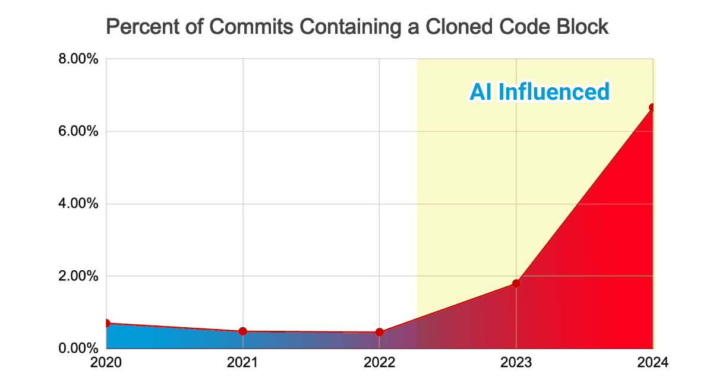

Over the past few years, especially after the pandemic and the AI explosion, I've watched a quiet decline in a profession that used to pride itself on pragmatism and attention to detail: software development.

I'm not predicting the end of this career, quite the opposite. But something changed at the core of what defined us. We used to be known not just for writing code that works, but for writing code that tells a story. How many hours have we burned in passionate debates about languages, technologies, architectures? We were people who built technology because we loved the process of creating, the art behind the code.

And that passion always showed up most clearly in one fundamental detail: documentation.


Documenting the code you'd just written felt like writing a book about your own work of art. People liked explaining how things worked, liked talking about the programs they built and the products they made with so much care.

EA recently [open-sourced the Command & Conquer code](https://github.com/electronicarts/CnC_Red_Alert) and I posted this tweet:

> Saiu o código fonte do Command & Conquer no GitHub e eu tava lendo um pouco dele, não sei quem é o Joe, mas esse código é provavelmente um dos mais bem documentados que eu já vi na minha vida. Saudades de quando a gente tinha código assim... [pic.twitter.com/4KiWVROfZ1](https://t.co/4KiWVROfZ1) — Lucas Santos 🇧🇷🇸🇪 • formacaots.com.br 💎 (@\_StaticVoid) [March 3, 2025](https://twitter.com/_StaticVoid/status/1896350049963307313?ref_src=twsrc%5Etfw)
>
> — 

That code was written in 1995, and it's hands down one of the best documented codebases I've seen in my entire career. But then I stopped to think: it's been years since I've seen documentation like that. _Where did all that good documentation go?_

In the replies to that tweet, a lot of people said the code was ugly, that things are different today, that they'd never call it well documented, and so on. What happened? How did we go from documentation this detailed to rushed little notes in half-baked READMEs?

> I left this question in [another tweet](https://x.com/_StaticVoid/status/1896350281564295320), if you want to share your take there, that'd be awesome! 😄

## What happened to us?

It's always been clear that code is a tool, I've never doubted that, and I still don't. But what happened to us? We stopped caring whether people can use or even understand our systems. Today it seems way more "efficient" and "productive" to just copy some code, paste it without reading anything, and see what happens.

I have a few theories...

### The slow decline of critical thinking

To promote [Formação TypeScript](https://formacaots.com.br), I run ads on a few platforms from time to time. Maybe you've seen one (or not). It's no secret that I do this, I always have, like anyone with a digital product.

I've been doing this for years without a hitch, but recently I ran a slightly more "controversial" ad and, apparently, I didn't get the message across the way I wanted. A bunch of people repeated the exact same comment, even after I'd already answered that same question several times.

> This happened so many times that I was forced to block comments on all the ads.

It's not the haters or the comments that bother me. I've been on the internet long enough to deal with the inevitable hate people brew from the comfort of their keyboards. What bothers me is the **total lack of effort to understand context**, in other words, to **read**.

And the same thing happens in development. **Devs are getting lazier and more complacent**, losing the curiosity that used to be a prerequisite for this field.

From a profession that prided itself on being meticulous and focused, we've moved to a generation that outsources its thinking to a machine, just to repeat exactly what it says. Again:

> what happened to us?

Ever since ChatGPT and other tools showed up, the number of people who just copy and paste a prompt without even reading what it says is absurd.

And it's not just me saying this from some marble throne. There are plenty of reports on the subject:

https://refactoring.fm/p/code-quality-in-the-age-of-ai

https://devclass.com/2025/02/20/ai-is-eroding-code-quality-states-new-in-depth-report/

https://www.gitclear.com/coding_on_copilot_data_shows_ais_downward_pressure_on_code_quality

https://leaddev.com/software-quality/how-ai-generated-code-accelerates-technical-debt

https://www.gitclear.com/ai_assistant_code_quality_2025_research

Almost all of them point to the same thing: code quality is declining year after year because **people are simply copying code instead of thinking**.



> I have a lot more to say about this and I'll dig into it in another Backlog.

The point here is that few people now bother to document or pay a bit more attention to the code they write, because, simply:

-   It's easier to ask AI to generate code on the spot, without considering the rest of the codebase.
-   Copy the whole code and ask AI to explain it in two lines.
-   Let AI write the documentation.

And there's a curious problem in all this: AI-generated code tends to be very well commented. The result? We've created the stereotype that any well-commented code must have been written by AI, and not that it's simply well-made, easy-to-read code.

### A good dev knows how to read and understand

A lot of people show up saying:

> "Ah, but Clean Code is against comments, blah blah"

And that's yet another example of how people have stopped thinking. _Clean Code_ is an old book, from another era, but that doesn't mean it condemns comments in code, it condemns useless comments. For example:

```js
// Adds a+b
function sum (a, b) { return a+b }
```

It's a useless comment, it describes _what_ is happening but not _why_. And that's where the nuance is.

Documentation (whether in comments or not) should explain the _why_ of things, not _what_ the code does. That should be clear just from reading the code.

> "If you can't understand what the code does just by reading it, you're a bad dev"

That phrase drives me crazy, for one simple reason. Check out this code:

```c
float Q_rsqrt( float number )
{
	long i;
	float x2, y;
	const float threehalfs = 1.5F;

	x2 = number * 0.5F;
	y  = number;
	i  = * ( long * ) &y;                       
	i  = 0x5f3759df - ( i >> 1 );               
	y  = * ( float * ) &i;
	y  = y * ( threehalfs - ( x2 * y * y ) );   
	return y;
}
```

Now try reading that code with zero context. Did you get it?

If you did, there are only two possibilities: either you're extremely smart and off the charts, or you already know the story behind this block.

Understanding code is hard, mostly because it **always comes with context**. That's why comments matter so much. A loose snippet with no explanation is like opening a book to a random page and trying to follow the story from there.

> In case you're curious, the code is [here](https://en.wikipedia.org/wiki/Fast_inverse_square_root)

But I don't think it's only on devs, there's also a mindset I really hate. The "[hustle bro](https://www.admdnewsletter.com/hustle-bro-culture-is-making-our/)" one, or the "[indie hacker](https://adlega.com/blog/indie-hackers-a-new-path-in-tech-entrepreneurship/)" one. That's my other theory.

## Ship it! Ship it! Ship it!

Two words define the tech job market from 2019 to today (2025): **money** and **speed**.

Go to any library, tool, or framework website and you'll always find some variation of _"blazing fast"_, _"weeks, not months"_, and the like. Speed and profit at any cost became the main goal of pretty much everything.

_Hustle bro_ culture, with its "YOU CAN DO IT! BELIEVE IN YOURSELF" and "work while they sleep" mantras, gained steam and ended up warping a mindset I used to admire: the _indie hacker_ one. An indie hacker is a solo entrepreneur who builds a product with full control, no investors, fully independent. I always loved that idea of working on what you want and making it work. But that changed once everything became about being more efficient and more productive, as if money were the only goal.

> People are shifting from a state of "plan, learn, and execute" to "execute and see what happens."

In the same scene that gave us "why test? Testing doesn't add value to the product", along comes the idea that "documentation is a waste of time" for the same reason. So documentation gets neglected because, once again, "good devs can tell what the code does just by looking at it". Documentation, housekeeping, and good practices get treated as waste, and the whole focus becomes just **ship ship ship**.

As an example, let me point to two emblematic figures of the new "indie hacking", [Pieter Levels](https://x.com/levelsio) and [Marc Lou](https://x.com/marc_louvion?lang=en), though they're far from the only ones, they're just the loudest.

> Notice how strikingly similar the details are. Bios with websites and monthly revenue numbers, dollar signs everywhere, the words "ship" and "fast" show up constantly.

To prove my point, one of them is currently building a game, with zero prior game dev experience, without reading any documentation, just copying and pasting code from Claude Sonnet, and this tweet sums up what's going on pretty well.

> This is like the vibe coding version of the TV show "Alone".[@levelsio](https://twitter.com/levelsio?ref_src=twsrc%5Etfw) is stranded in the wilderness, trying to build a multiplayer videogame with nothing but a Cursor subscription. As time goes on, the challenge gets harder: the game gets more complicated, the bugs get… [https://t.co/t0YOJsljWl](https://t.co/t0YOJsljWl) — George Arrowsmith (@ThatArrowsmith) [March 2, 2025](https://twitter.com/ThatArrowsmith/status/1896186694614802432?ref_src=twsrc%5Etfw)
>
> — 

As the bugs get harder, the fix isn't to learn to do it the right way, it's to patch the bugs and create new ones "just to see if it works". People are swapping the "plan, learn, and execute" cycle for "execute and see what happens", which is terrible, because nobody wants to study anything, just test and see what happens.

The problem isn't what they "know they don't know", it's what they "don't know they don't know", and they still think everything's fine. The biggest example of this was the [recent Marc drama](https://dev.to/lucaschitolina/the-marc-lou-drama-and-securitiy-lessons-1j02), where one of his products ran into serious trouble because he didn't implement the security his "MVP" needed. Stuff that could've been solved with 15 minutes reading the docs on the use cases. This brings me back to the meme:


## Documentation that matters

To wrap up, let me leave a few tips on what I think good documentation looks like. Companies like [Stripe](https://docs.stripe.com/), [Vercel](https://vercel.com/docs), [Twillio](https://www.twilio.com/docs/) and [Resend](https://resend.com/docs/introduction) are, to me, the ones that best mastered the "art of documenting" what they build. Their docs are extremely well made, easy to read, and kept up to date.

And what makes documentation good?

1.  Make the homepage a guide, the [](https://docs.stripe.com/)[Stripe does this really well](https://docs.stripe.com/), walking you through the products
2.  Teach the fundamentals of your technology, not just that it exists, Vercel has a [really good page for that](https://vercel.com/docs/fundamentals)
3.  Code should always show up as a tutorial, a step by step, or a simple guide, like on [Resend](https://resend.com/docs/send-with-nodejs)
4.  Cover common use cases among your users with docs specific to them, like [this page](https://www.twilio.com/docs/sendgrid#send-your-first-email) from SendGrid

But how do you keep documentation up to date? Code changes, but it isn't tied to the docs... But what if it were?

### Documentation === Code

Try writing code that generates the documentation, not the other way around. Instead of creating and maintaining separate docs, make the code the source of truth. Tools like [protobuf](https://protobuf.dev/) or the OpenAPI spec are great for keeping contracts documented. Why not generate the documentation **directly from** them?

If you think keeping documentation up to date is too complicated, stop maintaining it by hand. Keep only the code and have it generate the documentation automatically. Don't let one get updated without the other. There are several tools that let you do this, either through comments (JS/TSDoc) or in the code itself. I, for one, already [built one](https://github.com/expresso/router) that turns routes directly into OpenAPI specs.

What I mean is you don't need to keep documentation separate, you can delegate that job to your code. That way you always know what's in the code, and you get up to date documentation with no extra effort.

### Write comments that matter

Comments should tell a story. If the function is obvious, there's no need to comment it. The application probably won't notice one extra comment or the lack of it, but useless comments do the opposite of what we need.

Once a bad comment gets added, you can't tell a good one from a bad one anymore, and you end up wasting time reading things you don't need to. Nobody likes reading more than they have to.

But when you give the full context behind why a function, or even a single line of code, exists, you save hours of debugging, both yours and other people's down the road.

Contrary to what a lot of people say, documentation, if done right, can bring a ton of benefits, like a shorter learning curve and an easier time maintaining a project long term. It's thanks to documentation like this that I've managed to keep [this project](https://github.lsantos.dev/gotql) alive for so long, for example.

And you? What's your take on documentation?
