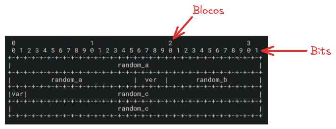
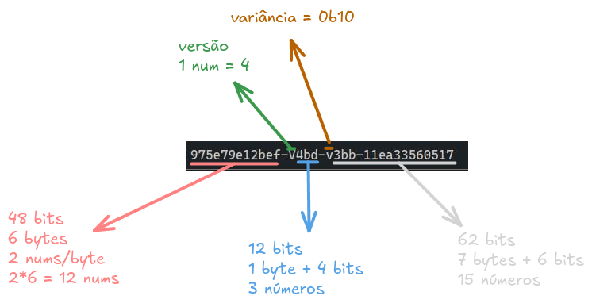

Em desenvolvimento, a capacidade de gerar IDs únicos sempre foi algo necessário, especialmente quando estamos lidando com grandes volumes de dados. Com o tempo a gente começou a ter outro problema: não dá pra gente gerar somente IDs sequenciais. Eles têm vários problemas, um deles é o fato de eles serem previsíveis e suscetíveis a ataques externos.

Então a gente criou vários outros tipos de IDs. Um exemplo deles é o [Snowflake](https://en.wikipedia.org/wiki/Snowflake_ID), que é o tipo de ID usado pelo Twitter para poder criar IDs que fossem únicos em computação distribuída (que tem um outro agravante de poder gerar o mesmo ID em dois lugares diferentes sem que um saiba do outro). Mas o que pegou mesmo foi o protocolo dos UUIDs ou _Universal Unique IDentifiers_.

Mas, recentemente, tivemos uma adição ao nosso ferramental, os ULIDs. Bora entender o que são eles. Mas primeiro a gente tem que entender um pouco de UUIDs.

## UUIDs

O modelo dos UUIDs foi originalmente proposto em uma [RFC](https://datatracker.ietf.org/doc/html/rfc4122), e depois movido para a [RFC-9562](https://datatracker.ietf.org/doc/html/rfc9562). Os UUIDs agora tem 8 versões, cada uma delas é um pouco diferente da outra e tem alguns usos especiais.

-   [UUID V1](https://www.rfc-editor.org/rfc/rfc9562.html#name-uuid-version-1): Gerado a partir de um timestamp, um contador monotônico e um MAC address. Ele tem 128 bits assim como os outros, onde os primeiros 60 são reservados para um timestamp em nano segundos desde 15 de Outubro de 1582.
-   UUID V2: Está fora da especificação original porque é reservado para IDs de segurança, quase ninguém os usa hoje.
-   [UUID V3](https://www.rfc-editor.org/rfc/rfc9562.html#name-uuid-version-3): ID's gerados a partir de um hash MD5 criado pelo usuário. Como você pode imaginar, eles não são tão aleatórios. Ele contém apenas 2 bits de variância e são utilizados mais como identificadores individuais, o que não faz muito sentido.
-   [UUID V4](https://www.rfc-editor.org/rfc/rfc9562.html#name-uuid-version-4): O mais comum de todos os IDs, é gerado através de dados completamente aleatórios. Esse é o que a maioria de nós utiliza para guardar dados em DBs e etc
-   [UUID V5](https://www.rfc-editor.org/rfc/rfc9562.html#name-uuid-version-5): Uma implementação um pouco melhor da versão 3, usa SHA1 (que também não é mais ideal). Mas ainda sim, meio sem uso
-   [UUID V6](https://www.rfc-editor.org/rfc/rfc9562.html#name-uuid-version-6): Esse é exatamente igual ao V1, porém a ordem dos bits foi alterada de forma que, quando ordenado, ele possa ser ordenado por data de criação
-   [UUID V7](https://www.rfc-editor.org/rfc/rfc9562.html#name-uuid-version-7): A implementação mais próxima que temos do ULID, é um timestamp e dados aleatórios. Sendo 48 bits de timestamp, 4 de versão, 2 de variância e 74 de aleatoriedade.
-   [UUID V8](https://www.rfc-editor.org/rfc/rfc9562.html#name-uuid-version-8): V8 é a versão customizada do UUID, os únicos dois campos que são requeridos são versão e variância.

### Como a gente cria um UUID?

Todos os UUIDs tem 128 bits, todos eles possuem 4 bits de versão, que é literalmente um número mostrando que versão que ele está, por exemplo, UUID V4 teria esse bit igual a `0b0100`, que é 4 em binário, o 7 seria `0b0111` e assim vai.

> `0bxxx` significa um número binário, por exemplo, `0b1010` é o mesmo que 10 em binário

A variante é sempre iniciada como `0b10`, em binário `0010` seria dois, mas esse 10 tem um outro significado que vamos ver já já. Esse é o motivo pelo qual todo UUID v4 vai ter um `4` no terceiro bloco:

```
919108f7-52d1-4320-9bac-f847db4148a8
              ^ver ^var
```

No geral, V1 e V6 são obsoletos e devem ser substituídos pelo 7, v2 é reservado para segurança computacional e o v3 ficou obsoleto pelo v5. Então os que importam são: 4, 5, 7 e 8.

### Um exemplo real



São 4 blocos de 32 bits (de 0-3, contando de 0-9 em cada). Os primeiros 48 bits (do 0 até o 32 no bloco 3, somado com 6) são destinados ao primeiro conjunto aleatório `random_a`, depois temos do octeto 6 até o bit 9 do primeiro bloco a versão `ver`, nesse caso é `0b0100`, depois temos mais 12 bits de dados aleatórios `random_b`, a variância que é sempre `0b10` e os outros 62 bits finais são o `random_c`, então funciona assim:

1.  128 bits são 16 bytes, podemos gerar um dado aleatório de 16 bytes em hex `975e79e12bef34bd33bb11ea33560517`, essa representação tem 32 caracteres, lembrando que cada caractere hexadecimal tem 4 bits, logo 4 bits \* 32 chars = 128 bits.

> [!NOTE] 💡
> Geralmente você vai ver a representação de números hexadecimais em um buffer, e um buffer é um array de bytes, ou seja, é um array de 8 bits em cada posição: `0000 1111` sendo que cada quarteto um é um número hexadecimal.
>
> Por isso que a representação como string seria algo como `97 5e 79 e1...`

1.  Agora a gente define os nossos bits
    1.  48 bits de aleatório: 48 bits são 6 bytes (48/8) então são as 12 primeiras letras `975e79e12bef`, para manter a separação do bloco, dividimos em 8 e 4 chars `975e79e1-2bef`
    2.  4 bits de versão: fixos em `0b0100`
    3.  12 bits de aleatoriedade: 12 bits podem ser entendidos como 1 byte completo e meio byte, então as próximas 3 letras, porém já pegamos uma letra que é a versão, então pulamos a próxima que é o 3 e pegamos `4bd`
    4.  2 bits de variância: fixo em `0b10`
    5.  62 bits de aleatoriedade: a partir do `4bd`, são mais 7 bytes (7\*8 = 56 bits) e outros 6 bits então são 14 letras mais 1 letra extra, porém pulando o primeiro 3 (de `33bb`) porque temos meio bit separado para a variância `3bb11ea33560517`
2.  Se separarmos tudo vamos ficar com algo assim:



4.  Mas essa conta não fecha... Temos dois bits faltando, tiramos um dos caracteres (na posição `v3bb`) para colocar a variância, mas a variância é `0b10`, e não `0b0010`... Bom, por isso que calculamos o hexadecimal primeiro, então imagine que temos isso aqui:

```
975e79e1-2bef-34bd-33bb-11ea33560517
xxxxxxxx-xxxx-Vxxx-vxxx-xxxxxxxxxxxx
```

5.  Para substituirmos a versão `V`, podemos simplesmente ignorar o número que está lá (que é o 3) e colocar um 4 no lugar porque temos 4 bits para versão, o que é suficiente para um número hexa:

```
975e79e1-2bef-34bd-33bb-11ea33560517 -- inicial
xxxxxxxx-xxxx-4xxx-vxxx-xxxxxxxxxxxx -- máscara
975e79e1-2bef-44bd-33bb-11ea33560517 -- final
```

6.  Agora para o bit da variância, como temos apenas 2 bits, temos que completar os dois bits que faltam com os primeiros dois bits mais significativos do próximo número, no nosso caso o número que está na máscara `v` é 3, então `0b0011`, como fixamos os dois primeiros da variância em `0b10`, temos que pegar os dois primeiros do próximo número e descartar o resto, o número final é `0b1000`, que é 8:

```
975e79e1-2bef-34bd-33bb-11ea33560517 -- inicial
xxxxxxxx-xxxx-4xxx-vxxx-xxxxxxxxxxxx -- máscara
975e79e1-2bef-44bd-83bb-11ea33560517 -- final
```

Em JavaScript (Node) podemos fazer isso com buffers, ficando assim:

```js
const randombuf = crypto.randomBytes(16)
Buffer.concat([
  randombuf.subarray(0,6), // 48 bits, 6 bytes
  Buffer.from([(randombuf[6] & 15) | 64]), // 4 bits da versão + 4 bits existentes
  randombuf.subarray(7,8), // 1 byte
  Buffer.from([(randombuf[8] & 63 ) | 128]), // concatena a variância
  randombuf.subarray(8) // restante
])
```

Que daria pra simplificar com um único buffer:

```js
const randombuf = crypto.randomBytes(16)
const result = Buffer.alloc(16)
randombuf.copy(result, 0, 0, 6)
result[6] = (randombuf[6] & 15) | 64
result[7] = randombuf[7]
result[8] = (randombuf[8] & 63) | 128
randombuf.copy(result, 9, 9, 16)
```

Mas o que são esses números mágicos? 15, 63, 128? São a representação decimal dos números binários `0000 1111` ou `0f` que é 15, `0011 1111` ou `3f` que é 63 e `1000 0000` ou `80` que é 128. Essencialmente essas operações são feitas para poder remover bits diretamente, por exemplo, o nosso bit de versão é 3, está no 6º byte que é `34`:

```
V = 0x34 ou 0011 0100
# Temos que zerar os primeiros 4 bits mantendo os últimos 4
# para isso podemos fazer um and com 0000 1111 que é 0x0f

0011 0100
    &
0000 1111
---------
0000 0100 # 0x04

# Agora podemos "somar" com 4 
# que seria um OR com o número 0x40 que é 64 ou 0100 0000

0000 0100
    +
0100 0000
---------
0100 0100 # 0x44
```

Com intuito de comparação, essa é a funcionalidade implementada no módulo [UUID](https://www.npmjs.com/package/uuid) do NPM:

```ts
function v4(options?: Version4Options, buf?: Uint8Array, offset?: number): UUIDTypes {
  options ??= {};

  if (native.randomUUID && !buf && !options) {
    return native.randomUUID();
  }

  options = options || {};

  const rnds = options.random || (options.rng || rng)();

  // Per 4.4, set bits for version and `clock_seq_hi_and_reserved`
  rnds[6] = (rnds[6] & 0x0f) | 0x40;
  rnds[8] = (rnds[8] & 0x3f) | 0x80;

  // Copy bytes to buffer, if provided
  if (buf) {
    offset = offset || 0;

    for (let i = 0; i < 16; ++i) {
      buf[offset + i] = rnds[i];
    }

    return buf;
  }

  return unsafeStringify(rnds);
}
```

Novamente, ela gera um buffer aleatório primeiro, depois faz um **bitwise and** com `0x0f`, que em binário é `0000 1111`, ou seja, está descartando o primeiro bloco, e depois fazendo um **bitwise or** com `0x40`que é `0100 0000`, substituindo o primeiro quarteto por `0b0100`:

```
# Aleatório
rnds[6] = 0x8a => 1000 1010
1000 1010 & 0x0f = 1000 1010 & 0000 1111

1000 1010 # 0x8a
    &
0000 1111 # 0x0f
---------
0000 1010 # agora somamos (+ é um or) com 0x40
    +
0100 0000 # 0x40
---------
0100 1010 # 0x4a
```

Para a variância ele está pegando o valor da 8 posição, removendo os dois primeiros bits do primeiro quarteto através do AND com `0x3f` que é 63 em decimal, com os dois primeiros bits zerados, podemos substituí-los por `0b1000` que é 8 em decimal, mas como temos um byte inteiro, seria `1000 0000` que é 128 em decimal:

```
# Aleatório
rnds[8] = 0x75 => 0111 0101
0111 0101 & 0x3f = 0111 0101 & 0011 1111

0111 0101 # 0x75
    &
0011 1111 # 0x3f
---------
0011 0101 # agora somamos (+ é um or) com 0x80
    +
1000 0000 # 0x80
---------
1011 0101 # 0xb5
```

A questão é a seguinte, o primeiro bloco do ID não é ordenável, ele é apenas um número aleatório de um buffer.

## ULID

ULID significa _Universally Unique Lexicographically Sortable Identifiers_, é um ID compatível com os UUIDs, também com 128 bits. ULIDs são case sensitive, e não tem nenhum outro caracter especial então podemos usar em URLs, assim como UUIDs.

A diferença é que o layout de um ULID é bem mais simples

```
 01AN4Z07BY      79KA1307SR9X4MV3

|----------|    |----------------|
 Timestamp           Aleatório
   48bits             80bits
```

O timestamp é um inteiro de 48 bits representando o UNIX time em milisegundos, enquanto a aleatoriedade são 80 bits de dados aleatórios genéricos. A diferença principal, como o nome já diz, é que eles são ordenáveis alfabeticamente. Além de que eles não são encodados usando hexadecimal, mas um algoritmo chamado [Base32](https://www.crockford.com/base32.html) (que foi criado pelo Douglas Crockford, que é também o criador do JSON), portanto a quantidade de símbolos é bem limitada:

```
0123456789ABCDEFGHJKMNPQRSTVWXYZ
```

Isso faz com que o ID seja menor (26 letras ao invés de 32) o que é mais eficiente em termos de espaço, Porém ele tem uma parada complicada, é possível que existam colisões se dois ULIDs forem gerados no mesmo milissegundo, o que não é incomum em sistemas distribuídos. Quando isso é identificado (seja lá como for) o componente aleatório é incrementado em 1 no bit menos significante, lembrando que ele utiliza a notação [big endian](https://en.wikipedia.org/wiki/Endianness), então os bits mais significantes são os da esquerda, portanto os menos significantes são os da direita.

Enquanto a comparação é meio incerta e até um pouco injusta, os ULIDs tem algumas vantagens sobre os UUIDS:

1.  São menores, 26 ao invés de 32 chars, economizando pelo menos 6 bytes por ID
2.  Ordenação léxica, embora isso não seja um grande ponto de comparação porque o UUID v7 também é ordenável, só não lexicalmente
3.  Vantagens em armazenamento de bancos de dados
    1.  Quando estamos usando índices ordenados, os ULIDs podem tirar proveito da mesma ordem e serem mais performáticos
    2.  Se você está armazenando dados de série temporal, os ULIDs podem ser armazenados e retirados em ordem sem precisar de nenhuma ordenação posterior
4.  Um outro ponto que eu considero uma vantagem é que os ULIDs são mais legíveis do que os UUIDs

## Conclusão

No final esse artigo acabou sendo mais sobre o UUID do que o próprio ULID 🤣, mas espero que você tenha aprendido como UUIDs funcionam.

Em geral, ULIDs são uma boa opção quando você quer gerar dados que precisam ser ordenados ou buscados de forma léxica. Para aplicações pequenas eu não acredito que tenha tanto impacto, mas para grandes aplicações distribuídas você pode ter tanto uma economia de espaço quanto ganho de performance usando ULIDs de forma léxica.

Porém, ULIDs não são muito comuns, grandes chances são de que você vai ter que implementar o seu próprio gerador ou então seu próprio verificador. Bibliotecas como o [Zod](https://zod.dev) já implementam validações para ULID, mas o Node, por exemplo, não implementa um gerador de ULIDs e nem vai implementar porque o ULID não é baseado em nenhuma RFC da IETF, o que torna ele mais arriscado já que é um protocolo que pode sobreviver por décadas ou não (a mesma coisa vale para o Snowflake, por exemplo).

Minha sugestão, não use ULIDs a menos que seja extremamente necessário, prefira testar os UUIDs v7 para dados que possam ser ordenáveis primeiro.
