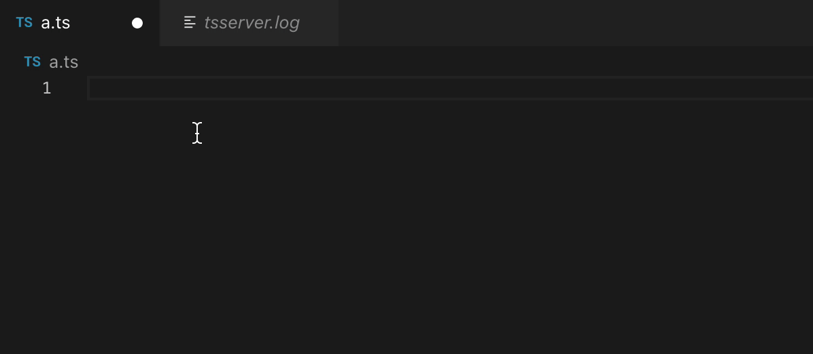

The new TypeScript version [came out in beta](https://devblogs.microsoft.com/typescript/announcing-typescript-4-3-beta/) on April 1st, 2021! For now this version still isn't ready for production, but it already includes some really cool changes and fixes!

To test all of this you can install the newest version with `npm i typescript@beta` and start enjoying the new features!

## Separate read and write types

Originally, when we have a class property that needs to be written and read in different ways, we write a getter and a setter for that property, for example:

```javascript
class Foo {
    #prop = 0
    
    get prop() {
        return this.#prop
    }

	set prop (value) {
        let val = Number(value)
        if (!Number.isFinite(num)) return
        this.#prop = val
    }
}
```

In TypeScript, by default, the type is inferred from the return type of `get`. The problem is that if we have a `set` property that can be set in multiple ways, for example as a `string` or a `number`, the return type of this property will be inferred as `unknown` or `any`.

The problem with that is that when we're using `unknown` we're forced to cast to the type we want, and `any` really doesn't do anything. This model forced us to choose between being precise or being permissive. In TS 4.3 we can specify separate types for the input and output of properties:

```typescript
class Foo {
    private prop = 0
    
    get prop(): number {
        return this.prop
    }

	set prop (value: string | number) {
        let val = Number(value)
        if (!Number.isFinite(num)) return
        this.prop = val
    }
}
```

And this isn't limited to classes, we can do the same thing with object literals:

```typescript
function buildFoo (): Foo {
  let prop = 0
  return {
    get prop(): number { return prop }
    set prop(value: string | number) {
      let val = Number(value)
      if (!Number.isfinite(val) return
      prop = val
    }
  }
}
```

And this also applies to interfaces:

```typescript
interface Foo {
  get prop (): number
  set prop (value: string | number)
}
```

The only limitation here is that the `set` method's type list **needs** to include the same type as the `get`, meaning that if we have a getter that returns a `number` the setter needs to accept a `number`.

## The `override` keyword

A less common but equally important change comes when we have derived classes. Usually, when we use a derived class with `extends`, we have several methods from the parent class that need to be overridden, or adapted. To do that we write a method on the derived class with the same signature:

```typescript
class Pai {
  metodo (value: boolean) { }
  outroMetodo (value: number) {}
}

classe Filha extends Pai {
  metodo () { }
  outroMetodo () { }
}
```

What happens here is that we're overriding both methods from the parent class and only using the ones from the derived class. But if we modify the parent class and remove both methods in favor of a single one, like this:

```typescript
class Pai {
  metodoUnico (value: boolean) { }
}

classe Filha extends Pai {
  metodo () { }
  outroMetodo () { }
}
```

What happens is that our child class no longer overrides the parent class's method, so it ends up with two completely useless methods that will never be called.

Because of this, TypeScript 4.3 added a new keyword called `override`. What this keyword does is tell the compiler that a method in the child class is explicitly overriding one from the parent, so we can write it like this:

```typescript
class Pai {
  metodo () { }
  outroMetodo () { }
}

classe Filha extends Pai {
  override metodo () { }
  override outroMetodo () { }
}
```

In this example we're telling TypeScript to explicitly check the parent class for two methods with these names. And if we then modify our parent class while keeping the child class as is:

```typescript
class Pai {
  metodoUnico (value: boolean) { }
}
classe Filha extends Pai {
  override metodo () { }
  override outroMetodo () { }
}

// Error! This method can't be marked with 'override' because it's not declared in 'Pai'.
```

On top of that, a new `--noImplicitOverride` flag was added to keep us from forgetting to mark these methods. Once it's on, we won't be able to override a method without writing `override` before it, and any method that isn't marked won't be treated as an override.

## Auto imports

The last important update we'll cover is more of a significant quality-of-life improvement for everyone who writes imports (which is, basically, everyone). Before, when we typed `import {` TypeScript had no way of knowing what we were about to import, so we'd often write `import {} from 'module.ts'` and then go back into the `{}` to get autocomplete on whatever was left.

In version 4.3, we get the same auto-import intelligence that already exists in the editor to help complete our declarations, as the video shows:



The important part here is that we need the editor to support this feature. For now it's available in regular VSCode version 1.56, but only with the [TS/JS nightly extension](https://marketplace.visualstudio.com/items?itemName=ms-vscode.vscode-typescript-next) installed.

## Other updates

Besides the updates we've covered, TypeScript also changed and **significantly** improved how _template literal types_ are inferred and identified. Now we can use them in a much simpler and more direct way.

We also get better Promise assertions and a breaking change in `.d.ts` files, which you can read about in the official release post.
