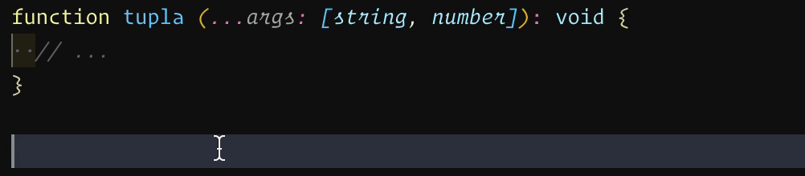
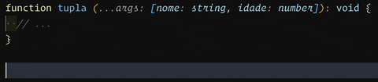

No dia 20 de Agosto de 2020, o TypeScript anunciou a sua mais nova versão, a 4.0! Então, neste artigo, me preparei para apresentar para vocês as últimas mudanças e novidades da versão!

Apesar de ser uma **major version** as alterações que foram introduzidas nesse release não são muito substanciais e, pode se acalmar, não temos nenhuma breaking change :D

## Tuplas nomeadas

Para começar, temos a resolução de um problema relativamente antigo do superset mais amado por todos. Quando temos tuplas (elementos que são compostos de pares de dados), antigamente tínhamos uma definição como esta:

```typescript
function tupla (...args: [string, number]) {}
```

Veja que não temos nenhum nome para nenhum dos parâmetros que ocupam tanto a posição da `string` quanto a posição do `number`. No que diz respeito à inferência de tipos e à checagem no geral, isso não faz diferença alguma, mas é muito útil quando estamos **documentando nosso código**.

Por conta da checagem de tipos, a função anterior seria traduzida para algo semelhante a isto:

```typescript
function tupla (args_0: string, args_1: number) {}
```

Que é essencialmente a mesma coisa, porém, na hora de fazermos o código, o nosso _intellisense_ – que é uma das grandes vantagens do uso do TypeScript, no geral – vai nos dar uma nomenclatura que não ajuda ninguém, como podemos ver no gif abaixo



Agora, com a versão 4.0, podemos incluir nomes nas nossas tuplas para que elas sejam nomeadas durante o intellisense:

```typescript
function tupla (...args: [nome: string, idade: number]) {}
```

E ai conseguimos um resultado como o seguinte:



É importante notar que: Se você está nomeando qualquer elemento de uma tupla, você **precisa** nomear os dois. Caso contrário você terá um erro:

```typescript
type Segment = [first: string, number];
//                             ~~~~~~
// error! Tuple members must all have names or all not have names.
```

## Inferência de propriedades a partir do construtor

A partir de agora, quando configuramos o TypeScript com a configuração `noImplicitAny`, podemos usar a análise de fluxo que é feita no tempo de compilação para determinar os tipos de propriedades em classes de acordo com as atribuições em seu construtor.

```typescript
class Test {    
   public x   
   constructor (b: boolean){      
     this.x = 42
     if (b) this.x = 'olá'
   }
}
```

Em versões anteriores, como não estamos especificando o tipo da propriedade, isto faria o compilador atribuir o tipo `any`, mas como checamos que não queremos `any` de forma implícita, então o compilador nos daria um erro dizendo que não podemos ter nenhum tipo de `any` implícito.

Na versão mais atual, o TypeScript consegue inferir, a partir do construtor, que `x` é do tipo `string | number`.

## Short-Circuit em operadores compostos

Poucas pessoas conhecem esta funcionalidade do JavaScript, mas muitas outras linguagens também possuem o que é chamado de _compound assignment operator_, ou, operadores de atribuição compostos.

O que eles fazem é resolver a expressão do lado direito e atribuir o valor para a variável do lado esquerdo. Os mais famosos são os operadores algébricos:

```javascript
let b += 2
let c /= 3
```

Todos funcionam muito bem e existem para a maioria das operações lógicas. Porém, de acordo com [o próprio time do TS](https://devblogs.microsoft.com/typescript/announcing-typescript-4-0/#short-circuiting-assignment-operators), existem três notáveis exceções à esta regra. Os operadores lógicos `&&`, `||` e o operador de coalescencia nula `??`. No 4.0 temos a adição de três novos operadores:

```javascript
a ||= b
// que é igual a
a || (a = b)
```

Além disso temos os operadores `&&=` e `??=`.

## Catch com `unknown`

Desde os primórdios do TypeScript, sempre que tínhamos uma cláusula `catch`, o valor do argumento de erro era sempre definido como `any`, pois não havia como saber qual era o tipo de retorno.

Portanto, o TypeScript simplesmente não checava os tipos destes parâmetros, mesmo se o `noImplicitAny` estava ativo.

```typescript
try {
  throw 'Alguma coisa'
} catch (err) { // Este 'err' é Any
  console.log(err.foo()) // não vai dar erro
}
```

Isso era pouco seguro uma vez que podíamos chamar qualquer função dentro do `catch`. A partir do 4.0, o TS vai tipar os erros como `unknown`.

O tipo `unknown` é um tipo especificamente voltado para tipar coisas que não sabemos o que são. Portanto elas **precisam** de um _type-casting_ antes de poderem ser usadas. É como se um dado do tipo `unknown` fosse um papel em branco e você pudesse pinta-lo da cor que quiser. Neste caso, o `unknown` pode ser convertido para qualquer tipo.

## Outras mudanças

Além de mudanças na linguagem, a velocidade de compilação com a flag `--noEmitOnError` ficou mais rápida quando usamos junto com a flag `--incremental`. O que a última flag faz é dar a possibilidade de compilarmos uma aplicação mais rapidamente a partir de uma outra aplicação que já foi compilada, a chamada **compilação incremental**.

Quando utilizávamos `--incremental` com `--noEmitOnError`, se compilássemos um programa pela primeira vez e ele der um erro, isso significa que ele não emitira nenhuma saída, portanto não há um arquivo `.tsbuildinfo` onde o `--incremental` poderá olhar, o que tornava tudo super devagar.

Na versão 4.0 este problema foi corrigido. E, além disso, agora é permitido o uso da flag `--noEmit` juntamente com `--incremental`, o que não era permitido antes pois `--incremental` precisava da emissão de um `.tsbuildinfo`.

Algumas outras mudanças menores foram feitas no que diz respeito à edição e editores no geral. Você pode conferir a postagem do blog [aqui](https://devblogs.microsoft.com/typescript/announcing-typescript-4-0).

## Conclusão

E fechamos por aqui a nossa atualização deste superset sensacional! Lembrando que [estamos precisando de ajuda na tradução para português no site do TypeScript](https://github.com/microsoft/TypeScript-Website/issues/233), nos ajude a traduzir!

Não se esqueça de se inscrever na newsletter para mais conteúdo exclusivo e notícias semanais! Curta e compartilhe seus feedbacks nos comentários!
