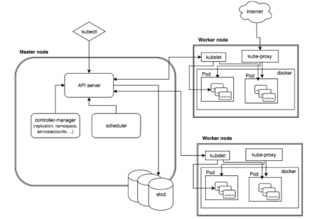
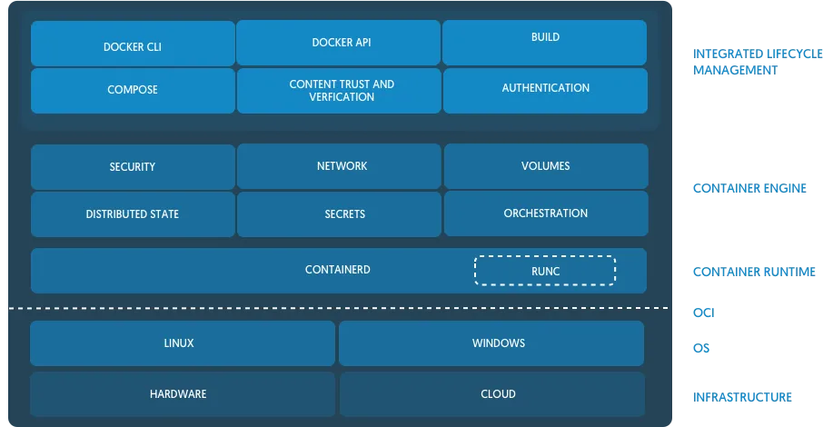

import figureImage1 from './oci-cri-docker-ecossistema-de-containers/image.png'
import figureImage2 from './oci-cri-docker-ecossistema-de-containers/image-2.png'

_Imagem de capa por [ItsVit](https://itsvit.com/blog/docker-kubernetes-till-death-us-part/)_

Recentemente o time do Kubernetes anunciou que estaria [descontinuando o suporte ao Docker](https://github.com/kubernetes/kubernetes/blob/master/CHANGELOG/CHANGELOG-1.20.md#deprecation) a partir da versão 1.22. Neste artigo vamos falar desta alteração e vou explicar o que são todas as ferramentas que temos disponíveis hoje para rodar nossos containers! Então vamos entrar nessa sopa de letrinhas que é o CRI, OCI, ContainerD e muito mais!

## Docker e Kubernetes

O Docker e o Kubernetes têm andado de mãos dadas por um bom tempo. Todos os nós de um cluster Kubernetes são equipados com uma implementação do Docker, que torna possível o uso do socket do Docker para várias implementações. Em suma, você pode montar o socket dentro do seu pod e utilizar o "Docker" que está disponível no nó dentro do seu container.

A partir da versão 1.22, o time anunciou que não estaria mais utilizando o Docker como runtime padrão, ou seja, se você está usando o socket do Docker ou então o está montando dentro do pod de alguma forma, então você terá de buscar outras opções. Mas não se preocupe, **imagens do docker (produzidas pelo `docker build` continuarão sendo aceitas pelo cluster normalmente**, e já vamos entender por quê. A razão para isto é que, na realidade, o Docker estava causando mais problemas do que soluções.

### CRI - Container Runtime Interface

Desde versões mais antigas do Kubernetes, como a 1.3 e a 1.5, já existiam conversas para que o Kubernetes pudesse suportar diversos tipos de runtimes de execução de containers (como o [Docker](https://docker.com) e o [RKT](https://coreos.com/rkt/)). Até aquele momento, ambos os runtimes já eram suportados porém eles estavam tão intimamente integrados com a ferramenta que estavam deixando de ser uma abstração e se tornando parte do que o Kubelet (o daemon de gerenciamento de containers) era.

Abaixo temos um diagrama muito legal [feito pelo Michael Brown, da](https://developer.ibm.com/technologies/containers/blogs/kube-cri-overview/) [IBM](https://developer.ibm.com/technologies/containers/blogs/kube-cri-overview/), sobre como podemos imaginar a arquitetura do Kubernetes e aonde o Kubelet se encaixa nisso tudo.



O Kubernetes, entre todas as coisas, é uma ferramenta que inicia e para containers, para isso acontecer, o Kubelet precisa se comunicar com o runtime que está gerenciando os containers. Isto era feito diretamente no código, ou seja, o Kubelet possuía uma camada de código específica para lidar com cada um dos runtimes, sempre que o runtime era trocado, a aplicação precisava ser recompilada e reexecutada.

Além disso, implementar um runtime diretamente abre uma imensa possibilidade de que as ferramentas implementadas (como o Docker, por exemplo), que estão em constante mudança e evolução, acabem quebrando o próprio Kubernetes por conta de suas atualizações.

Para ter a capacidade de trocar de runtime sem precisar compilar toda o cluster novamente, a [equipe do Kubernetes criou](https://kubernetes.io/blog/2016/12/container-runtime-interface-cri-in-kubernetes/) o que foi chamado de **CRI, ou Container Runtime Interface**.

O CRI é um plugin que permite que um Kubelet se distancie da camada de runtimes utilizando uma API feita utilizando gRPC. Em suma, a equipe desacoplou a aplicação do Kubelet do runtime, fazendo com que eles sejam inseridos como plugins, bastando que eles implementem a interface gRPC correspondente. Agora, ao invés de o Kubelet ter de se adaptar as mudanças de interface dos runtimes, os runtimes teriam que criar um plugin que seguiria uma interface obrigatória do Kubelet, desta forma a manutenção e a contribuição ficariam muito mais fáceis.

<Figure src={figureImage1} priority alt="" caption="Diagrama de funcionamento do CRI" />

Não vamos entrar em detalhes da implementação do gRPC, mas a lista de serviços suportados está descrita em um protofile bastante intuitivo:

```protobuf
service RuntimeService {

    // Sandbox operations.

    rpc RunPodSandbox(RunPodSandboxRequest) returns (RunPodSandboxResponse) {}  
    rpc StopPodSandbox(StopPodSandboxRequest) returns (StopPodSandboxResponse) {}  
    rpc RemovePodSandbox(RemovePodSandboxRequest) returns (RemovePodSandboxResponse) {}  
    rpc PodSandboxStatus(PodSandboxStatusRequest) returns (PodSandboxStatusResponse) {}  
    rpc ListPodSandbox(ListPodSandboxRequest) returns (ListPodSandboxResponse) {}  

    // Container operations.  
    rpc CreateContainer(CreateContainerRequest) returns (CreateContainerResponse) {}  
    rpc StartContainer(StartContainerRequest) returns (StartContainerResponse) {}  
    rpc StopContainer(StopContainerRequest) returns (StopContainerResponse) {}  
    rpc RemoveContainer(RemoveContainerRequest) returns (RemoveContainerResponse) {}  
    rpc ListContainers(ListContainersRequest) returns (ListContainersResponse) {}  
    rpc ContainerStatus(ContainerStatusRequest) returns (ContainerStatusResponse) {}

    ...  
}
```

Agora basta que o Kubelet acesse a API em gRPC do CRI como um cliente e ele poderá se comunicar com qualquer runtime que implemente essa mesma funcionalidade, desacoplando assim a lógica de lidar com o runtime diretamente do Kubernetes e passando para o CRI responsável que pode ser executado como um plugin.

Para complementar a lista de runtimes suportados, uma série de CRIs foi desenvolvido:

-   [CRI-O](https://cri-o.io/): um runtime que conforma com a especificação OCI (que já vamos ver)
-   [rktlet](https://github.com/kubernetes-incubator/rktlet): runtime para RKT
-   [dockershim](https://github.com/kubernetes/kubernetes/tree/release-1.5/pkg/kubelet/dockershim): O CRI para o Docker (que causou todo esse problema)

### O problema

O grande problema é que o Docker foi construído para ser uma aplicação a parte, mantida por uma empresa própria e não foi feita para ser inclusa dentro de um cluster como o Kubernetes (tanto é que o Docker tem seu próprio "Kubernetes" com o Docker Swarm).

Isto acontece porque o Docker em si não é apenas uma única aplicação, mas uma stack inteira: um CLI, APIs, Sockets, o Docker Engine e um runtime chamado ContainerD (mais detalhes [neste artigo](https://medium.com/better-programming/an-overview-to-docker-architecture-15407c482c52#id_token=eyJhbGciOiJSUzI1NiIsImtpZCI6Ijc4M2VjMDMxYzU5ZTExZjI1N2QwZWMxNTcxNGVmNjA3Y2U2YTJhNmYiLCJ0eXAiOiJKV1QifQ.eyJpc3MiOiJodHRwczovL2FjY291bnRzLmdvb2dsZS5jb20iLCJuYmYiOjE2MTA1NTgzMzMsImF1ZCI6IjIxNjI5NjAzNTgzNC1rMWs2cWUwNjBzMnRwMmEyamFtNGxqZGNtczAwc3R0Zy5hcHBzLmdvb2dsZXVzZXJjb250ZW50LmNvbSIsInN1YiI6IjExNjIyOTU0MTc3NjU0NjQyOTk5NiIsImVtYWlsIjoibGhzLnNhbnRvc3NAZ21haWwuY29tIiwiZW1haWxfdmVyaWZpZWQiOnRydWUsImF6cCI6IjIxNjI5NjAzNTgzNC1rMWs2cWUwNjBzMnRwMmEyamFtNGxqZGNtczAwc3R0Zy5hcHBzLmdvb2dsZXVzZXJjb250ZW50LmNvbSIsIm5hbWUiOiJMdWNhcyBTYW50b3MiLCJwaWN0dXJlIjoiaHR0cHM6Ly9saDMuZ29vZ2xldXNlcmNvbnRlbnQuY29tL2EtL0FPaDE0R2otc1JnRWpFTXJZMzh4aEVZcFRnYlV6a3VkNlpYTEFaQ0M1Nk5PLWdJPXM5Ni1jIiwiZ2l2ZW5fbmFtZSI6Ikx1Y2FzIiwiZmFtaWx5X25hbWUiOiJTYW50b3MiLCJpYXQiOjE2MTA1NTg2MzMsImV4cCI6MTYxMDU2MjIzMywianRpIjoiMWEwYTBlZmMyMmFjNmI4MjNlM2FmYzQ1Y2I2N2UxOWM2NWI5ZDUxZSJ9.ZK7VFwyD51uOQ8IjMcSXUBxUI1YDhZUuvEUJhWf_zCNtOoc4w6QVZ63x2j3dugxn3xkkbXJFxeYpGA2qHnWemp4_60faoY-V6zjT9Gmafwk2Ubp2h6pxoB9X1-VPZ_vahjRu_U4lbPEcsr_hLmWvpaHKPGOCQMABe2D5vtc0BIX3JHGSpEWBMd3lNuqRolcADW32a6AmFcNOQnQ90hk1RgAiBKwRvnVL938wwfvUG7ES0TBsL814VfHi5Apuuzq60VpPa1NFLz6JGzz2PwKw8gl6ZX4pL5SFYuuONwT8-KgRes7LSi_iSJQjiitPqXMECT7ZTnajiUD8fGmLnBgqBQ)). O que o Docker fez pela sociedade e pelo mundo dev foi transformar a forma como devs utilizam containers em ambientes Linux (como eu já expliquei [neste meu artigo](https://www.freecodecamp.org/news/what-is-docker-used-for-a-docker-container-tutorial-for-beginners/)). Porém, isso tudo não serve de nada para o Kubernetes, porque ele não é um humano...

Então, para utilizar só a parte importante do Docker (o `containerd`), a equipe do Kubernetes precisou desenvolver o que é chamado de Dockershim, um [shim](https://en.wikipedia.org/wiki/Shim_\(computing\)) (uma biblioteca que modifica chamadas para a API do docker de forma transparente). Isso é péssimo porque adiciona uma nova ferramenta que precisa ser mantida pelo time e outro ponto de falha que pode quebrar todo o ecossistema. E foi o Dockershim que teve sua depreciação na versão 1.20 e vai ser descontinuado na 1.23.

A questão por trás disso tudo é que o Docker não é compatível com o CRI, nunca foi e provavelmente nunca será. Como o próprio time diz:

> Se ele fosse, ele não precisaria do shim, e isso não estaria acontecendo.

### E agora?

Agora o que resta é encontrar um novo runtime para poder rodar os containers dentro do Kubernetes. Não é uma tarefa difícil, já que o próprio Docker estava utilizando o ContainerD, então basta extrair o ContainerD e utilizá-lo de forma independente!

Muitas pessoas estão se perguntando se esta mudança irá quebrar todo o ecossistema e ninguém mais conseguirá rodar containers no Kubernetes, isso não é verdade. Como falamos nos primeiros parágrafos, o runtime que usamos nas nossas máquinas para construir containers Docker é uma instalação voltada para usuários humanos que prioriza a UX, porém produz uma imagem que é compatível com o **OCI (Open Container Initiative)** e, para o Kubernetes, toda imagem OCI é a mesma imagem e pode ser executada por um runtime compatível com a mesma especificação.

## O que é o OCI?

[OCI](https://opencontainers.org/about/overview/) significa Open Container Initiative, ela é uma estrutura de governança open source formada nos mesmos moldes da Linux Foundation. O objetivo principal da OCI é criar um padrão de mercado seguido por todas as empresas que trabalham com containers de forma que todos sigam as mesmas interfaces para os formatos de containers e imagens. Isto facilita muito a interoperabilidade entre ferramentas e runtimes de forma que uma imagem que seja compatível com a OCI possa ser executada por qualquer runtime também compatível.

Ela foi criada em 2015 pela própria Docker, a CoreOS e outros líderes do mercado de containers.

Em essência, a OCI possui duas especificações, uma para as imagens (chamada de `image-spec`) e outra para os runtimes (chamada de `runtime-spec`). A especificação das imagens diz, entre outras coisas, como uma imagem deve ser formada, qual deve ser a estrutura de seu manifesto e quais são as informações específicas da arquitetura do sistema que uma imagem precisa ter para que ela seja executada em qualquer implementação de um runtime OCI. A especificação completa do `image-spec` pode ser encontrada [aqui](https://github.com/opencontainers/image-spec/blob/master/spec.md).

Da mesma forma, a \`runtime-spec\` descreve como um runtime deve se comportar, incluindo como o filesystem deve gerenciar e descompactar imagens no disco. Também específica algumas regras de UX que devem ser esperadas de qualquer runtime que siga a especificação como, por exemplo, executar uma imagem sem nenhum argumento – como em `docker run nginx:latest`. Toda a especificação pode ser encontrada [aqui](https://github.com/opencontainers/runtime-spec/blob/master/spec.md).

### RunC

Além de criar a especificação, a OCI também mantém uma implementação de sua própria especificação chamada `runc`, que foi doada pela Docker no início do projeto.

O [RunC](https://github.com/opencontainers/runc) é o runtime padrão por trás tanto do ContainerD quanto do CRI-O e é atualmente uma das mais abrangentes implementações existentes. Podemos ver a implementação do ContainerD e do RunC diretamente na arquitetura do Docker na imagem abaixo presente [neste artigo](https://www.docker.com/blog/what-is-containerd-runtime/) do Docker:



## Kubernetes depois do Docker

Depois de depreciar a interface do Dockershim, o uso do ContainerD diretamente faz com que a arquitetura geral do Kubernetes seja muito mais simples de entender.

Isso vem em partes porque o próprio ContainerD já possui uma integração com o CRI via plugin que é habilitado por padrão, então o Kubelet se comunica com o plugin do CRI do ContainerD que, por sua vez, executa a implementação do `runc` e então os containers propriamente ditos, conforme o diagrama abaixo, também do Michael Brown:

<Figure src={figureImage2} alt="" caption="Diagrama de funcionamento do ContainerD com o Kubelet" />

O daemon do ContainerD lida com todas as chamadas do Kubelet através do plugin do CRI, chamando os shims necessários para modificação (que são mantidos pelo proprio time do ContainerD) e executando os containers através do  `runc`.

## Conclusão

Neste artigo não mostramos tanto sobre o ContainerD quanto eu gostaria, mas estou quebrando ele em duas partes para que possamos ter um artigo específico onde podemos falar um pouco mais só sobre o ContainerD!

Espero que vocês tenham gostado! Não se esqueçam de se inscrevem no newsletter para receber conteúdos, promoções e novidades!
