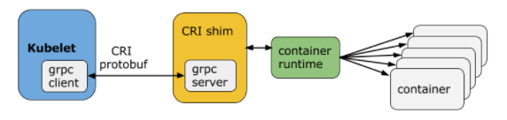
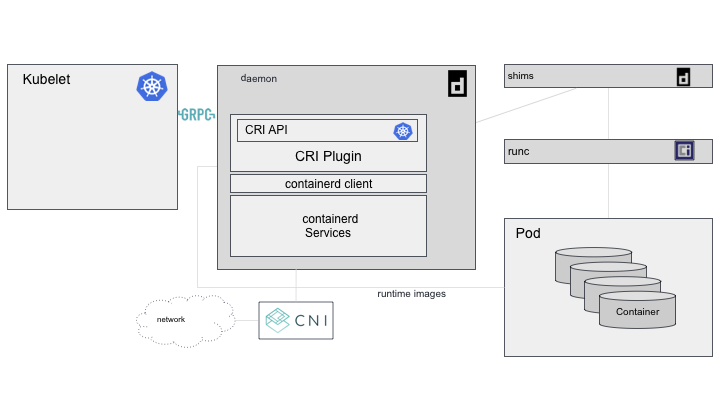

_Cover image by [ItsVit](https://itsvit.com/blog/docker-kubernetes-till-death-us-part/)_

The Kubernetes team recently announced that it would be [dropping support for Docker](https://github.com/kubernetes/kubernetes/blob/master/CHANGELOG/CHANGELOG-1.20.md#deprecation) starting with version 1.22. In this article I'll talk about this change and explain all the tools we have available today to run our containers. So let's jump into this alphabet soup that is CRI, OCI, ContainerD, and more!

## Docker and Kubernetes

Docker and Kubernetes have been walking hand in hand for a good while now. Every node in a Kubernetes cluster comes equipped with a Docker implementation, which makes it possible to use the Docker socket for all sorts of things. In short, you can mount the socket inside your pod and use the "Docker" that's available on the node from within your container.

Starting with version 1.22, the team announced that it would no longer use Docker as the default runtime. In other words, if you're using the Docker socket or mounting it inside the pod in any way, you'll need to look for other options. But don't worry, **images built with `docker build` will keep working on the cluster normally**, and we're about to see why. The reason for this is that, in reality, Docker was causing more problems than solutions.

### CRI - Container Runtime Interface

Back in older Kubernetes versions, like 1.3 and 1.5, there were already conversations about Kubernetes supporting several types of container execution runtimes (like [Docker](https://docker.com) and [RKT](https://coreos.com/rkt/)). Up to that point, both runtimes were already supported, but they were so tightly integrated with the tool that they were stopping being an abstraction and becoming part of what the Kubelet (the container management daemon) was.

Below is a really cool diagram [made by Michael Brown, from](https://developer.ibm.com/technologies/containers/blogs/kube-cri-overview/) [IBM](https://developer.ibm.com/technologies/containers/blogs/kube-cri-overview/), showing how we can picture the Kubernetes architecture and where the Kubelet fits into all of it.


Kubernetes, among everything else, is a tool that starts and stops containers. For that to happen, the Kubelet needs to talk to the runtime managing the containers. This used to be done directly in code, meaning the Kubelet had a specific code layer to deal with each runtime. Every time the runtime changed, the application needed to be recompiled and redeployed.

On top of that, implementing a runtime directly opens up a huge chance that the implemented tools (like Docker, for example), which are constantly changing and evolving, end up breaking Kubernetes itself because of their own updates.

To be able to swap runtimes without needing to recompile the whole cluster again, the [Kubernetes team built](https://kubernetes.io/blog/2016/12/container-runtime-interface-cri-in-kubernetes/) what got called **CRI, or Container Runtime Interface**.

CRI is a plugin that lets a Kubelet distance itself from the runtime layer using an API built with gRPC. In short, the team decoupled the Kubelet application from the runtime, turning runtimes into plugins, as long as they implement the matching gRPC interface. Now, instead of the Kubelet having to adapt to changes in each runtime's interface, the runtimes would have to build a plugin following a mandatory Kubelet interface. That way, maintenance and contribution become a lot easier.



We won't get into the gRPC implementation details, but the list of supported services is described in a pretty intuitive protofile:

```protobuf
service RuntimeService {

    // Sandbox operations.

    rpc RunPodSandbox(RunPodSandboxRequest) returns (RunPodSandboxResponse) {}  
    rpc StopPodSandbox(StopPodSandboxRequest) returns (StopPodSandboxResponse) {}  
    rpc RemovePodSandbox(RemovePodSandboxRequest) returns (RemovePodSandboxResponse) {}  
    rpc PodSandboxStatus(PodSandboxStatusRequest) returns (PodSandboxStatusResponse) {}  
    rpc ListPodSandbox(ListPodSandboxRequest) returns (ListPodSandboxResponse) {}  

    // Container operations.  
    rpc CreateContainer(CreateContainerRequest) returns (CreateContainerResponse) {}  
    rpc StartContainer(StartContainerRequest) returns (StartContainerResponse) {}  
    rpc StopContainer(StopContainerRequest) returns (StopContainerResponse) {}  
    rpc RemoveContainer(RemoveContainerRequest) returns (RemoveContainerResponse) {}  
    rpc ListContainers(ListContainersRequest) returns (ListContainersResponse) {}  
    rpc ContainerStatus(ContainerStatusRequest) returns (ContainerStatusResponse) {}

    ...  
}
```

Now all the Kubelet has to do is hit the CRI's gRPC API as a client, and it can talk to any runtime that implements that same functionality. That decouples the logic of dealing with the runtime directly from Kubernetes and hands it over to the responsible CRI, which can run as a plugin.

To round out the list of supported runtimes, a series of CRIs got built:

-   [CRI-O](https://cri-o.io/): a runtime that conforms to the OCI spec (which we'll get to)
-   [rktlet](https://github.com/kubernetes-incubator/rktlet): runtime for RKT
-   [dockershim](https://github.com/kubernetes/kubernetes/tree/release-1.5/pkg/kubelet/dockershim): the CRI for Docker (the one that caused this whole mess)

### The problem

The big problem is that Docker was built to be a standalone application, maintained by its own company, and it wasn't built to be included inside a cluster like Kubernetes (so much so that Docker has its own "Kubernetes" with Docker Swarm).

That's because Docker itself isn't just a single application, but an entire stack: a CLI, APIs, sockets, the Docker Engine, and a runtime called ContainerD (more details [in this article](https://medium.com/better-programming/an-overview-to-docker-architecture-15407c482c52#id_token=eyJhbGciOiJSUzI1NiIsImtpZCI6Ijc4M2VjMDMxYzU5ZTExZjI1N2QwZWMxNTcxNGVmNjA3Y2U2YTJhNmYiLCJ0eXAiOiJKV1QifQ.eyJpc3MiOiJodHRwczovL2FjY291bnRzLmdvb2dsZS5jb20iLCJuYmYiOjE2MTA1NTgzMzMsImF1ZCI6IjIxNjI5NjAzNTgzNC1rMWs2cWUwNjBzMnRwMmEyamFtNGxqZGNtczAwc3R0Zy5hcHBzLmdvb2dsZXVzZXJjb250ZW50LmNvbSIsInN1YiI6IjExNjIyOTU0MTc3NjU0NjQyOTk5NiIsImVtYWlsIjoibGhzLnNhbnRvc3NAZ21haWwuY29tIiwiZW1haWxfdmVyaWZpZWQiOnRydWUsImF6cCI6IjIxNjI5NjAzNTgzNC1rMWs2cWUwNjBzMnRwMmEyamFtNGxqZGNtczAwc3R0Zy5hcHBzLmdvb2dsZXVzZXJjb250ZW50LmNvbSIsIm5hbWUiOiJMdWNhcyBTYW50b3MiLCJwaWN0dXJlIjoiaHR0cHM6Ly9saDMuZ29vZ2xldXNlcmNvbnRlbnQuY29tL2EtL0FPaDE0R2otc1JnRWpFTXJZMzh4aEVZcFRnYlV6a3VkNlpYTEFaQ0M1Nk5PLWdJPXM5Ni1jIiwiZ2l2ZW5fbmFtZSI6Ikx1Y2FzIiwiZmFtaWx5X25hbWUiOiJTYW50b3MiLCJpYXQiOjE2MTA1NTg2MzMsImV4cCI6MTYxMDU2MjIzMywianRpIjoiMWEwYTBlZmMyMmFjNmI4MjNlM2FmYzQ1Y2I2N2UxOWM2NWI5ZDUxZSJ9.ZK7VFwyD51uOQ8IjMcSXUBxUI1YDhZUuvEUJhWf_zCNtOoc4w6QVZ63x2j3dugxn3xkkbXJFxeYpGA2qHnWemp4_60faoY-V6zjT9Gmafwk2Ubp2h6pxoB9X1-VPZ_vahjRu_U4lbPEcsr_hLmWvpaHKPGOCQMABe2D5vtc0BIX3JHGSpEWBMd3lNuqRolcADW32a6AmFcNOQnQ90hk1RgAiBKwRvnVL938wwfvUG7ES0TBsL814VfHi5Apuuzq60VpPa1NFLz6JGzz2PwKw8gl6ZX4pL5SFYuuONwT8-KgRes7LSi_iSJQjiitPqXMECT7ZTnajiUD8fGmLnBgqBQ)). What Docker did for the world and for devs was change the way people use containers in Linux environments (like I already explained [in this article of mine](https://www.freecodecamp.org/news/what-is-docker-used-for-a-docker-container-tutorial-for-beginners/)). But none of that matters to Kubernetes, because it's not human...

So, to use only the important part of Docker (the `containerd`), the Kubernetes team had to build what's called Dockershim, a [shim](https://en.wikipedia.org/wiki/Shim_\(computing\)) (a library that transparently modifies calls to the Docker API). That's terrible, because it adds a new tool that the team needs to maintain, and one more point of failure that can break the whole ecosystem. And Dockershim is exactly what got deprecated in version 1.20 and will be dropped entirely in 1.23.

The thing underlying all of this is that Docker isn't compatible with CRI. It never was, and it probably never will be. As the team itself puts it:

> If it were, it wouldn't need the shim, and none of this would be happening.

### So now what?

Now what's left is finding a new runtime to run containers inside Kubernetes. It's not a hard task, since Docker itself was already using ContainerD, so all we have to do is pull ContainerD out and use it on its own!

A lot of people are asking whether this change will break the whole ecosystem and nobody will be able to run containers on Kubernetes anymore. That's not true. Like we said in the first paragraphs, the runtime we use on our machines to build Docker containers is an installation aimed at human users that prioritizes UX, but it produces an image that's compatible with the **OCI (Open Container Initiative)**, and for Kubernetes, every OCI image is the same image and can be run by any runtime compatible with that same spec.

## What is OCI?

[OCI](https://opencontainers.org/about/overview/) stands for Open Container Initiative. It's an open source governance structure built along the same lines as the Linux Foundation. OCI's main goal is to create a market standard followed by every company that works with containers, so that everyone follows the same interfaces for container and image formats. This makes interoperability between tools and runtimes a lot easier, since an image that's OCI compatible can run on any runtime that's also compatible.

It was created in 2015 by Docker itself, CoreOS, and other leaders in the container market.

In essence, OCI has two specs: one for images (called `image-spec`) and another for runtimes (called `runtime-spec`). The image spec defines, among other things, how an image should be built, what its manifest structure should look like, and what system architecture information an image needs to carry so it can run on any OCI runtime implementation. The full `image-spec` can be found [here](https://github.com/opencontainers/image-spec/blob/master/spec.md).

Similarly, the `runtime-spec` describes how a runtime should behave, including how the filesystem should manage and unpack images on disk. It also specifies some UX rules that should be expected from any runtime following the spec, like, for example, running an image with no arguments at all, as in `docker run nginx:latest`. The full spec can be found [here](https://github.com/opencontainers/runtime-spec/blob/master/spec.md).

### RunC

Besides writing the spec, OCI also maintains its own implementation of it, called `runc`, which was donated by Docker at the start of the project.

[RunC](https://github.com/opencontainers/runc) is the default runtime behind both ContainerD and CRI-O, and it's currently one of the most widely used implementations out there. We can see ContainerD and RunC's place in the Docker architecture directly in the image below, from [this article](https://www.docker.com/blog/what-is-containerd-runtime/) on Docker's own blog:


## Kubernetes after Docker

After deprecating the Dockershim interface, using ContainerD directly makes the overall Kubernetes architecture a lot easier to understand.

That's partly because ContainerD already has a CRI integration built in via a plugin that's enabled by default. So the Kubelet talks to ContainerD's CRI plugin, which in turn runs the `runc` implementation, and then the containers themselves, as shown in the diagram below, also by Michael Brown:



The ContainerD daemon handles every call from the Kubelet through the CRI plugin, calling the necessary shims for modification (which are maintained by the ContainerD team itself) and running the containers through `runc`.

## Conclusion

In this article I didn't cover as much of ContainerD as I'd like, but I'm splitting it into two parts so we can have a dedicated article just about ContainerD!

Hope you enjoyed it!
