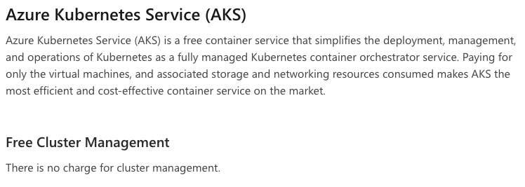
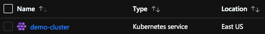
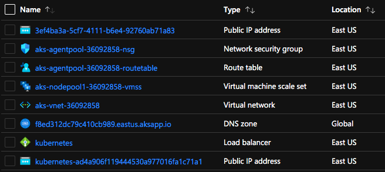

Desde os primórdios da computação distribuída e da chegada da cloud, todas as pessoas já tiveram que lidar, de alguma forma, com otimização de custos. Seja esta otimização em forma de redução de uso de espaço, ou até mesmo em redução de tráfego de rede!

Uma das ferramentas mais caras quando falamos em computação distribuída é o **[Kubernetes](https://docs.microsoft.com/azure/aks/?WT.mc_id=blog-personal-ludossan)**. Isto é um pouco óbvio por dois motivos bastante simples:

1.  O [**Kubernetes**](https://docs.microsoft.com/azure/aks/?WT.mc_id=blog-personal-ludossan) trabalha é um cluster de máquinas
2.  Por ser um cluster, temos mais recursos para gerenciar

Infelizmente, este problema faz com que muitas soluções incríveis deixem de estar rodando em seu ambiente ideal, que é um ambiente distribuído e altamente escalável, para rodarem em ambientes menores por pura questão de custo.

Mas isso não precisa ser assim!

## Modelos de cobrança

Para entendermos como podemos otimizar os custos dentro de uma arquitetura cloud com computação distribuída – usando [Kubernetes](https://docs.microsoft.com/azure/aks/?WT.mc_id=blog-personal-ludossan) – primeiro precisamos entender os modelos de cobrança.

Cada cloud tem seu modelo de cobrança individual, aqui vamos trabalhar somente com o [**AKS**](https://docs.microsoft.com/azure/aks/?WT.mc_id=blog-personal-ludossan) (Azure Kubernetes Service) que roda na [Microsoft Azure](https://azure.microsoft.com/?WT.mc_id=blog-personal-ludossan).

> Se você usa outro provedor cloud, busque no site do fornecedor o preço e as opções de cobrança para cada serviço oferecido. No entanto, as opções de otimização que vou mostrar por aqui servem para todas as clouds, claro, com algumas mudanças na linha de comando.



Como podemos ver, no caso do [AKS](https://docs.microsoft.com/azure/aks/?WT.mc_id=blog-personal-ludossan), a cobrança é feita somente pelos recursos utilizados, sendo que o o gerenciamento do cluster como um todo não possui nenhuma cobrança extra. Isso quer dizer que, em uma arquitetura [Kubernetes](https://docs.microsoft.com/azure/aks/?WT.mc_id=blog-personal-ludossan) padrão, o que chamamos de **Control Plane**, ou o plano de controle onde todos os recursos de sistema são criados, não é cobrado. Ao invés disso, todos os demais recursos que o [Kubernetes](https://docs.microsoft.com/azure/aks/?WT.mc_id=blog-personal-ludossan) usa para poder funcionar são.

Esta é uma prática bastante comum em vários provedores cloud. Alguns outros provedores cobram também pela alocação do control plane, geralmente porque não são totalmente gerenciados e abrem espaço para que as pessoas que os administram possam modificar uma parte do seu conteúdo, ou seja, oferecem uma capacidade maior de customização.

E quais recursos seriam estes?

## Recursos de cobrança

No geral, criar um cluster [Kubernetes](https://docs.microsoft.com/azure/aks/?WT.mc_id=blog-personal-ludossan) exige uma série de pequenos recursos que vão desde [máquinas virtuais](https://azure.microsoft.com/services/virtual-machines/?WT.mc_id=blog-personal-ludossan) – que suportam os nodes – até interfaces de rede e controladores de tráfego. Dependendo do tipo de funcionalidades que você está escolhendo para seu cluster, você pode ter zonas de DNS e outros recursos nessa lista.

No caso do [AKS](https://docs.microsoft.com/azure/aks/?WT.mc_id=blog-personal-ludossan), quando criamos um cluster, selecionamos o que é chamado de **Resource Group**. Neste resource group, a Azure irá criar um recurso de controle chamado **Kubernetes Service**, como podemos ver a seguir:



Porém, aonde estão todos os recursos cobrados que falei no início do parágrafo? Para isto, por conta de gerenciamento interno, a Azure cria um outro resource group que começa com o nome `MC_<resource-group>-<cluster>_<região>`. E nele serão colocados todos os recursos cobrados:



Veja que temos oito recursos diferentes, porém podemos ser cobrados por mais que isto porque o que é chamado de `Virtual Machine Scale Set` é, na verdade, uma lista de [VMs](https://azure.microsoft.com/services/virtual-machines/?WT.mc_id=blog-personal-ludossan) que podem ser escaladas de acordo com o precisamos.

## Otimizando custos com AKS

Para construir este artigo, estou usando como base um excelente material disponibilizado **gratuitamente** no Microsoft Learn. O curso "[Otimização de Custos com AKS e Node Pools](https://docs.microsoft.com/learn/modules/aks-optimize-compute-costs?WT.mc_id=blog-personal-ludossan)".

> Neste artigo, vamos passar pelo material completo, porém vou dar alguns exemplos fora do contexto e explicar algumas coisas além do que está sendo mostrado. Porém, é fortemente recomendado que você complete o módulo, ele é gratuito e leva apenas alguns minutos.

### Criando o ambiente

Para começar, vamos precisar de três itens importantes:

1.  Você precisa ter o [Azure CLI instalado em sua máquina](https://docs.microsoft.com/cli/azure/install-azure-cli?view=azure-cli-latest&WT.mc_id=blog-personal-ludossan)
2.  Você precisa ter o [Kubectl instalado em sua máquina](https://docs.microsoft.com/cli/azure/aks?view=azure-cli-latest&WT.mc_id=blog-personal-ludossan#az-aks-install-cli)
3.  Você precisa ter uma [conta na Azure](https://azure.microsoft.com/free/?WT.mc_id=blog-personal-ludossan)

Como uma segunda opção, **se você já tiver uma conta na Azure**, você pode entrar no [Azure Cloud Shell](https://shell.azure.com/?WT.mc_id=blog-personal-ludossan) e rodar todos os comandos por lá, pois o Cloud Shell já possui tanto o Azure CLI quando o Kubectl instalados. Se for a sua primeira vez usando o Cloud Shell, então selecione o **Bash** como shell principal.

Execute o comando a seguir para habilitar o modo de _preview_ no seu CLI da Azure:

```shell
az extension add --name aks-preview
```

Depois execute o seguinte comando para registrar as funcionalidades de permissão que vamos precisar:

```shell
az feature register --namespace "Microsoft.ContainerService" --name "spotpoolpreview"
```

Este comando demora alguns minutos para rodar, para checar o progresso, rode periodicamente o comando abaixo:

```shell
az feature list -o table --query "[?contains(name,'Microsoft.ContainerService/spotpoolpreview')].{Name:name,State:properties.state}"
```

Enquanto o resultado desta query for `Registering`, aguarde até que seja `Registered`. Uma vez registrado, rode o comando para atualizar o CLI:

```shell
az provider register --namespace Microsoft.ContainerService
```

## Node Pools

Antes de podermos partir para a criação do nosso cluster, precisamos entender o que são as chamadas [**Node Pools**](https://docs.microsoft.com/azure/aks/use-multiple-node-pools?WT.mc_id=blog-personal-ludossan), elas serão essenciais para podermos economizar durante o uso do AKS.

Basicamente, uma [Node Pool](https://docs.microsoft.com/azure/aks/use-multiple-node-pools?WT.mc_id=blog-personal-ludossan) descreve um grupo de _nodes_ do Kubernetes que compartilham características em comum.

Por exemplo, podemos ter _nodes_ que são VMs específicas para Machine Learning, ou então aqueles que possuem mais memória. O objetivo das [Node Pools](https://docs.microsoft.com/azure/aks/use-multiple-node-pools?WT.mc_id=blog-personal-ludossan) é justamente permitir que as pessoas que estejam operando o cluster possam ter uma opção de escolha para criar suas aplicações na infraestrutura que for mais adequada para o tipo de trabalho que está sendo realizado.

No [AKS](https://docs.microsoft.com/azure/aks/?WT.mc_id=blog-personal-ludossan), temos dois tipo de [Node Pools](https://docs.microsoft.com/azure/aks/use-multiple-node-pools?WT.mc_id=blog-personal-ludossan).

### System Node Pools

São criadas automaticamente com o cluster e, geralmente, servem para armazenar pods e deployments do sistema do AKS e do Kubernetes no geral. Não é uma boa prática executar workloads personalizados usando a mesma [node pool](https://docs.microsoft.com/azure/aks/use-multiple-node-pools?WT.mc_id=blog-personal-ludossan). Todo o cluster do [AKS](https://docs.microsoft.com/azure/aks/?WT.mc_id=blog-personal-ludossan) deve conter pelo menos uma [Node Pool](https://docs.microsoft.com/azure/aks/use-multiple-node-pools?WT.mc_id=blog-personal-ludossan) de sistema com pelo menos um _node_.

### User Node Pools

Como podemos imaginar, são os grupos de _nodes_ criados pelo usuário. Nestas pools temos algumas configurações interessantes, já que podemos especificar tanto Windows como Linux para as máquinas que são executadas, e também podemos alocar máquinas de tamanhos e categorias diferentes das do que foram definidas no [AKS](https://docs.microsoft.com/azure/aks/?WT.mc_id=blog-personal-ludossan)

### Capacidade de execução

Cada _node_ tem uma capacidade máxima de execução de pods, ou seja, conseguimos colocar uma quantidade máxima de pods dentro de uma VM antes que seus recursos sejam esgotados. Por isso, você pode especificar a quantidade de _nodes_ dentro de uma pool até um limite de 100.

Em pools de usuário você pode setar a quantidade de _nodes_ para zero, enquanto em pools de sistema o número mínimo é um.

### Criando uma Node Pool

Você pode criar uma nova pool em um cluster existente usando o [Azure CLI](https://docs.microsoft.com/cli/azure/?view=azure-cli-latest&WT.mc_id=blog-personal-ludossan) com o seguinte comando:

```bash
az aks nodepool add \
  -g <resource-group> \
  --cluster-name <nome do cluster> \
  --name <nome da pool> \
  --node-count <numero de nodes> \
  --node-vm-size <tamanho e tipo da VM> \
```

## Escalabilidade

Quando um _node_ atinge a sua capacidade máxima de execução, ou seja, quando já colocamos o número máximo de pods possível dentro daquela máquina, temos de aumentar – ou escalar – o número de _nodes_ dentro da pool. Isso pode ser feito de forma manual, através do comando a seguir:

```bash
az aks nodepool scale \
  -g <resource-group> \
  --cluster-name <nome do cluster> \
  --name <nome da pool> \
  --node-count <novo numero de nodes>
```

A escalabilidade é uma das principais razões pelo qual seu cluster pode custar bem caro. Principalmente porque quanto mais máquinas, mais recursos. E, quanto mais recursos estamos usando, mais vamos ter que pagar. Por isso é altamente recomendável utilizarmos formas automáticas de escalar nossas pools, a principal delas é o [Cluster Autoscaler](https://docs.microsoft.com/azure/aks/cluster-autoscaler?WT.mc_id=blog-personal-ludossan).

### Cluster autoscaler

Escalabilidade deve ser algo automático, pois é muito mais seguro e também economiza muito mais dinheiro porque ele sempre vai aumentar a quantidade de _nodes_ quando for necessário e vai reduzir a quantidade de nodes quando estes nodes não precisarem mais serem utilizados. Você pode ativar o [autoscaler](https://docs.microsoft.com/azure/aks/cluster-autoscaler?WT.mc_id=blog-personal-ludossan) em um cluster existente através do comando:

```bash
az aks update \
  -g <resource-group> \
  -n <nome do cluster> \
  --enable-cluster-autoscaler \
  --min-count <minimo de nodes> \
  --max-count <maximo de nodes>
```

## Spot Instances com Node Pools

Uma das formas mais eficientes de se economizar dinheiro enquanto estamos utilizando instâncias do [AKS](https://docs.microsoft.com/azure/aks/?WT.mc_id=blog-personal-ludossan) é através do uso de múltiplas [node pools](https://docs.microsoft.com/azure/aks/use-multiple-node-pools?WT.mc_id=blog-personal-ludossan) com as chamadas [Spot Instances](https://docs.microsoft.com/azure/virtual-machines/spot-vms?WT.mc_id=blog-personal-ludossan).

### Spot VMs

As [VMs do tipo Spot](https://docs.microsoft.com/azure/virtual-machines/spot-vms?WT.mc_id=blog-personal-ludossan) são máquinas virtuais que oferecem todos os recursos de escalabilidade que uma VM normal teria, mas ainda sim reduzindo os custos através do uso de **computação excedente**. Isso significa que as [Spot VMs](https://docs.microsoft.com/azure/virtual-machines/spot-vms?WT.mc_id=blog-personal-ludossan) usam poder computacional que não está sendo utilizado pela Azure no momento, garantindo descontos significativos no preço das mesmas.

Porém, isso tudo vem com um preço. As [Spot Instances](https://docs.microsoft.com/azure/virtual-machines/spot-vms?WT.mc_id=blog-personal-ludossan), por se aproveitarem de poder computacional não utilizado, **podem ser desativadas ou interrompidas a qualquer momento**. Isso significa que, durante o uso da VM, você terá uma notificação 30 segundos antes da máquina ser desalocada, depois deste tempo a máquina entrará em um estado de desalocação e sua computação será parada abruptamente.

Por este motivo, as [Spot VMs](https://docs.microsoft.com/azure/virtual-machines/spot-vms?WT.mc_id=blog-personal-ludossan) são muito boas quanto utilizamos aplicações que não guardam estado e podem ser interrompidas a qualquer momento, reiniciando seus processos sempre que for necessário. Alguns casos de uso:

-   Processamento batch
-   Aplicações stateless
-   Ambientes de desenvolvimento
-   Pipelines de CI e CD

### Juntando forças

Utilizar [Spot VMs](https://docs.microsoft.com/azure/virtual-machines/spot-vms?WT.mc_id=blog-personal-ludossan) com node pools dá um grande poder para economizar um bom dinheiro na hora de processar dados de larga escala. Principalmente porque, quando usamos [Spot VMs](https://docs.microsoft.com/azure/virtual-machines/spot-vms?WT.mc_id=blog-personal-ludossan) com node pools, temos a capacidade de escolher entre duas políticas de desalocação:

-   **Desalocar**: Quando a política é definida como desalocação, a máquina será parada e desalocada quando a VM chegar a um estado que não há mais poder computacional. Você pode fazer o deploy dela novamente quando a capacidade voltar a estar disponível, mas lembre-se de que todos os custos de alocação de CPU e discos continuam sendo contados.
-   **Deletar**: Neste caso, a máquina será completamente removida e você não irá pagar por mais nenhum recurso consumido.

## Spot Node Pools

As [Spot Node Pools](https://docs.microsoft.com/azure/aks/spot-node-pool?WT.mc_id=blog-personal-ludossan) permitem que você defina um valor máximo por hora para pagar, quando o valor for atingido, a máquina será desalocada ou removida, de acordo com a política selecionada.

> Apesar de garantirem uma redução de custos. [Spot node pools](https://docs.microsoft.com/azure/aks/spot-node-pool?WT.mc_id=blog-personal-ludossan) não são recomendadas para nenhum tipo de workload muito importante, pois a disponibilidade da mesma não é garantida.

Para criarmos uma [spot node pool](https://docs.microsoft.com/azure/aks/spot-node-pool?WT.mc_id=blog-personal-ludossan), podemos utilizar o seguinte comando:

```bash
az aks nodepool add \
  -g <resource-group> \
  --cluster-name <nome do cluster> \
  --name <nome da pool> \ 
  --enable-cluster-autoscaler \
  --min-count <numero minimo de nodes> \
  --max-count <numero maximo de nodes> \
  --priority Spot \
  --eviction-policy Delete \
  --spot-max-price -1 \
```

Quando setamos o valor do preço por hora para `-1`, os _nodes_ não vão ser removidos com base no preço e as novas instâncias criadas serão baseadas no menor valor entre o valor atual das spot VMs ou então o valor padrão de um _node_

### Criando recursos na nova pool

Para criarmos recursos nas nossas [spot node pools](https://docs.microsoft.com/azure/aks/spot-node-pool?WT.mc_id=blog-personal-ludossan), precisamos saber o conceito de [Taints e Tolerations](https://kubernetes.io/docs/concepts/scheduling-eviction/taint-and-toleration/) do Kubernetes (vamos ter um artigo aqui sobre isso logo mais). E também o conceito de [Node Affinity](https://kubernetes.io/docs/concepts/scheduling-eviction/assign-pod-node/).

Em suma, cada _node_ tem uma _taint_. Essas _taints_ repelem novos pods de serem criados nesses _nodes_ a não ser que estes pods tenham uma _toleration_ àquela _taint_ específica. É uma forma de escolher em qual VM suas aplicações serão criadas.

Por padrão, todos os nodes criados dentro de uma [spot node pool](https://docs.microsoft.com/azure/aks/spot-node-pool?WT.mc_id=blog-personal-ludossan) terão um _taint_ do tipo `kubernetes.azure.com/scalesetpriority=spot:NoSchedule`, isso significa que, a não ser que o pod tenha uma _toleration_ do mesmo tipo, nenhum outro pod poderá sofrer um `schedule` naquele _node_.

Para que possamos criar um pod – ou qualquer outro workload – dentro de um _node_ que está presente em uma [spot node pool](https://docs.microsoft.com/azure/aks/spot-node-pool?WT.mc_id=blog-personal-ludossan), precisamos definir uma nova _toleration_ no arquivo declarativo do pod, por exemplo:

```yaml
apiVersion: v1
kind: Pod
metadata:
  name: example-pod
  labels:
    env: example
spec:
  containers:
  - name: example
    image: node
    imagePullPolicy: IfNotPresent
  tolerations:
  - key: "kubernetes.azure.com/scalesetpriority"
    operator: Equal
    value: spot
    effect: NoSchedule
```

Veja que definimos um operador para que ele seja igual a _taint_ do _node_ em questão, portanto novos pods serão criados neste _node_.

## Conclusão

Apesar de ser um trabalho extenso, o uso de [spot node pools](https://docs.microsoft.com/azure/aks/spot-node-pool?WT.mc_id=blog-personal-ludossan) pode ser um salvador de vidas em termos de recursos quando estamos trabalhando com otimização de custos no [AKS](https://docs.microsoft.com/azure/aks/?WT.mc_id=blog-personal-ludossan), mas lembre-se sempre que as máquinas do tipo spot não são máquinas que garantem alta disponibilidade!

Recomendo fortemente a leitura da documentação sobre a [baseline de otimização de custos](https://docs.microsoft.com/azure/architecture/reference-architectures/containers/aks/secure-baseline-aks?WT.mc_id=blog-personal-ludossan#cost-optimization) do AKS, uma documentação incrível sobre como você pode definir polícias e melhores práticas para clusters AKS em produção

Neste artigo falamos bastante sobre conceitos mais avançados do Kubernetes, como _taints_ e _tolerations_. Estou preparando um artigo somente sobre estes conceitos e também sobre uma outra ferramenta super interessante desse orquestrador de containers, então não se esqueça de se inscrever na newsletter para receber esse conteúdo e também notícias semanais! Curta e compartilhe seus feedbacks nos comentários!

Até mais
