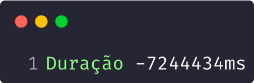

Measuring time is something we do all the time, whether we're walking down the street or waiting for an important meeting. Since time is such an important part of our lives, it's only natural that it matters just as much when we're writing code.

The idea for this article came up when I noticed some inconsistencies in time measurement using our beloved `Date.now`, the most standard way to measure time in a JavaScript application.

While I was looking for alternatives to measure time in Node.js, I came across [this fantastic article](https://blog.insiderattack.net/how-not-to-measure-time-in-programming-11089d546180) by Deepal about how this method can be quite problematic. You'll probably run into some of these cases only rarely in your life, but it's still worth understanding what's going on behind an action as simple as measuring time.

## Measuring time

Historically, the standard method for measuring time in electronic systems is counting seconds since January 1st, 1970, known as the **Unix timestamp**.

While today the **Unix Epoch**, as it's called, is widely used by most programming languages and OSes around the world, there are [at least 12 other ways to count time](https://stackoverflow.com/a/26391999/4186093) that are far from small enough to ignore. I won't get into that whole story here though, at least not in this article.

The thing is, representing time as a count of seconds needs some kind of synchronization, because there are small irregularities in how processors count time.

Regular computers don't have a dedicated processor to count time, so the same core that's processing your Netflix show is also being used to count time on your machine. This is known as [_time sharing_](https://en.wikipedia.org/wiki/Time-sharing)_._ It was originally built to share CPU time between different users of a system, but later got implemented straight into Operating Systems under the name _[context switching](https://en.wikipedia.org/wiki/Context_switch)_.

The whole idea is that your processor is splitting its processing time between all the processes running on your system, so it can't give its undivided attention just to your clock. That's where we always run into a problem called **[clock drifting](https://en.wikipedia.org/wiki/Clock_drift#:~:text=Clock%20drift%20refers%20to%20several,causing%20eventual%20divergence%20unless%20resynchronized.)**.

## Clock Drifting

Clock drift is an old problem that happens in any system that needs a certain level of precision to run, everything from clocks to pendulums.

In computers and clocks specifically, clock drift is caused by the lack of precision in equipment like wristwatches, wall clocks, and so on. How many times have you had to adjust your wall clock because it was off from your phone's clock?

And this holds true even for computers, not just because of that difference in CPU time, but also because computers use quartz clocks to measure time locally. A quartz clock drifts by about 1 second every few days.

> In fact, clock drift in computers is widely used to build random number generators, because the clock's own drift is naturally random.

So where does programming fit into all this? Imagine we have some ordinary code like this:

```js
const inicio = Date.now()
// some operation here
const fim = Date.now()
console.log(fim - inicio)
```

The idea is that this works just fine, I've used this kind of code a lot myself, along with others like `console.time`, for example:

```js
console.time('contador')
// We do something
console.time('contador')
// something else
console.timeEnd('contador')
```

The problem is exactly that clock drift inside computers. If you need to sync some kind of time with another computer somewhere else in the world, or with another clock outside your own machine, you might get a result that's, let's say, curious.

As an example, let's imagine we have a clock that suffered some clock drift:

```js
const { setTimeout } = require('timers/promises')

const inicio = Date.now()

adiantarTempo() // Moving the clock forward 1 minute
await setTimeout(2000) // Simulating a 2s operation

const fim = Date.now()
console.log(`Duração ${fim - inicio}ms`)
```

If you run this code, you'll get an output similar to: `Duração 7244758ms`, in other words, 7 seconds, for an operation that should have taken 2...

> I'll include the code for this full test (with the code to move the clock forward) at the end of the article, so you can replicate the experiment too.

If we swap the two time lines

```js
import { setTimeout } from 'node:timers/promises'

adiantarTempo() // Moving the clock forward 1 minute

const inicio = Date.now()
await setTimeout(2000) // Simulating a 2s operation
const fim = Date.now()
console.log(`Duração ${fim - inicio}ms`)
```

We'll get the expected output of `Duração 2002ms`. So here we've learned that `Date.now` grabs the time as it currently stands on the system.

Now you're going to ask me: "But when does this happen without me forcing it?" And the answer is: **All the time**.

## NTP - Network Time Protocol

To fix the clock drift problem in computers, there's NTP, a universal time transmission protocol. Basically it's a server that listens for requests and responds with the current time, adjusted using an atomic clock, which is far more precise.

The problem is that we have no control over NTP, it's implemented by the OS to sync the local clock with a central clock whenever there's some apparent clock drift. In other words, the OS will automatically correct the clock several times a day, even without you noticing.

So now let's do the opposite example;

```js
import { setTimeout } from 'node:timers/promises'

adiantarTempo() // Moving the clock forward 1 minute
const inicio = Date.now()
setImmediate(() => corrigeNTP()) // Fixes the time via NTP
await setTimeout(2000) // Simulating a 2s operation
const fim = Date.now()
console.log(`Duração ${fim - inicio}ms`)
```

And now we get a **NEGATIVE** result, without us having to do anything. You can already see where the problem might crop up, right?



If we're measuring time while the computer runs an NTP correction, we're in for a big problem, because our measurements are going to be completely inconsistent.

> An interesting thing to note is that the time we see in the output is exactly the time of the NTP correction

## Monotonic clocks

The solution to this problem is a **monotonic clock**, which is simply a counter that starts at some arbitrary point in time (in the past) and moves toward the future at the same rate as the system clock. In other words, a counter.

Since it's just a counter, obviously the only use we have for this kind of feature is counting the difference between two intervals, but the important part is that, precisely because it's not used to tell the actual time, it's not affected by NTP. So any difference between two points on a monotonic clock will always be a positive integer, smaller than the end value and larger than the start value.

Most languages have functions to handle both regular clocks and counters like these, and Node.js is no different. We can use `require('perf_hooks').performance.now()` and `process.hrtime.bigint()` (or `process.hrtime()` on older versions).

Let's use the same code, except instead of `Date.now`, we'll switch to using the `perf_hooks` counter:

```js
import { setTimeout } from 'node:timers/promises'
import { performance } from 'node:perf_hooks'

adiantarTempo() // Moving the clock forward 1 minute
const inicio = performance.now()
setImmediate(() => corrigeNTP()) // Fixes the time via NTP
await setTimeout(2000) // Simulating a 2s operation
const fim = performance.now()
console.log(`Duração ${fim - inicio}ms`)
```

And we get the output we expect, 2000 milliseconds:


Keep in mind that `setTimeout` and `setImmediate` themselves are subject to small delays because of what happens in the [Node.js Event Loop](https://dev.to/_staticvoid/node-js-por-baixo-dos-panos-3-um-mergulho-no-event-loop-38l9), hence the difference.

## Conclusion

Now that you know we can run into problems using `Date.now`, you also know there's another solution for counting durations between scripts! Use `perf_hooks` to avoid the NTP issues and everything else I've covered here.

Keep in mind that [Deepal's article](https://blog.insiderattack.net/how-not-to-measure-time-in-programming-11089d546180#:~:text=Experiment%203%20%E2%80%94%20Comparison) also has a really cool third experiment where you can compare the results of the other two experiments together, it's worth checking out!

Another **fantastic** resource is this [talk by Dr. Martin Kleppmann about clock drift in distributed systems](https://www.youtube.com/watch?v=mAyW-4LeXZo), which is totally worth your time.

I'll wrap it up here. If you want to know more about the code I used to generate these examples and replicate what I did on your own machine, keep reading into the article's appendix!

Catch you later!

### Appendix

Before I share the code, a few notes:

-   This code only works on macOS, but feel free to modify it to run on Linux
-   You'll probably need to use `sudo`
-   You need a Node version compatible with [ESModules](/os-ecmascript-modules-estao-aqui/) (>=12)
-   This is a more up-to-date version of the code found in the [article I mentioned](https://blog.insiderattack.net/how-not-to-measure-time-in-programming-11089d546180)

```js
import { execSync } from 'node:child_process'
import { setTimeout } from 'node:timers/promises'
import { performance } from 'node:perf_hooks'

function adiantarTempo () {
  const toTwoDigits = (num) => num.toString().padStart(2, "0")
  const now = new Date()
  const month = toTwoDigits(now.getMonth() + 1)
  const date = toTwoDigits(now.getDate())
  const hours = toTwoDigits(now.getHours())
  const fakeMinutes = toTwoDigits(now.getMinutes() + 1)
  const year = now.getFullYear().toString().substring(2, 4)

  // executes the OS command
  execSync(`date -u ${month}${date}${hours}${fakeMinutes}${year}`)
}

function correcaoNTP () {
  const output = execSync(`sntp -sS time.apple.com`)
  console.log(`Tempo corrigido: ${output}`)
}

const esperar2Segundos = () => setTimeout(2000)

// ------- Experiment 1: Regular clocks
{
  adiantarTempo()
  const timeNow = Date.now()

  setImmediate(() => correcaoNTP())

  await esperar2Segundos()

  const endTime = Date.now()
  const duration = endTime - timeNow
  console.log(`Duração\t: ${duration}ms`)
}

// ------- Experiment 2: Monotonic clocks
{
  adiantarTempo()
  const timeNow = performance.now()

  setImmediate(() => correcaoNTP())

  await esperar2Segundos()

  const endTime = performance.now()
  const duration = endTime - timeNow
  console.log(`Duração\t: ${duration}ms`)
}
```
