We're getting to the end of our TypeScript content week, and most of what we've covered so far has been about how we tie our types to our code, in other words, how we can add more safety when running our application in production.

> But what if we used TS's type system on its own?

There are [several projects](https://www.learningtypescript.com/articles/extreme-explorations-of-typescripts-type-system) that take TS's type system to the extreme just to see what can be built with it. There was the RPG I mentioned on day one, but there's also someone who implemented [TypeScript in TypeScript](https://github.com/ronami/HypeScript), or even an emulation of a [4-bit virtual machine](https://gist.github.com/acutmore/9d2ce837f019608f26ff54e0b1c23d6e) using nothing but types. This is what we call **Type-Level Programming**, or as I've seen it called a lot around the internet, **Type-Level Programming.**

This is a concept I first ran into in an [excellent piece by Gabriel Vergnaud](https://type-level-typescript.com), and it basically means using TS's types to program instead of using a traditional programming language. As I mentioned, TS is Turing-complete, so we can write any kind of program with any level of complexity using it.

The idea behind this concept is that we need to separate what's Type-Level programming from what's called **Value-Level Programming**, which is the kind of programming we're more used to, with ifs, fors, and so on. All of these structures exist in TypeScript too, just implicitly. For example, we can build an if like this:

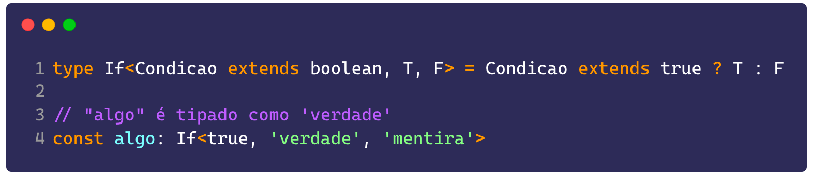

That's actually the implementation of the `if` keyword itself, but we can build a more generic if with what's called **conditional types**. For example, if we want a function to return one type when a given parameter is of a certain type:

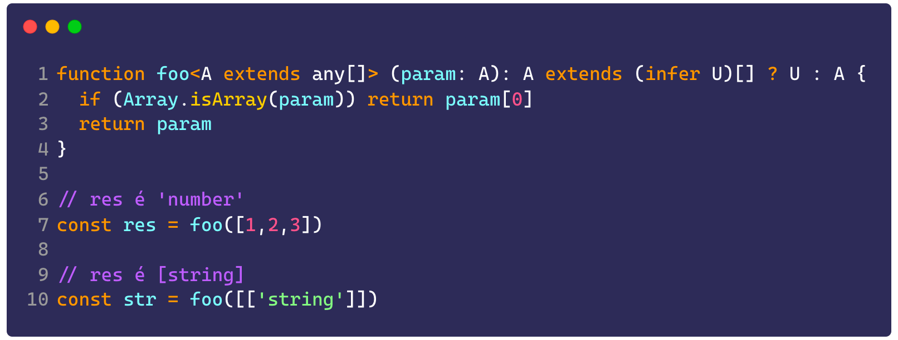

## Beyond typing

But way beyond that, we can build entire systems using only types, especially when they're about logic. That means we can code logic gates like **and, or, xor, and not** using nothing but types, and from those we can build other, more complex structures.

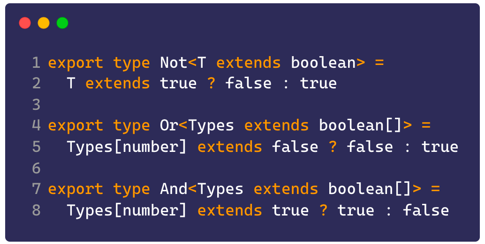

To implement an XOR gate we need one more type, one that checks equality between two types, since XOR only returns true when the two types being compared are different from each other:

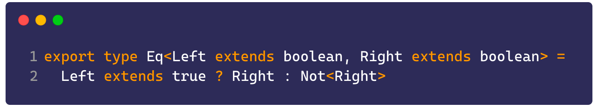

Since we're only comparing two boolean values, we can just return the right side of the expression. So to build an XOR, we can combine the other gates and return true only if the two types are not equal:

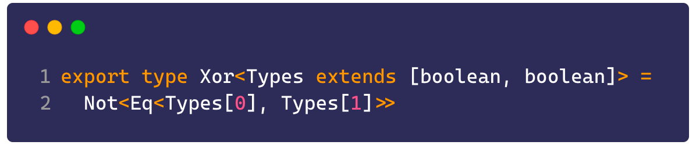

Interesting, right? This is actually a snippet from a library called [expect-type](https://github.com/mmkal/expect-type/blob/main/src/index.ts#LL5-L5C80), which is built specifically to write type tests following the same model we use to test regular code.

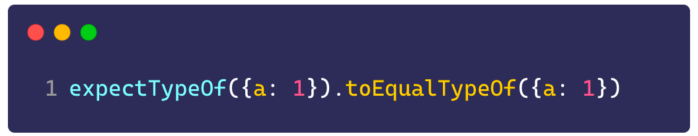

As we saw before in the chapter about type declarations, it's important not only to test the code but also to test its types, mainly to make sure a function is responding correctly and that we've covered every possible case. This [article](https://developers.mews.com/why-we-should-all-be-testing-our-typescript-types/) does a great job showing the main advantages of testing a type.

That's the kind of power types can offer us, the ability to build pretty much any application, we just need a bit of creativity.

Also notice that most of our calls are chaining functions inside one another, and that's how most executions in type-oriented programming tend to work.

## Going further

As an example, we can borrow an idea from [this amazing article](https://itnext.io/implementing-arithmetic-within-typescripts-type-system-a1ef140a6f6f) by Ryan Dabler, where we can implement arithmetic in TypeScript. How we go about it can vary, but it's pretty creative.

First, we need to know how to work with list types, like arrays and tuples, since that's how we're going to extract variable numbers out of our types. To do that we'll make use of a neat TypeScript feature that lets us pull the direct value of a property off an object, so we can grab the `length` property of an array, for example:

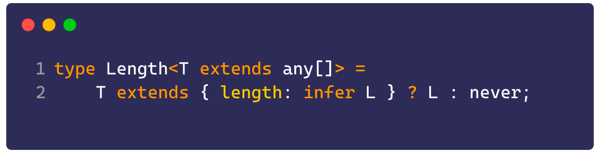

What we're doing here is using the `infer` keyword to infer the literal type of a value. In this case we're grabbing the length property of an array, which is a number, and now we can create and tweak a literal value however we need.

Next we'll create a type that's recursive, meaning we'll build a recursive loop that constructs an array based on the size we pass in:

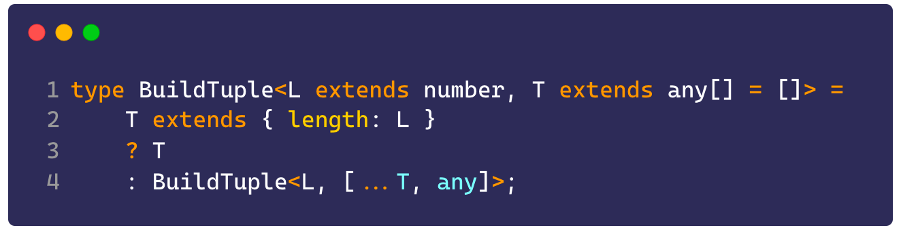

What happens is that if we run something like `type valores: BuildTuple<3>` we'll get a `[any, any, any]` type. In other words, a tuple with 3 elements. This type could be described as the following function:

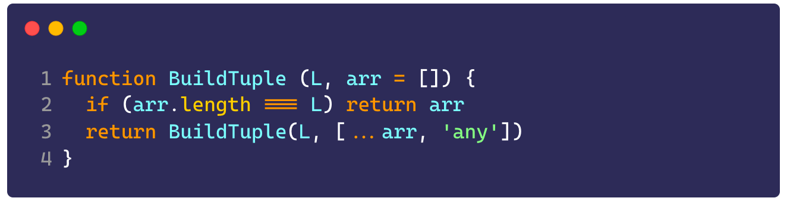

From there we can build basic types, like addition, which comes down to taking two values and returning a new tuple with the combined size of both:

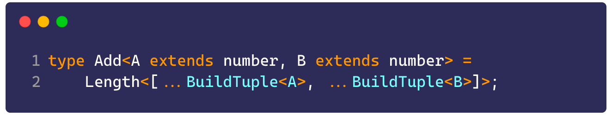

Essentially this operation concatenates two arrays and returns the size of both. If we put it in perspective, the function would look like this:

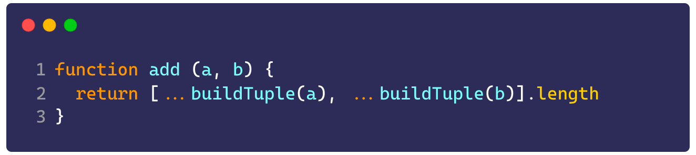

As I mentioned, we need to be creative, since TypeScript can't add or perform any direct operation on its own, we need to find a way to bolt that functionality on. Unfortunately, because of TS's own limitations, we can't work with negative numbers at all, which means our subtraction operation would end up looking like this:

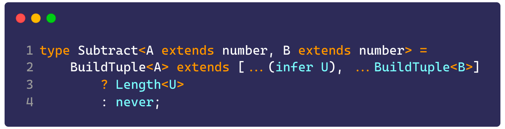

Basically we're returning the value of the first tuple, which means we need the first number to be bigger than the second.

## In the real world

These projects are interesting studies for pushing the type system to its limits, but that doesn't mean we're going to use these structures in a real application, or at least it'll be a rare case.

That said, the concepts we've covered here are extremely useful to have in your utility belt. Things like:

-   Infer
-   Conditional types
-   Recursive loops
-   Generics
-   Tuples and arrays

Are extremely useful for building advanced usage patterns with TypeScript. If you're up for studying them a bit more, stick around because there's more coming soon!

## For you to practice

Since this is the last article of our TS week, I decided to make it a bit shorter so you can go enjoy your Friday!

Since we won't have an exercise in this edition, let's fix the last exercise we had!

To declare new functionality on a global function we can use the `declare` keyword we saw on day two. If we declare a function with the same name and a different signature, we'll be creating a type augmentation for a global method, like this:

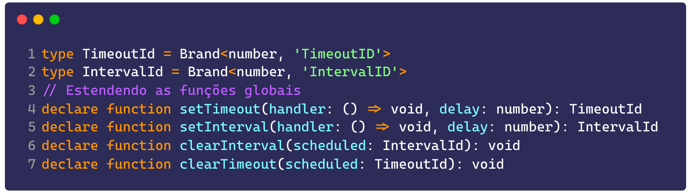

Now that we have our brands and our functions defined, we can test our call like this:

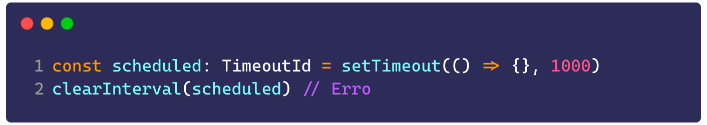

## It's not over yet

First off, thank you so much for following along this far, and I hope you enjoyed the content! Don't forget to leave feedback in the form below! But it'd be a shame if it ended here, wouldn't it?

So that's why, if you help me share and spread the word about this content week (tag me on [twitter](https://twitter.lsantos.dev) or on other [social networks](http://lsantos.dev)), I'll write a sixth article focused specifically on TypeScript's tools and ecosystem, coming out on Monday (we've got to enjoy the weekend too!), so help me out there!

> Don't forget to leave your feedback about #SemanaTS in [this form](https://forms.gle/6hAqjVmah9uyR4by8)!
