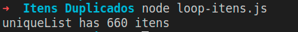
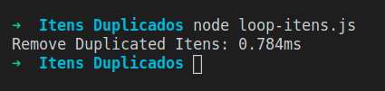
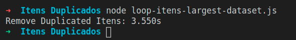
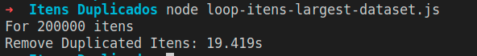
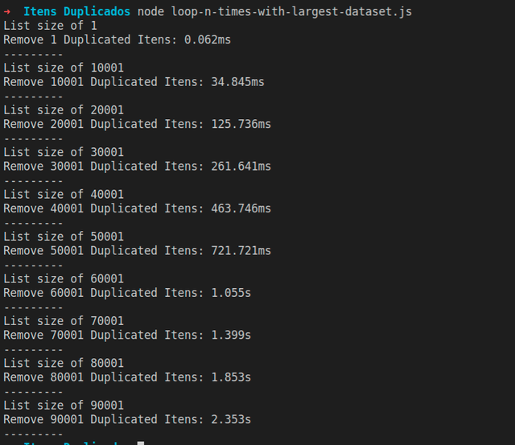
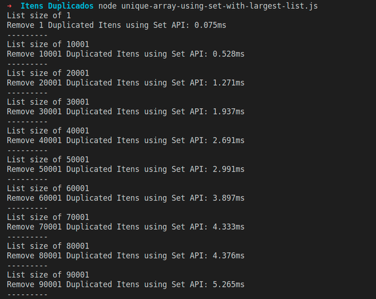
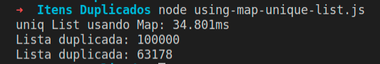

I think everyone, just like me, has had to remove duplicate items from an Array list at some point. But is the way we learned actually the best one?

In this article I'll show you my point of view, the way I found to remove duplicate items from a list with over 1,000,000 items in my day to day at [@squidit](https://squidit.com.br/), whether the array holds primitive types or not.

## The common way

I believe the most common way we know is looping through an Array and checking, on every iteration, whether that item is already in the new array or not.

```js
//  loop-itens.js
/**
 * @desc Generates an array of size N with random numbers, respecting N
 * @param {number} length 
 */
function generateRandomArray(length) {
  return Array.from(Array(length), () => parseInt(Math.random() * length));
}

const randomList = generateRandomArray(1000) // An array with 1000 random numbers
const uniqueList = [] // List for the unique array

for(const value of randomList) {
  //  If the value isn't in uniqueList, add it
  if (!uniqueList.includes(value)) uniqueList.push(value)
}
console.log(`uniqueList has ${uniqueList.length} itens`)
```

Which produces the following output:



This might even work fine for a small list of a few thousand items.

If we use `console.time` and `console.timeEnd` to check how long this operation takes, we'll see it's super fast.

```js
//  Rest of the code

console.time('Remove duplicated items') // We add
for(const value of randomList) {
  //  Check from the previous code...
}
console.timeEnd('Remove duplicated items')
```

Produces the following output:



What would happen if we happened to increase this dataset, say to a list with 100,000 items?

```js
//  Rest of the code ... 

// equals 10^5, which is the same as 100,000
const randomList = generateRandomArray(10 ** 5) 
const uniqueList = [] // List that will hold the unique items

console.time('Remove duplicated items')
for(const value of randomList) {
  //  If the value isn't in uniqueList, add it
  if (!uniqueList.includes(value)) uniqueList.push(value)
}
console.timeEnd('Remove duplicated items')
```

Produces the following output:



And if we increase it to 200,000, for example, the time already increases drastically.



## The problem

Using `for` or [.reduce](https://developer.mozilla.org/en-US/docs/Web/JavaScript/Reference/Global_Objects/Array/Reduce) the premise would still be the same:

-   Loop through the array.
-   Check whether the value exists in the new array.
-   Add it to the array.

For every iteration, you need to do a second iteration over `uniqueArray` to check whether the value is already in there. In programming, this is called `O(n)²`, where `n` dictates the number of operations your application will run. So the number of operations for this algorithm grows exponentially as the number of items grows.

Let's look at an example with the following code:

```js
// Rest of the code

// Loops 10 times, 10k at a time, up to 100k
for (let length = 1; length <= 100000; length += 10000) {
  // For each iteration, generates a new array.
  const randomList = generateRandomArray(length)
  const uniqueList = [] // List that will hold the unique items

  console.log(`List size of ${randomList.length}`)
  console.time(`Remove ${randomList.length} duplicated items`)
  for (const value of randomList) {
    // If the value isn't in uniqueList, add it
    if (!uniqueList.includes(value)) uniqueList.push(value)
  }
  console.timeEnd(`Remove ${randomList.length} duplicated items`)
  console.log('---------')
}
```

You can see the time growing exponentially when we print how long the operation takes to finish based on the number of items.



## Using Set

In JavaScript we have an object called [Set](https://developer.mozilla.org/en-US/docs/Web/JavaScript/Reference/Global_Objects/Set). It guarantees values are stored only once, meaning whenever we try to add a value that's already in the structure, that value won't be added.

```js
const set = new Set();

set.add(1) // [1]
set.add(2) // [1,2]
set.add(3) // [1,2,3]
set.add(2) // [1,2,3]

console.log(set) // Set(3) { 1, 2, 3 }
```

Set accepts objects too, but it won't remove duplicates among them because objects, as we know, are passed by reference in JavaScript:

```js
const set = new Set();

set.add({ a: 1, b: 2 }) // Object gets added [{}]
set.add({ a: 10, b: 20}) //  [{},{}]

// Even though the values are the same,
// the object is still different,
// because it's referenced 
// at a different memory address
set.add({a: 1, b: 2}) //  [{}, {}, {}]

console.log(set) // Set(3) { { a: 1, b: 2 }, { a: 10, b: 20 }, { a: 1, b: 2 } }
```

## Using Set to remove duplicates

When we use the [Set API](https://developer.mozilla.org/en-US/docs/Web/JavaScript/Reference/Global_Objects/Set) to remove duplicate items from an array, we notice the time difference between using Set and using a for loop.

```js
/**
 * @desc Generates an array of size N with random numbers, respecting N
 * @param {number} length 
 */
function generateRandomArray(length) {
  return Array.from(Array(length), () => parseInt(Math.random() * length));
}

// Loops 10 times, 10k at a time, up to 100k
for (let length = 1; length <= 100000; length += 10000) {
  // For each iteration, generates a new array.
  const randomList = generateRandomArray(length)

  console.log(`List size of ${randomList.length}`)
  console.time(`Remove ${randomList.length} duplicated items using Set API`)
  const uniqList = Array.from(new Set(randomList))
  console.timeEnd(`Remove ${randomList.length} duplicated items using Set API`)
  console.log('---------')
}
```

Produces the following output:



This happens because, unlike the loop, we still need to iterate over the array `n` times, but on each iteration the Set API guarantees we're adding a single unique value. And since the Set object implements the `iterable` interface, we can turn it into an `Array`.

```js
Array.from(new Set([1,2,3,4,1,2,3,4])) // Produces [1,2,3,4]
```

## Duplicates in a list of objects

In the real world we know lists aren't made up of primitive types only. So how would we handle objects?

Instead of using [Set](https://developer.mozilla.org/en-US/docs/Web/JavaScript/Reference/Global_Objects/Set), we use [Map](https://developer.mozilla.org/en-US/docs/Web/JavaScript/Reference/Global_Objects/Map) together with the Array API's [.reduce](https://developer.mozilla.org/en-US/docs/Web/JavaScript/Reference/Global_Objects/Array/Reduce) method. But for that I need to give you an overview of what Map is.

### Maps

The [Map](https://developer.mozilla.org/en-US/docs/Web/JavaScript/Reference/Global_Objects/Map) structure works as a key-value data structure, or a [HashTable](https://www.devmedia.com.br/hashmap-java-trabalhando-com-listas-key-value/29811), which, in short, is a list of key-value data where every item added has a related id, or `key`. That makes it possible to do a fast lookup using just the `key`, without needing to loop through the whole list to find the item.

```js
const map = new Map()

map.set(1, { a: 1, b: 2, b: 3 }) // Map(1) { 1 => { a: 1, b: 3 } }
console.log(map)

map.set(2, { a: 10, b: 20, c: 30 }) //  Map(2) { 1 => { a: 1, b: 3 }, 2 => { a: 10, b: 20, c: 30 } }
console.log(map)

// Overwrites the object at key 1.
map.set(1, { a: 100 }) // Map(2) { 1 => { a: 100 }, 2 => { a: 10, b: 20, c: 30 } }

map.get(1)  // { a: 100 }
map.get(2)  // { a: 10, b: 20, c: 30 }
map.get(3)  // undefined, because there's nothing at key 3
```

And of course, the key doesn't have to be a numeric value. It can be any type of data:

```js
const map = new Map()

map.set('samsung', ['S10', 'S20']) // Map(1) { 'samsung' => [ 'S10', 'S20' ] }

map.set('outro valor', [2, 3, 4, 5]) // Map(2) { 'samsung' => [ 'S10', 'S20' ], 'outro valor' => [ 2, 3, 4, 5 ] }
```

## Using Map to remove duplicate items

Now that we have an idea of how to use `Map`, we can take advantage of [.reduce](https://developer.mozilla.org/en-US/docs/Web/JavaScript/Reference/Global_Objects/Array/Reduce) to generate a unique array from a list with duplicates.

First, let's create a function that generates a list with the same object, varying only the id of each item.

```js
/**
 * @desc Generates a list with the same object,
 * where the id will be random
 * @param {number} length 
 */
function generateRandomObjectList(length) {
  const defaultObject = {
    name: 'Guilherme',
    developer: true
  }
  return Array.from(Array(length), () => {
    const randomId = parseInt(Math.random() * length)
    return {
      ...defaultObject,
      id: randomId
    }
  });
}
```

Now let's create a `Map` object from the generated array,  
where the `Map`'s id will be the user's id. That way we remove duplicate IDs from the list:

```js
const listObjectWithRandomId = generateRandomObjectList(10 ** 5) // 100k
const objectMap = listObjectWithRandomId.reduce((map, object) => {
  map.set(object.id, object);
  return map
}, new Map())
```

Since `Map` is also an iterable object, we just need to use the [Array.from](https://developer.mozilla.org/en-US/docs/Web/JavaScript/Reference/Global_Objects/Array/from) function:

```js
const uniqList = Array.from(objectMap, ([_, value]) => value)
```

The whole code would look like this:

```js
/**
 * @desc Generates a list with the same object,
 * where the id will be random
 * @param {number} length 
 */
function generateRandomObjectList(length) {
  const defaultObject = {
    name: 'Guilherme',
    developer: true
  }
  return Array.from(Array(length), () => {
    const randomId = parseInt(Math.random() * length)
    return {
      ...defaultObject,
      id: randomId
    }
  });
}

const listObjectWithRandomId = generateRandomObjectList(10 ** 5) // 100k

console.time('uniq List usando Map') // To measure how long the operation takes
const objectMap = listObjectWithRandomId.reduce((map, object) => {
  map.set(object.id, object);
  return map
}, new Map())

const uniqList = Array.from(objectMap, ([_, value]) => value)
console.timeEnd('uniq List usando Map')
console.log(`Lista duplicada: ${listObjectWithRandomId.length}`)
console.log(`Lista duplicada: ${uniqList.length}`)

```



## Conclusion

Even though libraries like [lodash](https://lodash.com/) have functions to remove duplicate items, importing an entire library to solve a problem you can solve with a few lines of native code ends up being unnecessary.
