_Photo by <a href="https://unsplash.com/@trommelkopf?utm_source=unsplash&utm_medium=referral&utm_content=creditCopyText">Steve Harvey</a> on <a href="https://unsplash.com/s/photos/broadcast?utm_source=unsplash&utm_medium=referral&utm_content=creditCopyText">Unsplash</a>_

In the previous articles that I've written about HarperDB, we've explored the realms of [Kubernetes](https://medium.com/@khaosdoctor/using-harperdb-with-kubernetes-e796ea606e99), and [Helm](https://faun.pub/running-harperdb-in-kubernetes-in-one-command-8c87e2788eb6). Now it's time to step back a little and try to understand another cool feature that it offers in this short and straight-to-the-point article.

Let's imagine we work for a company that provides business intelligence on productive processes for big factories across the world and you're launching a new product; Intelligent factories! To do that, the factories would be equipped with the most varied types of sensors that monitor several of the machines' key properties, like pressure, temperature, and weight put on it. 

The problem is that all this data needs to be sent back to the company's main servers so we can apply our machine learning models and big data analysis on top of them. And they've asked you to provide a nice architecture to make it happen. The process has a few rules:

* The sensors send data at a very fast rate, so sending them as you receive would not be wise as it would clutter the network, making data streaming a sub optimal solution.
* The data should be stored in a database at the company in raw format.
* The sensors will keep sending data even in case of a network failure. You need to sync that data with the company's servers as soon as the network returns.
* The company must be able to send configurations to the sensors installed in the customers from the HQ, without the need for a local visit.

How can you perform all these tasks with the minimum amount of effort and using the best technology? Enters **HarperDB clusters**.

## Clusters

When we say clusters, the base idea that comes to us is something like Kubernetes, right? A bunch of virtual machines that behave as a single, big one. However, HarperDB takes this idea a step further. Since we're talking about a database, the concept of "work as one" boils down to having the same data in all instances eventually, and this is, in fact, the concept of a cluster of databases.

However, in other DBs, all the data will be replicated across the whole cluster no matter what, they'll be identical eventually, then why can't you choose which data you want to sync?

When you cluster two or more instances of a HarperDB database together, they'll ask you which data you wish to share, this is called a **subscription**. So, basically, what HarperDB has is a very robust and fancy implementation of a publish/subscribe model that works at the table level and has a fault-tolerant mechanism that allows it to lose the connection at any given time and automatically re-synchronize the data once it's back up.

### How do clusters work?


I won't extend myself in this part as HarperDB has a [very nice documentation about it](https://harperdb.io/docs/clustering/), but the idea is that each database composes a **node** in the cluster, and the whole group of nodes in a cluster and their configurations is called a **topology**.

To send and receive data, the nodes rely on **channels**, which are named as `schema:table`, each channel represents a connection between two nodes, sending or receiving data from a specific table. Channels have two options, they can either be **publishers**, **subscribers**, or both.

A **publishing** channel will post all the changes of that specific table to any other nodes that are **subscribing to it**, let's see an example. If I wanted to publish all the changes from the schema named _dev_ on the table _dog_ from the first node to the second one, I could create a **publish channel** called `dev:dog`.

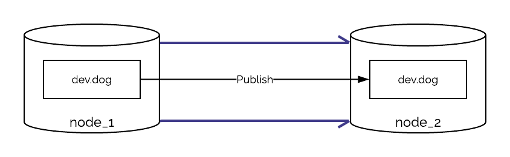

On the other hand, I could express it differently, I could say that I want to listen to all the changes in the _dog_ table in node 1, so I can **subscribe to it**:

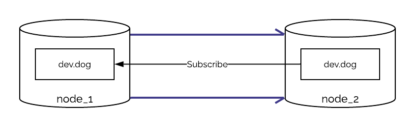

When you create a subscription in any node, any changes to that particular table will be synced to the other tables, any new data on `dev:dog` will be published to the other node, as well as any updates or removals. If the table doesn't exist in one of the nodes, it'll also be created, however, **destructive operations like `drop` won't be propagated.**

### Creating a cluster

So, you decide to create a proof of concept to see if your idea to use HarperDB's clusters will work. Since HarperDB has a Docker image with clustering available, we'll start by creating a Docker Compose file.

The idea is to simulate two instances of a HarperDB node and connect them both into a cluster. For this we'll create two services in your Docker Compose, the first will be the one representing the sensor:


```yaml
services:
harper-edge:
image: harperdb/harperdb
container_name: harper-edge
ports:
- "9900:9925"
- "9901:9926"
- "62000:62344"
    environment:
    - HDB_ADMIN_USERNAME=admin
      - HDB_ADMIN_PASSWORD=admin
      - CLUSTERING=true
      - CLUSTERING_USER=cluster
      - CLUSTERING_PASSWORD=cluster
      - CLUSTERING_PORT=62344
      - NODE_NAME=harper-edge
```


We'll open ports 9925, 9926 and 62344, but since we'll spin up another service in the same computer, we cannot just use the same ports, so we'll map them to 9900, 9901, and 6200 respectively. We'll enable clustering in the environment variables, then we'll set the cluster port to 62344 as we set in the port manifest. Lastly, we'll name the node as _harper-edge_.

For the second instance that will represent the company's server, we'll copy the first part and just change the names and ports, the final file will be like this:


```yaml
services:
  harper-edge:
    image: harperdb/harperdb
    container_name: harper-edge
    ports:
      - "9900:9925"
      - "9901:9926"
      - "62000:62344"
    environment:
      - HDB_ADMIN_USERNAME=admin
      - HDB_ADMIN_PASSWORD=admin
      - CLUSTERING=true
      - CLUSTERING_USER=cluster
      - CLUSTERING_PASSWORD=cluster
      - CLUSTERING_PORT=62344
      - NODE_NAME=harper-edge

  harper-host:
    image: harperdb/harperdb
    container_name: harper-host
    ports:
      - "9902:9925"
      - "9903:9926"
      - "62001:62344"
    environment:
      - HDB_ADMIN_USERNAME=admin
      - HDB_ADMIN_PASSWORD=admin
      - CLUSTERING=true
      - CLUSTERING_USER=cluster
      - CLUSTERING_PASSWORD=cluster
      - CLUSTERING_PORT=62344
      - NODE_NAME=harper-host
```


We are just summing 1 in the ports so they don't conflict, and also changing the name of the node. The important part here is that the cluster user and password **must be the same in both services**.

Let's spin that up with `docker compose up`, you should see the result of two HarperDB instances being run. Now let's go to the [HarperDB Studio](https://studio.harperdb.io/) and register them. Just create your account, organization, and click on register a new user-managed instance. This should be the data we have:

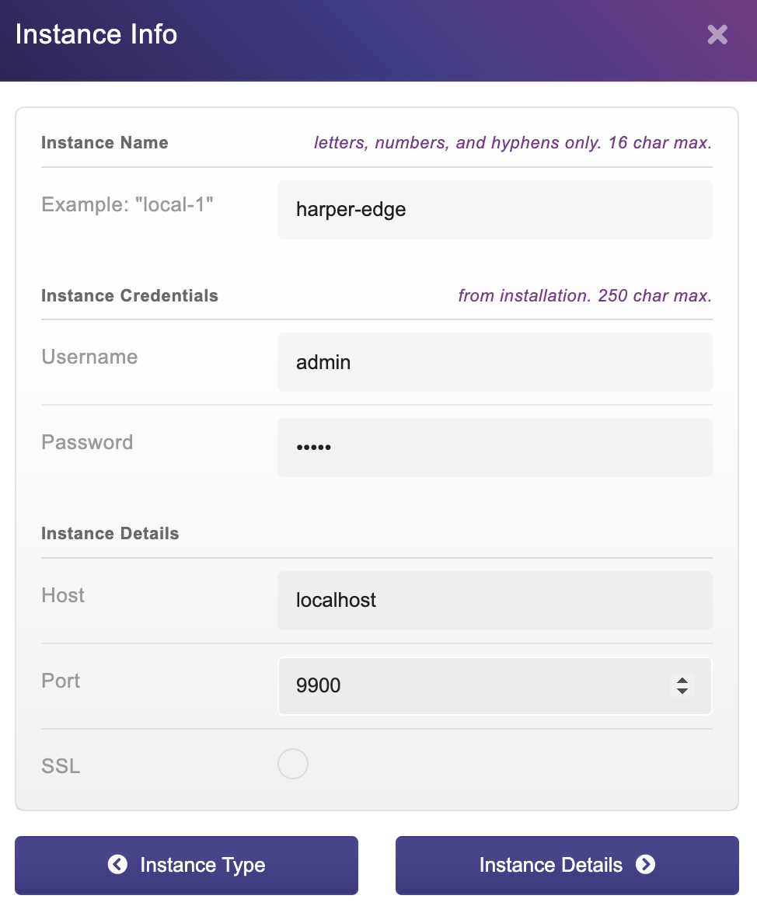

Select the free instance and accept the terms, we should be ready to go:


Let's do the same for the other one:

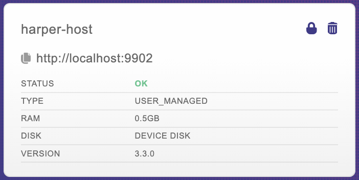

What will change will only be the port number, which is now 9902.

### Connecting the nodes

We won't create any tables on any of the instances. Instead, let's jump into our studio and go to the "Cluster" tab on any of those instances:

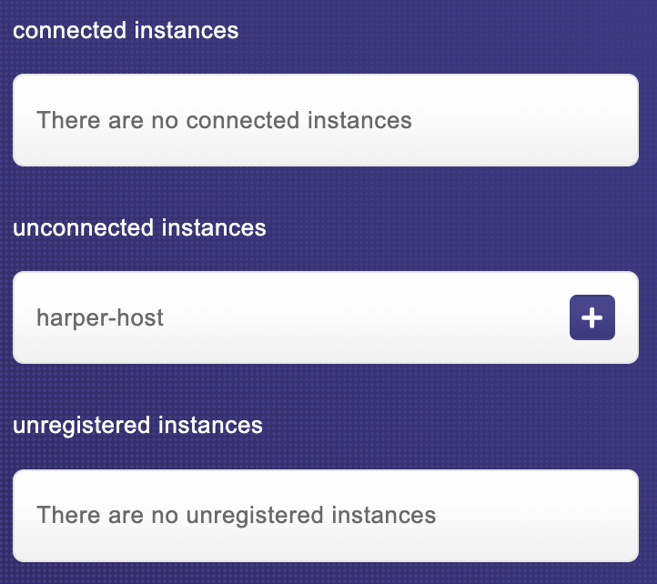
 

As you can see, we have our other node listed, but when we try to connect we get an error:

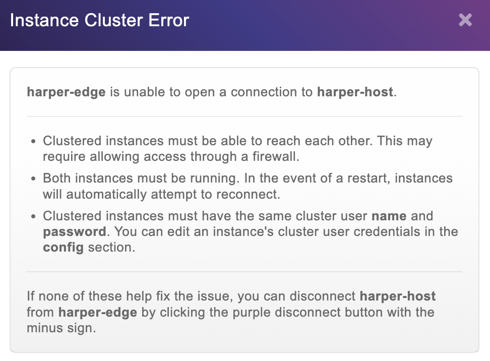

Since we're using Docker, the instance is not available through the HarperDB studio to be connected to the other node in the cluster, in this case, we'll need to take the matters into our own hands, literally.

HarperDB has an API that allows you to manually create a connection between two nodes. On any request tool you have – like Postman, Insomnia, or any other – use the URL: `http://localhost:9902` in a POST request. You can use any of the hosts to do what we're about to do, but to keep the idea of the project, let's connect to the host one representing the company's database.

In the auth section, we'll use a basic HTTP auth, the username and password are the ones we defined in the compose file, in this case both of them are `admin`. Now we'll create a JSON body that looks like this:

```json
{
  "operation": "add_node",
  "name": "harper-edge",
  "host": "harper-edge",
  "port": 62344,
  "subscriptions": [] 
}
```

So, from the company's database, we want to **publish** configurations and **subscribe** to sensor data, let's tell the node that with two objects inside the `subscriptions` key:


```json
{
  "operation": "add_node",
  "name": "harper-edge",
  "host": "harper-edge",
  "port": 62344,
  "subscriptions": [
    {
      "channel": "default:sensor_data",
      "subscribe": true,
      "publish": false
    },
        {
      "channel": "default:configs",
      "subscribe": false,
      "publish": true
    }
  ] 
}
```

Now, we go back to our studio and log on to the **harper-host** instance. We'll create our schema called `default` and a table called `configs`. 

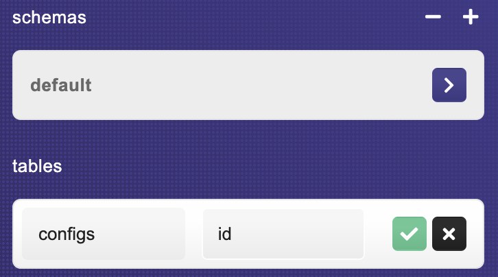

Now, let's add a simple data to that table by clicking the `+` button on the top right:

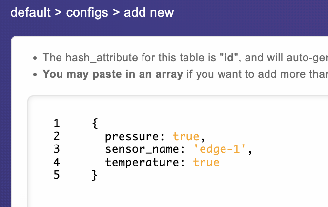

After saving, let’s switch to the `harper-edge` instance, and look! We now have a configs table and inside that table we have the same item we just added:

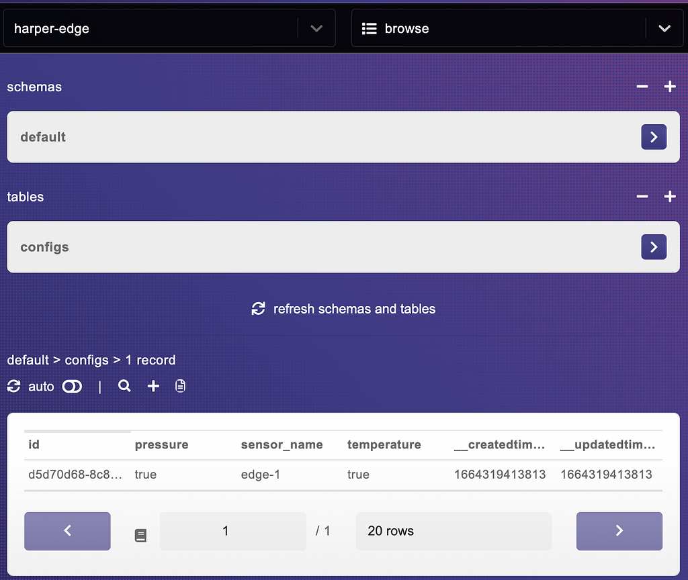

Let's do the same on the `harper-edge` instance, and add a table called `sensor_data` with a hash of `id`, then add some data on it:

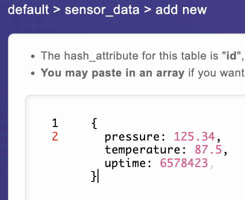

And if we switch back to the host, we'll also have the same data over there:

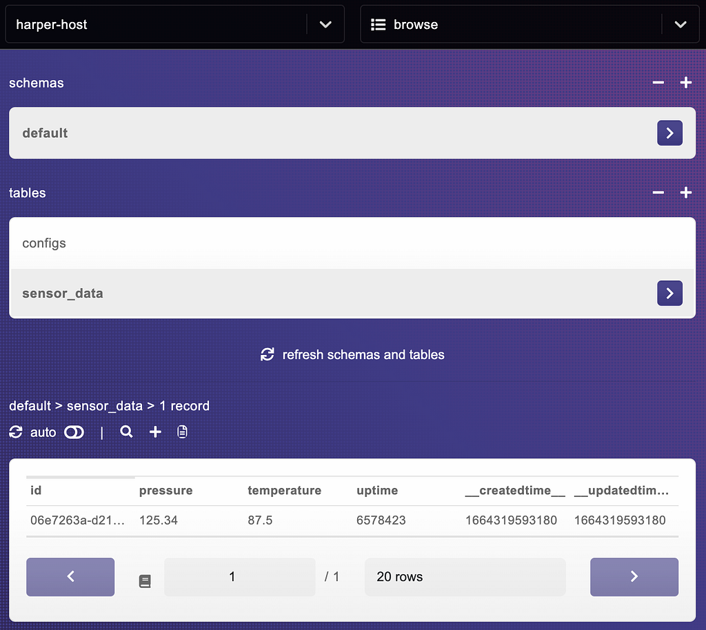

This is valid even if we delete the data on one of the sides, in this case the data on the other end will also be deleted.

## Conclusion


This was the first glimpse of this amazing feature. Stay tuned for the next tutorials on how we can use Harper's pub/sub to make it work in our favor in other real-world examples.
