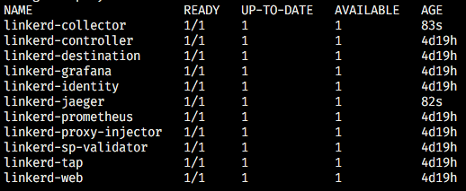
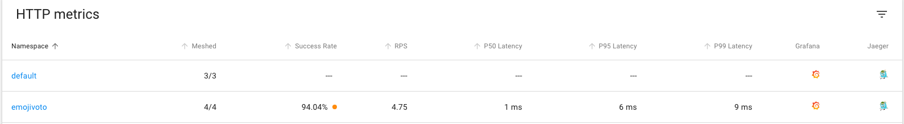
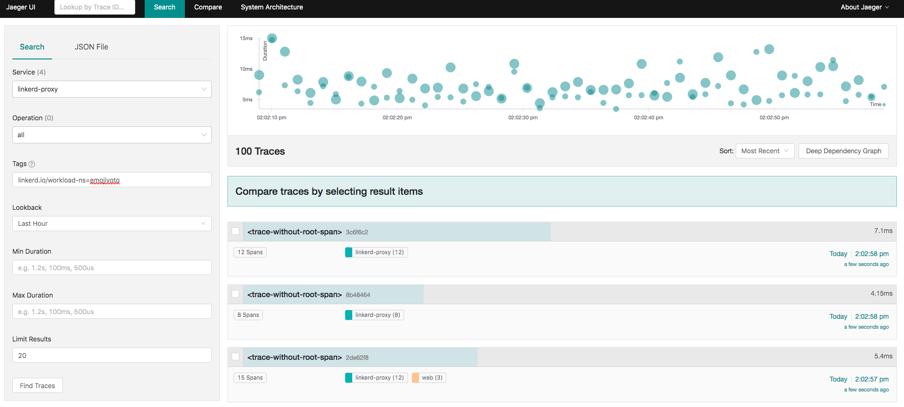
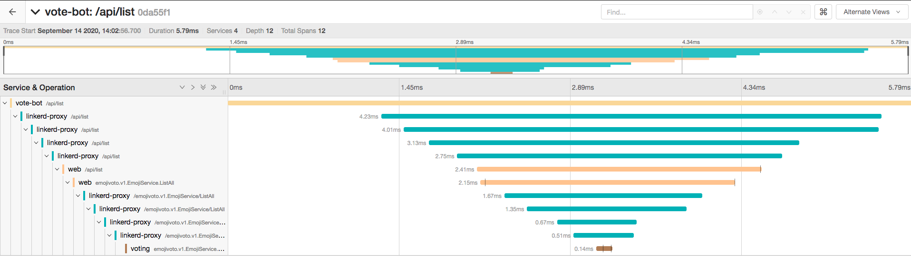
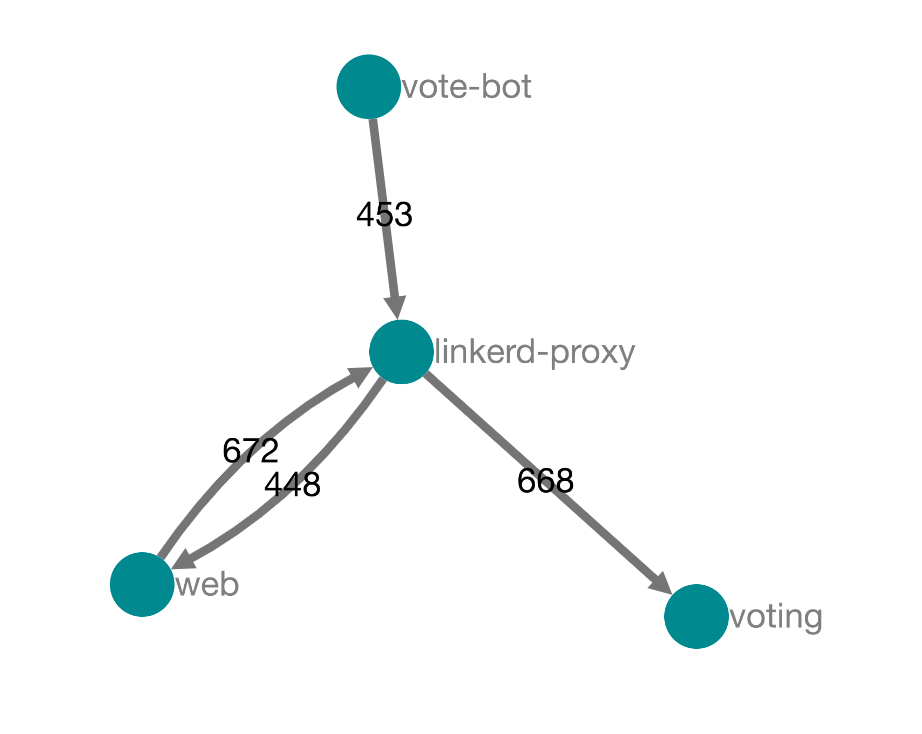
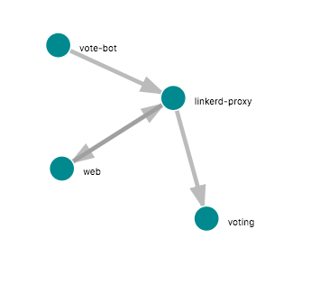
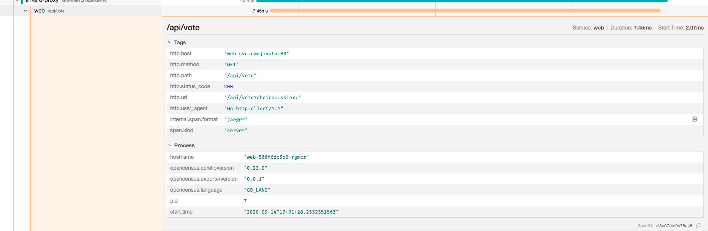

We already talked a bit about Linkerd in the [last post](/uma-introducao-a-service-mesh-com-linkerd/), now, to stretch our service mesh knowledge even further, let's talk about an interesting concept that we'll explore more calmly in other articles. But here we'll have a practical example! **Tracing.**

## Tracing

Tracing is one of the elements of the triad that make up what we'll treat further ahead as **Observability**, but for now let's focus on this aspect.

Tracing is the ability to follow a request end to end, checking the order of service calls, the payload sent and received by each one, the responses from each service, and also how long each request took.

Implementing simple tracing in an application isn't a complex task, you just log everything you receive and send. However, there's another concept called **deep tracing** or **distributed tracing** that's aimed specifically at distributed applications.

And that's where things start to get complicated...

### Deep Tracing

Deep Tracing is the name given to the technique of linking logs from one call to another, forming a timeline of what was done. Each log is called a **span**, and a single request can trigger multiple spans, even more so when we're dealing with microservices calling each other in sequence.

Put very simply, what Deep Tracing does is add a header to the initial request called a **Request ID**, each implementation of the technique has its own name for this. On every new request, this ID gets passed forward and, combined with the request's timestamp, this information is used to build a history of everything that was done.

The problem is that, to do all of this manually, we have to:

-   Have a very good understanding of our application
-   Intercept every HTTP call and add a header to each one of them

Which isn't an easy task, that's why tools like Jaeger exist.

## Jaeger

[Jaeger](https://www.jaegertracing.io/) is an open source tool hosted by the CNCF that exists precisely to avoid the hassle of deploying and implementing all the moving parts that make up a distributed tracing system.

It also uses [Open Telemetry](https://opentelemetry.io/), a project that aims to simplify application telemetry through a standard set of tools for gathering metrics.

Jaeger is written in Golang, which makes it super fast and very useful for systems that are distributed or have a complex mesh of services. You know what else goes well with this architecture? Linkerd!

## Linkerd and Jaeger

Service Mesh and Observability are concepts that walk hand in hand, but you don't always have the ability to implement both in a simple way. And that's where both Linkerd and Jaeger shine individually, but, besides being amazing on their own, they're even better **together**.

Using Linkerd with Jaeger is an excellent way to get all the information and metrics possible from your application quickly and practically, especially since Linkerd itself supports add-ons that include both Jaeger and the [OpenCensus Collector](https://opencensus.io/service/components/collector/), a metrics collection tool.

Enough concepts! The best way to explain what Jaeger is is through practice! So let's get our hands dirty!

## Applying Tracing

> To get started, I'll assume you already have the cluster created and Linkerd installed, if you haven't installed everything yet, go back to [the previous article](/uma-introducao-a-service-mesh-com-linkerd/) and follow the tutorial to the end

With our cluster set up and Linkerd already installed, let's start by installing the [all-in-one](https://www.jaegertracing.io/docs/1.8/getting-started/#all-in-one) configuration, which provides a single image containing all the elements needed for Jaeger tracing to work smoothly.

To install this configuration, let's create a new file called `config.yaml` and put the following content in it:

```yaml
tracing:
  enabled: true
```

Then, let's run a Linkerd command to add the new add-on, in the folder where you created the new file run the following command:

```bash
linkerd upgrade --addon-config config.yaml | kubectl apply -f -
```

Once we're done, we should have two new deployments, one called `linkerd-collector` and another called `linkerd-jaeger` in the `linkerd` namespace:



### Annotations

To detect the changes and start doing the tracing, Linkerd uses two new annotations on our deployments, whenever we need to make this modification we'll include these lines alongside the `linkerd.io/inject: enabled` annotation, ending up like this:

```yaml
spec:
  template:
    metadata:
      annotations:
      	linkerd.io/inject: enabled
        config.linkerd.io/trace-collector: linkerd-collector.linkerd:55678
        config.alpha.linkerd.io/trace-collector-service-account: linkerd-collector
```

### Instrumentation

Tracing, unlike most DevOps techniques, requires instrumentation in the application, meaning we have to manually insert the metrics collector code into our system so it can identify and add the headers and the ID for the trace.

This can be done manually in our application using Node through [this package](https://github.com/census-instrumentation/opencensus-node/tree/master/packages/opencensus-nodejs), but, to keep the process simpler, we'll use Linkerd's default application to test.

First we install the application with the command

```bash
kubectl apply -f https://run.linkerd.io/emojivoto.yml
```

Then we run the following command so we can include the annotation shown earlier

```bash
kubectl -n emojivoto patch -f https://run.linkerd.io/emojivoto.yml -p '
spec:
  template:
    metadata:
      annotations:
        linkerd.io/inject: enabled
        config.linkerd.io/trace-collector: linkerd-collector.linkerd:55678
        config.alpha.linkerd.io/trace-collector-service-account: linkerd-collector
'
```

We wait for the deployment to finish rolling out. You can run the following command to keep track of it:

```bash
kubectl -n emojivoto rollout status deploy/web
```

To finish, let's enable tracing by setting a new environment variable on the deployment with the following command

```bash
kubectl -n emojivoto set env --all deploy OC_AGENT_HOST=linkerd-collector.linkerd:55678
```

## Exploring Jaeger

Let's make sure our implementation worked by running the `linkerd dashboard` command and seeing the Jaeger icon next to our namespaces



If we click on it, we'll get every call made inside the application and we'll be able to follow the history of everything that was called via HTTP



If we click on one of the lines, we'll be able to see everywhere the requests passed through and which services were called, as well as their payloads and timings



Another interesting feature is Jaeger's ability to identify the system's possible architecture. Just click the "System Architecture" tab and choose between the directed graph and the DAG:





We can also explore each request individually through the same Jaeger icon on each line when we start the "Live View" of a route.



## Conclusion

We'll talk more about observability around here in the future, but keep in mind that tracing is one of the main reasons service mesh is so sought after. The power you can extract from knowing exactly what's happening in your system lets you fix bugs and handle errors much more simply and quickly.

I hope you enjoyed the article, leave a comment, like it and share it! Let's help everyone understand what tracing is! Don't forget to subscribe to the newsletter for more exclusive content!

See you next time!
