No dia de hoje vamos trocar uma ideia sobre **Arquivos de declaração de tipos**, os famosos arquivos `.d.ts` que provavelmente você já viu por ai se você chegou a fazer qualquer tipo de projeto com TypeScript. Também vou mostrar algumas das melhores práticas tanto para poder publicar sua biblioteca de tipos no NPM (ou outro gerenciador de pacotes).

Então bora lá! E não esquece de deixar o [seu feedback](https://forms.gle/6hAqjVmah9uyR4by8) sobre a #SemanaTS!

## Arquivos de declaração

Os arquivos `.d.ts` são conhecidos como **arquivos de declaração de tipos**, eles tem uma sintaxe um pouco diferente e raramente são visto em aplicações como código que é exibido para usuários ou outros devs. E esse é o objetivo.

Arquivos de declaração são usados para dizer ao TypeScript qual é o tipo de um determinado módulo, arquivo ou função. Por exemplo, um dos usos mais comuns de arquivos de declaração é para tipar módulos do NPM que não possuem nenhum tipo. Dessa forma você pode usar esse pacote usufruindo do sistema de tipos que o TS te oferece como se o pacote em si fosse escrito com TypeScript.

> Você pode ver um [exemplo](https://github.com/DefinitelyTyped/DefinitelyTyped/pull/64842/files#diff-2dfda1c06c01252655eb83b1bd389beb27213848707db6a58180b71fcc229b25R6) de um arquivo de declaração para um pacote do NPM chamado [keychain](http://npm.im/keychain) que eu fiz recentemente.

Vamos colocar a mão na massa e codar um pouco, crie uma pasta em qualquer local do seu computador e coloque o seguinte conteúdo em um arquivo `package.json`:

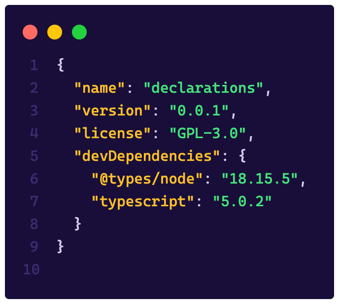

Execute `npx tsc --init` na raiz dessa pasta para poder criar o nosso arquivo `tsconfig` e depois rodar o comando `npm i` para instalar todas as dependências. Por fim, dentro da pasta, crie uma outra pasta chamada `minhaLib` e lá coloque um arquivo `index.js` (sim `.js`) com esse conteúdo:

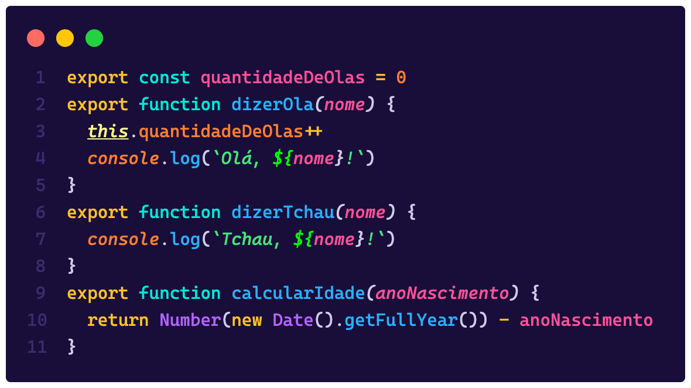

Na raiz da pasta, crie um arquivo `index.ts` e importe seu arquivo `index.js` da forma tradicional com `import lib from './minhaLib'` e agora vamos ver a mágica acontecendo.

> Eu estou assumindo que você já tem o Node instalado na sua máquina para rodar os comandos, se não, [instale ele aí](https://nodejs.org/) para ter os comandos `npm` e `npx` disponíveis.

Se você seguiu os passos, deve ter se deparado com um erro que diz o seguinte:

> Could not find a declaration file for module './minhalib'. 'caminho/para/minhalib/index.js' implicitly has an 'any' type.

Isto porque o TypeScript, por baixo dos panos, vai sempre tentar procurar um tipo para o arquivo que você estiver importando. Se o arquivo for do tipo `.ts` então ele vai usar as tipagens que já estão presentes ali, caso o arquivo seja um arquivo `.js`, ele vai tentar procurar um arquivo `.d.ts` que tenha as definições necessárias para ele entender o que está acontecendo.

É nesse momento que projetos como o [DefinitelyTyped](https://github.com/DefinitelyTyped/DefinitelyTyped/) entram em cena, eles são repositórios de tipos. Se você olhar no nosso arquivo `package.json` temos uma dependência chamada `@types/node`, esse `@types` é a organização deste projeto. E ele é tão importante que virou parte da pipeline do TypeScript.

> Por padrão, o TypeScript vai procurar primeiro na pasta da sua biblioteca, mas se não achar nada, ele vai ir em `node_modules/@types/<nome-da-lib>/index.d.ts` que é o diretório do DefinitelyTyped para encontrar esses tipos, e se esses tipos não existirem, ai você recebe esse erro que recebemos acima.

### Criando tipos onde antes não tinha nenhum

Esse tipo de problema não é incomum, você vai encontrar diversas bibliotecas por ai que não são tipadas, o exemplo que eu dei do Keychain é só um dentre milhões de outros pacotes.

> Um uso diferente para os arquivos declarativos é o caso de você poder ampliar ou modificar uma biblioteca, isso é chamado de **module augmentation**, mas não vamos falar disso aqui

A primeira coisa que temos que fazer quando estamos lidando com um pacote sem tipos é identificar qual é o tipo de arquivo que ele é. Por exemplo, ele é um módulo? Uma função? Uma classe? E isso pode ser feito vendo como o arquivo se comporta.

Existem duas formas de se perceber isso, a primeira é através do uso e a segunda é através de código. No caso de uso especificamente, olhe para coisas do tipo:

-   Como você obtem a biblioteca no geral? Via NPM, via CDN? Outro jeito?
-   Como você importa essa lib no seu código? Ela tem um objeto global? Ela usa `require` ou usa `import/export`?

Geralmente libs que são modulares vão ter um dos dois tipos de chamadas, ou com `const lib = require('lib')` ou `import x from 'lib'`. No nosso caso podemos ver que nossa biblioteca é um módulo, e mais do que isso, ela é um módulo que usa [ESModules](/os-ecmascript-modules-estao-aqui/) por causa das exportações usando `export`.

Essa identificação é super importante porque vai dizer como vamos definir os tipos. Mas primeiro, precisamos definir esses tipos em algum lugar. A boa prática é criar um arquivo `index.d.ts` dentro de uma pasta que tenha o mesmo nome da biblioteca, no nosso caso é só criar um arquivo `index.d.ts` junto ao `index.js`.

Existem outros casos onde, por exemplo, você vai baixar um pacote do NPM sem tipos, e por isso não vai conseguir adicionar os tipos diretamente dentro de `node_modules`, porque você não vai enviar essa pasta para o seu controle de versão. Nestes casos, a boa prática é criar uma pasta chamada `@types` na raiz do seu projeto, dentro dela uma outra pasta com o mesmo nome da sua lib e, dentro dela, o arquivo `index.d.ts`, ou seja, você vai estar imitando a estrutura do DefinitelyTyped.

No nosso arquivo `index.d.ts` vamos adicionar todas as declarações de tipo que a nossa lib exporta dessa forma:

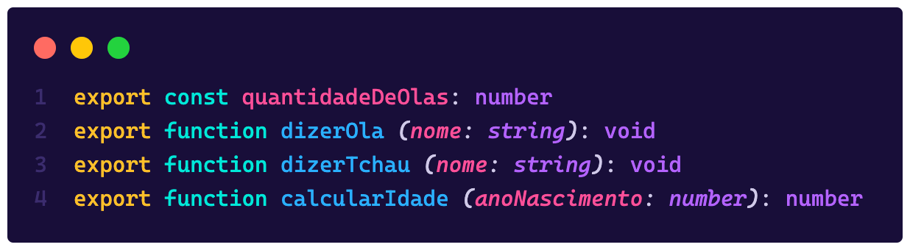

Perceba que não temos uma implementação da função, estamos só declarando a assinatura dela, que é o que o TypeScript precisa para poder saber o tipo e nos guiar. Quando você voltar para o nosso arquivo `index.ts` vai ver que além de o erro ter sumido, você agora ganho um intellisense da sua lib:

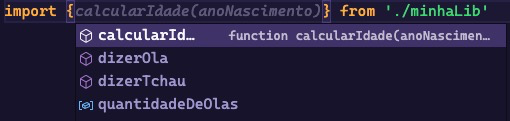

### Objetos globais e namespaces

Bibliotecas podem ser classes, por exemplo, se ao invés de a nossa lib exportar funções diretamente, ela fosse uma classe, dessa forma:

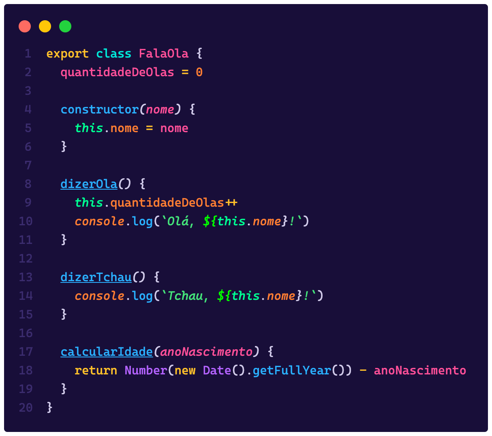

Agora nossa declaração mudou, porque não estamos mais recebendo as funções diretamente, nesse caso temos que mudar o nosso arquivo `index.d.ts` para exportar uma classe, o que vai basicamente seguir o mesmo modelo do arquivo original:

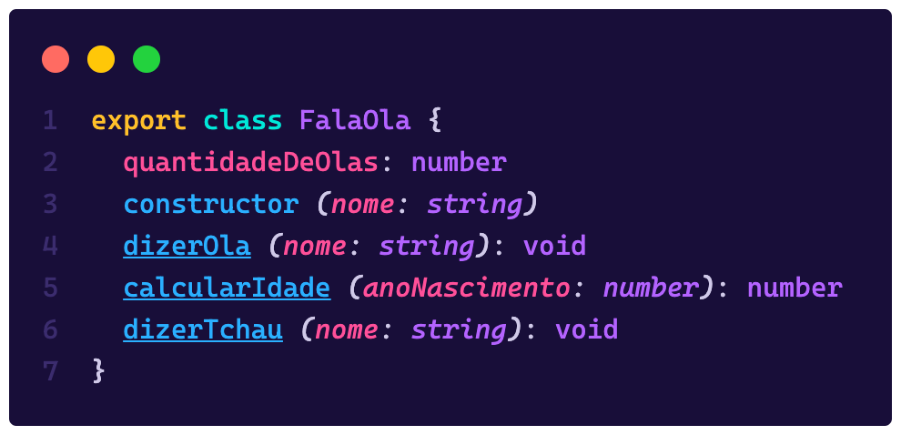

E assim temos também a mesma tipagem da nossa classe:

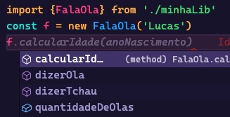

Porém, se o nosso pacote não usar ESM? E se ele exportar tudo como um módulo em um objeto? Então temos o conceito de `namespaces`, vamos supor que a nossa lib seja assim:

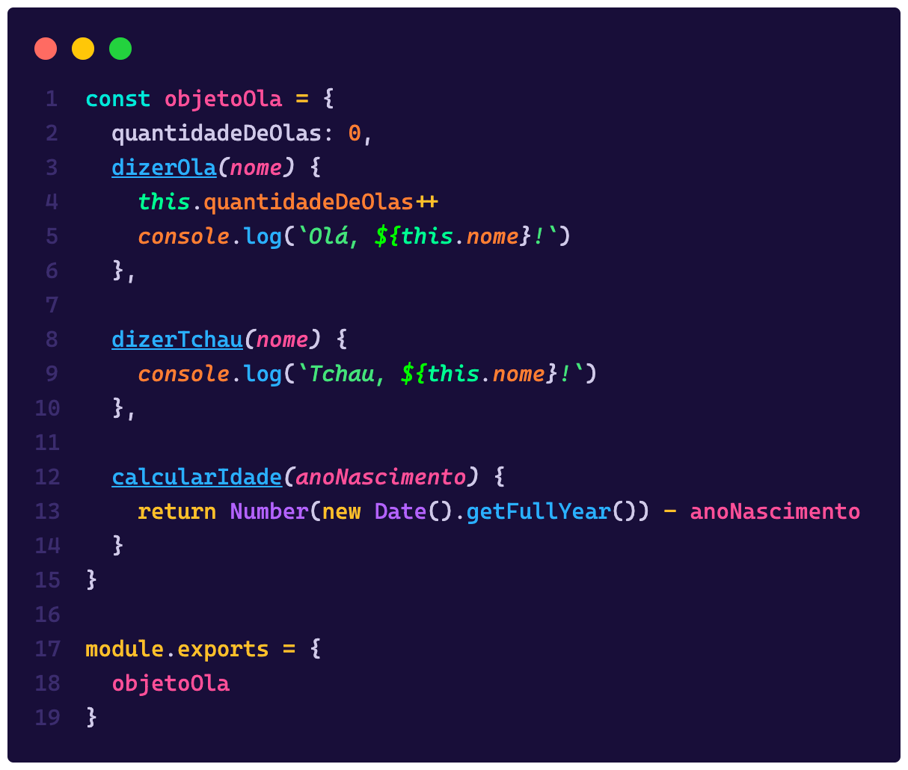

Para podermos usar essa lib, vamos ter que importar ela como um destructuring do jeito `const { objetoOla } = require('./minhaLib')`, o nosso arquivo de declaração então vai ter que conter um objeto que será o container de todas as funções, isso é o que chamamos de `namespaces`, e podemos declarar um dessa forma:

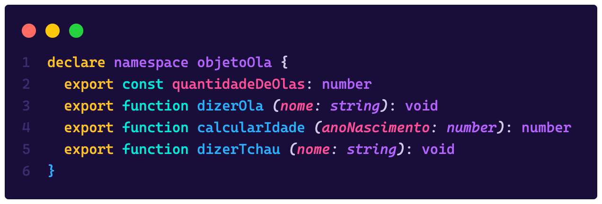

> Pense no namespace como um objeto, uma caixa que vai conter todas as funções que temos, e namespaces podem ter outros namespaces e assim por diante

Veja que temos uma palavra chave nova ai, o `declare`, pense nele como sendo uma espécie de `let` ou `const` para arquivos de declaração, ele está dizendo que estamos criando um novo objeto. Todas as declarações que aparecem no top level de um arquivo `.d.ts` precisam começar ou com `declare` ou com `export`.

Depois temos que dizer que a nossa lib é um módulo, caso contrário vamos ter um erro dizendo "File \<seu caminho> is not a module". Podemos fazer isso de duas formas, a primeira é ser explícito e declarar o módulo exportando por padrão o namespace, dessa forma:

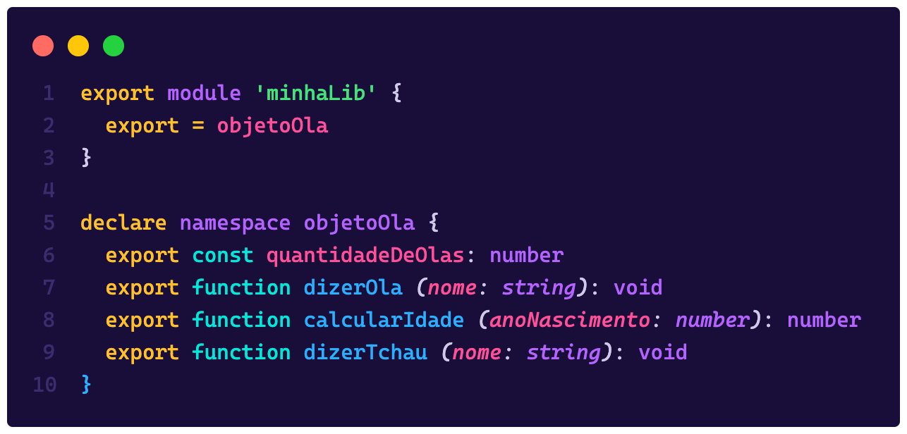

Ou podemos fazer de um jeito mais sucinto e omitir a exportação, o que deixa implícito que tudo que está declarado no arquivo vai ser exportado por padrão:

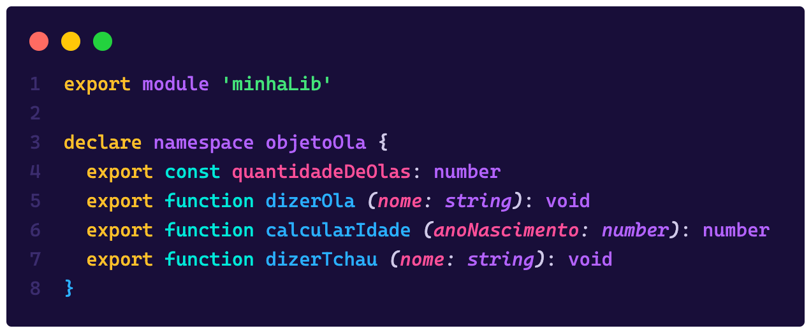

O resultado final é o mesmo e temos o intellisense novamente:

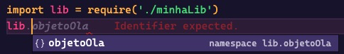

### Exports padrões e tipos extras

Neste caso eu quero fazer uma análise da [PR](https://github.com/DefinitelyTyped/DefinitelyTyped/pull/64842/files) que abri para o pacote Keychain lá no DefinitelyTyped. Esse pacote além de ser super antigo, é um pacote CommonJS (que nem o que fizemos acima) mas exporta um objeto padrão ao invés de um namespace, então o uso dele é algo assim:

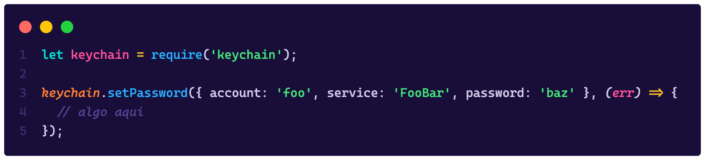

Para criar um tipo e publicar esse tipo no DefinitelyTyped primeiro temos que criar o nosso tipo localmente, portanto, para começar eu fiz exatamente o que fizemos aqui, uma pasta. Só que ao invés de criar uma pasta com o nome da minha biblioteca, eu segui a estrutura `<root>/@types/keychain/index.d.ts`, dessa forma podemos organizar todos os tipos ali.

Como estamos lidando com um módulo antigo, e precisamos suportar todas as possibilidades, vamos ter que exportar essa funcionalidade não como um módulo, mas sim como um _default export,_ mas antes, vamos criar a tipagem para todas as funções.

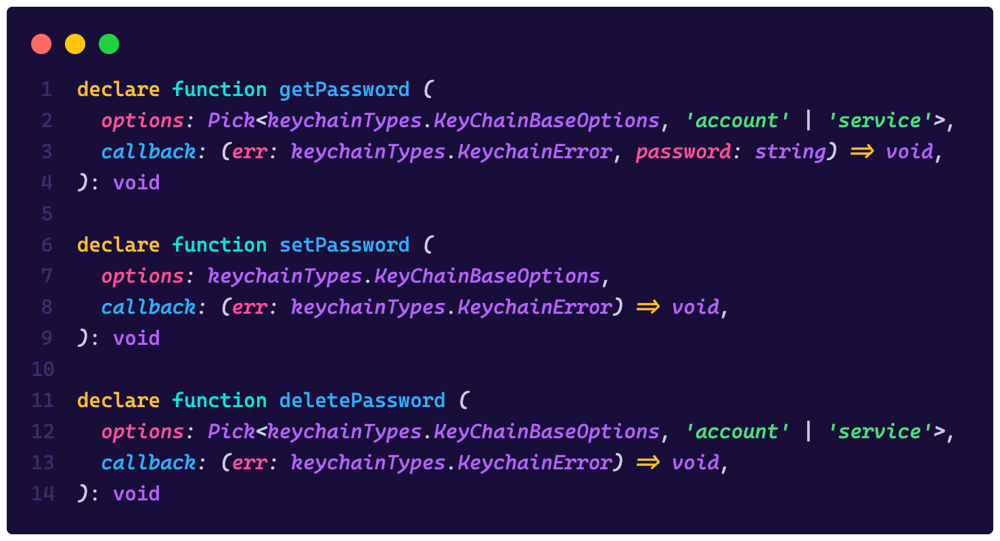

Veja que estou usando a função `Pick` que pega chaves de um objeto base, e esse objeto base está dentro de um namespace chamado `keychainTypes`, isto porque eu identifiquei que podemos tipar ainda mais a biblioteca, por isso podemos adicionar **tipos extras** e deixar ela ainda bem mais tipada, porém quando estamos falando de exportações com CommonJS, essas declarações precisam estar dentro de um namespace. Então podemos criar o nosso namespace da seguinte forma:

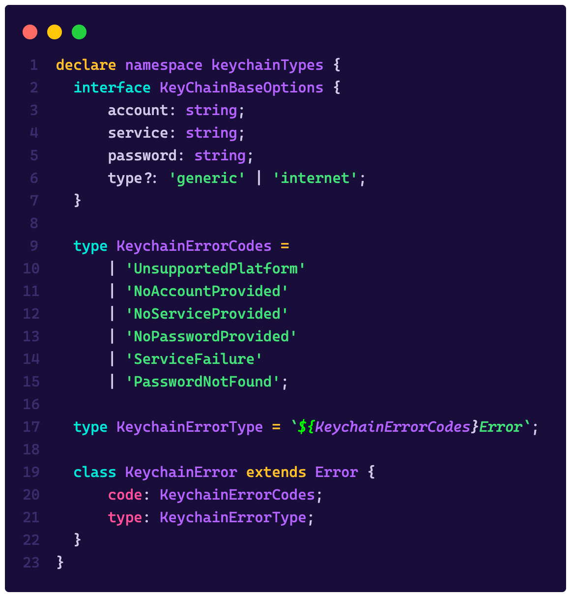

Por padrão, tudo que estiver dentro do namespace vai ser exportado, isso significa que estou exportando mais tipos do que a lib em si tem, mas pode isso!?

Não só pode como é uma boa prática, porque se exportamos tipos que identificam, por exemplo, erros e enumeradores, as pessoas que vão usar a nossa tipagem podem melhorar a asserção dos tipos delas!

> Um bom exercício e uma boa forma de entender como libs funcionam é criar tipos para elas, porque ai você não só entende a forma que a biblioteca tem, mas também como ela funciona internamente.

No final, o que temos que fazer é criar uma constante que vai ser o objeto padrão (nosso default export) que é exportado pela lib:

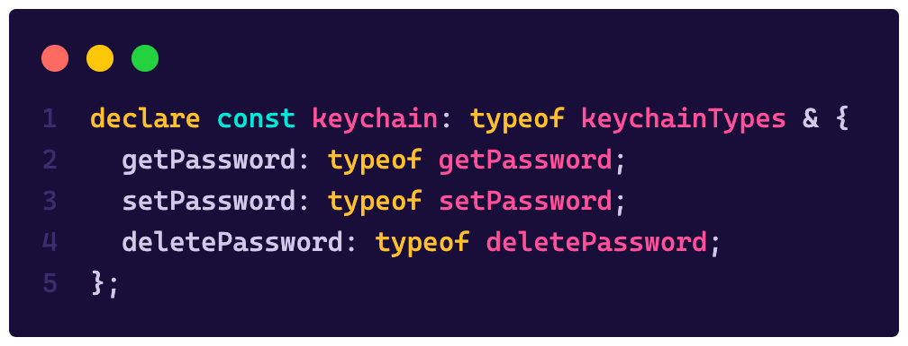

Vamos passo a passo:

1.  Estou declarando uma constante chamada `keychain`, o nome não importa já que o noss pacote é um default export
2.  Atribuí a essa constante o tipo do nosso namespace, a keyword `typeof` vai buscar todos os membros de um objeto e retornar seus tipos
3.  Usei o operador `&` que é a intersecção de tipos, no TS, quando estamos intersectando dois objetos que não possuem chaves em comum, o resultado é um objeto com todas as chaves de ambos

Agora só nos resta exportar tudo com um `export = keychain` como está na PR. Porém, para testar localmente vamos ter que criar um módulo para que o TS possa identificar nosso arquivo e importar esse módulo localmente, então vamos fazer uma pequena modificação, e o arquivo completo fica assim:

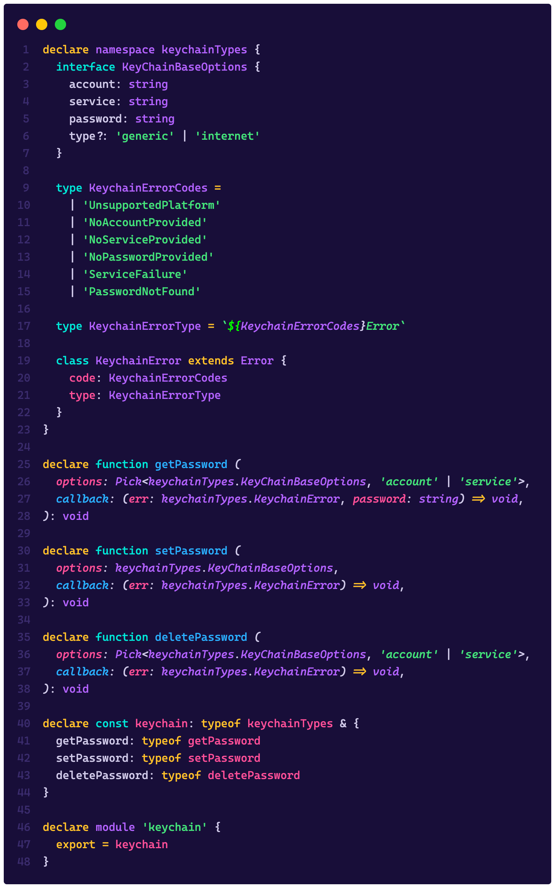

Acabamos de tipar nosso primeiro módulo externo:

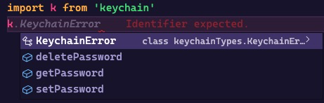

### Testes de tipos

Assim como é importante testar nosso código, os nossos tipos também precisam de testes, mas testes de tipos são um pouco diferentes. Vamos dar uma olhada no arquivo de testes desses tipos que criamos (que está lá no [DefinitelyTyped](https://github.com/DefinitelyTyped/DefinitelyTyped/blob/master/types/keychain/keychain-tests.ts)):

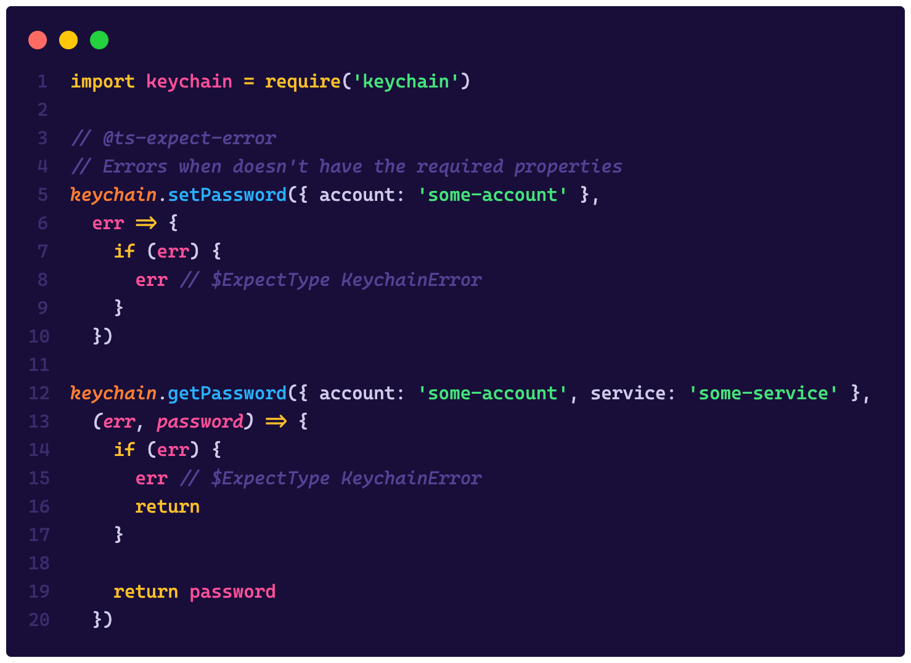

A ideia de um teste de tipo é simplesmente chamar as nossas funções passando os parâmetros corretos, já que o arquivo nunca vai ser, de fato, executado, só vamos passar o compilador do TS para ver se esse códig compila como esperado.

Vamos abusar de diretivas como `@ts-expect-error` para dizer que a próxima linha deve dar um erro de compilação, e é assim que conseguimos não só testar o código mas também nossos tipos.

## Publicando uma biblioteca com TS

Publicar um módulo com TypeScript não é muito diferente de publicar um módulo JavaScript nativo no NPM, porém estamos lidando com outra situação importante aqui: Precisamos também mandar os tipos, ou seja, os arquivos `.d.ts` precisam estar presentes no pacote que o NPM vai usar.

Para publicar sua primeira lib no NPM, o que você precisa fazer é ter certeza de que as seguintes opções estão setadas no seu arquivo `tsconfig.json` (que você cria com o `tsc --init`):

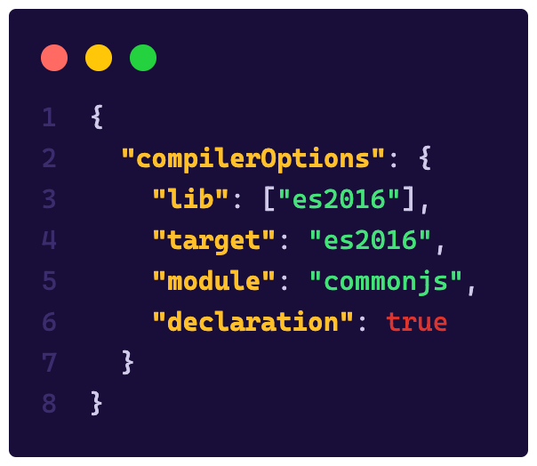

A parte mais importante aqui é ter o `declaration: true`, pois isso vai dizer para o TS gerar seus tipos de acordo com o que você escrever. Depois, no `package.json` você também pode especificar um campo chamado `types` e dizer onde encontrar os tipos das suas bibliotecas, dessa forma:

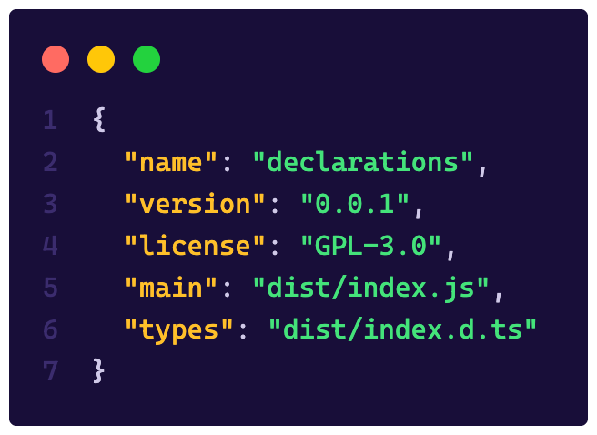

Aqui estou assumindo que o valor de `outDir` no seu `tsconfig.json` é `dist` então sua pasta de saída seria `dist` e seus arquivos de declaração vão viver junto com o seus arquivos JavaScript.

Além disso é importante ignorar a pasta `dist` no seu `.gitignore` mas não no seu NPM, porque queremos essa pasta por lá, então você pode sobrescrever a funcionalidade padrão adicionando a chave `files` no seu `package.json`, isso vai dizer ao NPM quais são os arquivos que ele precisa buscar para incluir no pacote, vamos colocar a pasta `dist` lá dentro:

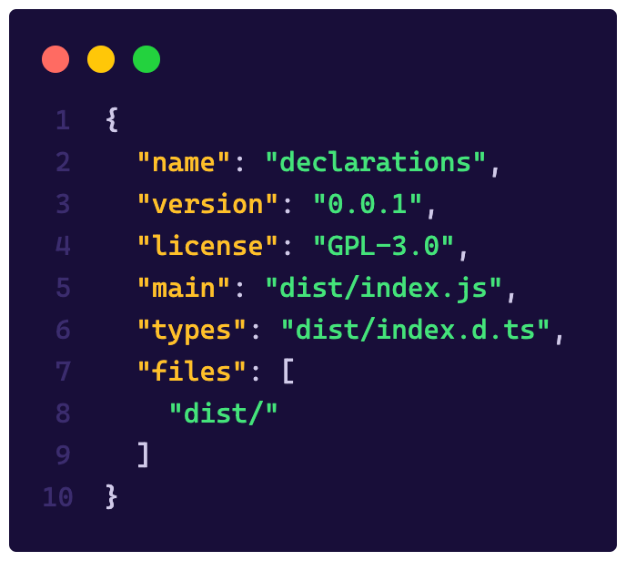

Agora é só implementar a sua biblioteca e publicar o seu pacote com `npm publish`!

## Pra você treinar

Primeiro, vamos começar resolvendo os últimos desafios!

#### Hello World

Para resolver esse desafio basta definir o tipo como uma string:

```ts
type HelloWorld = string
```

#### If

Para implementar uma funcionalidade como o `if` dentro do sistema de tipos do TS vamos fazer uso de **generics**, que vamos comentar nos próximos dias! A ideia é que `If<true, 'a', 'b'>` deveria retornar `a`, portanto vamos implementar um tipo que recebe uma condição e se ela for `true`, retornamos o primeiro valor:

```ts
type If<Condicao, Verdadeiro, Falso> = Condicao extends true
	? Verdadeiro
    : Falso
```

---

👉 O próximo desafio vai ser apenas um! Tente fazer a tipagem [dessa biblioteca](https://gist.github.com/khaosdoctor/9e9a30d5053974f7221be7e06ec19ffc) em um arquivo `.d.ts` e vamos corrigir amanhã!

> Não esquece de deixar o seu feedback sobre a #SemanaTS aqui [nesse formulário](https://forms.gle/6hAqjVmah9uyR4by8)!
