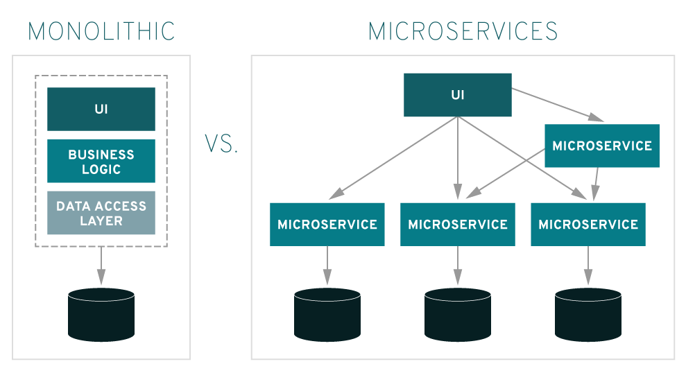
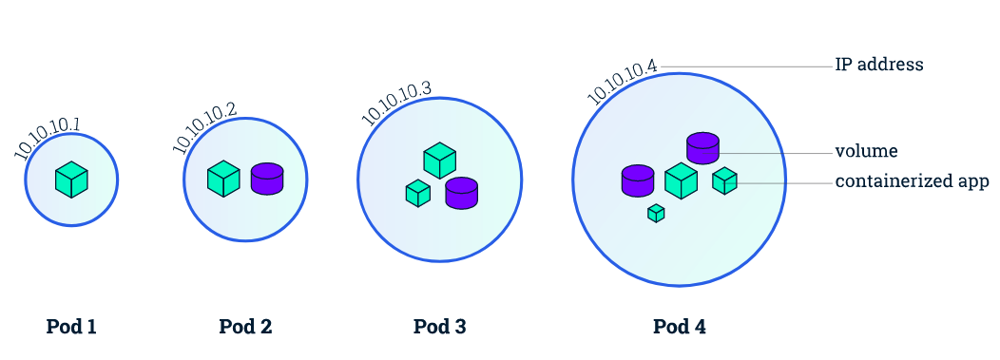
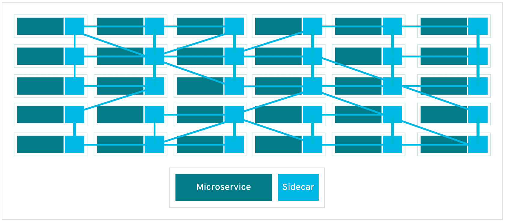
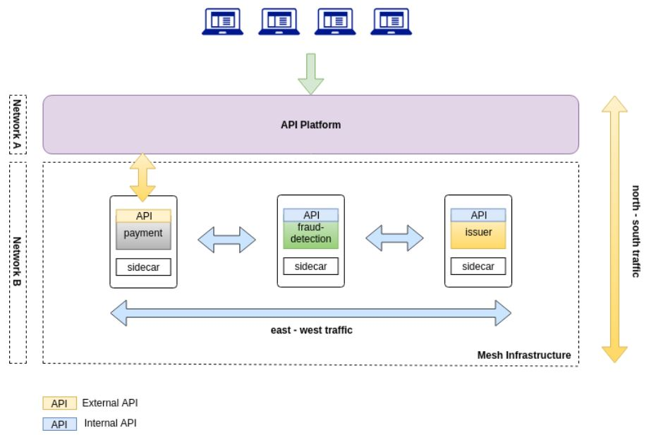
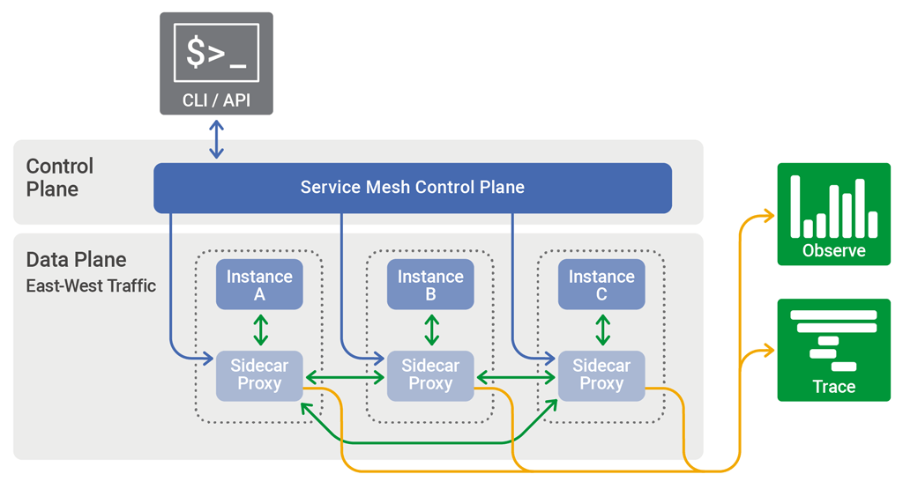
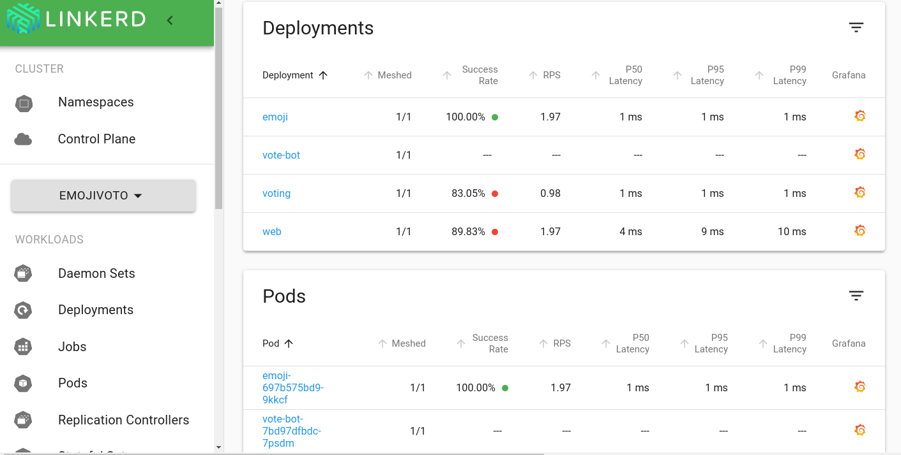

Ever since Docker came out, and even before that, developers have worried about how to decouple their applications from their configuration and their infrastructure, so they can be easily migrated and can easily talk to one another.

Kubernetes made it a lot easier to implement better service layers, especially when we're talking about distributed services using a [microservices architecture](https://medium.com/trainingcenter/microservi%C3%A7os-dos-grandes-mon%C3%B3litos-%C3%A0s-pequenas-rotas-adb70303b6a3).

The big problem is that, even with all these conveniences, we still run into plenty of trouble when it comes to migrating an application or even making it more independent. Mostly because of the communication model we use.

## The problem with microservices

When you study microservices, you see that the **ideal** is to have individual applications that talk to their own databases and are independent enough that they don't need any other external application to function.

")

On top of that, we're always hearing sentences like this one:

> A microservice is an independent application, self-contained, that can use its own database so it doesn't depend on any other part of the system.

The big problem is that we can't always build an application in this model, and that can come down to several more limiting issues:

-   A huge jump in complexity
-   The cost of maintaining every database
-   Data scattered all over the place
-   Data duplication
-   Security

And another huge problem many companies run into when using microservices is the classic pair of **observability** (which we'll cover in another post) and **Service Discovery**. Even though the latter has largely been solved by orchestration tools like [Kubernetes](https://docs.microsoft.com/azure/aks/?WT.mc_id=personal-blog-ludossan).

So that brings us to a pretty interesting subject: the **Service Mesh**.

## Service Mesh

In pretty simple terms, a service mesh can be thought of as a new "layer" that abstracts away the networking problems that come up when services talk to each other.

But when we talk about abstractions, we're not talking about something purely passive. A service mesh layer also brings a bunch of benefits, the main ones being:

-   Telemetry
-   Canary deployments
-   A/B testing
-   Traffic routing
-   Network discovery (Service Discovery)
-   Monitoring
-   Tracing

These are the main problems we run into in distributed architectures. Questions like "how can I fully monitor all my services?" or "how do I know how many requests I'm getting?" usually call for a shared resource, the **API Gateway**, a very common piece in distributed architectures acting as an entry point and control point for the whole service mesh behind it.

Generally speaking, calling **Service Mesh** a layer is a bit off, because it isn't a layer sitting on top of the other services, it's a network built directly into the structure of the applications.

One of the main advantages of using a mesh model is, for example, not having that shared resource the way you'd have with an API Gateway if you had to route all your requests through a single entry point, since the routing implementation already lives inside the application itself.

Beyond that, using a Service Mesh lets you implement a pattern called [Circuit Breaker](https://martinfowler.com/bliki/CircuitBreaker.html), which isolates broken instances of an application until it gradually brings them back to life.

The most famous **Service Mesh** implementations today are [Istio](https://istio.io/) and [Linkerd](https://linkerd.io/).

## Definitions

Since this is a new pattern that runs through the **entire** service ecosystem, we need some terminology first.

### Instances and services

By convention, every application inside a service mesh is called a **service**, and each one of them is an **instance** of a service.

Basically, every service is a running copy of some microservice. Sometimes that instance is a single container, other times it can be an application made up of more than one container, which is the concept of a Pod in Kubernetes.

### Sidecar

The Service Mesh's big trick is the use of sidecars. Sidecars are proxies running in containers that live side by side with the services they support. In a Kubernetes Pod, a sidecar is just another container living inside the same pod.

The sidecar is the one responsible for receiving network traffic and routing it to its sibling application. Sidecars talk to other sidecars on other microservices and are managed by whatever container orchestrator is in use. On top of that, the sidecar is one of the main ones responsible for gathering the application's network usage metrics.

This is the big trick, because a sidecar is basically a distributed implementation of an API Gateway. Instead of a single communication point, you get many points that let the network know how to get from service A to service B.

### Data Plane

The **Data Plane** is responsible for network traffic between instances, which is called "East-West Traffic". As you can see in the previous image, this kind of traffic is the one moving horizontally inside the same network. In other words, the data plane is the sidecar itself.

North-South traffic, as shown in the image above, is communication between different networks. In other words, internal communication reaching out to an external network is a type of N-S traffic, while one service talking to another inside the same cluster is an example of E-W traffic.

### Control Plane

The control plane is only used by the people operating the service mesh, meaning it's the plane that holds the control tools for the service mesh.

This layer usually includes an API for talking to the Service Mesh, and it can also include a CLI and/or a visual interface for controlling the application, as you can see in the image below.

## How a service mesh can improve service communication

It's hard to grasp how a simple service mesh can improve communication across an entire network. So let's walk through a practical scenario where we can put the mesh's metrics and visibility to work improving our applications.

Say you have a service that fails constantly. That's already a known issue, but nobody's found a fix yet, so your application has a retry system that retries the call after 5, 8, 10 and 15 seconds respectively for each attempt. But that's causing a request bottleneck, since during peak hours your application is holding the user up for as long as 15 seconds.

Because of how inherently transparent service mesh metrics are, every bit of communication gets documented, including the traffic metrics between services. With those metrics in hand, we can see the average time our service takes to fail, or even whether it's this service failing and not another one, and adjust our retry time to match.

Let's say the average failure time is 6 seconds, then our retry isn't doing its job, since we have to make two attempts before we get to a third one that's actually valid. We can just set our retry time to 6 seconds then, avoiding an unnecessary load of requests on the service.

## Conclusion

In the next posts we'll dig even further into how we can build and work with service meshes, plus their underlying concepts! So subscribe to the newsletter to get weekly news on every post plus other news from the tech world!

See you around!
