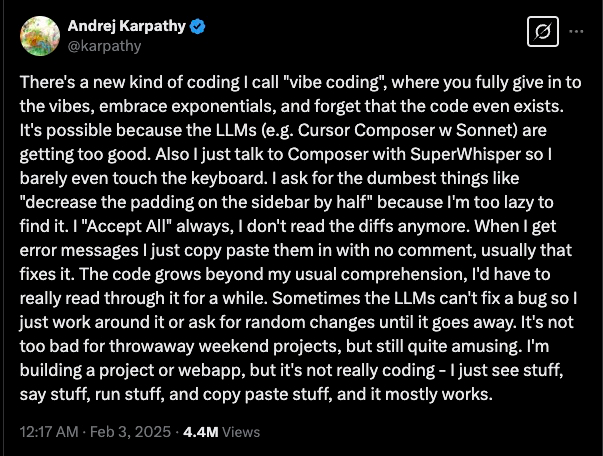
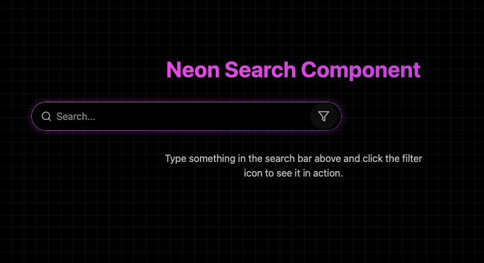

No [último Backlog](/o-que-aconteceu-com-devs/) eu abordei um tema que estava me incomodando bastante nos últimos meses: o fato de que devs hoje estão ficando cada vez mais preguiçosos e delegando cada vez mais tarefas para a IA. Desde então tivemos o advento disso aqui, que eu estou nomeando agora como **Slopware**:

> ✨ [https://t.co/6TyHKajGaJ](https://t.co/6TyHKajGaJ) has now gone from \$0 to \$1 million ARR in just 17 days! 💸 Revenue update: \$87,000 MRR (which is \$1M ARR) My first project ever to go up this fast 🤯 Only 3 ads left now: [https://t.co/uc1J8Ia7QZ](https://t.co/uc1J8Ia7QZ) 📊 Stats update: 320,000 people have now flown in the… [https://t.co/scrq1lSJOT](https://t.co/scrq1lSJOT) [pic.twitter.com/NCc50FOgJa](https://t.co/NCc50FOgJa) — @levelsio (@levelsio) [March 11, 2025](https://twitter.com/levelsio/status/1899596115210891751?ref_src=twsrc%5Etfw)
>
> — 

Se você está por fora da bolha de reclamações do mundo tech, esse é o _Fly Pieter_, um jogo criado pelo mesmo Pieter Levels (que comentei no Backlog anterior) usando apenas a força de vontade e uma subscription do Cursor. Eu tentei jogar, mas aparentemente depois de 20s de jogo eu não consegui conectar em nenhum servidor (imagino que por que meu setup bloqueia trackers).

Como você pode ver, o jogo não é uma obra de arte, mas tudo bem, gráficos não são a parte mais importante de um jogo (eu jogo _Tibia_ e _Dwarf Fortress_), e sim a jogabilidade, a história, etc. O problema é que esse jogo não tem nenhuma dessas propriedades… É apenas um monte de gente voando e vendo anúncios. E, ainda assim, gera uma renda de 1 milhão de dólares anualmente (segundo o criador). Meu questionamento é um só: por quê? Simples… Audiência.

## O efeito da audiência

Eu tenho uma opinião muito forte sobre essa situação toda: não concordo com as pessoas que estão endeusando esse cara porque ele “criou” um jogo e fez milhões com ele. Eu acho que nossos ídolos estão nos lugares errados.

Recentemente o Felipe Deschamps postou esse tweet:

> Muita gente batendo no [@levelsio](https://twitter.com/levelsio?ref_src=twsrc%5Etfw) falando que o jogo dele só deu certo porque ele tem uma audiência enorme. O que me deixa frustrado é que ninguém está levando em conta a quantidade de \*anos\* que demorou para ele \*construir\* consistentemente essa audiência. O que estou perdendo? — Filipe Deschamps (@FilipeDeschamps) [March 11, 2025](https://twitter.com/FilipeDeschamps/status/1899416165409038375?ref_src=twsrc%5Etfw)
>
> — 

E ele está certo. Levels está construindo isso há não sei quanto tempo, e eu não tenho nenhum problema com isso. Mas é um fato: isso só deu certo porque ele tem uma grande audiência, quase um culto de pessoas que o idolatram porque, de alguma forma, o número na conta bancária dele é maior.

Enquanto a grande massa idolatrar milionários e bilionários, vamos ter o mesmo problema: eles vendem o que querem, quando querem, simplesmente porque _são quem são_.

O maior exemplo disso é justamente esse jogo, que é basicamente uma exposição de anúncios. Não existe nada que você possa fazer ao jogar, é só voar, atirar nos outros e ver anúncios. E é isso. O que, aliás, é refletido na página de login:

Quando você quer promover sua startup, é levado a uma página de compra do _Stripe_ e, por uma bagatela de 5.000 USD mensais, pode colocar o que quiser nos balões.

Agora me diga: se uma empresa grande de jogos, digamos, a _Blizzard_, fizesse a mesma coisa, você ficaria feliz ou puto da vida? Então por que esse tratamento diferente? Acho que você entende onde quero chegar.

> Nesse [vídeo](https://youtu.be/VQFvugpxNJE?si=5liiW0fqSqzZOBkq&t=400) (que vou mostrar mais pra frente), Max discute o mesmo ponto. Isso não é algo que a maioria de nós conseguiria fazer. É algo que só ele consegue, justamente por causa desse culto ao dinheiro.

E, se as empresas têm tanto dinheiro, por que não patrocinar um jogo de um pequeno produtor indie ou uma empresa pequena que está trabalhando duro para ter seu jogo publicado? Simples: essas pessoas não querem estragar o jogo com _ads_. Quem faz isso são apenas aqueles que não se importam com o produto, só com o dinheiro no final.

E nem tudo tem que ser sobre dinheiro. Enquanto essa for a mentalidade, a única coisa que vamos ter são produtos mal feitos, cheios de promessas.

## Vibe coding

Esse jogo foi feito em um modelo que aparentemente existe há mais ou menos um mês: **vibe coding**. Um termo feito por Andrej Karpathy (um dos fundadores da OpenAI, então sem viés...) e compartilhado em um tweet:

Basicamente, a ideia é aceitar absolutamente qualquer coisa que a IA cuspa para você. Você não está mais codando, está conversando com um agente de IA. Ela sugere o código, você aceita sem ler. Se der erro, simplesmente copia a mensagem e cola novamente na IA, e assim vai indo até conseguir fazer o app funcionar.

> Esse modelo me lembra muito um algoritmo chamado [Bogosort](https://en.wikipedia.org/wiki/Bogosort), onde você embaralha uma lista até ela "se ordenar" sozinha.

Eu não consigo nem começar a descrever o quão contra esse tipo de coisa eu sou. Simplesmente aceitar **qualquer coisa** que uma IA te sugere é o equivalente de ir no cabeleireiro e ir testando novos cortes de cabelo até um deles dar certo.

E, para completar, temos esse vídeo fantástico da _Y Combinator_ dizendo por que _vibe coding_ é o futuro:

O mais interessante é que esse vídeo é tão estranho, de tantas formas... Os comentários resumem muito melhor do que qualquer coisa que eu possa falar aqui:

O próprio Garry Tan diz que uma das coisas que ficou clara nas pesquisas é que: _“Vibe coding é muito difícil de debugar”_. Eu imagino por quê… Talvez porque você não entende absolutamente nada do que está escrito ali? Ou talvez porque _debugar_ seja 90% de ser um programador?

Além disso, achei a pesquisa inicial meio estranha. A hipótese proposta é que _vibe coding_ é o futuro, mas a pesquisa feita foi se _“como founders usam IA no dia a dia”_. Isso é um exemplo clássico da [**Falácia do Espantalho (Strawman)**](https://en.wikipedia.org/wiki/Straw_man) —quando se tenta provar um ponto completamente diferente do que está sendo debatido, criando uma relação inexistente entre eles. Seria como testar a hipótese de que _“pessoas preferem motos a carros”_ perguntando se costumavam andar de bicicleta quando crianças.

No entanto, no minuto 17, Diana Hu fala algo que faz sentido e com o qual eu realmente concordo: para produzir um produto _muito_ rápido, não há problema em usar algo desse tipo para acelerar o desenvolvimento. O problema é achar que podemos construir empresas inteiras assim.

> Sempre lembrando de que, se a IA te faz um 10x engineer, então provavelmente você vai ser substituído por uma IA no futuro próximo.

Enquanto o vídeo da Y Combinator é estranho, mas mostra uma perspectiva do lado que quer ganhar mais dinheiro com menos trabalho, outra perspectiva interessante foi dada pelo Maximilian Schwartzmüller no canal dele:

E essa eu quero cobrir com mais detalhes.

### Algo para começar

_Vibe coding_ é uma ideia legal para prototipar rapidamente, testar conceitos e validar hipóteses sem gastar muito tempo. Mas quando falamos de algo realmente sério—um produto do qual muitas pessoas dependem, que precisa ser confiável e sustentável a longo prazo—não dá para tratar o código como um experimento descartável. Você definitivamente não quer que algo _“funcione mais ou menos”_ quando for para produção, porque “mais ou menos” em tecnologia significa bugs imprevisíveis, falhas de segurança e, no pior cenário, um sistema inteiro quebrando no momento mais crítico.

O próprio Andrej menciona isso no tweet original. Então, não—_vibe coding_ não é o futuro da engenharia de software, é só uma forma de testar ideias rapidamente, sem muito pensamento estratégico, para ver se algo dá certo. E mesmo quando dá, chega um momento em que esse código precisa ser reescrito do jeito certo.

### Os perigos do vibe coding

Voltando ao caso do simulador de voo, [nesse mesmo vídeo](https://youtu.be/VQFvugpxNJE?si=0vfYqCuB_7R7G2Dn&t=335), ele mostra o jogo rodando em produção, com milhares de pessoas acessando. Aos cinco minutos, também revela que o código estava vulnerável a **XSS (Cross-Site Scripting)**.

O problema não é deixar de codar ou fingir que está codando. O problema é pedir para uma IA escrever o código, não entender o que está acontecendo, publicar o código sem questionar e, ainda assim, ignorar o mínimo de segurança. Isso coloca não apenas a sua empresa, mas milhares de outras pessoas em risco, tudo porque você se considera um “10x engineer”.

No caso específico, os atacantes começaram a inserir elementos no jogo. Foi “super legal” para o Pieter, mas se fosse um malware, aposto que não seria tão divertido assim…

### Sempre existe um viés

Idealmente, tanto as empresas de IA quanto as VCs querem que isso se torne realidade por dois motivos:

1.  **Empresas de IA** querem manter seu valor, e é óbvio que “vibe coding” é bom para elas. Quanto mais as pessoas dependem de IA para gerar código sem entender o que está acontecendo, mais elas consomem e compram os serviços dessas empresas.
2.  **VCs**, como a Y Combinator, estão focadas em uma única coisa: dinheiro. Se você consegue reduzir o custo de contratar desenvolvedores, isso significa mais dinheiro no bolso. E muitas dessas VCs também investem em empresas de IA, o que nos leva ao ponto 1.

Meu ponto é o seguinte: todo mundo que diz que “vibe coding”, ou IA gerando código e resolvendo tudo, é “maravilhoso”, “o próximo passo” ou “o futuro”, geralmente tem algum interesse pessoal em fazer com que isso seja verdade.

Minha teoria não oficial é que, no fundo (ou não), muitas dessas pessoas estão tentando reduzir o valor dos desenvolvedores, porque eles são essenciais em uma economia tecnológica, e bons desenvolvedores são caros. É uma tentativa de dizer: _“Opa! A IA também consegue fazer isso, então talvez você não valha tanto assim.”_ O objetivo, no final das contas, é pagar menos e ainda obter o mesmo resultado. Mais uma vez, tudo se resume a como fazer mais dinheiro de forma mais rápida.

Mas, para não ser injusto, eu mesmo testei o “vibe coding”.

### Minha experiência

Eu postei [esse tweet](https://x.com/_StaticVoid/status/1899831757995733333) falando com a galera de frontend para fazer [esse desafio](https://t.co/PGA6oJd3xB). A ideia é só gerar um input de busca exatamente igual a esse:

O Igor depois me deu a ideia de tentar gerar com IA, e isso não tinha passado pela minha cabeça, quem sabe poderia dar certo. Mas eu estava completamente errado. Eu testei quatro geradores diferentes: [Lovable](https://lovable.dev), [V0](https://v0.dev) (que tem uma funcionalidade de copiar de um screenshot), [Bolt](https://bolt.new) e [Cerebras](https://cerebrascoder.com). Isso foi o que eu consegui:

Não é exatamente o que eu queria quando eu fiz um prompt como: "Copie exatamente esse componente". Mesmo depois de 35 minutos de ping-pong com a IA. Então eu acho que eu não vou estar "vibe coding" num futuro próximo.

### O problema do Vibe Coding

Para mim, o problema do “Vibe Coding” não está exatamente no código sendo gerado — a gente já tinha algo similar com assistentes como o Copilot há algum tempo. Quando eu digo que “gosto de escrever código”, o que quero dizer é que esse é o objetivo de um projeto para mim. Eu quero estar envolvido no processo de codificação, mas, claro, não faço tudo sozinho. Não digito todas as linhas ou todas as letras, e é por isso que posso usar assistentes para me ajudar.

O real problema, na minha visão, é não estar no controle. É inaceitável para mim “criar” um produto sobre o qual eu não tenho o menor controle e não faço a menor ideia de como funciona, muito menos colocar isso em produção para outras pessoas usarem. Quando uso assistentes, estou no controle. Eu guio o que quero que seja feito.

Mais do que isso, se você não gosta de escrever código, talvez seja hora de repensar se a programação é a profissão certa para você. Como desenvolvedores, a gente **precisa** gostar da programação em si. Eu não sou fã de bugs, claro, mas não posso negar que me sinto muito mais calmo e tranquilo quando estou escrevendo o código.

Além de tudo isso, ficar batendo ping pong com a IA tentando fazer com que ela entenda o que eu quero é bem menos produtivo do que simplesmente escrever o código por conta própria.

> Eu realmente não entendo por que algumas pessoas querem parar de escrever código.

Para quem não sabe absolutamente nada de programação, o “vibe coding” pode ser um bom caminho, mas é uma via única: ou você usa para tudo ou para nada. Se você quer criar algo muito rápido, simples e direto, e não se importa muito com os detalhes, vá em frente. Mas, por favor, não coloque outras pessoas em risco por não saber o que deveria ter feito você mesmo.

### Você é hipócrita!

As pessoas podem me chamar de hipócrita, pois eu também uso IA para outras coisas. Não é mentira, eu realmente utilizo inteligência artificial. Porém, algo que eu **não faço** é deixar que ela gere algo que vai para produção — seja código, texto ou o que for.

Eu vejo a IA de forma positiva quando aplicada a algo útil. Exemplos disso estão aqui mesmo nesta newsletter! Sempre faço uma revisão para deixar o texto mais conciso, corrigir pontuações, mas todo o conteúdo original é meu, escrito por mim, letra por letra (sem autocompletion). Quando a IA é usada com propósito, ela pode ser muito eficaz. O problema surge quando “usar IA” é visto como um fim em si mesmo, e não como uma solução para um problema específico. “Alguma coisa com IA” não é um propósito. É simplesmente uma solução procurando por um problema.

## Slopware

Eu sigo uma newsletter chamada "The Honest Broker". Nela, o autor Ted Gioia [publicou um post muito interessante](https://www.honest-broker.com/p/the-new-aesthetics-of-slop) sobre o novo "movimento artístico" chamado de _slop_. Que é a ideia de que aquelas imagens absurdas geradas por IA podem se tornar um movimento real... Por exemplo:

Quanto pior, melhor; quanto mais absurdo, melhor; quanto mais estranho, mais as pessoas vão comprar. E, se você lembrar do início desta newsletter, isso descreve exatamente o que o nosso game é: algo absurdo, mal feito, mas que as pessoas adoram por um motivo ainda mais absurdo — o desejo de **não ficar de fora**. É como uma espécie de fenômeno social, onde o status de “estar dentro” se torna mais importante do que a qualidade real do produto. E é isso que nos leva ao conceito que estou apresentando nesta edição: **Slopware**.

> **Slopware** é o tipo de software que é feito de qualquer maneira

**Slopware** é o tipo de software que é feito de qualquer maneira, sem uma visão clara ou objetivo definido. Ele provavelmente é gerado, em grande parte, por IA, e se passa como um produto sério. O problema é que, na maioria das vezes, os criadores desses produtos não têm a menor ideia de como esse software foi realmente criado ou como ele funciona. É como se fosse uma simulação de algo “sofisticado”, mas na verdade é apenas um amontoado de soluções que, de alguma forma, se tornam um produto utilizável — ou pelo menos, consumível de alguma forma. Isso se torna ainda mais irônico quando vemos esse tipo de software sendo vendido como inovação, mesmo que o próprio processo de criação seja desorganizado e sem sentido.

Na mesma newsletter, Ted coloca 4 imagens que parecem slop mas não são:

Essas imagens mostram algo mais profundo: elas ilustram como, no mundo real, as pessoas estão se esforçando para alcançar o mesmo resultado medíocre que a IA já entrega, de forma automática. O objetivo por trás disso parece ser normalizar a ideia de que o mal feito é o novo bom. Isso acontece porque, em um cenário onde tudo ao nosso redor é de qualidade questionável, qualquer coisa que se destaque minimamente, mesmo que ruim, se torna relativamente incrível. Quando o padrão é baixo, até o mínimo de esforço se torna uma grande conquista.

E é aí que mora o meu maior medo: que esse conceito de **slopware** se estenda para o software de forma generalizada. Imagine um futuro onde nossos aplicativos, ferramentas e sistemas são feitos sem muito cuidado, com a IA simplesmente criando algo que funciona de maneira superficial, mas que não passa de uma solução rápida e sem substância. Em vez de aspirarmos a criar software robusto, bem arquitetado e seguro, aceitaremos como normal um produto que apenas “faz o trabalho” de maneira medíocre.

Isso representaria uma grande mudança de paradigma, onde, ao invés de termos softwares que são projetados com qualidade e propósito, todos eles se tornariam exemplos de **slopware**, e qualquer coisa que se distoasse minimamente dessa mediocridade seria considerada uma verdadeira revolução. O problema é que, no fundo, isso levaria a uma diminuição da qualidade geral, colocando em risco a confiança que colocamos em ferramentas que são essenciais no nosso dia a dia.

É isso. Happy vibe coding.
