We've talked a lot about types already, and we went through some good and bad code practices with TypeScript, but I still feel like we're missing something here. That something is the less conventional techniques you'll run into out there.

I don't love calling them _advanced techniques_, but for lack of a better name, I'll stick with that. These techniques aren't anything out of this world, they're just clever uses of the type system that make it work for you more easily. But enough of an intro, let's talk about our first technique!

## Satisfies

This is a super recent "technique", I [already talked about it](/ts-satisfies/) here on the blog before. I wouldn't even call it a technique, since it's a new operator, but using that operator is a pretty interesting technique! This is `satisfies`.

When we're dealing with types, one problem that comes up a lot is that the more generic types inferred by the compiler end up overriding the more specific types we actually want. Let's look at an example we've used before, with 3D points:

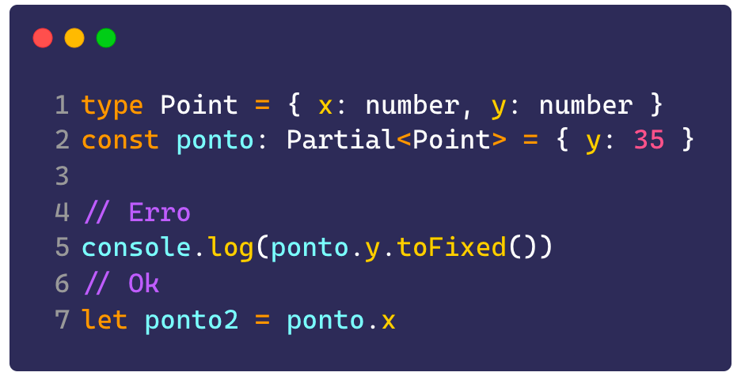

See how the call to `toFixed` throws an error, as it should, because we need to check whether the property exists. But we can still assign a non-existent value to a variable anyway, in our case `x`.

> I want to make it clear that, in this specific case, assigning `x` to a variable wouldn't make that much of a difference, because TS is going to type `ponto.x` as `number | undefined` anyway, meaning we'll have to check either way.

This happens because, even though we know our object only has one of the keys, TS can't infer that correctly, since the only information we gave it was that our object might have one or two properties. But if we use the `satisfies` operator, things change:

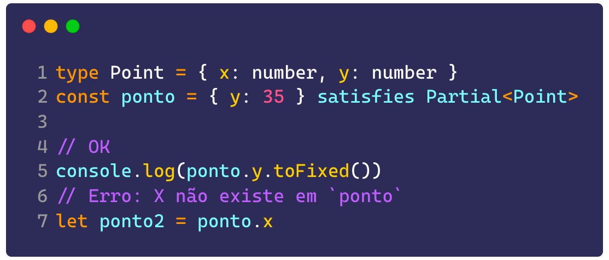

Now we get the correct inference, and `ponto` gets typed as `{ y: number }`. It's as if the compiler took your variable's value, went to the object you defined as `satisfies`, looked at it, and gave you back only the properties from your variable that actually exist in that object.

Another pretty interesting use for satisfies is guaranteeing that different properties get different types starting from a more generic type, for example, a mixed object:

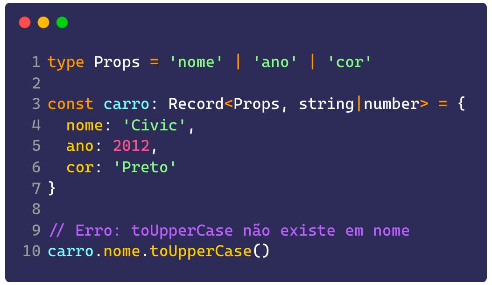

See how we can't use the `toUpperCase()` method, because the `string | number` union doesn't have that method, even though `nome` is a string. But if we tell TS that this more specific object satisfies a more generic shape, then we get the correct inference:

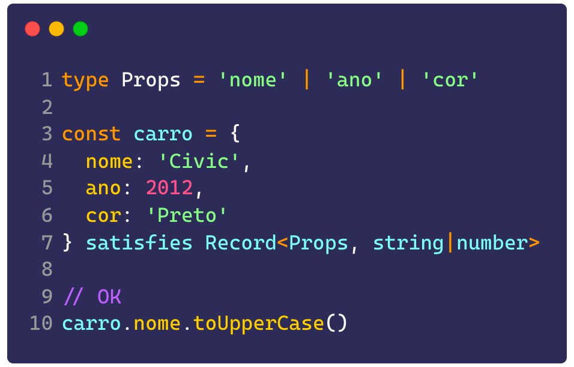

Now, the type of `carro` is going to be `{ nome: string, ano: number, cor: string }` instead of a `Record<Props, string|number>` that types every value as `string | number`.

> Notice that, in both examples, we had to strip the type annotation off the variable and pass it directly to `satisfies`.

### Deep inference with `as const`

This case deserves its own section, because it's one of the coolest ways to use `satisfies`. But you can also tell TS a value is a constant, using `let v = 20 as const`, and TS will type that value as `type v = 20`, a **literal type**.

Let's say we have an object holding an API's routes. That object has the following interface:

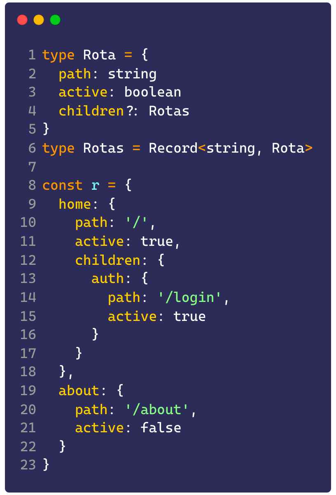

So far, TS's type inference is typing this object like this:

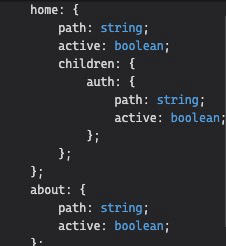

If we use `satisfies Rotas` at the end of the object, we're going to change that inference a bit:

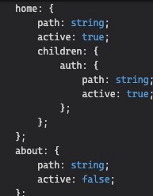

See how the booleans are now literal `true` or `false`. But if we have a function like this:

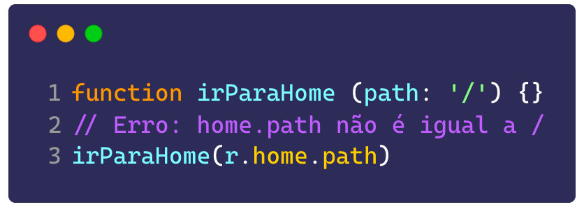

We can't call our route, because the literal type `/` is different from the more generic `string` type. To fix that, let's use `as const` on our object:

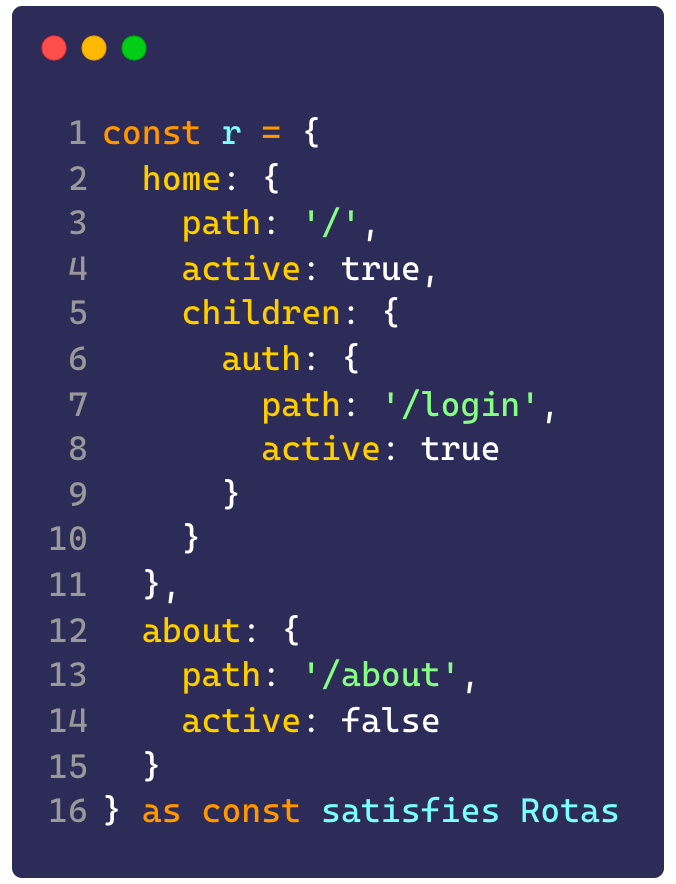

And now let's look at our types again:

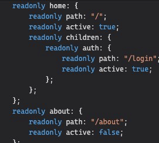

See how they're now fully inferred as readonly and with literal types, which lets us pass the correct value to our function.

## Branded types

Branded types are a way to validate certain kinds of data against a specific pattern. For example, if we want to validate that a monetary value is valid, we need two pieces of information: the currency and the amount of that currency.

But every currency, even with matching values, is completely different: we can't pay 100 reais for something that costs 100 dollars, because R\$100 isn't the same as \$100. That's what **branded types** are for.

Branded types are types that carry a _mark_ (brand) or _tag_, and they can be defined like this:

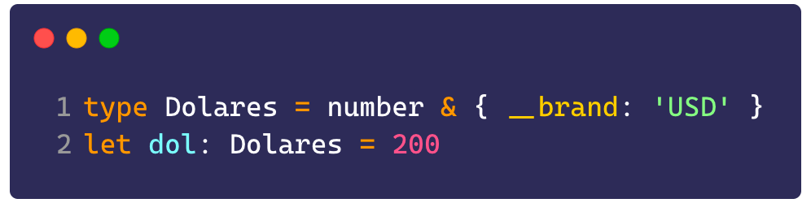

The intersection of two types is a new type containing both types' properties. By default (though not mandatory), a branded type is the merge of a primitive type with an object that contains `__brand` or `__tag` (with 2 `_`).

> This is a community convention, you can name your object whatever you want.

But notice that if you try to run this code, we'll get an error saying we can't assign `200` to `Dolares`. That's because no branded type is assignable by default, they need to be forced or verified.

We'll talk more about verification in a bit, but for now let's pull off a little trick just so I can show you what these are actually used for:

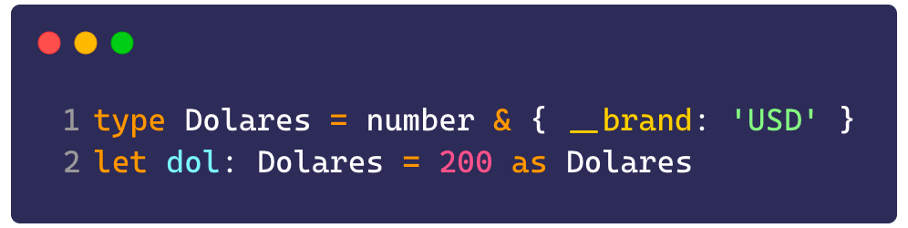

Now let's say we have to convert between our currencies. For that, let's create a function like this:

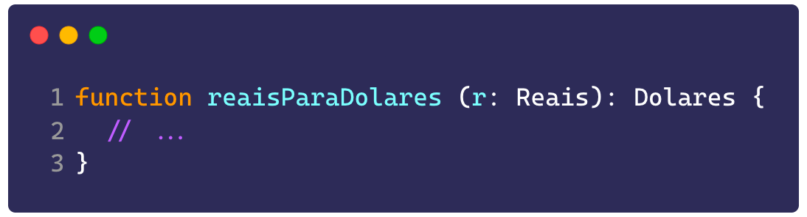

Now we have a function that **only accepts reais** and **only returns dollars**. That way, we guarantee these functions' return values aren't just the plain `number` primitive, but a variation of it that can't be specified directly.

If we create a type for reais and call the function, we won't get any error:

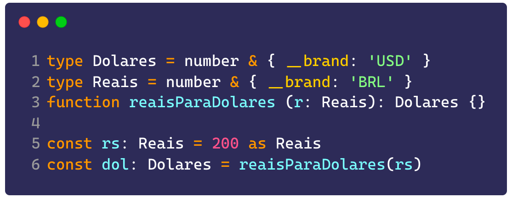

This is how you work with branded types: they need to come in either as already-verified parameters, or as external data that needs to be verified and converted into a _branded_ type.

> **Note:** NEVER use a direct type cast (with `as <type>`) to create a branded type, we're about to look at safer ways to do that.

Going back to yesterday's generics topic, can you see a way to improve our branded type? We can use a generic to create a `Branded<T,B>` type:

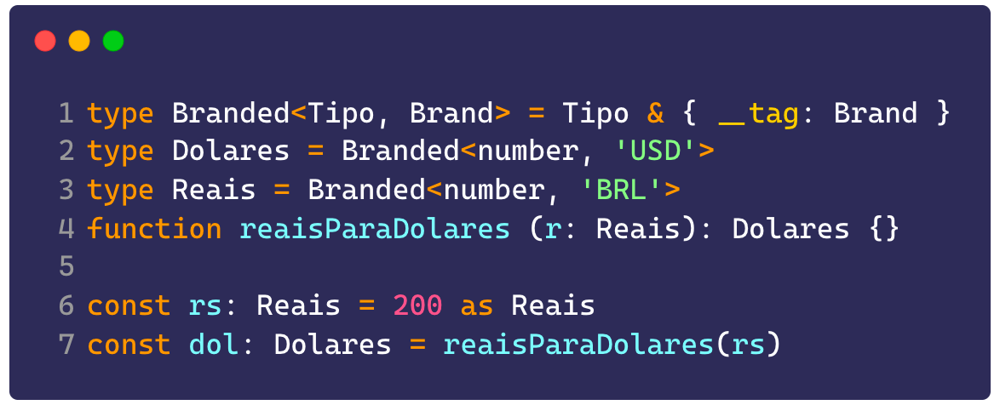

## Type Guards and Assertion Functions

These are the two ways we can verify and cast a normal type into a branded type, like I mentioned before. While both can be used for the same purpose, **assertion functions** and **type guards** are fundamentally different.

### Assertion Functions

Assertion functions, as the name says, are functions that make sure a given value is of a certain type. If it isn't, we get an error. In TypeScript, assertion functions are defined with the `asserts <value> is <type>` keyword:

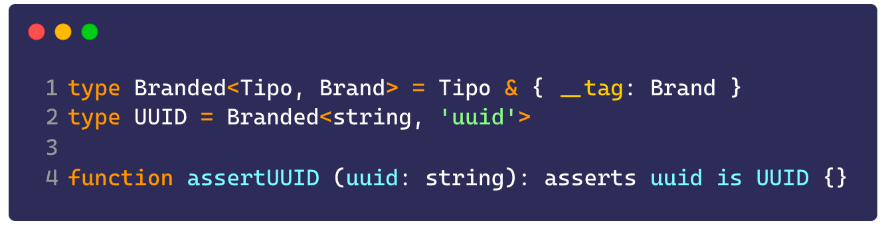

This is a very useful example to show off the power of branded types together with assertion functions. When we're working with databases, we need to guarantee a given value is a UUID and not just any regular string. For that, we use an assertion function like this:

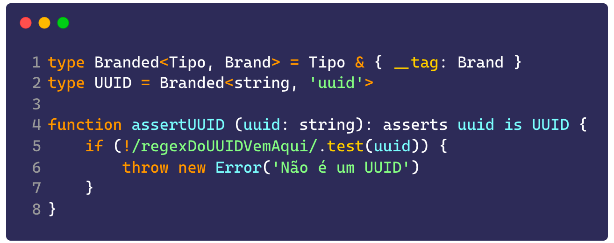

See how we throw an error if our regex doesn't match. That guarantees whatever needs that string afterward, it's going to be a UUID.

> If you want to know what the UUID regex is, the one I cut for space, here it is [here](https://ihateregex.io/expr/uuid/): `^_[0__-__9a__-__fA__-__F]_{8}\b-_[0__-__9a__-__fA__-__F]_{4}\b-_[0__-__9a__-__fA__-__F]_{4}\b-_[0__-__9a__-__fA__-__F]_{4}\b-_[0__-__9a__-__fA__-__F]_{12}$`

That way, we can use it like this:

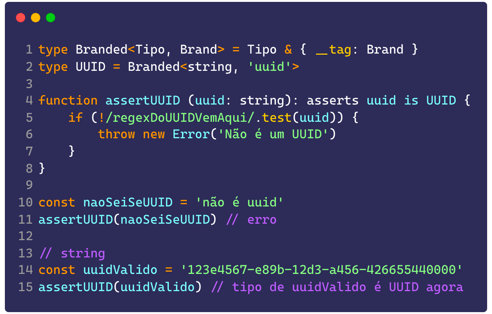

### Type Guards

Type guards are almost exactly the same thing as assertion functions, except that instead of throwing an error, they return a boolean guaranteeing the value is of a certain type, using the `<value> is <type>` syntax:

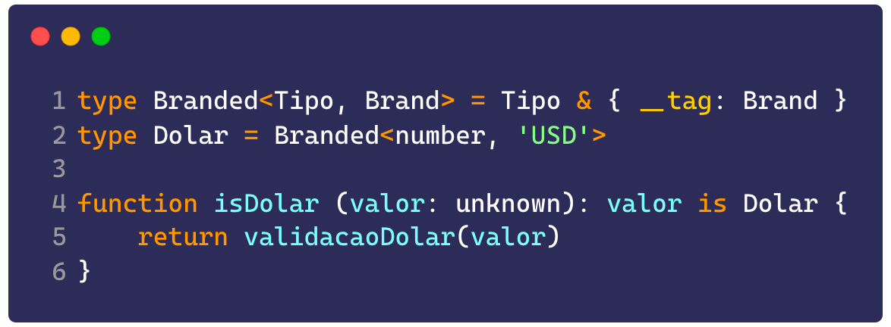

Type guards are really useful when you want to validate a type but don't want the app to throw an error and halt execution, which comes in handy, for example, if your value can be converted into the type you need later on.

Together with assertion functions, type guards are the safest ways to guarantee that a given value belongs to a certain "brand", but of course you can also use regular functions that return the value as `valor as Brand`, as long as you've already done the validation before returning.

## Enums

Enums have been present in most statically typed programming languages forever. But they're [still not a reality in JavaScript](https://github.com/rbuckton/proposal-enum). TS implements the enum pattern, and enums themselves aren't considered an advanced technique, but knowing when to use them and when not to sure is.<Sidenote>My former coworker, Robin Pokorny, has [a really good article](https://robinpokorny.com/blog/typescript-enums-i-want-to-actually-use/) about this on his blog. I'll try to sum up this point with my own opinions, but it's worth the read.</Sidenote>

There are plenty of people against enums and plenty in favor of them, I personally like using them a lot, but we have to agree they come with downsides, mainly because they're **the only TS construct that generates JavaScript code**. That's right, if you write an enum like this:

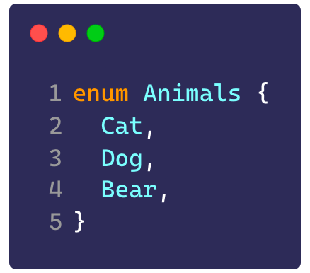

Unlike what TypeScript does with the rest of the types (the so-called _type erasure_), erasing them from the final code, this enum is going to be represented like this in the real, production code:

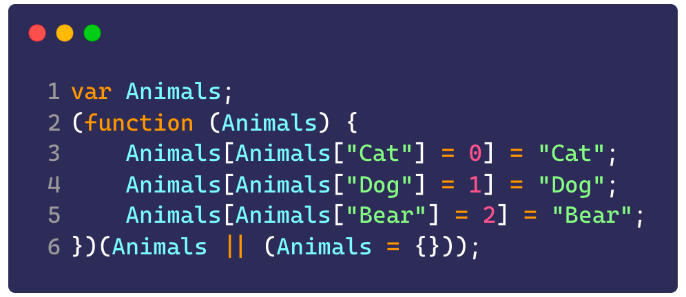

This happens because enums can be used both as types and as values:

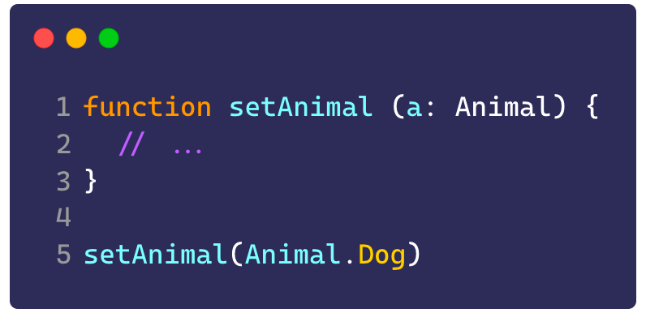

In the function above, you can see that the `a` parameter is of type `Animal`, and we call the function with the enum's value. An important detail: **we can't use the string**, meaning we couldn't call `setAnimal('Dog')`, because `'Dog'` isn't a value of the enum.

> That's not a huge problem, but unfortunately, when we get values from outside sources like APIs and so on, we have to do a type cast in some cases to satisfy the enum.

Personally, I don't see a problem, especially since we're not going to see this code or touch it by hand, but a lot of people think it's not a good option. So what are the other options?

### Disjoint unions

Another way to build enums is using disjoint unions, which are unions of literal types:

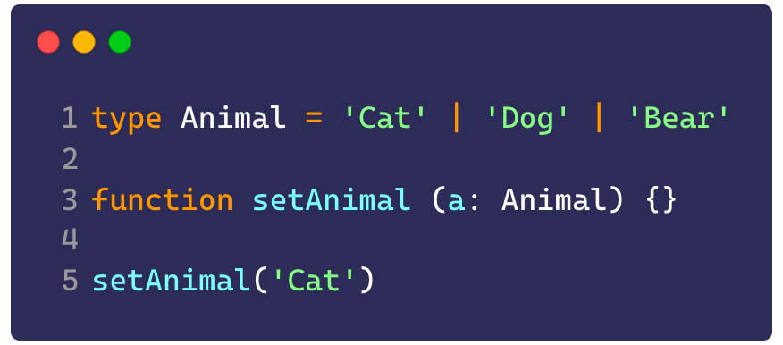

Here we don't have the enum's code, but we also can't use its types anywhere, which means we end up with these strings scattered loose across the code. In a large system, that can get pretty problematic.

> You could even "solve" this by assigning each value to a constant and using the constants as parameters, but that's not much better.

### Dictionary of constants

Another approach is creating a dictionary:

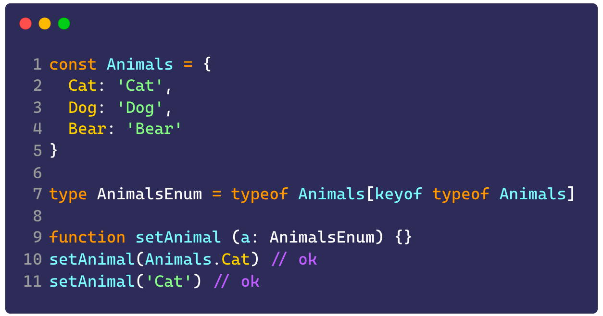

It lets us use both the strings and the dictionary's value, but we could pass any string in there and it would still work, which is terrible.

To fix that we can use a constant dictionary of constants (confusing, I know), basically it's just adding `as const` at the end, which turns the object into a disjoint union of strings:

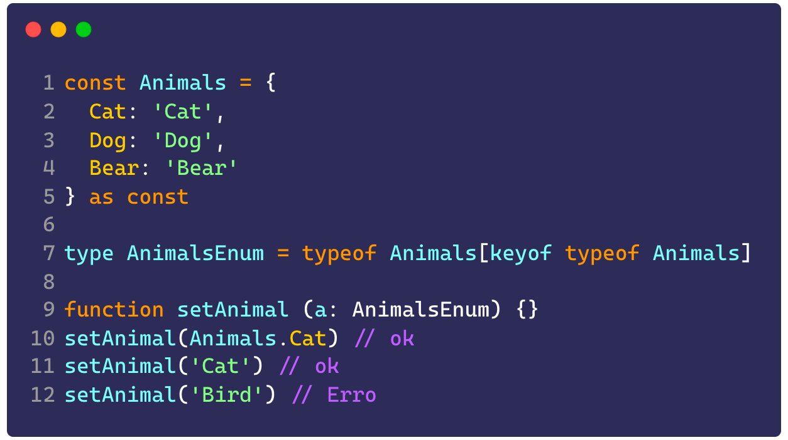

### Constant enums

There's another way to declare an enum, a constant enum. That means when you compile the code, every value that was used from the enum gets placed literally in the final code, like this:

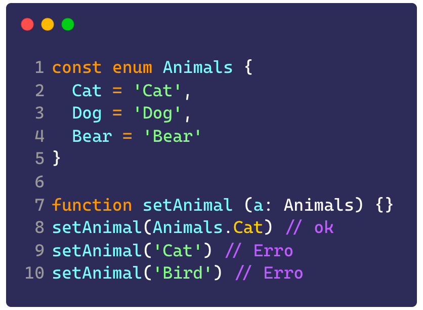

In this code, besides not being able to use the values as strings (because we have an enum), the final JavaScript looks like this:

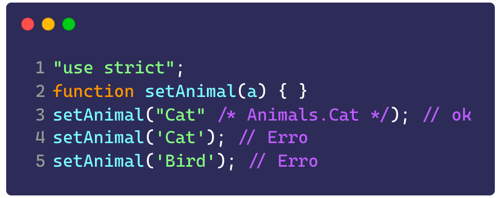

See how the enum stops existing, if it weren't for the comment, you wouldn't even know it's an enum. That's great when you're building your own applications, because there's a noticeable drop in memory usage and a speed boost in large projects, but [the official documentation itself](https://www.typescriptlang.org/docs/handbook/enums.html#const-enums) says they shouldn't be shared with other projects, like we talked about on day 2 with declaration files.

> The only way to share const enums is by turning on a setting called [`preserveConstEnums`](https://www.typescriptlang.org/tsconfig#preserveConstEnums), which essentially makes the const enum behave like a regular enum.

## For you to practice

Let's go over yesterday's exercises? The Flatten and FlattenDeep types can be found [here](https://www.typescriptlang.org/play?#code/PTAEGUEsFsAcBsCmBnAUAFwJ60aAYvAIbrqIB2APACqiIAepZAJsqIWZgNoC6AfKAF5QNeoxagAFJDIAzRACdQAVQCUPUAH5loAFzDUqEKACMoAPYBXUACZUAYzNlk6NnoLFGFTgHJj3gDSg3tbefIJBIYZgzvLSAOb2js6gAEZuRCTkFDHxPPxCvt4GUaAAIgCi4ACCeACSAPIlALQtrW1tBkYAciikTBjYuO6ZZKWIiLDUtAzk4uyY+cLTYqxSsgrKatygqKCa2qKzq9JyigAKWzt7e1rDjGMTFGf8u9d6Sq96VJ3R6LFkCQcThcdnSHnID0mnGhnByAO4CLCBT8P1AZAs0BSCkSwNATDBI0hFHRmIUi1sJXgkFI8kIkDQQOSiAJ93GUMKgR8IU53gAzAFQNDvAAWAU+ACsoURCMWhVQQA). Already the class implementation can be found [here](https://www.typescriptlang.org/play?#code/JYOwLgpgTgZghgYwgAgGIHsoFs7IN4BQyycUEuAFAJQBcyIArlgEbRHIBu6ANkytXUYs2AXwIEE3OAGdpyAIoM4AEygr0yYFgAO3CFgjg5GbLkLEE6ENLBQGCMJmQUy6kNwCeyKcvSCmrFBU+GLE7KTkAvQB0PjsxGRgDFAgyGAAFsDSAHQ+GgBU+cgATOxi7Fy8BlFCgXHEyInJqRlZuerIhcgAzGUE5ZIycgDCwFAIDNwaWrr6hmDGmDj1jeS+7l7KwHAGtn7RwlDslta29o5Qzq7rno1wwPu10MHmDa05WzsQe8gAvHcPfKlYjlYgRSgveKrJIpZAAWTgGWyAAUAJKdeGI9LZbToADuFHe2TUDwANCUqH0Kjw+M5IQ1oc1nAAWDEIpFotlYnH4wmZHIk9Dk7pUKgAel6IP64kGsmQABUoNsQABzSbTHR6AxGNBLMzHKw2OwOJwuNZWW7MGQQfyHcnXC1eODcGFwW2BF6gkiuOkrBLfJl8tpW6QoIpE52u4JikpU4iVWnUfDIMUx5FK6TLWzKtVSI4NJqwiOuJPh-nZSPJOB9ERAA).

For today's challenge:

-   Using the type declarations we saw before, extend JavaScript's native `setTimeout` and `setInterval` methods to return a branded type of `TimeoutID` and `IntervalID`, then extend the `clearTimeout` and `clearInterval` functions to accept only the branded types as parameters, not just any number.

> Don't forget to leave your feedback about #SemanaTS here [in this form](https://forms.gle/6hAqjVmah9uyR4by8)!
