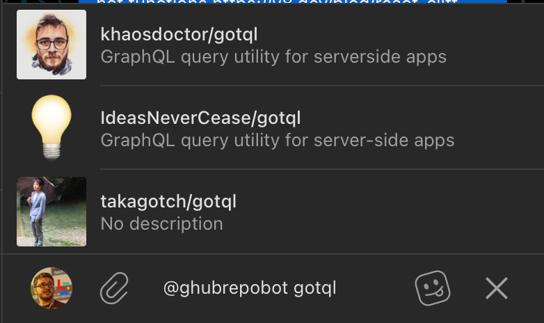

When we talk about modern applications, we inevitably end up running into the famous bots. Using bots to automate tasks, or even to make communicating with APIs easier, is becoming more and more common, and one of the platforms where bots keep popping up more and more is [Telegram](https://telegram.org/).

I personally hadn't ventured much into the world of bots until recently, but in that adventure I found a fantastic tool that makes creating (and even revolutionizes) the way you build bots for Telegram: [GrammY](https://grammy.dev/).

In this article we're going to build a bot that searches GitHub repositories and sends them into a chat inline, meaning we'll just type `@bot` and the repository name so it searches for the repository based on whatever we typed.

But first, let's understand how a Telegram bot's message flow actually works.

## How a Telegram bot works

Telegram is known worldwide for being a platform that's simple both to use and to extend. And through extensions, we get several kinds of bots we can build, using the full power of the platform to create buttons, menus, and even entire sites that get shown back to users. Actually, a big chunk of Telegram itself runs on bots.

All of your bot's interaction with Telegram happens based on a _webhook_, meaning that for every new event, whether it's a new message or any other activity that happened directly with your bot or in some group it's part of, a `POST` request gets sent to an address you define for the bot.

> Your webhook address isn't set by default, but we'll define one a bit later with a specific endpoint.

Every type of message update on Telegram creates an event. This event can be one of the types [described here in the docs](https://core.telegram.org/bots/api#update). The response is always a JSON with an `update_id` key, and the next key is the type of event that was sent. For example, if we're receiving an update for a message being sent, then we're expecting an event of type `message`, so the payload we'll get looks like this:

```json
{
    "update_id": 821159882,
    "message": {
        "message_id": 1600269,
        "from": {
            "id": 172983467,
            "is_bot": false,
            "first_name": "Lucas",
            "last_name": "Santos",
            "username": "lhs_santoss",
            "language_code": "en"
        },
        "chat": {
            "id": 172983467,
            "first_name": "Lucas",
            "last_name": "Santos",
            "username": "lhs_santoss",
            "type": "private"
        },
        "date": 1664119114,
        "text": "Teste"
    }
}
```

Everything inside the `message.from` field relates to the user who sent the update event, and everything inside the `message.chat` key relates to **the chat where the bot was triggered**.

To answer a request, we can either respond to the update call itself with the result we want to send back (it could be another message, a keyboard, an inline query, and so on), or we can send a response directly to Telegram's bot API, which is `https://api.telegram.org/bot<token>/<method>`, where the token is your bot's token from BotFather and the method is one of the [methods described here in the docs](https://core.telegram.org/bots/api#available-methods).

So I could send a message back to a user who sent me a message, on top of answering the original request, by using the request `https://api.telegram.org/bot123456:ABC-DEF1234ghIkl-zyx57W2v1u123ew11/sendMessage` with the parameters [described here](https://core.telegram.org/bots/api#sendmessage).

## Creating your first bot

To start building a bot on Telegram, you first need to talk to another bot called **BotFather**. Just click [this link](https://t.me/BotFather) to talk to it directly.

Then just type `/newbot` and answer the questions it asks you.

> Remember that every Telegram bot needs a username that ends in `bot`, and it's pretty hard to find a valid name that isn't taken yet.

Once you're done, the bot will reply with an access token, **keep that token safe**, because that's what we'll use to control your bot.<Sidenote>If you want to understand this a bit more, [the official docs have a full guide](https://core.telegram.org/bots#3-how-do-i-create-a-bot)</Sidenote>

With that done, let's expose a local port to the cloud so we can connect our bot and test our messages. We can do that with [ngrok](https://ngrok.io), just download and install the NGROK binary and run the command:

```bash
ngrok http <your-port>
```

In my case I'll be using 8000, so I'll type `ngrok http 8000`, and ngrok's response locks up your shell and gives you a link that looks something like `https://<string>.<region>.ngrok.io`, in my case it was `https://fb83-80-216-0-139.eu.ngrok.io`.

Using your favorite request tool ([insomnia](https://insomnia.rest/), [postman](https://www.postman.com/)), make a GET request to `https://api.telegram.org/bot<token>/setwebhook?url=<yourngrokurl>`, keeping in mind that the URL needs the full protocol in front of it, so in my case it would look like this:

```
https://api.telegram.org/bot1234512345:ABCDEFABCDEFABCDEFABCDEFABCDEF-AbcdefAbcdef/setwebhook?url=https://fb83-80-216-0-139.eu.ngrok.io
```

You should get a response like:

```json
{
  "ok": true,
  "result": true,
  "description": "Webhook was set"
}
```

Now we can start coding our bot!

## **GrammY**

[GrammY](https://grammy.dev/) is a library built exclusively for creating Telegram bots, abstracting away the tedious part of having to manage the entire conversation context and flow by hand. On top of that it supports plugins and can be extended with a bunch of really cool features that make building a Telegram bot even easier.

If you want to check out the traditional way of building bots, take a look at this point in the repository of the bot we're about to build:

https://github.com/khaosdoctor/telegram-gh-bot/tree/af0f3b1f71d7687eebc3537bf7e22cfb14d2a411

And compare it with the final version we're going to build in this article:

https://github.com/khaosdoctor/telegram-gh-bot/tree/main

### Deno

GrammY is a framework built especially for use with [Deno](https://deno.land), and I personally think that's fantastic because it lets you run TypeScript straight from the compiler, plus dependency resolution inside a Deno file, through modules being imported directly by URL, is a lot simpler and more direct.

So the first step is installing the Deno runtime on your machine to get access to the `deno` command.

## Setting up the project

To set up your environment using Deno, if you're using VSCode, just install [the official Deno extension](https://deno.land/manual@v1.25.4/vscode_deno) and create a new folder, open that folder in VSCode and, using `CTRL/CMD + SHIFT + P`, look for **"Deno Initialize workspace configuration"**.

That's going to create a new `.vscode` folder and a `settings.json` file inside it. Let's leave it like this:

```json
{
  "deno.enable": true,
  "deno.unstable": true,
  "editor.codeActionsOnSave": {
    "source.fixAll": true,
    "source.organizeImports": true
  },
  "editor.defaultFormatter": "denoland.vscode-deno"
}
```

Now let's create the base files. This part comes down to taste, but I like creating a `src` folder with all the source files together and leaving the config files at the root.

Let's start by creating the `import-map.json` file, which creates a mapping between base site names and libraries into a simpler alias, let's leave it like this:

```json
{
  "imports": {
    "x/": "https://deno.land/x/",
    "std/": "https://deno.land/std@0.156.0/"
  }
}
```

This tells Deno that whenever we import something like `x/name` it should replace `x/` with `https://deno.land/x/` plus our package name, just a shortcut so we don't have to type out the whole site every time.

Now we can point Deno to this file and also create the equivalent of our NPM scripts in the `deno.json` file, which is the equivalent of `package.json`:

```json
{
  "importMap": "./import-map.json",
  "tasks": {
    "start": "denon run -A ./src/utils/pooling.ts",
    "setWebhook": "deno run -A ./src/utils/setWebhook.ts"
  }
}
```

Here I have two tasks, one is `start`, which will boot up our bot, and the other is `setWebhook`, which will create the webhook programmatically the way we were doing before. We haven't created either of them yet, but we will soon.

Notice I'm using `denon`, which is the Deno equivalent of `nodemon`, to install this package just run `deno install -qAf --unstable https://deno.land/x/denon/denon.ts`

With the setup done, let's create an environment variables file called `.env` and put in the following variables:

```bash
BOT_SECRET="Any random string"
BOT_TOKEN="Your bot's token"
GH_API_TOKEN="A github token"
```

For `BOT_SECRET`, generate a sequence of 64 random characters, this is going to be a security key to guarantee your bot is who it says it is.

For `BOT_TOKEN` we'll use the token BotFather gave us, and finally let's head to [GitHub](https://github.com/settings/tokens) to create a new token, it doesn't need any permissions since we're only going to use the API to search repositories, which doesn't require any special access.

## Building the bot

First, let's create the `src` folder and inside it a file that's going to be our config file, from there we'll pull in every system variable once. Let's call this file `config.ts`:

```ts
import * as dotenv from 'std/dotenv/mod.ts'
await dotenv.config({ export: true })

export const config = {
  bot: {
    token: Deno.env.get('BOT_TOKEN') ?? '',
    secret: Deno.env.get('BOT_SECRET') ?? ''
  },
  gh: {
    token: Deno.env.get('GH_API_TOKEN') ?? ''
  }
}
export type AppConfig = typeof config
```

We're importing `dotenv`, the module that loads environment variables straight from a `.env` file, notice we're importing just `std/dotenv` instead of using the whole original URL path.

Next, let's create a file that'll make our lives easier whenever we need to set up our webhook again if we ever need to. Let's create a `utils` folder and inside it a `setWebhook.ts` file.

In this file we'll import the `Bot` object from GrammY, which represents the entire interface to Telegram's bot API, and our config file.

```ts
import { Bot } from 'x/grammy@v1.11.0/mod.ts'
import { config } from '../config.ts'
```

Now let's start a new bot with our token by calling the init function:

```ts
import { Bot } from 'x/grammy@v1.11.0/mod.ts'
import { config } from '../config.ts'

const bot = new Bot(config.bot.token)
await bot.init()
```

By default GrammY has an API that wraps every other Telegram API and creates an easy to use interface, but if you need or want to call a method directly from the API, you can use the `bot.api` object, which has every method with its parameters.

Remember we called `https://bot.telegram.org/bot<token>/setWebhook`? So let's use the `bot.api.setWebhook` function and pass our program's first parameter to it, also sending our bot's secret, the whole file ends up like this:

```ts
import { Bot } from 'x/grammy@v1.11.0/mod.ts'
import { config } from '../config.ts'

const bot = new Bot(config.bot.token)
await bot.init()
await bot.api.setWebhook(Deno.args[0], { secret_token: config.bot.secret }).then(console.log)
```

### Splitting off the search

Since we're building a bot to search GitHub, the idea is that we'll type `@ourbot <repository name>`, and from there we can search by user or repository name with no problems, so let's split this feature off from the rest of the bot to keep everything organized.

Let's create a folder called `core` and inside it a `gh.ts` file. From here on we'll use the _fetch API_ to make calls directly to the GitHub API, but first let's define our types.

A GitHub item has a response that looks like this:

```ts
export interface GHSearchItem {
  id: number
  name: string
  full_name: string
  owner: {
    login: string
    id: number
    avatar_url: string
    url: string
    html_url: string
  }
  html_url: string
  description: string
  fork: boolean
  stargazers_count: number
  watchers_count: number
  language: string
  forks_count: number
}
```

While the full API response result looks like this:

```ts
export interface GHSearchResult {
  total_count: number
  incomplete_results: boolean
  items: GHSearchItem[]
}
```

Now let's create our search function, the idea is we'll receive the parameter we're searching for, strip the URL if there is one, and from there make the call to our endpoint and limit the result to 3 items at a time.

Our final file looks roughly like this:

```ts
import { config } from '../config.ts'

export interface GHSearchResult {
  total_count: number
  incomplete_results: boolean
  items: GHSearchItem[]
}

export interface GHSearchItem {
  id: number
  name: string
  full_name: string
  owner: {
    login: string
    id: number
    avatar_url: string
    url: string
    html_url: string
  }
  html_url: string
  description: string
  fork: boolean
  stargazers_count: number
  watchers_count: number
  language: string
  forks_count: number
}

export const search = async (query: string) => {
  const sanitized = query.replace('https://github.com/', '')
  const result = await fetch(`https://api.github.com/search/repositories?q=${sanitized}&per_page=3`, {
    method: 'GET',
    headers: {
      Accept: 'application/vnd.github.v3+json',
      Authorization: `Bearer ${config.gh.token}`
    }
  })
  return result.json() as Promise<GHSearchResult>
}
```

### The bot

Now, let's get to the main part, our bot. For this let's create a new file inside `src` called `bot.ts`, there we'll put all the logic surrounding our bot and everything it needs to work and answer messages, but we won't have it listening on the server just yet.

First let's import the `Bot` class from GrammY, along with our config and the search interface we just built:

```ts
import { Bot } from 'x/grammy@v1.11.0/mod.ts'
import type { AppConfig } from './config.ts'
import { search } from './core/gh.ts'
```

Then let's create a function called `getBot`, this function will hand us our bot already configured. The first thing we need to do is tell the bot we want to respond to a special kind of message called `inline_query`, which is when the user is typing directly in the message box.

For this, we'll have to go back to Telegram and talk to BotFather again, because by default inline mode comes turned off on the bot, so we need to send the `/setInline` command, and BotFather will ask which bot you want to change the settings for, just pick one from the list.

After picking it, send the placeholder text that'll show up while the user is searching in the next message, in our case it'll be **"Search GitHub Repos..."**. And that's it, we're all set.

Now let's go to our `bot.ts` file and create a listener for our message:

```ts
function getBot(config: AppConfig) {
  const bot = new Bot(config.bot.token)

  bot.on('inline_query', async (ctx) => {
```

Our `ctx` context object gets a bunch of properties from the Telegram request for us, like the query the user made, its type, ID and so on. And we'll check whether the query is filled in, meaning whether the user has already typed something in the query, if not, we'll respond with an empty array of results:

```ts
function getBot(config: AppConfig) {
  const bot = new Bot(config.bot.token)

  bot.on('inline_query', async (ctx) => {
    const { query } = ctx.inlineQuery
    if (!query) return ctx.answerInlineQuery([])
```

Here we're using the `ctx.answerInlineQuery` command because we want the result to be answered as a list of results that shows up at the top of the text box, and not as a message, this method takes an array of results that follows a specific shape we'll build once we have some result from GitHub.

If the user has already made a query, let's pass that query on to GitHub and check whether we got any result, this is pretty simple because GitHub returns a total result count in the response:

```ts
function getBot(config: AppConfig) {
  const bot = new Bot(config.bot.token)

  bot.on('inline_query', async (ctx) => {
    const { query } = ctx.inlineQuery
    if (!query) return ctx.answerInlineQuery([])

    const results = await search(query)
    if (results.total_count <= 0) return ctx.answerInlineQuery([])
```

If we find something, let's respond using `ctx.answerInlineQuery` with the result of a `map` over the GitHub results array, building our message.

The inline query response object follows this structure:

```ts
interface AnswerInlineQuery {
    type: 'article' // Fixed
    id: string // Unique ID for the response item
    title: string // Response title
    url: string // Response item URL
    cache_time?: number // How long the response stays cached on Telegram
    input_message_content: { // Content of the message sent when the response is selected
    	message_text: string
        parse_mode: 'Markdown'|'HTML'|'MarkdownV2'
    }
    hide_url: boolean // Whether the URL should be hidden in the results list
    description: string // Result description
    thumb_url: string // Result thumbnail
}
```

We have all of this information straight from the GitHub API, we just need to build our object like this:

```ts
function getBot(config: AppConfig) {
  const bot = new Bot(config.bot.token)

  bot.on('inline_query', async (ctx) => {
    const { query } = ctx.inlineQuery
    if (!query) return ctx.answerInlineQuery([])

    const results = await search(query)
    if (results.total_count <= 0) return ctx.answerInlineQuery([])

    return ctx.answerInlineQuery(
      results.items.map((item) => ({
        type: 'article',
        id: item.id.toString(),
        title: item.full_name,
        url: item.html_url,
        cache_time: 300,
        input_message_content: {
          message_text: `[${item.full_name}](${item.html_url})
  _${item.description || 'No Description'}_

  *Stars:* ${item.stargazers_count}
  *Forks:* ${item.forks_count}
  *Language:* ${item.language}`,
          parse_mode: 'Markdown'
        },
        hide_url: true,
        description: item.description || 'No description',
        thumb_url: item.owner.avatar_url
      }))
    )
```

Notice I'm sending Markdown text in the message body, this text gets sent once the user selects that result. You can change this to return whatever you find coolest.

Finally we return the bot and export our function, the whole file ends up like this:

```ts
import { Bot } from 'x/grammy@v1.11.0/mod.ts'
import type { AppConfig } from './config.ts'
import { search } from './core/gh.ts'

function getBot(config: AppConfig) {
  const bot = new Bot(config.bot.token)

  bot.on('inline_query', async (ctx) => {
    const { query } = ctx.inlineQuery
    if (!query) return ctx.answerInlineQuery([])

    const results = await search(query)
    if (results.total_count <= 0) return ctx.answerInlineQuery([])

    return ctx.answerInlineQuery(
      results.items.map((item) => ({
        type: 'article',
        id: item.id.toString(),
        title: item.full_name,
        url: item.html_url,
        cache_time: 300,
        input_message_content: {
          message_text: `[${item.full_name}](${item.html_url})
  _${item.description || 'No Description'}_

  *Stars:* ${item.stargazers_count}
  *Forks:* ${item.forks_count}
  *Language:* ${item.language}`,
          parse_mode: 'Markdown'
        },
        hide_url: true,
        description: item.description || 'No description',
        thumb_url: item.owner.avatar_url
      }))
    )
  })
  return bot
}

export { getBot }
```

## Putting it all together

To glue every piece together, let's create the `src/mod.ts` file, which is Deno's main entry point. In it we'll boot up our bot using webhooks, and for this we'll need to import the `webhookCallback` function from GrammY, which exists exactly to set the bot up to listen to certain requests using a standard web server, in our case `std/http`.

First let's import everything we need:

```ts
import { webhookCallback } from 'x/grammy@v1.11.0/mod.ts'
import { serve } from 'x/sift@0.5.0/mod.ts'
import { getBot } from './bot.ts'
import { config } from './config.ts'
const bot = getBot(config)
```

Now let's set up our response handler for the server:

```ts
import { webhookCallback } from 'x/grammy@v1.11.0/mod.ts'
import { serve } from 'x/sift@0.5.0/mod.ts'
import { getBot } from './bot.ts'
import { config } from './config.ts'
const bot = getBot(config)

const handleUpdate = webhookCallback(bot, 'std/http', { 
	secretToken: config.bot.secret 
})
```

The `handleUpdate` function is what GrammY returns when we tell it to create a response object for `bot` using `std/http` as the server. That said, we're not using Deno's native module to create a web server, but Sift instead, which is a web framework for building servers without straying too far from Deno's own defaults.

The idea is we have a `serve` function, just like we do in `std/http`, but we can pass a config object to this function, where each key is the route we're listening on, and the key's value is the response handler:

```ts
import { webhookCallback } from 'x/grammy@v1.11.0/mod.ts'
import { serve } from 'x/sift@0.6.0/mod.ts'
import { getBot } from './bot.ts'
import { config } from './config.ts'
const bot = getBot(config)

const handleUpdate = webhookCallback(bot, 'std/http', { secretToken: config.bot.secret })

serve({
  '/': (req) => {
    return req.method === 'POST' ? handleUpdate(req) : new Response('Not found', { status: 404 })
  }
})
```

Notice we're always listening on the `/` route, and when we detect the route isn't a POST, we respond with a 404 status, otherwise we pass our request on to the bot.

## Testing locally

To test locally we can start our bot with `denon run -A ./src/mod.ts` and it should already be listening successfully on whatever port we set.

> If you get an error when running it, try caching the dependencies locally with `deno cache --reload ./src/mod.ts` or `CMD + SHIFT + P` in VSCode and look for "Deno: Cache" and select "Deno: Cache Dependencies"

Now just head over to Telegram and make requests using your bot's @:



However, this method requires that we always have a URL to set our webhook to, which can be a problem, since that URL can change. Because of that, one of the best ways to test locally is to use a long polling setup instead, which will periodically check for new events on Telegram.

This is super simple, all we need to do is start our bot in a mode other than WebHooks, let's create a new file at `utils/pooling.ts`:

```ts
import { getBot } from '../bot.ts'
import { config } from '../config.ts'

const bot = getBot(config)
bot.start({
  onStart: ({ username }) => console.log(`Bot started as @${username}`),
  drop_pending_updates: true
})
```

By default, GrammY's `bot.start` will boot the bot in long polling mode, while you need to explicitly tell it to start in Webhook mode instead.

After that, just run our task in Deno with `deno task start` and we'll get the same result.
