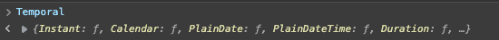
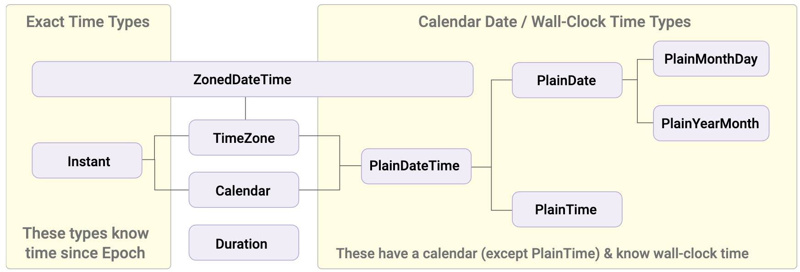

It's no secret that JavaScript's date API needs an urgent fix. For a long time now, plenty of devs have complained that it isn't very intuitive and isn't very reliable either. On top of that, the date API has some conventions that are, let's say, less than orthodox, like starting months at 0 instead of 1.

Let's go through all of `Date`'s problems and understand how the new `Temporal` API promises to solve them. We'll also look at why we're getting a whole new API for this instead of just fixing what we already have.

## The problems with `Date`

As Maggie Pint points out [on her blog](https://maggiepint.com/2017/04/09/fixing-javascript-date-getting-started/), it's common knowledge by now that [Brendan Eich](https://twitter.com/BrendanEich) had 10 days to write what would become known as JavaScript and ship it in the now-defunct Netscape browser.

Date handling is a very important part of any programming language, none can be launched (or even considered complete) without something to deal with the most common thing in our day-to-day lives: time. The problem is that implementing an entire date-handling domain isn't trivial at all, if it's not trivial for _us_ today, and we just use it, imagine for whoever has to implement it, so Eich leaned on the instruction "it should look like Java", which he'd been given to build the language, and copied the `java.Util.Date` API, which was already bad and got almost entirely rewritten in Java 1.1, that's 24 years ago now.

Building on that, Maggie, Matt and Brian, the main committers of our beloved [Moment.js](https://momentjs.com), put together a list of things JavaScript's `Date` left to be desired:

1.  `Date` doesn't support timezones beyond UTC and the user's local time: there's no native way to display a date conveniently across multiple timezones, all we can do is manually calculate an offset to add to UTC and modify the date that way.
2.  The date parser is pretty confusing on its own.
3.  The `Date` object is mutable, so some methods change the reference of the original object, breaking a global implementation.
4.  DST (Daylight Saving Time) support is something that's still kind of esoteric in most languages, and JS is no different.
5.  Anything you need to do to do math with dates will eventually make you cry inside. That's because the API doesn't have simple methods for adding days or calculating intervals, you have to turn everything into a unix timestamp and do the math by hand.
6.  We forget that the world is a big place, and there isn't just one type of calendar. The [Gregorian calendar](https://en.wikipedia.org/wiki/Gregorian_calendar) is the most common in the West, but there are other calendars we should support too.

A bit further down in that same post, she talks about how some of these things are "fixable" by adding extra methods or parameters. But there's another factor we have to take into account when dealing with JavaScript that we probably wouldn't have to think about in other cases.

Compatibility.

## Web Compatibility

The web is a big place, and as a consequence, JavaScript became absurdly big too. There's a very famous saying that goes:

> If it can be done with JavaScript, it will be done with JavaScript.

And that's very real, because everything that was possible and impossible has already been done at least once in JavaScript. And that makes things a lot harder, because one of the main principles of the Web, one that TC39 follows to the letter, is **_"don't break the web"_**.

Today, in 2021, we have JavaScript code from legacy applications from the 90s being served all over the web, and while that can be commendable, it's also extremely worrying, because any change has to be considered very carefully, and old APIs, like Date, can't just be deprecated.

And the biggest problem with the Web today, and consequently with JavaScript, is immutability. If we think in terms of the DDD model, our objects can be defined as entities whose state changes over time, but we also have _value types_, which are defined only by their properties and not by their state or ID. Looking at it from that angle, `Date` is clearly a _value type_, because even though we have the same `Date` object, the date `10/04/2021` is clearly different from `10/05/2021`. And that's a problem.

Today, JavaScript treats objects like `Date` by reference. So if we do something like this:

```js
const d = new Date()
d.toISOString() // 2021-09-23T21:31:45.820Z
d.setMonth(11)
d.toISOString() // 2021-12-23T21:31:45.820Z
```

And that can give us plenty of problems, because if we have helpers like the ones we always end up writing, `addDate`, `subtractDate` and so on, we'll usually take a `Date` parameter and the number of days, months or years to add or subtract, and if we don't clone the object into a new one, we'll mutate the original object instead of its value.

Another problem, also mentioned in [this other article by Maggie](https://maggiepint.com/2017/04/11/fixing-javascript-date-web-compatibility-and-reality/), is what she calls the _Web Reality issue_, meaning a problem whose solution came about not because it made the most sense, but because the Web already worked a certain way, and changing it would break the Web.

This is the problem with parsing an ISO8601 date. I'll simplify the idea here (you can read the full breakdown on her blog), but the gist is that JS's default date format is ISO8601, our famous `YYYY-MM-DDTHH:mm:ss.sssZ`, which has formats that are _date-only_, covering only the date part, like `YYYY`, `YYYY-MM` and `YYYY-MM-DD`. And its _time-only_ counterpart, which only covers variations containing something time-related.

However, there's a line that changed everything:

> When the timezone offset is absent, date-only forms are interpreted as UTC time, while date-time forms are interpreted as local time.

This means `new Date('2021-04-10')` will give me a date in the UTC timezone, something like `2021-04-10T00:00:00.000Z`, but `new Date('2021-04-10T10:30')` will give me an ISO8601 string in my local time. This problem was partially fixed back in 2017, but there's still plenty of discussion about how the parser behaves.

## Temporal

The [Temporal proposal](https://github.com/tc39/proposal-temporal) is one of the oldest open TC39 proposals, and also one of the most important. As of this article's publication, it's at [stage 3](https://github.com/tc39/proposals#stage-3), which means most of the tests already pass and browsers are nearly ready to implement it.

The idea behind the API is to have a global object as a namespace, the same way `Math` works today. On top of that, every `Temporal` object is completely immutable, and all values can be represented in local values but can be converted into the Gregorian calendar.

Other assumptions are that leap seconds aren't counted and all times are shown on a traditional 24h clock.

You can try `Temporal` directly in the [documentation](https://tc39.es/proposal-temporal/docs/cookbook.html) using the polyfill already included in the console, just hit F12, go to the `console` tab, type `Temporal` and you should see the result of the objects.



Every `Temporal` method starts with `Temporal.`. If you check in your console, you'll see we have five types of entities under temporal:

-   **Instant**: an _Instant_ is a fixed point in time, without accounting for a calendar or a locale. So it has no notion of time values, like days, hours or months.
-   **Calendar**: represents a calendar system.
-   **PlainDate**: represents a date that isn't tied to a specific timezone. We also have the `PlainTime` variant and the local variants `PlainMonthYear`, `PlainMonthDay` and so on.
-   **PlainDateTime**: the same as `PlainDate`, but with hours.
-   **Duration**: represents a stretch of time, for example, five minutes, generally used for doing arithmetic operations or conversions between dates and measuring differences between `Temporal` objects themselves.
-   **Now:** a modifier for all the types above, fixing the reference time as being now.
-   **TimeZone:** represents a timezone object. Timezones are heavily used to convert between `Instant` objects and `PlainDateTime` objects.

The relationship between these objects is described as hierarchical, so we have the following:



Notice that `TimeZone` implements every type of object below it, so it's possible to get any object from it. For example, starting from a specific TimeZone, we can get every object from it at a specific date:

```js
const tz = Temporal.TimeZone.from('America/Sao_Paulo')
tz.getInstantFor('2001-01-01T00:00') // 2001-01-01T02:00:00Z
tz.getPlainDateTimeFor('2001-01-01T00:00Z') // 2000-12-31T22:00:00
```

Let's go through the main methods and things we can do with Temporal.

### Getting the current date and time

```js
const now = Temporal.Now.plainDateTimeISO()
now.toString() // Returns in ISO format, equivalent to Date.now.toISOString()
```

If you only want the date, use `plainDateISO()`.

### Unix Timestamps

```js
const ts = Temporal.Now.instant()
ts.epochMilliseconds // unix in ms
ts.epochSeconds // unix in seconds
```

### Interoperability with Date

```js
const atual = new Date('2003-04-05T12:34:23Z')
atual.toTemporalInstant() // 2003-04-05T12:34:23Z
```

### Interoperability with inputs

We can set `date`-type inputs using `Temporal` itself. Since these values accept dates in the ISO format, any date set on them as `value` can be retrieved through Temporal:

```js
const datePicker = document.getElementById('input')
const today = Temporal.Now.plainDateISO()
datePicker.value = today
```

### Converting between types

```js
const date = Temporal.PlainDate.from('2021-04-10')
const timeOnDate = date.toPlainDateTime(Temporal.PlainTime.from({ hour: 23 }))
```

Notice that we converted an object with no time into a `PlainDateTime` object, by passing another `PlainTime` object as the time.

### Sorting `DateTime`

Every `Temporal` object has a `compare()` method that can be used inside `Array.prototype.sort()` as the comparison function. With that in mind, let's picture a list of `PlainDateTime`s:

```js
let a = Temporal.PlainDateTime.from({
  year: 2020,
  day: 20,
  month: 2,
  hour: 8,
  minute: 45
})
let b = Temporal.PlainDateTime.from({
  year: 2020,
  day: 21,
  month: 2,
  hour: 13,
  minute: 10
})
let c = Temporal.PlainDateTime.from({
  year: 2020,
  day: 20,
  month: 2,
  hour: 15,
  minute: 30
})
```

Then we can write a comparison function to feed our array:

```js
function sortedLocalDates (dateTimes) {
  return Array.from(dateTimes).sort(Temporal.PlainDateTime.compare)
}
```

And then:

```js
const results = sortedLocalDates([a,b,c])
// ['2020-02-20T08:45:00', '2020-02-20T15:30:00', '2020-02-21T13:10:00']
```

### Rounding types

Temporal's time types have a method called `round`, which rounds the objects to the next full value depending on the time unit you're after. For example, rounding to the next full hour:

```js
const time = Temporal.PlainTime.from('11:12:23.123432123')
time.round({smallestUnit: 'hour', roundingMode: 'ceil'}) // 12:00:00
```

## Conclusion

`Temporal` is the tip of a massive iceberg we call "temporal handling". There are several key concepts, like [ambiguity](https://tc39.es/proposal-temporal/docs/ambiguity.html), that need to be taken into account when working with times and dates.

The `Temporal` API is our first real chance to change the way JavaScript looks at dates and how we can improve the way we work with them. This was just a slice of what's possible and how it'll be done going forward, read the [full documentation](https://tc39.es/proposal-temporal/docs/) to learn more.
