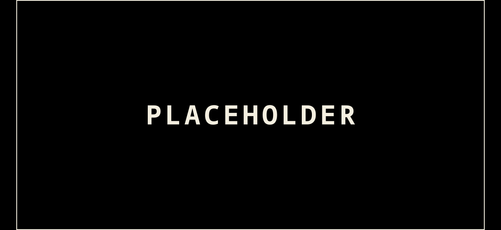

Isto é o arquivo do [[theme-lab]]. Cada bloco aqui é um candidato que perdeu uma decisão e continua funcionando, com os
mesmos botões e sliders que tinha quando estava na página principal.

Ele existe por um motivo prático: a página viva só deve mostrar o que ainda está em aberto, senão ela cresce até
ninguém conseguir comparar nada. E existe por um motivo melhor: a opção recusada é metade do argumento. Um texto que
diz "escolhi X" não vale nada; um que mostra o Y que foi testado, funcionando, e diz por que ele perdeu, vale a
leitura. Quando eu escrever sobre como esse redesenho foi decidido, é daqui que vêm os exemplos.

Nada foi apagado, então nada aqui é uma captura de tela morta. Os componentes moram em `components/` ao lado deste
arquivo e continuam sendo compilados pelo build como qualquer outra ilha do site. Os controles compartilhados (os
sliders, os seletores, a conta de contraste) continuam importados do laboratório vivo, para um candidato aposentado
não virar motivo de duplicar código.

## As fontes de corpo que perderam

A decisão de tipografia fechou em duas fontes, não uma: Literata como padrão e Atkinson Hyperlegible como a opção sem
serifa, porque o menu de preferências vai oferecer as duas. Treze fontes ficaram no caminho, e elas são o argumento
inteiro deste arquivo.

Cinco disputaram o corpo de verdade, medidas contra um post inteiro com citação, tabela, código e nota de rodapé, e não
contra quatro parágrafos limpos. É essa diferença que derrubou a favorita: a IBM Plex Mono ganhava fácil em prosa lisa
e caiu no primeiro trecho de código inline, porque num blog sobre código um parágrafo monoespaçado e um `trecho` deixam
de ser distinguíveis. A Handjet caiu por ser condicional, só legível a 22px exatos. A Inter e a Roboto caíram para a
Atkinson na mesma vaga, e a Source Serif 4 caiu para a Literata pelo motivo contrário: uma foi desenhada para papel, a
outra para tela.

As outras oito nunca disputaram o corpo. Foram o levantamento de fonte pixelada, e servem para mostrar onde um bitmap
funciona (etiqueta, título curto) e onde ele desmonta (qualquer coisa com mais de quarenta palavras).

Cada uma aqui renderiza de verdade, no tamanho em que foi julgada, sobre os dois fundos do site. Nenhuma tem slider: não
há mais o que decidir, e um controle numa decisão fechada só convida a reabrir.

<LabDemo src="./components/RetiredFaces.vue" client:visible />

## A capa em textmode

O segundo candidato de animação virou a primeira tentativa de capa: em vez de fundo ambiente, a biblioteca monta um
cartão, pintando o fundo de cada célula (`cellColor`, que é a técnica de gradiente por sombreado do ANSI) e desenhando
uma moldura `╔═╗` de caracteres em volta.

Ele perdeu por ser a mesma decisão duas vezes. A seção da capa no laboratório vivo faz o mesmo trabalho em `<svg>` de
verdade, na proporção final de 1200x630, que é o formato que o `sharp` rasteriza no build sem passar por canvas nem por
WebGL. Ter duas bancadas de capa lado a lado só dividia a atenção, e a de SVG é a que vira código de produção.

O que ele deixou de aprendizado está registrado aqui porque custou tempo: um `<canvas>` sem atributos mede 300x150, e a
biblioteca usa um canvas externo como está, então o primeiro quadro nascia nesse tamanho e ficava impresso no canto como
uma cópia menor da cena; a tela de abertura da biblioteca, se o loop parasse no meio do fade dela, deixava a moldura do
splash impressa por cima; e a caixa preta atrás do texto, quando foi adicionada para o título parar de se perder na
arte, deixou a tinta de uma paleta escolhida para fundo claro em 1,54:1, o que é pior do que o problema que ela
resolvia. Os três são o mesmo tipo de erro: assumir o que está atrás do que você está desenhando.

<LabDemo src="./components/TmCover.vue" client:visible />

## O título sobre o campo animado

O primeiro candidato de todos, e o mais próximo da captura que começou este trabalho: um título de post sobre um campo
de caracteres animado em WebGL2. O texto é HTML de verdade por cima do canvas, então continua selecionável, continua no
leitor de tela e sobrevive se o WebGL não subir; o canvas só faz o fundo, e é `aria-hidden`.

Perdeu pela mesma decisão que aposentou o sólido: o blog vai ter quase nenhuma animação, e o único lugar com movimento
constante é o logo. Um campo animado atrás de cada título de post é o oposto disso.

Vale guardar pelos quatro movimentos, que são bem diferentes entre si e cada um é uma referência: a onda concêntrica é
a do exemplo oficial da biblioteca, a chuva de coluna é a herança óbvia do Matrix, o ruído perlin é uma névoa que não
repete e a grade cruzada é a mais próxima de uma tela de BBS. A densidade em 0% apaga o campo inteiro, o que também era
uma resposta válida à pergunta. Se algum dia uma página só, tipo a "sobre", quiser um fundo desses, o candidato está
aqui pronto.

<LabDemo src="./components/TmHeading.vue" client:visible />

## O sólido em ASCII

O terceiro candidato de animação: um sólido girando, resolvido em caracteres pelo pipeline 3D do textmode.js, com
malha, câmera e luz. A ideia era usar ele no 404, na página "sobre", ou como o único ornamento de um rodapé.

Ele perdeu por uma decisão maior do que ele: o blog vai ter quase nenhuma animação, e o único lugar que ganha
movimento constante é o logo. Um sólido girando não é um logo, e era o candidato mais caro dos três, um loop de WebGL2
que nunca para sozinho. O que ficou no lugar são os candidatos de animação do logo, na seção 04 do laboratório vivo.

Vale guardar porque ele é a demonstração mais completa do que a biblioteca faz além de pintar caracteres: aqui tem
projeção, `perspective`, `camera`, luz ambiente e luz pontual. Também é o candidato que ensinou duas coisas por errar
primeiro: `frameCount` é um getter e chamar como função derrubava a cena inteira, e sem `camera()` a biblioteca começa
com o olho dentro do toro, o que renderizava a parede interna do tubo como um campo verde com um buraco preto no meio.

<LabDemo src="./components/TmSolid.vue" client:visible />

## A seção "What will you create?" em CSS

O quarto candidato de animação, e o mais útil dos recusados: exatamente o efeito da captura que começou este trabalho,
a linha que se digita sozinha com um cursor de bloco, reproduzida sem WebGL nenhum, só DOM e CSS.

Ele perdeu por não ser deste blog. É a página da textmode.art, com o prompt, o `[ ler o começo ]` entre colchetes e o
título com uma palavra em destaque. Copiar o layout de outra pessoa é referência, não identidade, e a decisão de ter
quase nenhuma animação tirou o pouco que restava de razão para ele existir aqui.

Vale guardar por um motivo específico, e é o mais importante deste arquivo: ele é a prova de que o efeito da captura
nunca precisou da biblioteca de WebGL. Ler o fonte da textmode.art mostrou que a linha digitada é um componente Vue de
umas quarenta linhas, sem canvas nenhum, e este candidato existe para demonstrar isso lado a lado com o candidato que
carrega cento e noventa quilobytes para chegar num resultado parecido. Quem for comparar custo com aparência num
redesenho tem aqui os dois lados montados.

Os colchetes em volta do texto do botão são `::before` e `::after`, então o botão continua sendo um botão, focável, e o
leitor de tela não anuncia os colchetes como conteúdo. Esse detalhe sobreviveu à decisão e vale para qualquer botão do
site.

<LabDemo src="./components/CssHeading.vue" client:visible />

## A bancada de tipografia, com as duas que ganharam

A decisão do corpo fechou em Literata para o padrão e Atkinson Hyperlegible para a opção sem serifa, com as medidas de cada uma aplicadas no site (`src/styles/theme.css`). O painel saiu do laboratório vivo porque não sobrou pergunta nele, e continua aqui inteiro, funcionando.

Vale guardar por uma razão que não é a fonte: este é o único candidato do redesenho que não renderiza amostra nenhuma. O que ele controla é o post de verdade dentro do próprio painel, markdown puro passando pelo mesmo remark e pelo mesmo rehype de qualquer post do blog, com citação, callout, tabela, código, nota lateral e nota de rodapé no lugar. Mexer num slider muda o post, não uma maquete dele.

Foi essa diferença que decidiu a disputa, e é o argumento inteiro: a IBM Plex Mono ganhava com folga enquanto a amostra era prosa lisa, e caiu no primeiro `trecho de código inline`, que numa fonte monoespaçada deixa de se distinguir do parágrafo em volta. Nenhuma amostra de quatro parágrafos limpos mostraria isso. As treze recusadas estão logo acima.

Os sliders de espaçamento existem por causa da regra 1.4.12 do WCAG, que não pede que o texto já venha espaçado, e sim que ele não quebre quando o leitor força entrelinha 1,5, entreletra 0,12em e entrepalavra 0,16em.

<LabDemo src="./components/TypeSpecimen.vue" client:visible>

<div id="lab-post">


### Uma consulta DNS, do clique ao pacote

Digitar um domínio na barra de endereço parece instantâneo, mas embaixo dele existe uma cadeia inteira de perguntas e respostas que a maioria dos programadores nunca vê. O **DNS** não guarda um mapa completo em lugar nenhum: ele guarda pedaços, cada um numa autoridade diferente, e monta a resposta perguntando de cima para baixo. É essa indireção, e não um banco de dados gigante, que faz o sistema aguentar bilhões de nomes sem cair.

O primeiro lugar que o navegador olha é o próprio cache: o do processo, depois o do sistema operacional. Se o nome já foi resolvido há pouco, a resposta sai dali e nenhum pacote sai da máquina. Quando o cache está frio, a pergunta sobe para um resolvedor recursivo, quase sempre o do provedor de internet ou um público como `1.1.1.1`. É esse resolvedor que faz o trabalho pesado <u>em nome do cliente</u>, um passo de cada vez, e é por isso que ele se chama recursivo: ele não devolve uma resposta parcial, insiste até ter a definitiva.

#### Os registros que valem a pena entender

Nem todo registro DNS guarda o mesmo tipo de coisa, e confundir um pelo outro é o erro mais comum de quem configura um domínio pela primeira vez.

| Tipo    | Guarda                              | Exemplo comum                  |
| ------- | ------------------------------------ | ------------------------------- |
| `A`     | Um endereço IPv4                     | apontar um domínio para um servidor |
| `AAAA`  | Um endereço IPv6                     | o mesmo, na versão nova do IP  |
| `CNAME` | Um apelido para outro nome           | `www` apontando para o domínio raiz |
| `MX`    | Para onde vai o e-mail do domínio    | delegar e-mail a um terceiro   |
| `TXT`   | Texto arbitrário                     | provar que você é dono do domínio |
| `NS`    | Quem é a autoridade daquela zona     | delegar um subdomínio inteiro  |

A consulta raramente para no primeiro registro encontrado. Um `CNAME` manda o resolvedor perguntar de novo pelo nome novo, e essa cadeia pode ter vários elos antes de chegar a um `A` de verdade.<Sidenote>Uma cadeia de `CNAME` longa demais é uma causa clássica de lentidão silenciosa: cada elo é uma volta extra ao resolvedor, mesmo que cada volta individual seja rápida.</Sidenote> Nenhum desses registros expira sozinho: quem decide por quanto tempo ele fica em cache é o `TTL`, um número em segundos que acompanha cada resposta.<MarginNote>Um `TTL` baixo demais multiplica o tráfego sobre a autoridade; um `TTL` alto demais atrasa qualquer correção depois de um erro de configuração. A prática comum é baixar o `TTL` horas antes de uma migração planejada e subir de volta depois que o novo endereço já se espalhou.</MarginNote>

> A internet inteira funciona porque ninguém precisa saber o endereço de ninguém, só o nome.

Essa ideia não é nova. Ela é, na prática, o mesmo argumento que David Wheeler fez sobre indireção em geral, décadas antes do DNS existir na forma atual:

> [!quote] David Wheeler
> Todo problema em ciência da computação pode ser resolvido com mais uma camada de indireção, exceto o problema de camadas demais.

O DNS é essa camada aplicada a nomes: ~~um índice fixo~~ um sistema hierárquico e distribuído, e é exatamente por ser distribuído que ele sobrevive à queda de qualquer servidor isolado, inclusive um dos treze grupos de servidores raiz.

Uma função mínima de resolução, só para deixar o fluxo concreto, cabe em poucas linhas:

```ts
// src/dns/resolve.ts
export async function resolveA(hostname: string): Promise<string[]> {
  const response = await fetch(`https://dns.example/resolve?name=${hostname}&type=A`)
  const { answers } = await response.json()
  return answers.map((record: { data: string }) => record.data)
}
```

E o mesmo resultado, olhando pela linha de comando em vez de código, com a ferramenta que qualquer administrador de rede usa primeiro para depurar um domínio:

```bash
dig +noall +answer example.com A
```

> [!NOTE]
> `dig` sem nenhuma opção já mostra a resposta completa; `+noall +answer` só corta o ruído do cabeçalho e da seção de autoridade.

> [!TIP]
> Rodar `dig` contra um resolvedor específico com `dig @1.1.1.1 example.com` é o jeito mais rápido de saber se o problema está no cache local ou na configuração real do domínio.

> [!WARNING]
> Um `TTL` de zero não é "sempre atual": é uma sobrecarga garantida no resolvedor, porque nenhuma resposta fica em cache nem por um segundo.

> [!IMPORTANT]
> O DNS não é criptografado por padrão. `DNS over HTTPS` e `DNS over TLS` existem justamente para esconder qual nome está sendo resolvido de quem está observando a rede no meio do caminho.

> [!QUESTION]
> Se o resolvedor do provedor já é rápido o bastante, vale a pena trocar para um público só por causa da privacidade, ou isso é otimizar o elo errado da corrente?

Antes de apontar um domínio novo em produção, a checklist de sempre é curta, mas pular um item dela é a causa mais comum de incidente evitável:

- [x] Conferir o `TTL` atual antes de mudar qualquer registro
- [x] Confirmar que o `NS` da zona aponta para a autoridade certa
- [ ] Testar a resolução a partir de uma rede fora do escritório
- [ ] Esperar o `TTL` antigo expirar antes de considerar a migração terminada

A imagem abaixo não tenta ilustrar nada disso: é só um retângulo no preto de fundo do site, para conferir se a legenda nasce do lugar certo.



O que fica desse passeio inteiro é uma lista curta do que já foi conferido nesta bancada:

- Ênfase: negrito, itálico, riscado e sublinhado
- Código inline e blocos cercados, com e sem nome de arquivo
- Citação simples e citação com autor
- Cinco tipos de callout, não só um
- Nota de rodapé, nota lateral e nota de margem
- Imagem com legenda vinda do título, não do texto alternativo

---

Se este parágrafo já cansou de ler, a fonte do corpo respondeu antes de qualquer slider precisar responder por ela. A hierarquia inteira do DNS existe porque ninguém confia num único ponto central, e o mesmo raciocínio vale para escolher uma fonte de corpo: nenhum julgamento vindo de uma linha só resolve a pergunta.[^1]


</div>

</LabDemo>

[^1]: Mockapetris, P. *Domain Names, Concepts and Facilities*, RFC 1035, IETF, 1987.

Uma fonte de bitmap só fica nítida em múltiplo inteiro do tamanho em que foi desenhada. Falar isso não convence ninguém, então aqui está a escada: a mesma palavra de 8 a 32px, com os tamanhos que fecham no grid marcados e os outros mostrando o borrão.

<LabDemo src="./components/WholePixel.vue" client:visible />

## A paleta, com o tom decidido por cor e por fundo

A disputa da seção 01 nunca foi sobre quais cores usar: as cinco da marca já estavam certas desde o início. Era sobre o tom certo de cada uma, por fundo, porque a cor que passa em contraste no escuro não é a mesma que passa no claro: o vermelho pede uns 6% de escurecer para passar em 4.5:1 no fundo claro, o amarelo pede uns 48%, oito vezes mais. É por isso que cada cor e cada fundo ganharam o próprio seletor em vez de um ajuste geral, e é essa diferença que fechou a decisão: o tom de cada cor, por fundo, está aplicado em `src/styles/theme.css`. O painel saiu do laboratório vivo porque não sobrou pergunta nele.

Vale guardar por um motivo que não é a cor final: a rampa de cada seletor já abre no primeiro tom que passa em 4.5:1, então o que está impresso aqui é a mesma leitura que qualquer pessoa veria abrindo o painel sem mexer em nada. E o achado tinha precedente independente no próprio código antes desta bancada existir: `--em-italic-fg`, em `src/styles/theme.css`, já escurecia o amarelo da marca perto desse mesmo tanto para o itálico do modo claro.

<LabDemo src="./components/PaletteLab.vue" client:visible />

## Os efeitos de tubo, que voltaram para onde começaram

Scanline com passo separado, brilho, granulado, vinheta e cintilação, tudo começando em zero de propósito: a pergunta da bancada nunca foi quanto de scanline usar, foi se scanline serve para alguma coisa. O dono arrastou os seis controles e terminou onde tinha começado: fundo claro, scanline 0%, passo 2px, brilho 0%, granulado 0%, vinheta 0%, cintilação desligada. A leitura nesse ponto: 16,79:1 sem o efeito, 16,79:1 na linha escura da scanline, AAA, custo 0,00. O próprio ajuste já é o veredito.

A conta em `docs/theming.md` explica por que ele não sobreviveu a nenhum valor acima de zero. Uma linha de scanline preta cobre texto e fundo por igual, e sobre um fundo já escuro a perda inteira cai no texto: âmbar sobre preto cai de 11,46:1 para 6,52:1 na receita clássica de CSS (`rgba(0,0,0,0.25)` a cada 2px) e para 3,31:1 a 50% de alfa, abaixo do piso de corpo de texto. Um guia de estilo de 2026 recomenda 0,06 de alfa, faixa em que o efeito quase não aparece. É a mesma conclusão dos dois lados: scanline só é segura numa faixa em que ela não está fazendo trabalho nenhum; fora dela, ela come contraste.

Tem uma segunda razão, e não é sobre contraste. Das referências modernas de estética de terminal olhadas nesta pesquisa, nenhuma usa scanline, nem o Ghostty, que embarca um shader de scanline no próprio terminal e o mantém fora do site de divulgação dele. De tudo que foi olhado, scanline é o único elemento que lê como fantasia em vez de projeto de tipo, exatamente a linha que o brief original tinha traçado ao chamar scanline de talvez.

<LabDemo src="./components/CrtEffects.vue" client:visible />

## O cabeçalho, com quatro formas que perderam para a barra de caixa

Cinco leituras disputaram a moldura do cabeçalho e uma só ganhou: a barra de caixa `┌─┐`, a linha de desenho de caixa que abre e fecha em volta do nome e do menu, como uma janela de terminal desenhada só em caractere. As outras quatro estão aqui, lado a lado, cada uma com os mesmos controles de marca, fonte, cor, entreletra e respiro que a bancada viva usa para a barra.

`docs/theming.md` já tinha registrado o lado fraco de duas delas antes desta decisão fechar: a seção 6 chama o menu de Game Boy e a linha de DOS de cosplay, não de referência, porque as duas reproduzem uma tela específica em vez de pegar dela só o jeito de organizar informação; a seção 11 marca o menu como "o mais bonito da página e o primeiro a parar de escalar", bom para um menu pequeno e fixo, ruim para um cabeçalho que carrega o nome do site em toda página. A mesma seção 11 recomendava outra coisa: o razão `SEÇÃO 00 / ÍNDICE`, por ser a leitura mais densa das cinco. A decisão final não seguiu essa recomendação, e o arquivo não registra por quê; fica aqui como o desacordo que é, não como um veredito escondido.

O "mínimo, só uma régua" nunca teve uma crítica escrita contra ele: ele simplesmente é a leitura menos distinta das cinco, uma régua pontilhada sob o menu, perto o bastante de um cabeçalho sem estilo nenhum.

Uma coisa sobrevive intacta do candidato "linha de DOS invertida": nele o prompt é a própria marca, então nenhum logo aparece ao lado, e o prompt continua editável de verdade aqui embaixo, não uma captura congelada. O cursor de bloco e as cinco animações do wordmark não vieram junto: os dois viraram efeito e opção do candidato vencedor, nunca foram parte da disputa entre as cinco formas.

<LabDemo src="./components/RetiredChromeHeaderShapes.vue" client:visible />

## A lista de posts, com a tabela densa decidida

Sete leituras disputaram a lista de posts, a página mais visitada do site depois dos posts em si, e só uma venceu: a tabela densa de quatro colunas, data, título, seção e tempo de leitura, cada um na própria coluna, sem imagem nenhuma. As outras seis estão aqui, com os mesmos controles de fonte, pontilhado, altura de linha, entreletra e seção que a bancada viva usa para a tabela.

A razão com pontilhado foi a mais perto de vencer: o olho corre pela coluna de títulos e o pontilhado leva até a data só quando o leitor procura por ela. Ela perdeu por um motivo simples: para caber numa linha só, ela abre mão da seção e do tempo de leitura, os dois dados que a tabela mantém alinhados em coluna própria sem custar espaço a mais.

O menu de Game Boy é o mais bonito dos sete e o que menos escala: o destaque de cada linha só existe com o mouse sobre ela, e o respiro que um menu de jogo pede não é o respiro de uma lista de cem posts.

Os cartões com aresta grossa custam altura por linha (moldura dupla, aresta de 8px do lado esquerdo) para entregar o mesmo dado que a tabela já mostra sem moldura nenhuma.

A grade com capa e a lista com miniatura quadrada são os dois candidatos que carregam uma imagem por post: a grade na proporção nativa 1200x630, a miniatura recortada num quadrado. As duas perdem pelo mesmo motivo, medido no próprio painel: quanto maior a miniatura, menos linhas cabem numa janela de 900px, um custo que a tabela não paga porque não desenha imagem nenhuma.

A densidade que o leitor escolhe é o sétimo candidato: um controle que troca entre a grade e a miniatura sem trocar de página, a favor de deixar a densidade a critério de quem lê. Ela herda a limitação das duas formas que reaproveita, então não resolve o problema que a tabela resolve sozinha ao dispensar imagem. O controle em si (aqui um estado que reseta ao recarregar a bancada) também nunca chegou a virar preferência persistida: o pedido original era uma demonstração do controle, não o sistema de preferência inteiro.

<LabDemo src="./components/RetiredChromeListShapes.vue" client:visible />

## O botão, com os colchetes decididos

Cinco desenhos escondidos atrás do mesmo componente, porque a comparação pedia ver os cinco lado a lado, não julgar um candidato de cada vez: colchetes `[ ]`, bloco cheio, moldura dupla, prompt (sublinhado pontilhado com um `>` na frente) e cursor de menu (`▸` que aparece no hover e no foco). Ganharam os colchetes: Departure Mono, amarelo, respiro 11, sem entreletra, sem texto branco no bloco cheio.

Colchetes não custam nada: são `::before` e `::after`, então o botão continua um `<button>` de verdade, focável, e o leitor de tela nunca anuncia os dois caracteres como conteúdo. E seguem funcionando numa fonte sem variação de peso, o que os outros quatro tratamentos não têm de graça: o bloco cheio depende de uma cor sólida atrás do texto, a moldura dupla depende de espessura de traço, o prompt e o cursor de menu dependem de um detalhe extra (o sinal `>` ou a seta) que o `[ ]` não precisa.

Os números que fecharam a decisão, medidos no painel: contorno 9,70:1, bloco cheio 9,70:1 com texto escuro, alvo de toque de uns 38px. Duas coisas honestas em vez de arrumadas: os dois primeiros números foram medidos contra o fundo antigo `#14161a` e o amarelo antigo da marca, o par que a decisão de cor acima já substituiu, então a leitura de produção é outra; e 38px fica abaixo do mínimo de 44px que a norma pede para um alvo de toque, motivo pelo qual a versão aplicada no site não usa o mesmo respiro do painel.

<LabDemo src="./components/ChromeButton.vue" client:visible />

## O link em prosa, com o bloco invertido decidido

Seis leituras do mesmo parágrafo, lado a lado, porque a decisão é sobre link dentro de frase corrida, não sobre uma palavra isolada testada sozinha. O candidato 0 é o que o site tem hoje e nunca foi uma escolha: sem regra de cor nem de sublinhado em `.prose a`, quem decide azul e traço é o navegador. O candidato 1 é a receita real do bpaulino.com, lida do CSS compilado do site dele: sublinhado de 1px na cor accent a 40% de opacidade, 2px de distância do texto, subindo para opacidade cheia no hover. O candidato 2 é o tracejado grosso de terminal, mais afastado do texto que o normal; o traço dele sobrevive no candidato que ganhou. O candidato 3 troca sublinhado por colchetes de texto real em volta do link, sem depender de cor nenhuma como sinal: é o teste mais duro da WCAG 1.4.1 nesta bancada, porque prova que a moldura sozinha já marca o link mesmo com a cor do link igual à do corpo. O candidato 5 é um marcador de prompt (`❯`, `>` ou `_`) antes do link, reaproveitando o desenho do botão "prompt" arquivado acima.

Ganhou o candidato 4, o bloco que inverte no hover como a seleção de um terminal: em repouso quase nada, no hover o fundo vira a cor do link e o texto vira a cor do fundo da página. A decisão aplicada é um híbrido de dois candidatos: o repouso ficou com o sublinhado tracejado do candidato 2 em vez do pontilhado fino original do candidato 4, e o respiro do bloco foi para zero. Medido nesse ajuste: 10,84:1 no escuro, 6,06:1 no claro, na cor `--accent`.

O motivo de ele ter ganhado não é só o contraste, que os outros também alcançavam: é ser o único dos seis com um sinal que não é cor nos dois estados, sublinhado em repouso e inversão cheia no hover, e essa inversão é a linguagem de seleção de um terminal, não o tingimento de hover comum da web. O painel inteiro, com os seis candidatos e o número de contraste de cada um, está abaixo, ainda funcionando.

<LabDemo src="./components/LinkLab.vue" client:visible />

## A capa sem moldura

Um dos seis candidatos de capa OG/social do [[theme-lab]]: o fundo inteiro na cor da marca, sem a janela DOS por
cima, título e assinatura na tinta clara ou escura que aquela marca pedir.

Perdeu para os quatro que ficaram (janela DOS, wireframe 3D, janela DOS com fogo, janela DOS com ondas) porque o
fundo cheio na cor da marca é a leitura mais fraca de contraste das seis: o texto só tem uma tinta para escolher, e
o verde e o amarelo da marca já nascem claros demais para qualquer tinta bater 4.5:1 nas duas pontas ao mesmo tempo.
As outras quatro sempre têm um fundo escuro por baixo em algum ponto do cartão, e é aí que o texto lê melhor.

Vale guardar pela régua tracejada que esvanece para o meio do cartão: é ela quem separa o chapéu do título sem uma
linha inteira cruzando a capa, e virou referência para a régua nova do candidato 4 na bancada viva.

<LabDemo src="./components/CoverBleedLab.vue" client:visible />

## A capa em plasma

Outro dos seis candidatos de capa: um campo de três senos por trás do título, sem moldura e sem wireframe, cada
frequência e cada fase vindas de uma chamada separada do mesmo PRNG que gera o sólido do wireframe e o fogo do
candidato 5.

Perdeu por ser um candidato único demais: nem a janela DOS do primeiro candidato, nem a moldura dupla que os outros
quatro compartilham, então ele lia como uma ideia à parte da família em vez de uma variação dela. O campo que ele
usa não se perdeu com a decisão, só o cartão: o candidato 6 (janela DOS com ondas) ainda gera o mesmo campo,
quantizado em poucos tons em vez do valor contínuo daqui.

Vale guardar pelo próprio bug que ele carregou na primeira tentativa e que o comentário do gerador de campo, na
bancada viva, ainda explica: uma fase só escalada por três constantes fixas fazia o campo inteiro colapsar numa
única rampa, em vez das várias manchas de claro e escuro que sete leituras independentes do PRNG produzem.

<LabDemo src="./components/CoverPlasmaLab.vue" client:visible />

## As marcas que perderam

A seção do logo no laboratório vivo (`ChromeHeader.vue`, agora fundida com a antiga seção de interface) tinha seis jeitos de desenhar a mesma silhueta 8x8 em caractere: contorno vetorial, grade de `+`, malha ciano, retrato em ramp, dither de dois tons e pixel glitched. Só dois sobreviveram, o contorno ("fio", no espírito do wireframe da Elite de 1984) e a grade de `+` ("lattice"), agora coloridos com o mesmo seletor de acento que o resto da bancada usa.

Os quatro que perderam tinham todos o mesmo problema em graus diferentes: quanto mais peças um candidato somava por cima da silhueta (um anel de SVG, oito níveis de sombra, uma reamostragem 4x4, uma franja cromática), mais ele lia como uma imagem com efeito e menos como um desenho de terminal. O pixel glitched é o caso mais claro: tirando a franja, ele é literalmente os cinco retângulos do favicon antigo, a marca que este redesenho existe para substituir.

<LabDemo src="./components/RetiredLogoMarks.vue" client:visible />

