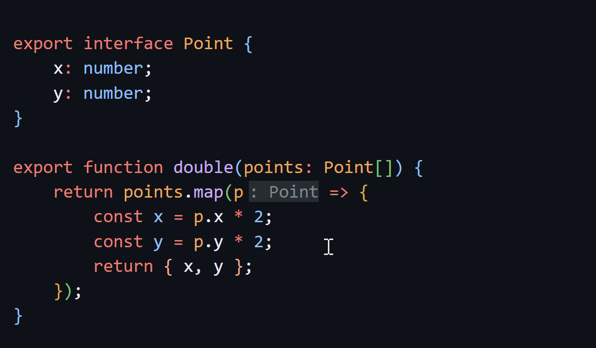

As usual, another TypeScript release is here and I'm around to tell you all about it! This time we'll even compare it to what I proposed in the [other article](/ts-53-alpha/) when we talked about the alpha version!

Let's go!

## Import Attributes

This is a feature that was already in the other article and that really got implemented. The idea behind this implementation is to keep pace with the newer version of the [proposal with the same name over at TC39](https://github.com/tc39/proposal-import-attributes).

> It's worth noting that this was the only implementation from the other article that made it through, so I need to work on my fortune-telling skills 🔮

Essentially, the main use case for this new feature is to force reading a certain module as a certain type. For example, if we want to import a JSON file strictly as JSON:

```ts
import obj from "./something.json" with { type: "json" };
```

Dynamic imports also work well with this new implementation through a second parameter:

```ts
const obj = await import("./something.json", {
    with: { type: "json" }
});
```

Two things are worth noting here. First, back in [TS 4.5](https://devblogs.microsoft.com/typescript/announcing-typescript-4-5/#import-assertions) we already had an earlier version of the same proposal when it was called **import assertions**, and that version will be gradually deprecated over time.

Second, TypeScript won't check what's inside that field, so you can put an import with any type:

```ts
import obj from './something.json' with { type: 'batata' }
```

This will work in TypeScript, but since the implementation depends on the runtime and not on TypeScript itself, your runtime might not like it.

## Interactive Inlay Hints

One of the main changes was the addition of **interactive inlay hints**. An _inlay hint_ is a gray annotation that sits in front of types in your editor. Over at [Formação TS](https://formacaots.com.br), for example, we have all of them turned on and they really help you understand what's in that variable without having to hover over it.

> [!NOTE] 🤩

Previously, they were just plain text, but now you can interact with them to go to the definition and other things.



## General Optimizations

In most releases we get performance improvements through general optimizations. In this case we had two main ones.

### **Skip JSDoc During Parsing**

Since not all applications need JSDoc as a string when parsing code, this functionality was removed from `tsc`. That means we get faster parsing in the compiler, but also lower memory usage.

Since not all applications need this, the same functionality was exposed in the API itself so they can use it. So expect tools like `ESLint` and others to get faster too.

### Union and Intersection Optimization

When TypeScript identifies a mix of a union with an intersection, like `A & (B | C)`, it transforms everything into unions of intersections, so that example becomes `(A & B) | (A & C)`. But if you have a union with 50,000 types like `A & (B | C | D ....)`, that gets really slow.

That's why new TypeScript versions will look at your original union (before transforming it into an intersection) to see if the original type is there before testing all the possibilities.

## Other Changes

- The `resolution-mode` property in type imports `/// <reference types="pkg" resolution-mode="import" />` can now be included in import assertions with `import type { tipo } from 'pkg' with { 'resolution-mode': 'require' }`
- `switch (true)` narrowing where you can now validate each `case` clause where it wasn't possible before
- Similarly, comparisons with booleans got better
- You can now narrow inside a custom `instanceof`, that's right, you can modify the comparison value of an `instanceof` through a `Symbol.hasInstance` property, and now TypeScript will take that change into account too (see examples [here](https://devblogs.microsoft.com/typescript/announcing-typescript-5-3-beta/#instanceof-narrowing-through-symbol-hasinstance))
