## O TypeScript

Para começar, nada melhor do que contar um pouco da história do TypeScript, para que ele serve e qual é o prpósito dessa ferramenta super útil nas nossas vidas. Essa história vai te ajudar a criar um contexto sobre o que é o TypeScript e qual é o problema que ele veio resolver, depois vamos mergulhar de cabeça no seu primeiro projeto e como cada parte das configurações dele funcionam!

### Contexto e história

O TypeScript começou como um projeto interno da Microsoft em 2008, e foi lançado ao público em 1 de Outubro de 2010. A ideia básica do TypeScript (e o problema que ele veio pra resolver) era a tipagem estática de código JavaScript, principalmente focado no desenvolvimento de aplicações maiores, onde o JavaScript não consegue escalar de forma eficiente (a gente vai voltar nisso).

O TS não é considerado uma linguagem em si, mas o que a gente chama de um _superset_ do JavaScript, ou seja, um superconjunto. Mas falar isso não ajudou muito não é? Então deixa eu te dar um exemplo mais prático. Isso significa que o TypeScript engloba tudo que o JavaScript já tem e estende ainda mais, portanto **todo o código JavaScript é um código TypeScript válido**, mas o contrário não é verdade, por definição.

> Vamos ver no decorrer da semana que o TypeScript é basicamente inteiro baseado em conjuntos, então esse conceito vai ficar mais claro.

Diferente de outras linguagens, o TypeScript não foi criado para substituir o JavaScript, mas sim para estender o uso dele, da mesma forma que outra ferramenta chamada Flow tinha feito anteriormente. Por isso que muita gente fala que o TypeScript em si não é uma linguagem, mas sim um sistema de tipos que é implementado sobre o JavaScript.

> A definição de um "sistema" ou um "superset" está correta, mas é meio controversa já que, por definição, um superset de uma linguagem deveria também ser considerado uma linguagem, porque, no mínimo, ele tem que conter a linguagem dentro dele.

Mas, diferentemente de outros sistemas de tipos que já vieram antes (sim, o TS não é o primeiro, e nem o segundo), o TS é considerado um sistema [Turing-Completo](https://en.wikipedia.org/wiki/Turing_completeness), isso significa que a gente pode resolver problemas de qualquer complexidade usando somente os construtos que ele oferece pra gente.

E isso é tanto verdade que existem projetos inteiros como jogos, parsers e até pequenas aplicações feitas exclusivamente usando o sistema de tipos do TypeScript, claro que, por não possuir interface, a galera achou maneiras bastante criativas de exibir saídas para os usuários.

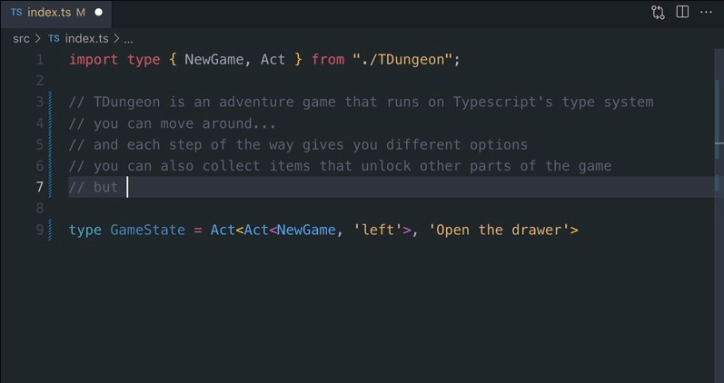

Um desses exemplos é o [`TDungeon`](https://github.com/cassiozen/TDungeon), um jogo de RPG baseado em texto que é **totalmente** feito no sistema de tipos do TS.

Quem sabe o que você pode criar com ele depois dessa semana?

Um fato interessante é que um dos principais designers e desenvolvedores do TS é um engenheiro de software dinamarquês chamado [Anders Hejlsberg](https://en.wikipedia.org/wiki/Anders_Hejlsberg) que também é o lead designer do C# e criou outras linguagens como o Delphi e o Turbo Pascal. Por isso que, à primeira vista, um código TS é muito similar a um código C#, principalmente nas estruturas.

Hoje o TS é uma das ferramentas mais usadas no mundo e uma das mais queridas por qualquer dev porque, entre muitas outras coisas, ela te ajuda a manter a sua sanidade mental em projetos muito grandes.

### Por que TypeScript?

Agora que a gente já tem o contexto de onde ele veio, bora entender o **porquê** dele existir.

Durante a minha carreira eu já trabalhei com projetos pequenos e grandes usando JavaScript. A linguagem em si não é o problema, na verdade, muitos desses projetos só foram possíveis porque o JavaScript é muito mais simples do que outras linguagens, o maior problema de longe é a escalabilidade dessas aplicações, que é um reflexo direto de o JavaScript possuir uma _tipagem dinâmica_.

> Eu já falei um pouco sobre tipagem estática e dinâmica na [minha série de artigos sobre Node.js por baixo dos panos](https://dev.to/_staticvoid/series/2080)

Vamos mostrar código. Imagina que você tem essa aplicação usando express com Node.js:

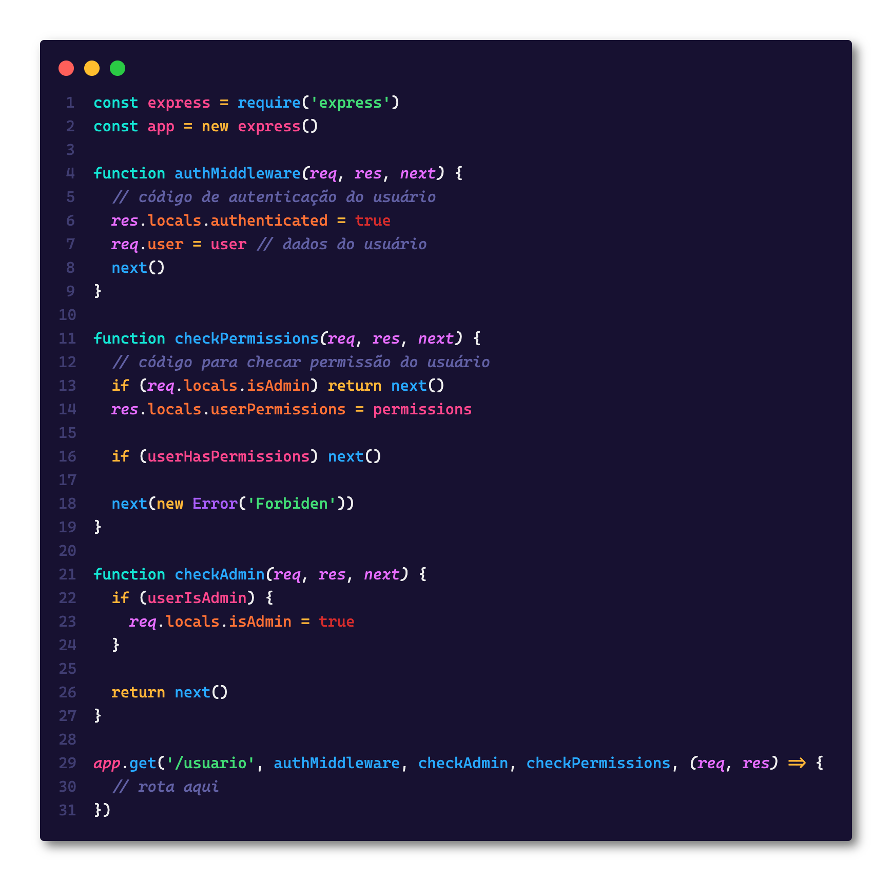

Nesse exemplo temos apenas três middlewares e já podemos ver que temos um problema em saber o que existe dentro de `res.locals`, em aplicações maiores o número de middlewares pode facilmente passar de 30 por rota (o que é uma super má prática, mas existem) nestes casos vai ser completamente impossível de saber o que existe dentro dessa variável, ainda mais se os middlewares forem definidos em arquivos separados.

Outro exemplo bastante interessante é quando temos que garantir um determinado tipo de dado, vamos supor que temos esse código:

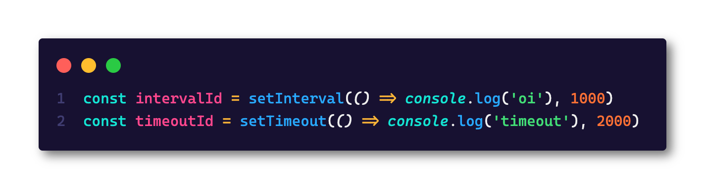

No JavaScript temos duas funções para cancelar timeouts e intervals, que são `clearInterval` e `clearTimeout`, mas elas só podem receber IDs específicos de cada um deles, se tentarmos usar `clearInterval(timeoutId)` não vamos obter nenhum resultado, e é ai que o TypeScript vai brilhar com algo do tipo:

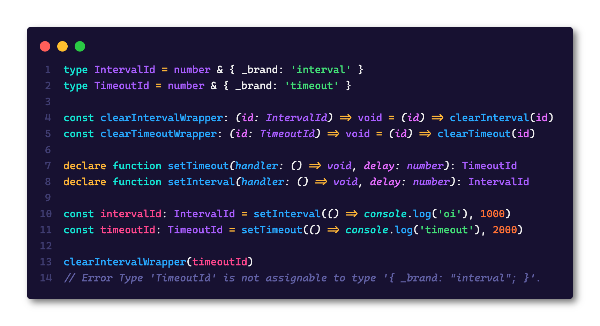

Conseguiu pegar a ideia? O objetivo do TypeScript é exatamente o seu próprio slogan: "JavaScript that scales", ou seja, "JavaScript que escala". Porque, com ele, é possível criar aplicações imensas, com muitos módulos e muita complexidade sem perder o rastro dos tipos de cada variável. O que é especialmente útil quando você está trabalhando com um time, já que o conhecimento da aplicação está distribuído entre muitas pessoas.

Outro fator bastante importante é que o TypeScript reduz drásticamente o que a gente chama de _bus factor_, que é uma analogia para a quantidade de pessoas que podem estar fora do seu projeto até ele ficar insustentável. Geralmente esse fator está muito atrelado àquelas pessoas que entraram no início do projeto e, por conta disso, tem uma bagagem muito grande sobre as regras de negócio e a própria base de código, mas se elas saírem da sua empresa o projeto acabou, porque ninguém mais sabe nada. Com o TypeScript você pode pelo menos manter um controle muito maior da base, fazendo com que a passagem de conhecimento seja muito mais simples.

O TypeScript também facilita o debug direto, ou seja, aquele debug que você nem precisa executar o código ou um asuite de testes para saber que alguma coisa está errada. Isto porque, se a tipagem estiver correta, você pode resolver problemas complexos sem sequer rodar o código uma só vez. Fora que ajuda na documentação e na arquitetura da aplicação.

Fora que o compilador do TypeScript também pode fazer várias outras tarefas além de checar os tipos, um dos usos do TypeScript também é para quebrar grandes projetos em pequenos projetos menores e juntar tudo usando um modelo de módulos que vamos ver nos próximos parágrafos.

### Primeiros passos

Te convenci que o TS vale a pena? Então bora aprender a instalar e usar todas as vantagens que ele oferece.

> Eu vou referenciar essa parte nas partes seguintes quando precisarmos instalar o TS para rodar nossos projetos

#### Criando o seu ambiente

O TypeScript pode ser executado em qualquer ambiente, da mesma forma, você pode usar qualquer editor para poder criar um arquivo TypeScript, hoje em dia a grande maioria dos editores tem suporte para a análise de tipos do TS.

Porém, a minha recomendação pessoal é o [VSCode](https://code.visualstudio.com) já que ele é o editor que foi originalmente construído para se trabalhar com TypeScript, por padrão ele já suporta todas as funcionalidades do TS e vem até mesmo com sua própria versão embutida caso você precise analisar algum arquivo e ainda não tenha ele instalado na máquina.

> Na verdade, o suporte ao TS é tão bom no VSCode que você não precisa de nenhum plugin ou extensão para fazer ele funcionar

#### Pacotes do NPM

O TypeScript é escrito em TypeScript (olha que poético) e publicado no NPM como um pacote, então para começar a usar no seu primeiro projeto é só criar uma nova pasta e rodar o comando `npm init -y`, e depois instalar o pacote do TypeScript com `npm install -D typescript`.

> Lembre-se sempre de adicionar o `-D` porque o TypeScript **não** é um pacote que deva ir para produção

Para ajudar ainda mais, podemos instalar toda a tipagem do Node.js, assim o TS vai saber tudo sobre o ambiente que a gente está rodando. A gente pode fazer isso com o comando `npm install -D @types/node`

> O `@types` é o escopo de uma organização chamada [DefinitelyTyped](https://github.com/definitelytyped) que possui tipos para vários pacotes famosos, nós vamos falar mais sobre ela nos próximos dias.

#### Compilando

Quando você instalar o TypeScript, ele vai te dar acesso a um binário chamado `tsc` que é o **T**ype**S**cript **C**ompiler. Ele vai ser o responsável por fazer a _transpilação_ de TypeScript para JavaScript, já que nenhum ambiente (nem o browser e nem o Node.js) rodam TypeScript nativamente.

Antes de tudo, precisamos inicializar o TypeScript na pasta, e podemos fazer isso com o comando `npx tsc --init`, perceba que agora vamos ter um arquivo `tsconfig.json` na raiz, e é sobre ele que vamos falar nesse primeiro dia.

Crie um arquivo `sum.ts` e coloque esse código lá:

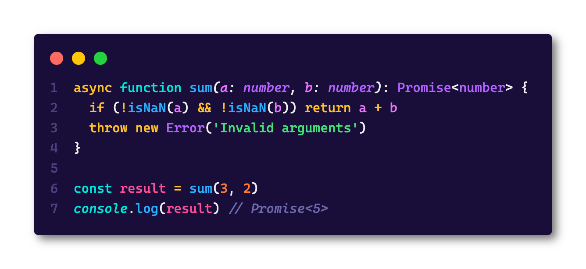

Agora execute `npx tsc ./sum.ts` e isso deve te dar um arquivo `sum.js` na mesma pasta, experimente executar esse arquivo usando `node sum.js` e ver o resultado!

### TSConfig

O arquivo de configuração do TypeScript é chamado de TS Config, e ele é o coração do projeto todo. A presença do arquivo `tsconfig.json` indica que essa é a raiz de um repositório TS, e vai ser lá que o TS vai buscar todas configurações para poder compilar o projeto.

Da mesma forma que estamos acostumados com o Node, quando invocamos o compilador do TS (o `tsc`) sem nenhum tipo de argumento, ele vai procurar o arquivo `tsconfig.json` mais próximo e vai ler esse arquivo para buscar as opções. Além disso você pode especificamente dizer qual é o arquivo de configuração que ele tem que usar com o `tsc -p <arquivo>`

Além disso você pode também sobrescrever quaisquer propriedades do `tsconfig.json` diretamente na [linha de comando](https://www.typescriptlang.org/docs/handbook/compiler-options.html) usando as opções especificadas diretamente, o que é bem útil quando você precisa alterar alguma coisa pra uma compilação específica.

Hoje eu quero passar pelas principais configurações do TSConfig e te explicar para que cada uma delas serve! Mas antes vamos entender a estrutura do arquivo:

#### Root Fields

Ele começa com os chamados _root fields_, que são as chaves que dizem para o TS quais são os arquivos que ele vai levar em conta:

-   `files`: Uma lista de nomes de arquivos que devem se incluídos no programa que você está compilando, por exemplo:

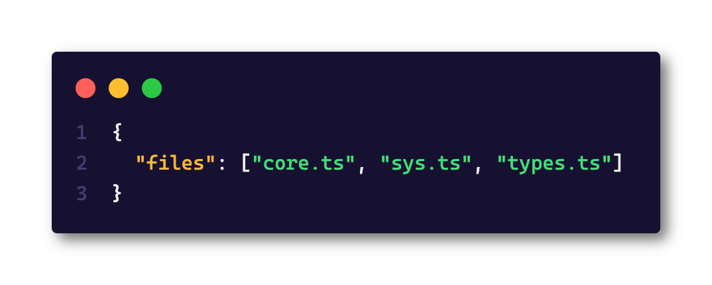

-   `extends`: Uma das funcionalidades mais poderosas do tsconfig, que permite que você estenda outros arquivos de configuração, inclusive, o TS tem os [arquivos base](https://www.typescriptlang.org/docs/handbook/tsconfig-json.html#tsconfig-bases) que são arquivos de configuração prontos e configurados que você pode estender diretamente do repositório com `extends: "@tsconfig/node16/tsconfig.json"`. Um outro uso muito útil para essa funcionalidade é quando você está trabalhando com monorepos que contém muitos projetos dentro, dessa forma você pode ter o arquivo base na raiz e modificar de acordo com cada projeto. Todas as configurações extras serão tratadas como modificações, inclusive se uma opção existir no arquivo base e for sobrescrita no segundo arquivo, a mais recente vai ser a que vale!

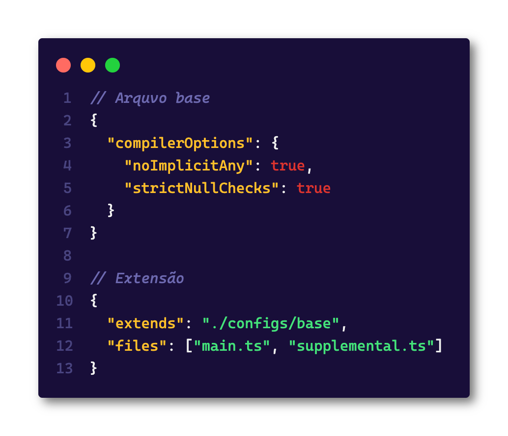

-   `include` e `exclude`: Da mesma forma que o `files` o `include` e o `exclude` vão controlar quais são os arquivos que você vai incluir no projeto, a diferença é que essas chaves aceitam _globs_, ou seja, expressões regulares que dão match em um ou mais arquivos. Eles são bem úteis quando você não tem como especificar uma lista de arquivos direta com o `files`

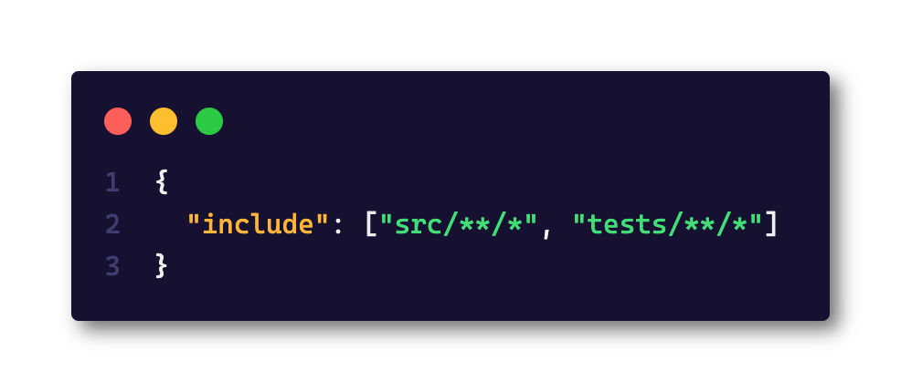

#### Compiler Options

Esse é o campo mais importante do arquivo, que é o local onde você define como o compilador do TypeScript vai se comportar. Essa sessão é extremamente longa e tem [muitas opções](https://www.typescriptlang.org/tsconfig#compilerOptions) então eu não vou listar todas aqui, mas vou falar de algumas que eu considero mais importantes e boas práticas.

-   `exactOptionalPropertyTypes`: É uma opção que faz com que campos opcionais em interfaces como `{ color?: 'blue' | 'red' }` sejam mais estritos. Este código seria resolvido para `color: 'blue' | 'red' | undefined`, com essa opção ativada, o `undefined` para de ser uma opção, então ou o campo está lá ou ele não está.
-   `noImplicitAny`: É uma das opções mais controversas do TS, a ideia é que essa opcão não permita que o TS faça a inferência automática de tipo para o `any`, que é o flagelo de todos os tipos do TS. Neste caso, quando temos funções como `const f = (s) => s` o TS vai reclamar que `s` é `any`. Eu fortemente recomendo que essa opção esteja ligada porque é a forma mais eficiente de somente deixar os `any`s que você quer no código.
-   `noImplicitReturns`: É outra opção da classe `noImplicit` que eu fortemente recomendo que estejam todas ativadas. Neste caso, essa opção vai garantir que todos os caminhos que você possa tomar **precisam** retornar um valor.
-   `module`: Modifica a forma como o TS vai carregar os módulos, geralmente você não vai mudar essa opção, mas cada uma delas vai se comportar de uma forma diferente, alterando o arquivo final. Aqui você pode definir se você quer que a forma de importação seja `CommonJS`, `UMD`, `AMD`, vários sabores de `ES` como `ES2020` e `node16` que integra automaticamente o suporte para ESModules usando as extensões `mts` e `mjs`.
-   `paths`: Uma opção interessante que deixa que você crie seus próprios import maps, dizendo para o TypeScript como ele deve carregar um arquivo, por exemplo, setar algo como:

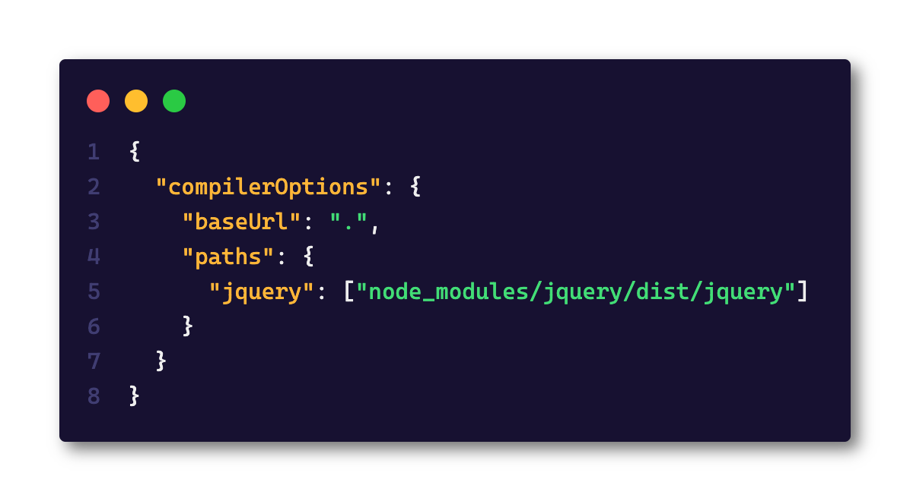

Vai permitir que você escreva `import 'jquery'` diretamente, da mesma forma que usar algo como:

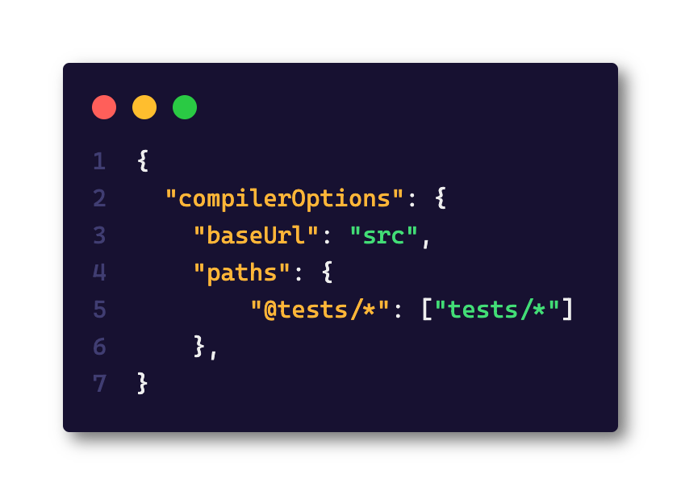

Vai permitir que você importe seus testes como `import '@tests/meu-arquivo.spec.ts'`.

Infelizmente não vou conseguir cobrir todas as opções aqui, mas além destas, você também pode configurar como editores se comportam, plugins e muito mais. A documentação completa está [aqui](https://www.typescriptlang.org/tsconfig)

## Finalizando

Foi um texto bem longo, mas espero que você tenha gostado! Nos próximos dias vamos ter ainda mais conteúdo então fica por ai!

Uma última coisa! Essa é a primeira vez que estou criando esse tipo de conteúdo então seu [feedback](https://forms.gle/vzrZBKGhLPc7cKDVA) é super importante! É mega rápido e me ajuda demais 🥰

## Para você treinar

Para os desafios de hoje vamos começar leve com o repositório sensacional do [Type Challenges](https://github.com/type-challenges/type-challenges) para você poder treinar!

A cada dia eu vou mandar o resultado do dia anterior e explicar a resolução, fique a vontade para compartilhar a sua solução comigo lá nas minhas [redes sociais](https://lsantos.dev)! Eu vou adorar 🤓

Os desafios de hoje são:

-   [Hello World](https://www.typescriptlang.org/play#code/PQKgUABBCMDMEFoIAkCmAbdB7CB1LATugCaSIIWVkBGAnhAIIB2ALgBZZP0BiArhAAoAAgENWAM14BKCAGIA7iIIBbBLwAOYMrJ0QAir1QBnFgEtOWqGkxYANHkIkAhJYgBJJhAAqtdaggAwmwimKhMAObG9vL+vEb+7Am+-ka0JqjKEKYs8ejiECw4xDiJECJG8QRmnAB0rtyEBWymRhAAxsGhEaj2tFj88qaYEEyoqMQFOB1ikU3+4lg2gxHtWMQJOMoiANYJbAnGORDq5a0CTCXJ7ftt2xCoBASERlJ1ZAAGnzlkwMD3AB5+NoscaTCDUFIsAimCJkFhXazYfBECYAXjKXA+n1cn3e3ygvwgfX4Rg4vBIEC2uyaLQg8kI2zhVxBJgg6IAooDUMCADzsgCOvBCPMRWGRJHsJmhEQAfDKse9XAF0KZbnMIO8vDs9v4giF0GFIu9wbwWIVPIUICYlCxVsQYeEnCgROp1PRkCJbg6XGQZRAAGqmVDyCCcCAAcWyyF41AAXBA2Gb1EZY78ch0agArIw1QjhYBwMAgYBaUAQAD6lar1arEAAmv0CIE1v40AR-DXO5WIMWtPC-CgMEjHGiMfRCagucDQZaIWUrVCHaWQBWuzXvIdAuVjKu17Xe6ZlOpCLb+-4AN4QAVC9D2TlAlj2AByWBYzHoAF8IOInpkAORCGeCDTF0kRGMAppDEYf59lcbTbq06IANpkPe3IsDyL5vlwIpDmKI5yrYqFThh17CqK4rEJKi6yjKREALrLrue7lhAfBVPsTYAMogsmzF7j2JagL6EBccE7ZEo2VqLJBnApgmSYpmmRgZtmuYEPmcDAGIRgxAQImBsG0noLJTDyYmLDJqmwDpmwWY5nmBawMARgydUZkiQAsoQuqdAa3TmYp1m2fZ6nhEWJZAA): Para começar de leve, você tem que fazer esse código parar de dar erros transformando `HelloWorld` em uma `String`
-   [If](https://www.typescriptlang.org/play#code/PQKgUABBBMBsAcEC0ECSAzSyk91gRgJ4QAKAhgG4CmANhAOI0CuAzgBYDWA9hRABQABAA5l2TAC4cAlBADEVUcVkSAljRZgss7RACKTKi3EquAO01RUAWyE0qVqqfERxbKhFV1xhIe4AGGAA8AMIANBAAKuEAYgB8fhAA7mwqAMZsEGSpqVRC4iwQqWYAJirGZhB+wX7hZC4AThJsxBRkzP4RNZmmxZkQ6G0sLW0GldF+AHSV1RAqBVQAHr6p4lS94lwQ+O5UZW71leKNVAlcB34D6idJKXaVnd29fuOFZKZb7m-E3r4TFhDRM4QRZkGx2ABc-z80PyWB+7gAghAALxodCBI4GcIAcjI2Jx+GxsSgwGAwKWVBWaxcm22EFx2LhPncACEUWjApcWFQcXiCUSIKTyctVutae5sYSsNC-P9iQA1FRURIQCr0MoACSY+HBEDY4nEQhY4NJ+XSEwAViwJmcAObAODwMAgYCaUAQAD6Xu9Pu9EAAmlwmAdglxiu4NVR6u5fbGvRAXZp4RywpEYsTUV83SBPXHfZFDM5gqJDLm837EyobGdnMmAN4QACiAEcmG1wo2KSsIABffr1LhWekCeFIdJtOymW2GYCeFiMsDJ1IlgqogDaWE7IsCLbbNECQUxPPpfPphNivKJF83XfEO9bbQP6K5x4Z4WgF5gsWvAF03WSRxYJBFhFYD6gHepF2ZYFwKBVEglMJgaBoS9+VibMy3LD0AWDVwowgABlVYjUw8sE1dUAsGJAi2DIaMIEIIMDhYLhmHKUxjT1A0jRNYAzTYS1rTtB0EGAN4WESKMqIgRVlQgFi2JMDjdX1Q1jVNFhzStG16ntR1gAU1QzA0KBiQAWTOdxglo5DHGnTjVJ4jStKE3TnVdIA): Pra deixar um pouco mais difícil, implemente um tipo chamado `If<C, T, F>` onde `C` é a condição que deve ser ou `true` ou `false`, `T` é o valor verdadeiro e `F` é o valor falso, então por exemplo:

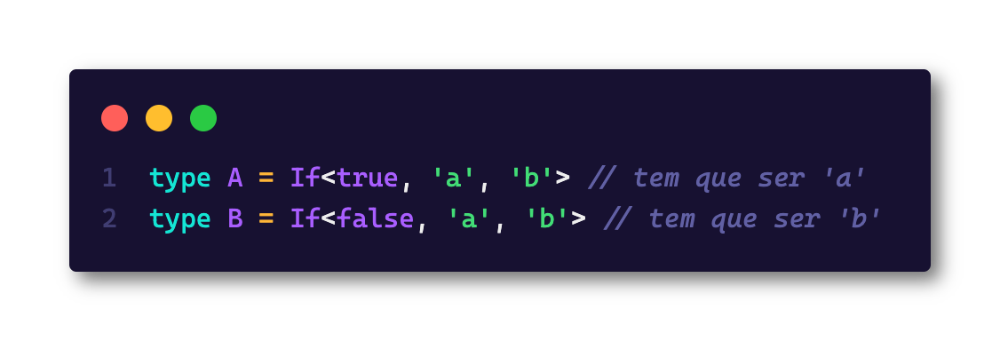

Te vejo amanhã! E não esquece de deixar o [seu feedback](https://forms.gle/6hAqjVmah9uyR4by8) sobre a semana [nesse formulário](https://forms.gle/6hAqjVmah9uyR4by8)!
