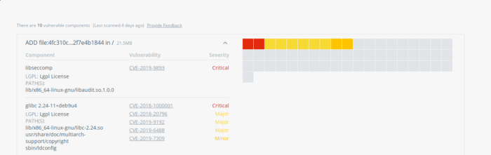
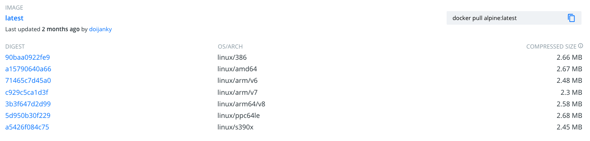

Recentemente li uma série de artigos do [Scott Coulton](https://itnext.io/@scott.coulton?source=post_page-----44b45e47a1f7----------------------)[^1][^2][^3] no Medium sobre como escolher as imagens base para seus containers. Decidi então escrever estes artigos para que outras pessoas também possam entender como escolher melhor como começar a criar seus containers usando Docker da melhor forma possível!

[^1]: [I Chose You Container Image - Part 1](https://itnext.io/i-cho-cho-chose-you-container-image-part-1-fa6671d9ae1f)
[^2]: [I Chose You Container Image - Part 2](https://itnext.io/i-cho-cho-choose-you-container-image-part-2-44b45e47a1f7)
[^3]: [I Chose You Container Image - Part 3](https://itnext.io/i-cho-cho-choose-you-container-image-part-3-b4eadb4f1573)

## Imagens Base

Quando começamos a criar nossas imagens, a primeira coisa que temos que nos preocupar é: Qual será a imagem base que vamos utilizar para a nossa aplicação?

Por exemplo, eu crio muitas imagens que utilizam o [Node.js](https://docs.microsoft.com/visualstudio/javascript/tutorial-nodejs?view=vs-2019&WT.mc_id=blog-personal-ludossan), portanto minha escolha natural seria utilizar uma imagem base do próprio Node, como a `node:14` que é uma [imagem oficial](https://hub.docker.com/_/node) presente no [DockerHub](https://hub.docker.com).

Porém eu poderia tranquilamente criar minha própria imagem tendo o [Node](https://docs.microsoft.com/windows/nodejs/setup-on-wsl2?WT.mc_id=blog-personal-ludossan) como uma ferramenta instalada ao invés de tê-la nativamente a partir da minha imagem base. Para isso, basta que eu escolha uma outra imagem base que contenha apenas o sistema operacional, poderíamos utilizar a imagem do [Debian](https://hub.docker.com/_/debian) e então criar um `Dockerfile` parecido com o seguinte:

```Dockerfile
FROM debian:buster 
RUN sudo apt update \ 
    && sudo apt upgrade -y \ 
    && sudo apt install -y curl \ 
    && curl -sL https://deb.nodesource.com/setup_14.x | bash - \ 
    && sudo apt install -y nodejs
```

O que não é muito diferente do que é feito [na imagem oficial](https://github.com/nodejs/docker-node/blob/1d6a051d71e817f3947612a260ddcb02e48c2f74/14/stretch/Dockerfile). Mas será que estamos criando uma imagem que possui os requisitos básicos para que ela seja utilizada por outras pessoas?

O que quero dizer com esta introdução é que temos que pensar muito além da imagem base. Qualquer imagem do [Docker](https://docs.microsoft.com/dotnet/architecture/microservices/container-docker-introduction/docker-defined?WT.mc_id=blog-personal-ludossan) precisa ser pensada para obter a melhor escalabilidade e usabilidade possível. Isto é feito com os seguintes requisitos:

-   O tamanho da imagem é pequeno o suficiente
-   A aplicação que executará dentro da imagem possui uma boa performance
-   A segurança está garantida dentro da imagem base

Para podermos atacar todas as partes, vamos trabalhar com linguagens compiladas – como Golang – na próxima parte deste artigo e, na última parte, vamos trabalhar com linguagens dinâmicas – como JavaScript ou Python.

## Tipos de imagens base

Para deixar a escolha diretamente a quem lê, não vou dizer se um sistema operacional é melhor que outro, afinal isto é uma escolha completamente pessoal. Ao invés disso, vamos trabalhar com três tipos de nomenclaturas:

-   Imagens `full`
-   Imagens `slim`
-   Imagens `alpine`

### Imagens Full


As imagens `full` (ou completas), são imagens que contém toda a extensão de um sistema operacional, por exemplo, uma imagem `debian-full` é uma imagem que possui a distribuição Debian do Linux por completo, com todos os pacotes e módulos carregados.

Este tipo de imagem é o melhor tipo de imagem para se começar e, provavelmente, o jeito mais simples de colocar uma aplicação no ar. Isto porque elas possuem todas as ferramentas e pacotes já instalados por padrão.  Neste artigo vamos apenas comparar as imagens e não vamos nos preocupar muito com as aplicações que vamos rodar dentro delas.

Um dos grandes problemas de imagens `full` é que, por terem muitos pacotes instalados por padrão, isso significa que existem muitos pacotes com vulnerabilidades comprovadas que também vem instalados por padrão. Isto abre portas para que um ataque possa ocorrer.

O próprio Docker Hub possui uma [ferramenta de análise de vulnerabilidades](https://docs.docker.com/docker-hub/official_images/#official-image-vulnerability-scanning) que pode ser utilizada diretamente do site, através da aba `Tags`. Como mostra a imagem a seguir.



Como você pode ver, a própria imagem tem vulnerabilidades que você está "herdando" antes mesmo de fazer qualquer _deploy_ do seu código.

### Imagens Slim


Uma imagem _slim_ é uma imagem um pouco menor. Toda a imagem _slim_ só possui os pacotes necessários para que o sistema operacional funcione, é esperado que você instale todos os pacotes extras para que sua aplicação possa funcionar. Atualmente, só o Debian possui uma imagem _slim_.

Um dos benefícios diretos do uso de imagens _slim_ é que, por ter menos pacotes, você tem menos dependências que podem estar sujeitas a vulnerabilidades. Veja um exemplo.‌


Outro ganho interessante é que, justamente por serem mais "limpas", imagens _slim_ são muito menores em tamanho do que uma imagem _full_. Em casos mais extremos, **uma imagem** _**slim**_ **pode ser até 50% menor do que uma imagem** _**full.**_ Veja o exemplo da comparação do `debian:buster` com o `debian:buster-slim`.


Agora veja o tamanho da imagem completa


Veja que, se pegarmos a arquitetura `amd64`, que é a mais comum para processadores de 64 bits, e compararmos as versões full com **48.06MB** contra os **25.84MB** da mesma imagem, só que na versão slim. Isso é uma redução de **47%** no tamanho da imagem. Tudo isso só removendo pacotes não utilizados.

### Imagens Alpine Linux


As imagens Alpine Linux são o tipo de imagem mais otimizada possível. Este tipo de OS foi construído do zero para ser um sistema operacional já nativo de containers. A principal diferença entre esse tipo de imagem para uma imagem tradicional é que esse sistema não utiliza a `glibc`. O Alpine depende de uma outra biblioteca chamada `musl libc`. Além disso, por padrão, o Alpine só vem com os pacotes base instalados, ou seja, qualquer outra coisa que sua aplicação precisar, você vai ter que instalar manualmente.

Isso pode parecer um pouco complicado, mas veja como reduzimos a quantidade de vulnerabilidades só por reduzir os pacotes. Perceba que não há nenhuma vulnerabilidade crítica.



Além disso, uma imagem `alpine` tem menos de **6MB** de tamanho **total.** No caso das imagens mais novas, esse tamanho pode chegar a pouco mais de **2MB.** Isso é uma redução de mais **95%** no tamanho geral da imagem.


Os contras de se trabalhar com uma imagem Alpine é que é um sistema completamente diferente, você terá de aprender a lidar com seu package manager nativo, como ele não usa as bibliotecas padrões do Linux, provavelmente a grande maioria dos sistemas precisarão ser recompilados utilizando as ferramentas do Alpine.

## Imagens Scratch


Por último, vamos dar uma olhada nas imagens do tipo `scratch`. Quando usamos `scratch` como imagem base, estamos dizendo ao [Docker](https://docs.microsoft.com/dotnet/architecture/microservices/container-docker-introduction/docker-defined?WT.mc_id=blog-personal-ludossan) que queremos que o próximo comando no nosso `Dockerfile` seja a primeira camada do nosso sistema de arquivos dentro dessa imagem.

Isso significa que não temos nenhum gerenciador de pacotes, nem mesmo pacotes. Somente um sistema de arquivos vazio. Você pode começar utilizando `FROM scratch`, já que este é um namespace reservado no DockerHub e não possui nenhum tipo de vulnerabilidade ou pacote instalado.

```Dockerfile
FROM scratch
ADD rootfs.tar.xz /
CMD ["bash"]
```

A maioria das imagens de sistemas operacionais começam deste modo, pois a maioria delas são consideradas imagens vazias. Que começam do absoluto zero.

## Conclusão

Vamos explorar um pouco mais sobre imagens e colocar esses conceitos em prática nos próximos artigos escrevendo uma aplicação em Go.

Fique ligado para mais novidades!
