We [recently talked](/service-mesh-1/) about **Service Mesh** and how this architecture pattern can save your project by giving it more observability and easier use.

We talked about Service Mesh in a pretty conceptual way. Now let's get our hands dirty and build our own mesh using [Linkerd](https://linkerd.io/)!

## Linkerd

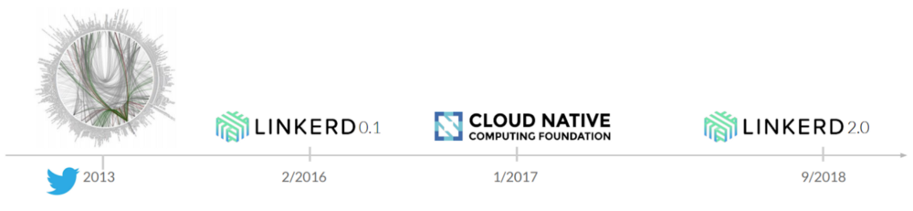

Linkerd is a project born inside Twitter in 2013, when the network was migrating its architecture from a layered platform to a microservices architecture. The **Linkerd** project went open source in 2016, in what became known as version 0.1.

In 2017, the project was donated to the [CNCF](https://www.cncf.io/) (Cloud Native Computing Foundation), an arm of the Linux Foundation dedicated to taking care of open source projects. Some [projects](https://www.cncf.io/projects/) like Kubernetes, Helm, Brigade, Harbor, Envoy and CoreDNS are part of this incredible foundation.

More recently, in 2018, Linkerd reached version 2.0. Linkerd v2 shipped fixing a bunch of problems and built on the lessons learned from v1. The initial project set out to be highly configurable, powerful and cross-platform. v2, on the other hand, aimed to be a lot simpler. The main design goals for version two were:

-   Zero configuration
-   Simple and lightweight
-   Built for Kubernetes

By default, Linkerd already gives us a bunch of native features:

-   **Protocol detection**: besides proxying TCP and gRPC traffic, Linkerd can automatically detect whether the traffic is HTTP or gRPC.
-   **HTTP 1.1/2 and gRPC proxy:** if any of these protocols are in use, Linkerd can natively extract metrics, proxy the traffic, retry logic and load balancing.
-   **Automatic and zero-config injection:** as we'll see further ahead, Linkerd is super simple to install, even in clusters with existing applications. That makes adopting the tool a lot easier.
-   **Automatic mTLS by default:** by default, all internal communication is encrypted using mTLS.
-   **Observability:** besides logs and metrics, Linkerd can build a service graph based purely on inbound and outbound traffic. All of it with metrics and data.
-   **Traffic splitting:** a fairly common technique for distributed applications is called _Canary Deployment_. That's when we deploy applications partially, by gradually redirecting part of the traffic to the new application while the old one is still running. Linkerd natively provides this feature.

### Architecture

To get a better grip on what we're doing, let's try to understand how Linkerd works and what architecture it follows. For that we have two concepts that are inherent to **service mesh**.

-   **Control Plane:** responsible for collecting and storing all the request information and also for controlling the flow of information.
-   **Data Plane:** where your application lives and where the data transfers actually happen.

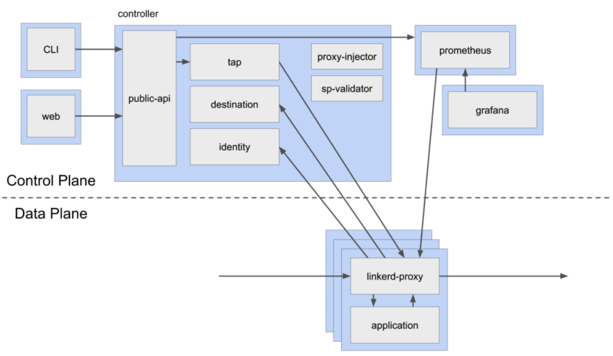

I won't walk through every layer of the system in full, since that's not the point of this article, but I'll talk a bit about each one so we can understand how all the parts talk to each other.

#### Proxy

The only piece that lives in the **data plane**. It's responsible for capturing information and metrics from the containers where your applications are running.

This is done by injecting two containers into your Kubernetes pods:

-   Init Container: runs before the pod's container and sets up the access rules, IP and routes so that all communication passes through the Linkerd proxy first.
-   Proxy Container: the layer that captures the requests and extracts metrics for analysis.

#### Controller

The piece with the most responsibilities. It holds Linkerd's core and has several functions:

-   Hosts the API server
-   Acts as a CA (certificate authority) for mTLS
-   Provides service discovery and load balancing information to the proxy
-   Enables **tap**, which is real-time inspection of network traffic on one or more routes/applications
-   Automatically injects the proxies into containers as they start

#### Web

One of the great things about Linkerd is that there's a web interface that shows and controls every aspect of the mesh.

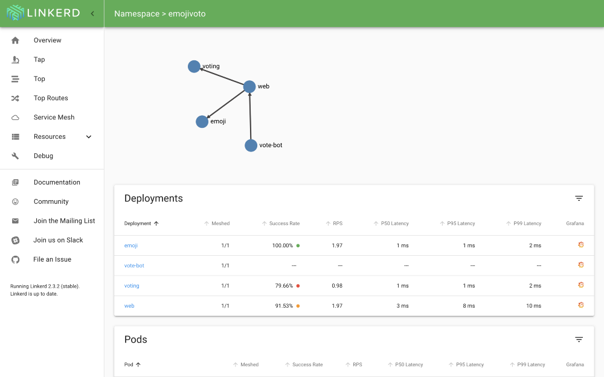

#### Prometheus

The service that collects the proxy's metrics. It fetches and temporarily stores the metrics collected from your applications.

Your Kubernetes cluster often already ships with its own Prometheus service, and Linkerd's own service isn't set up for analysis, only for performance, so it **doesn't store more than 6 hours of metrics**.

#### Grafana

Fetches metrics and shows them as graphs and dashboards.

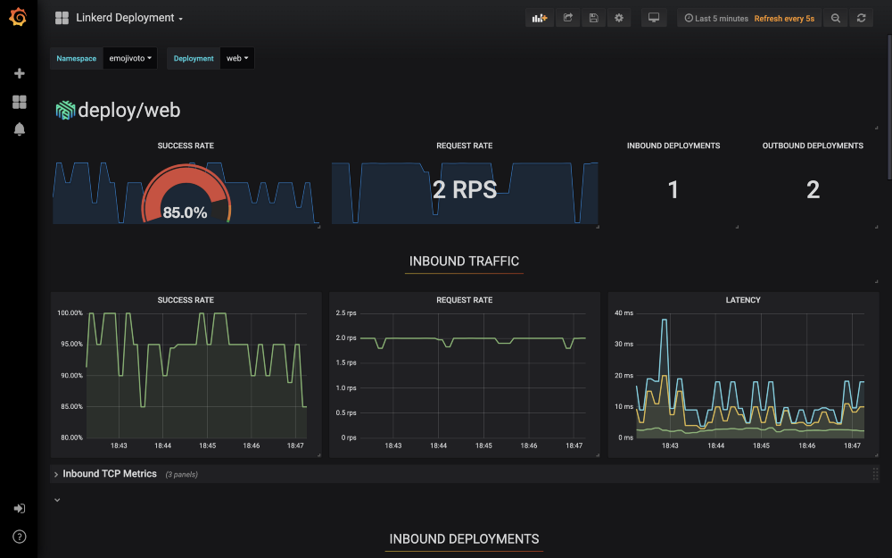

## What about Istio?

One of the main questions people ask when they look at Linkerd is:

> What's the difference between Linkerd and Istio?

Basically, there are some differences in focus, both in the platform itself and in the architecture. But in short, Linkerd is a tool more focused on performance than Istio is.

Istio is more focused on providing more tools and features and, because of that, it's more complex than Linkerd. In my opinion, using Linkerd is a lot easier for anyone just getting started with **Service Mesh** than Istio is.

## Building a service mesh

Time to leave the theory behind and get into practice! Let's get our hands dirty and understand how we can build a service mesh using Linkerd.

To run this hands-on, I'll create a cluster on [AKS](https://docs.microsoft.com/azure/aks/?WT.mc_id=personal-blog-ludossan), but you can do it on any Kubernetes cluster you have, **including one already in production**, since Linkerd isn't destructive and installs its own information in a separate namespace.

> You can also use solutions to run K8S locally, like [minikube](https://kubernetes.io/docs/tasks/tools/install-minikube/), [Docker](https://www.docker.com/products/docker-desktop) or [other options](https://kubernetes.io/docs/setup/).

Inside this cluster I'll deploy the application from the repository below.

https://github.com/Azure-Samples/aks-bootcamp-sample/tree/finished

This is a demo application that uses a frontend and a backend talking to each other. You can also follow along using a different application, like [Linkerd's own sample app](https://linkerd.io/2/getting-started/#step-5-install-the-demo-app).

I'll assume the cluster is already created and the application is already running, so we can jump straight to the part that matters.

## Installation

To run Linkerd, first we need to install the tool's command line with:

```sh
curl -sL https://run.linkerd.io/install | sh
```

And add it to our path with:

```sh
export PATH=$PATH:$HOME/.linkerd2/bin
```

> If you're on a Mac, you can install Linkerd with Homebrew, through `brew install linkerd`

### Validation

Before we actually install Linkerd on the cluster, let's run a validation with:

```sh
linkerd check --pre
```

This makes sure all the names and services are available for Linkerd to be installed.

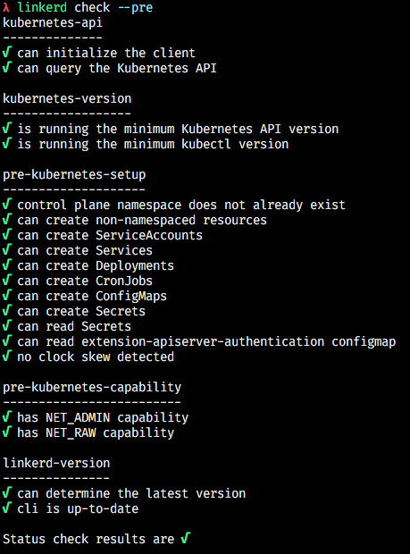

Then we run:

```bash
linkerd install | kubectl apply -f -
```

Notice that this command is actually a combination of two, because Linkerd doesn't install anything on the cluster itself, it just generates a YAML file as output that the cluster can use to create its workloads, which is why we pipe it into `kubectl apply -f -`. Try running just `linkerd install` and watch the files show up on screen.

Then, let's run the following command to check whether the whole process ran successfully:

```bash
linkerd check
```

If everything went well, you should get an output like this:

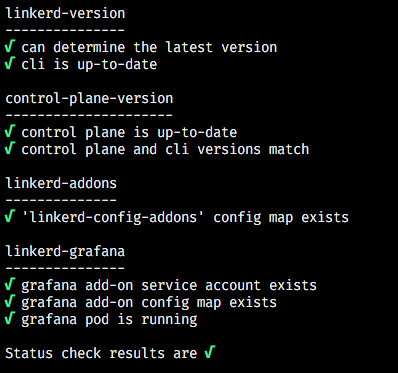

All of Linkerd's workloads get installed inside their own _namespace_ called `linkerd`, so you can look up all the resources we've talked about through **kubectl** with:

```sh
kubectl get all -n linkerd
```

## First impressions

To start getting a feel for how Linkerd works, you can type `linkerd dashboard &` and wait a few seconds for the web panel to open.

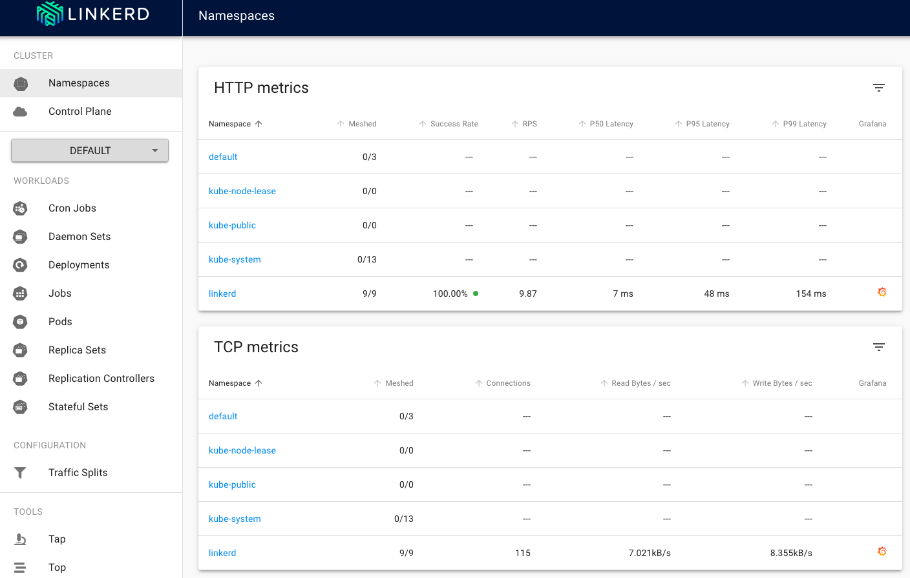

Through this panel you'll be able to run every one of Linkerd's features, as well as check your cluster's state. In a way, it can also act as a kind of dashboard for Kubernetes itself. Just take a look at the **Workloads** section in the side menu:

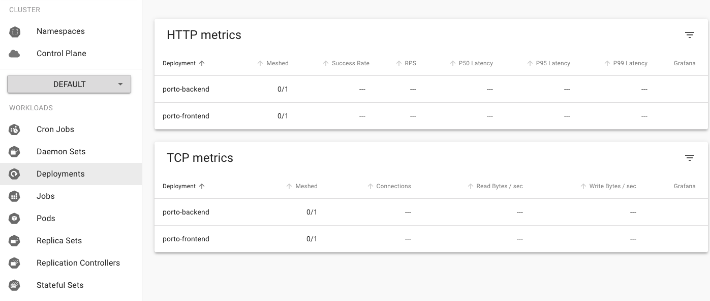

Notice that we're working in the default _namespace_. That can be changed through the selection menu.

### Control Plane

If we click the **Control Plane** section, we'll get an overview of our entire **Service Mesh**.

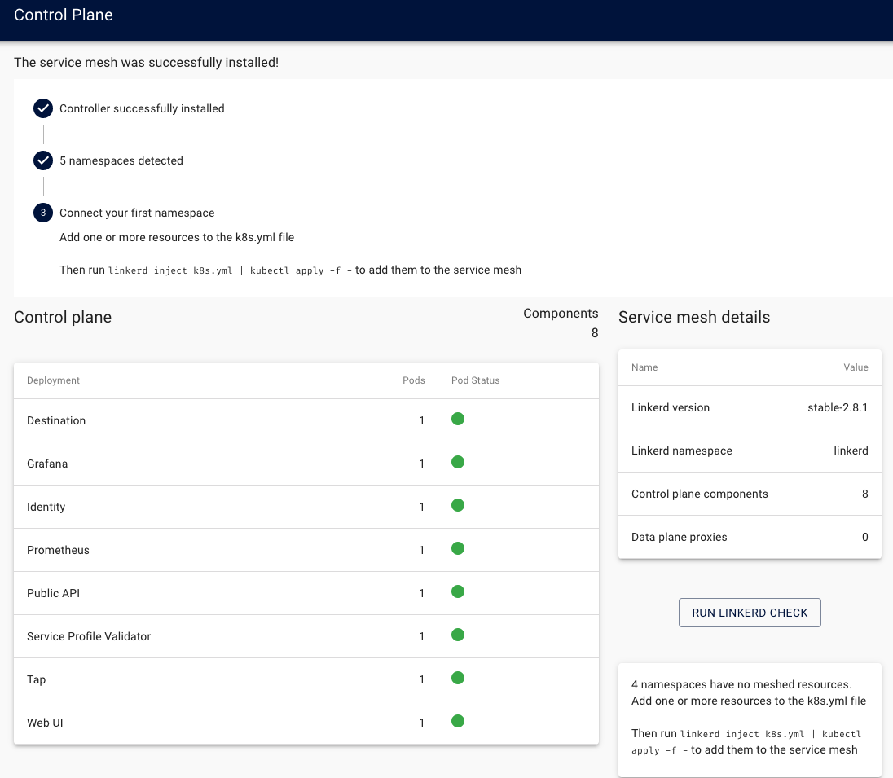

Notice that this panel shows us the whole system status and also how many components we have installed.

Further down, we can see how many namespaces are "meshed", meaning injected by Linkerd's proxy and generating metrics:

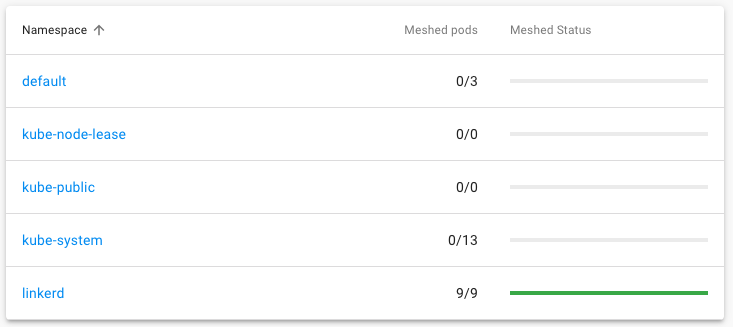

## Adding metrics

Our application lives in the `default` namespace, so how do we bring it into the **Service Mesh**? Simple! Let's run the following command:

```bash
kubectl get deploy -o yaml
```

Notice we get all the YAML files for our deployments, so let's pipe this command into `linkerd inject`:

```bash
kubectl get deploy -o yaml | linkerd inject -
```

Now look at the difference between the two files. The injected file will have an _annotation_ on the pod template, like this:

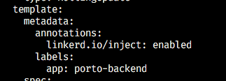

This is the only change made to your deployments, meaning it's very easy to inject Linkerd into services that **are already in production** without causing many side effects.

Let's apply the changes through another pipe into the `apply` command:

```bash
kubectl get deploy -o yaml | linkerd inject - | kubectl apply -f -
```

As soon as we apply the change we'll see some activity in the _Control Plane_, since it'll be reloading our pods to include them in the metrics:

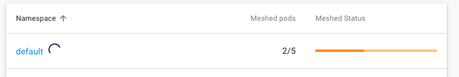

Notice that one of the pods isn't sending metrics... The MongoDB pod is outside the mesh, but why?

Because, in this example, it's a **StatefulSet** and not a deployment! So let's run the same command we ran before, but swap `deploy` for `sts`.

```bash
kubectl get sts -o yaml | linkerd inject - | kubectl apply -f -
```

> **Important:** _For this example I'm using a simple version of MongoDB inside the local cluster, you can use a version hosted by any provider, like Mongo Atlas, for example, or some other solution. The application just needs a MongoDB to work._

Now we have all the details:

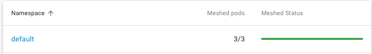

## Tools

Linkerd gives us a bunch of interesting tools, let's get to know some of them.

### Grafana

Click the _namespace_ name in the Control Plane tab.

Besides being able to check metrics inside Linkerd's own panel, we can also find a Grafana dashboard by clicking the small orange icon on the right corner.

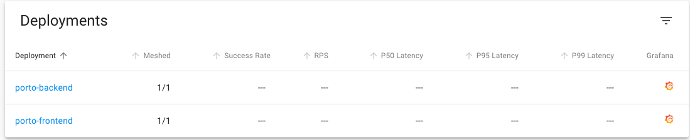

Let's open the panel for the `porto-backend` deployment:

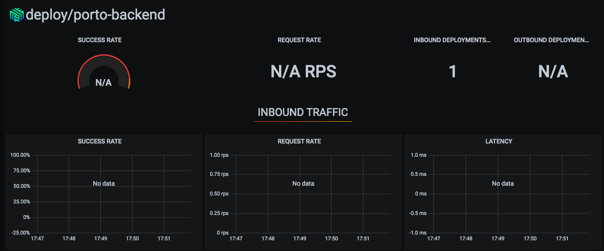

Notice the dashboard shows no data at all... Why? Because we haven't made any requests that could be captured yet! Let's go into our application and generate some traffic. To find your application's URL, use `kubectl get ing` to look up the ingresses and get the URLs from there.

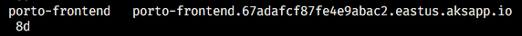

As soon as we start making some requests we can see some data coming in:

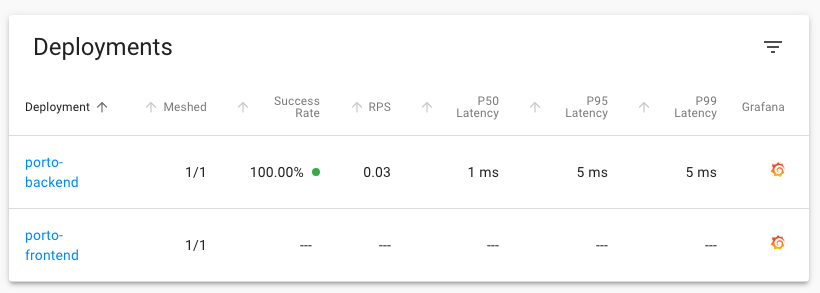

And we can see what's happening in Grafana's graphs too!

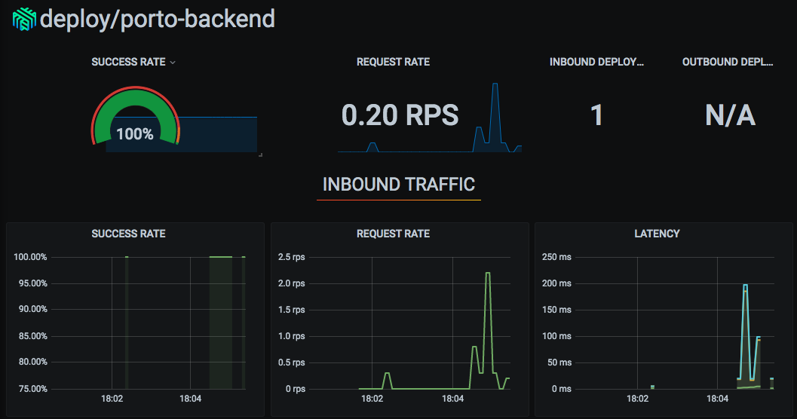

We also have TCP traffic metrics:

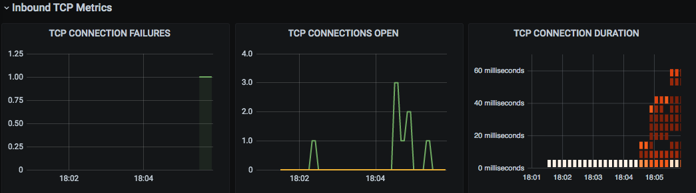

Besides this dashboard, there are other built-in dashboards that Linkerd itself already created.

### Real-time view

If we click our deployment inside the namespace view, we can see the calls being made in real time.

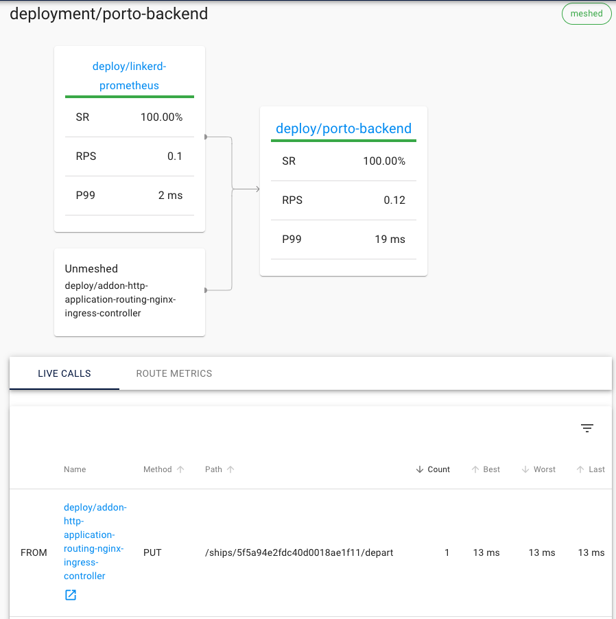

We can also see an app map that shows us which services are connected.

### Top

If we click the `Top` menu in the Tools section of the side menu, we can pick a namespace or resource to follow in real time. Select the `default` namespace and make a few requests to the application. Notice we start getting a live feed of metrics:

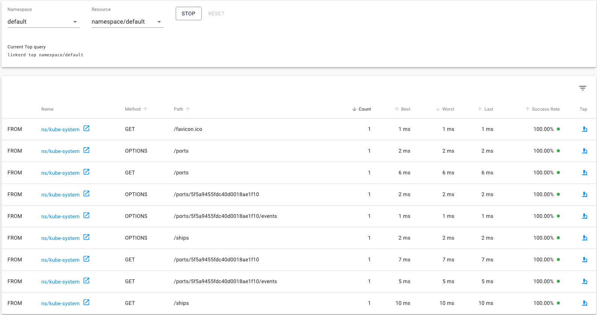

### Tap

Still in the same view, notice we have a microscope icon, this icon lets us watch that specific route in more detail.

Let's open the `Tap` tab in the side menu. Select the `default` namespace at the top and click `start`. As soon as we make a few requests, we can see all of them in real time.

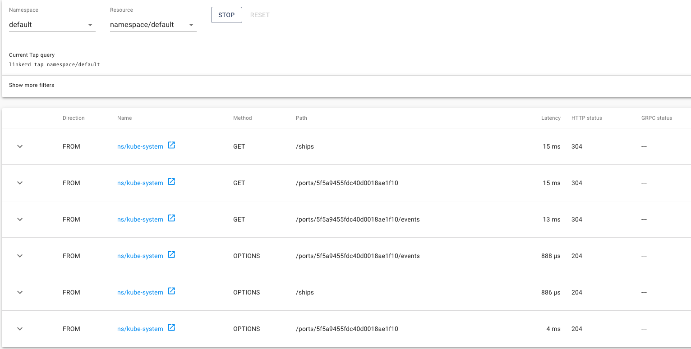

Clicking the left arrow gives us a detailed view of the request.

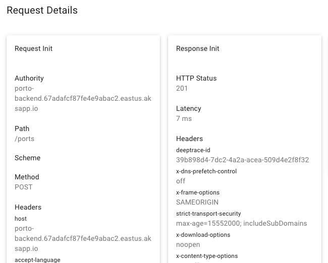

### Service graph

In my opinion, one of Linkerd's coolest features is the service graph. To get a good picture of how it works, let's go back to the **namespaces** view on the left menu and click the `linkerd` namespace.

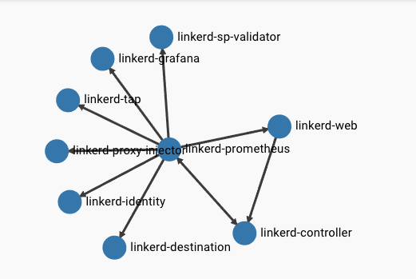

At the top of the screen we'll get a representation of the services talking to each other and which ones are sending requests. This is **really** useful when we're dealing with very large meshes.

## Removing Linkerd

To remove Linkerd from a namespace, just run:

```bash
kubectl get deploy -o yaml | linkerd uninject - | kubectl apply -f -
```

In other words, the same way we ran `inject`, we also run `uninject`.

## Conclusion

Linkerd can make life a lot easier for anyone building distributed applications. Being simple and easy to install gives it a big edge over other Service Mesh systems, and it can prove to be an excellent addition to your infrastructure.

Don't forget to subscribe to the newsletter to get this content plus weekly news! Like it and share your feedback in the comments!

See you!
