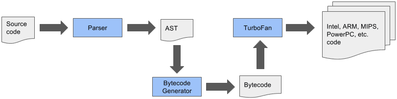
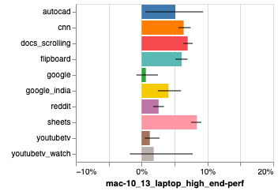
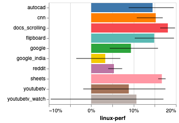

JavaScript is a box full of surprises. It looks like an extremely simple language that runs everywhere. But it's exactly that versatility that makes JS more and more complex.

A while back I published a [series of 10 articles](https://dev.to/khaosdoctor/node-js-por-baixo-dos-panos-1-conhecendo-nossas-ferramentas-34b6) about how NodeJS works under the hood. And a lot of what I said there isn't limited to NodeJS, it applies to JavaScript as a whole.

For example, V8 is the engine behind the main performance advances JavaScript has had over the years, and that came thanks to advances in the browser (mostly Chrome).

Let's understand what was recently added to V8, something that can be very beneficial to applications with a short lifespan, like CLIs and small sites. We're talking about the new, super fast compiler called **sparkplug!**

## Understanding V8

V8 is the main reason we have an extremely fast JavaScript today. To reach this level of efficiency, V8 has been refined for almost a decade to squeeze the most out of every step of building an application.

These steps are what we call the compilation _pipeline_. Think of it as a sequence of steps your application (your code) goes through to become code that's executable by the browser and, consequently, by the computer.

I won't go into detail on how it works here, because I already did that [in part 4 of my article series](https://dev.to/khaosdoctor/node-js-por-baixo-dos-panos-4-vamos-falar-do-v8-4pai), but today, we have the following pipeline:

Notice we have three main stages. The first is the code parser, where the code is parsed from text into an intermediate representation called **bytecode** (learn more about it [here](https://dev.to/khaosdoctor/node-js-por-baixo-dos-panos-8-entendendo-bytecodes-jib)) and handed to another interpreter called **Ignition**. Ignition's job is exactly that: optimize the bytecodes so the next compiler can optimize it even further.

In short, Ignition takes the full bytecode and optimizes it in a single pass, then hands it off to the next stage, which is **Turbofan**.

Turbofan is V8's optimizing compiler. It's split into layers that work to optimize different parts of the code at different times, and it also generates the final code for different system architectures.

## What's new

Since 2016 the V8 team has noticed that JavaScript's speed and performance bottlenecks are happening _before_ Turbofan compiles the code, that is, at the start of the pipeline.

Even though Ignition is pretty optimized and optimizes the code in a single pass, which lets it be served to the browser and run instantly, the performance still wasn't good enough.

This came to light after a change in how they were measuring performance. They stopped using so called _synthetic_ benchmarks (test tools like Octane) and started [using real browsing data](https://v8.dev/blog/real-world-performance) to measure the performance of sites and of the engine itself.

The problem here is that some things can't be optimized any further than they already are. For example, V8's parser is quite fast, but there are things a parser has to do that simply can't be removed from the pipeline.

On top of that, with a two-compiler model in the pipeline, there wasn't much room to split work further and squeeze out more performance, because the only way to make everything faster would be to remove optimization passes, which, in the end, just ends up reducing performance even more.

The solution: create a new compiler and stick it in the middle of the two.

This compiler was named Sparkplug.

## What is Sparkplug?

Sparkplug's main goal is to be fast, really fast. It's so fast that it's possible to almost completely ignore compile time and run a full recompile of the code at any moment.

The secret to that, honestly, isn't much of a secret, it's a hack. The reality is that it doesn't compile functions from scratch. They've already been compiled to bytecode before by Ignition, which already did most of the work figuring out variable values, whether parentheses are arrow functions, turning destructurings into assignments, and much more.

The real trick is that Sparkplug won't generate any intermediate representation (called IR). IR is basically code that sits halfway between machine code and bytecode, usually grouped in trios of instructions, and it's very common in most compilers. Instead, the code skips a few steps and gets compiled directly to machine code.[^n1]

That's great for speed, but unfortunately there isn't much you can optimize with just that information. That's why Sparkplug is a compiler with no optimizations.

So what's the point of all this, if it doesn't optimize the code? The big idea behind adding Sparkplug is that, even though it's just a serialization of the parser, it's still useful, because it precompiles all the steps that couldn't be optimized in the interpreter itself. This gives us a big performance boost just by removing those small, non-optimizable steps at the start.

According to the V8 team, Sparkplug's performance gains are 5-15% over not having the compiler at all!

Go read the [original article](https://v8.dev/blog/sparkplug) for a lot more information about how Sparkplug keeps this compatibility with the entire existing ecosystem!

[^n1]: An interesting fact is that Sparkplug is actually one big [`switch`](https://source.chromium.org/chromium/chromium/src/+/main:v8/src/baseline/baseline-compiler.cc;l=465;drc=55cbb2ce3be503d9096688b72d5af0e40a9e598b) inside a [`for`](https://source.chromium.org/chromium/chromium/src/+/main:v8/src/baseline/baseline-compiler.cc;l=290;drc=9013bf7765d7febaa58224542782307fa952ac14) that basically reads each bytecode individually and sends the instruction off to machine code generation
