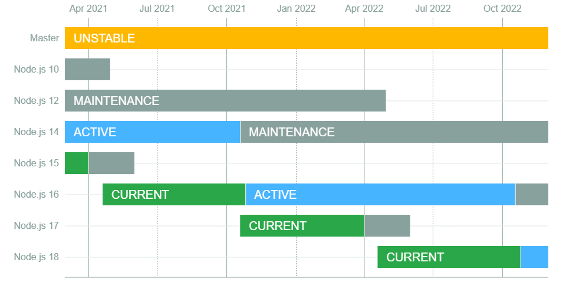

In April 2021, [Node.js 16 was released](https://medium.com/the-node-js-collection/node-js-16-available-now-7f5099a97e70). As usual, the even-numbered versions of the runtime are considered _production-ready_—the versions that'll be stable for production.

Right now, Node.js 14 is the LTS (Long Term Support) version through October 2021, while 16 is the _current_ version. After October, 14 moves into maintenance mode and 16 gets promoted to LTS. This means 14 gets security and maintenance updates only, while 16 gets active support. You can see all this on the [official release calendar](https://github.com/nodejs/Release#release-schedule).



This versioning matters. As you can see in the diagram, version 10 lost all support back in May—it was the last version that **didn't support ES Modules natively**. Now everyone maintaining a package or library on NPM can use the new structure by default.

Let's go through the main differences in this version.

## V8 updated to version 9.0

The world's most famous JavaScript engine was bumped to 9.0 in this Node.js release. It's not the newest version out there, but it comes with tons of cool stuff.

> In V8 9.1, you'll get [top-level await support](https://v8.dev/blog/v8-release-91#top-level-await), which makes life way simpler.

Beyond the usual performance and stability improvements, this version has a special change to regular expressions. Now the result of `exec` has a new key. Before, you couldn't tell where a matched string started and ended in a RegExp check—you didn't know which index it appeared at. Now, with the `indices` key, you can see exactly where the string starts and ends when it matches a RegExp with the `/d` flag set:

```js
const str = /(Java)(Script)/d.exec('JavaScript')

str.indices // [ [0,10], [0,4], [4,10] ]
str.indices[0] // [0,10] -> the whole string
str.indices[1] // [0,4] -> first group ("Java")
str.indices[2] // [4,10] -> second group ("Script")
```

## The `timers/promises` library is stable

Whenever you need a `setTimeout`, `setInterval`, or any timer function, you usually do one of two things:

- Wrap it manually into a promise

```js
function asyncTimeout (ms) {
    return new Promise((resolve) => setTimeout(resolve, ms))
}

;(async () => {
  await asyncTimeout(3000)
  console.log('Hello')
})()
```

- Use `util.promisify`

```js
const { promisify } = require('util')
const asyncTimeout = promisify(setTimeout)

;(async () => {
  await asyncTimeout(3000)
  console.log('Hello')
})()
```

Now we've got a native timers API with promises (it was in beta in Node 15):

```js
import { setTimeout } from 'timers/promises';
async function run() {
  await setTimeout(5000);
  console.log('Hello, World!');
}
run();
```

## Conclusion

We've got some really cool changes coming in Node.js. There's a lot to look forward to.
