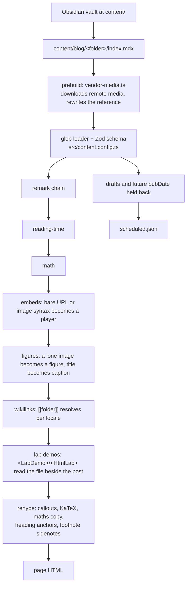
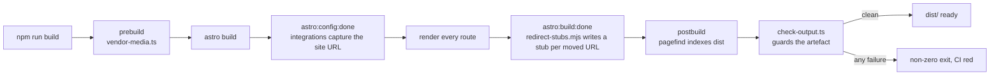
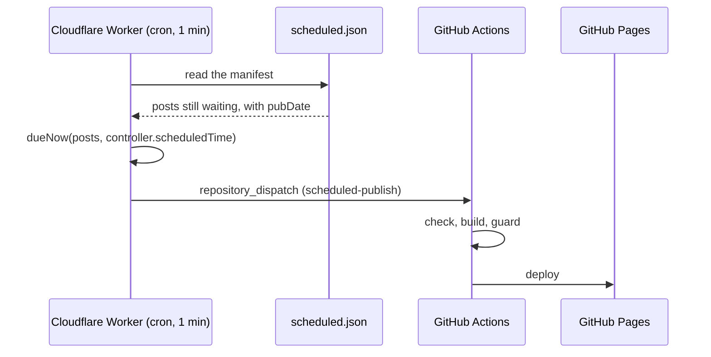
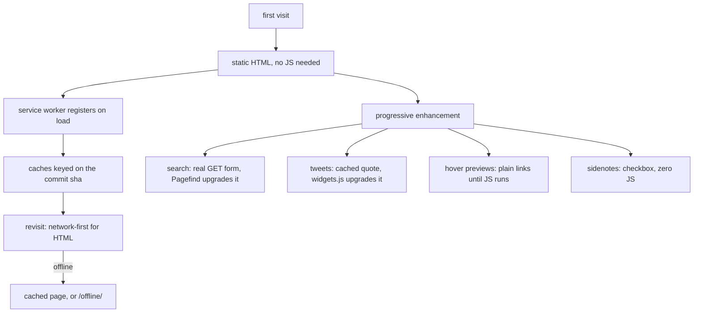
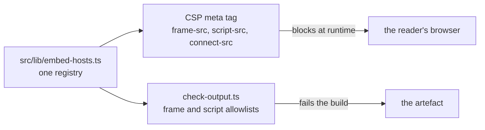

# Architecture

How the site is built and why. `content/WRITING.md` is the authoring reference, `docs/decisions-log.md` records what
was decided and why (in English), `docs/decisions.md` holds only what is still open (in Portuguese, being the owner's
own notes), `docs/design.md` holds the visual direction. This file is the machinery.

Astro 7, static output, no server, no database. Deployed to GitHub Pages. One author, writing in Obsidian.

## The content model

One folder per article. Every language of that article is a file inside it.

```
content/blog/error-cause/
  index.mdx                     lang: pt (the default)   ->  /error-cause/
  what-is-error-cause.mdx       lang: en, slug: ...      ->  /en/what-is-error-cause/
  image.png                     shared by both
```

- **The folder is the pairing.** Two files in one folder are translations of each other, which is where `hreflang`
  comes from. There is no `translationOf` field to keep in sync.
- **`lang` decides the language.** Nothing else does.
- **`slug` overrides the URL**, so an English article reads as English in the address bar. Without it, the slug is the
  folder name for `index.*` and the filename for anything else.
- **Portuguese stays at the root.** Every URL Ghost ever published still answers, which is the whole reason the
  migration kept flat URLs.
- Images are `./image.png` from either file, because they are in the same folder.

Posts are `.mdx` files whose content is **plain markdown**. Never an import, and a component tag only where markdown
has no syntax at all (`<Video>`, `<Sidenote>`, `<MarginNote>`, `<LabDemo>`, `<HtmlLab>`; the whole set is injected
into every post, which is why none of them is imported). Obsidian cannot open `.mdx` and cannot render component tags,
and Obsidian is the point of the rebuild, so the remark chain turns markdown into components at build time instead.
Do not "clean this up" by writing components in content.



Why each plugin exists, in the order they run:

| Plugin | Turns this | Into this |
|---|---|---|
| `remark-reading-time` | the body | a `readingTime` number in the frontmatter |
| `remark-math` + `rehype-katex` | `$...$` | rendered maths |
| `remark-embeds` | a bare URL or `` alone in a paragraph | `<YouTube>`, `<Vimeo>`, `<Tweet>`, `<SpeakerDeck>`, `<Spotify>`, `<Bookmark>` |
| `remark-figures` | a lone image whose title is set | `<figure>` plus `<figcaption>` |
| `remark-wikilinks` | `[[folder]]` | a link to that article in the reader's language |
| `remark-lab-demos` | `<LabDemo src="./components/X.vue" />` | the island, its import, and its source as a highlighted block |
| `rehype-callouts` | `> [!note]`, `> [!quote] Author` | a callout box, in Obsidian's own vocabulary |
| `rehype-math-copy` | a rendered formula | the same formula, copyable as LaTeX |
| `rehype-heading-anchors` | a heading | a `#` link to itself |
| `rehype-footnote-sidenotes` | a GFM footnote | the same note repeated in the margin |

`remark-embeds` runs before `remark-figures` because an image and a bare link are both "the only thing in a
paragraph", and once a figure is wrapped the link check would have to look one level deeper for nothing.
`remark-lab-demos` runs last because it is the only one that reads a file off disk and injects synthesized content.

Code blocks go through expressive-code, which replaces Astro's default Shiki setup and so has to be listed before
`mdx()` in `astro.config.mjs`. It carries the line numbers, the filename tab read from a first-line comment, and the
fourteen themes the reader picks between.

Both accept `` on purpose: Obsidian renders image syntax for YouTube and tweets as a live embed while you
write, so a post previews correctly in the editor.

## The build



What each step can fail on:

- **`vendor-media.ts`** never fails the build. A download that does not answer leaves the remote URL in the post and
  is listed in `.migration/unreachable-media.md`. Everything it does succeed at is committed, so the step is a no-op
  on the next run and the site stops depending on anyone else's server.
- **`astro build`** fails on a schema violation, a broken image path (the `image()` helper resolves it), an MDX parse
  error, or a wikilink pointing at a folder that does not exist.
- **`redirect-stubs.mjs`** fails if a redirect target is not in the output, so a stub can never point at a 404.
- **`check-output.ts`** is the post-build guard, and it exists because the previous Ghost site served an injected
  script for a month with nobody noticing. See Checks below.

The version in the footer is built during that render, by `src/lib/version.ts`: the semver from `package.json` plus
the number of commits since the tag of that version, as semver build metadata (`0.0.1+42`). A plus rather than a
dash, since in semver a dash would claim the release is a prerelease of the tag. It reads git, so CI checks out with
`fetch-depth: 0`: a shallow clone cannot see the tag or the history behind it, and the number would quietly be wrong
rather than failing anything. Outside a checkout entirely it renders the bare semver. With no tag cut yet, which is
where the repo is today, it counts from the root commit and starts counting from the tag on its own the moment one
exists.

## Publishing and scheduling

A future `pubDate` means scheduled. The build hides the post and lists it in `dist/scheduled.json`; a Cloudflare
Worker polls that file every minute and fires a `repository_dispatch` when a post comes due, which rebuilds the site.



Two things make this correct rather than nearly correct:

- **One instant per build.** `PUBLISH_CUTOFF` in `src/lib/posts.ts` is evaluated once per process and every
  publication cutoff compares against it. Astro settles the route table before rendering, so a build that straddles a
  `pubDate` and asks the clock twice can list a post on the homepage whose page was never generated.
- **The window follows the tick, not the clock.** `dueNow` uses `controller.scheduledTime`. A tick that Cloudflare
  runs 65 seconds late would otherwise produce a window that skips a whole-minute `pubDate` entirely, and the
  scheduler is stateless, so that post would never publish.

`check-output.ts` asserts the invariant those two produce: every non-draft post is either on the site or in the
manifest, never both, never neither.

## What the reader gets



Everything degrades to working HTML. The search page submits a real GET request, a tweet is a blockquote with a link,
a preview card is an ordinary `<a href>`, and the sidenote toggle is a checkbox.

## Trust boundaries

The Ghost site was compromised through a third-party integration token that could write into the page. Two mechanisms
exist because of that, and both read from one registry, `src/lib/embed-hosts.ts`.



- A host that may **run script** is separate from a host that may only be **named** in the output. Thumbnails and
  preconnect hints are the second kind, and `script-src` grants them nothing.
- The registry is never derived from the built output. An allowlist that grows to fit whatever appears in a page
  would let anything that can write a page grant itself permission, which is exactly the failure that happened.
- Adding an embed host is one line there. Both the CSP and the guard follow, so they cannot disagree.

Model-written translations are the only untrusted content producer in the system, so the translation pipeline has its
own gate: `scripts/check-translations.ts` rejects script tags, event handlers, `javascript:` URLs, unknown elements,
and, most importantly, MDX expressions and `import`/`export` lines, because in an `.mdx` file those execute during
the build.

## Checks

`check-output.ts` runs after every build and exits non-zero on any of these:

1. A post that is both published and still scheduled, or neither.
2. Leftover Ghost markup (`kg-` classes, `__GHOST_URL__`).
3. A component tag that leaked into the HTML as literal text.
4. A script, iframe, or URL inside an inline script pointing at a host that is not in the registry.
5. A missing feed, sitemap, manifest, 404 or robots file.
6. A manifest icon that does not exist in the output.
7. An image a page references that never reached the output.
8. A remote-script loader pattern: `new Function(`, `eval(await`, a raw gist URL.

## Layout

```
content/blog/<folder>/       posts, translations and their images
content/categories.json      what each section is about, per language. Read at build time
content/internal/            Obsidian templates and snippets, ignored by the build
src/pages/                   routes. [...slug] is Portuguese, en/[...slug] is English
src/components/              rendering. Injected into MDX, so content needs no imports
src/plugins/                 the remark chain, and the rehype plugins after it
src/integrations/            build hooks: redirect stubs
src/lib/                     posts, taxonomy, seo, embed-hosts, version
src/i18n/ui.ts               every string the chrome shows, both languages
scripts/                     build steps and guards
worker/                      the Cloudflare scheduler
```
