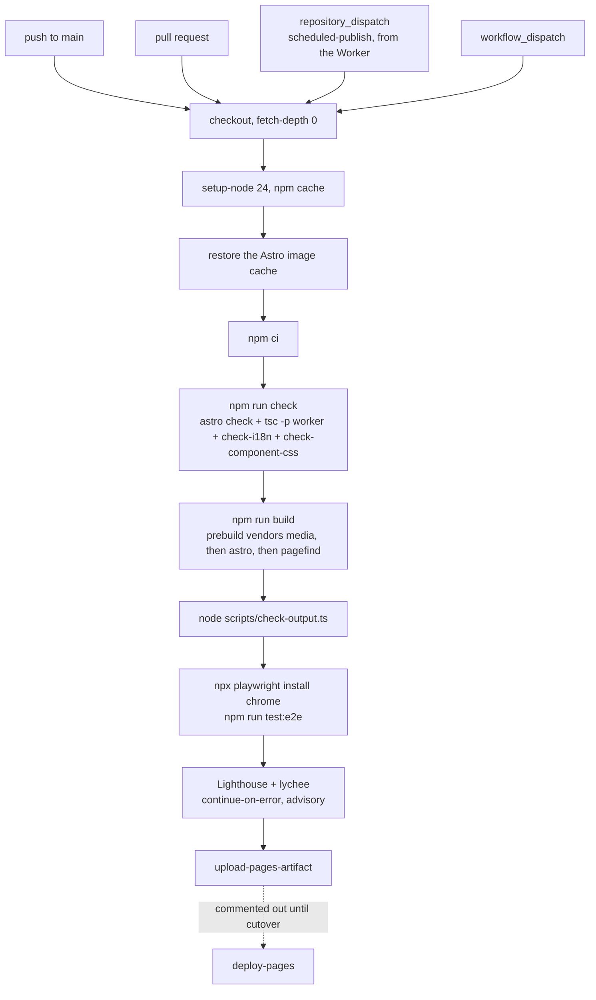
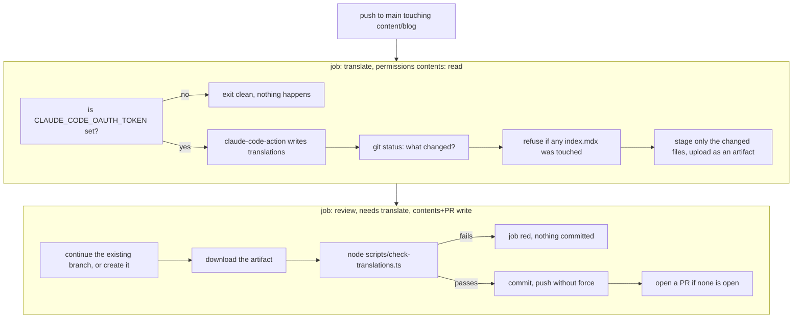
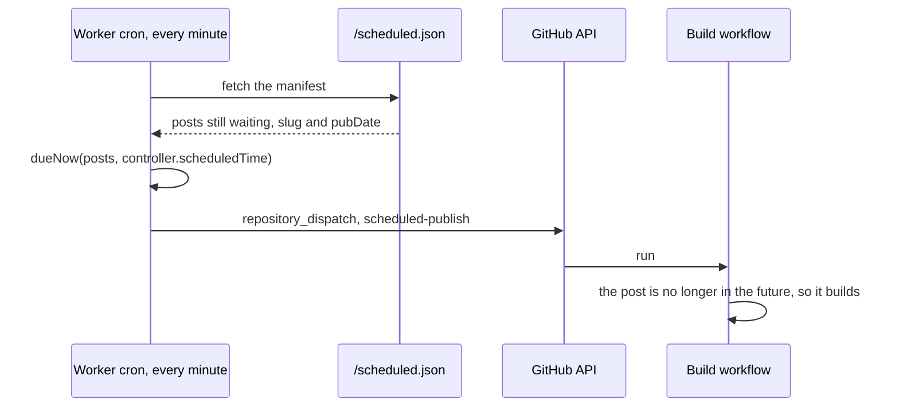

# CI

Three workflows and one Cloudflare Worker. Nothing is deployed yet: the deploy job in `build.yml` is commented out
and Pages is off until the DNS cutover.

Every `uses:` is pinned to a full commit SHA. A tag like `@v1` is a moving ref, so the action's owner decides what
runs on the runner, which is the same trust that cost the Ghost site a month of serving an injected script.
Dependabot watches the pins.

## Build



`fetch-depth: 0` is required: the footer version is the semver plus the number of commits since that version's tag
(`0.0.1+42`), and a shallow clone can see neither the tag nor the history behind it. See `src/lib/version.ts`.

**The end-to-end suite** runs after the artefact guard, against the same `dist/`. Everything before it reads the
output as text, so it is the only step that sees layout, the per-theme code colours a browser has to resolve, and the
markup a reader gets with scripting off. `playwright.config.ts` pins the `chrome` channel, hence the install step, and
starts its own `astro preview` when there is not one already on 4322. A failing run uploads its report as an artifact.
This one does fail the workflow.

**Lighthouse and lychee** run last, in the same job and against the same `dist/`. Lighthouse
([treosh/lighthouse-ci-action](https://github.com/treosh/lighthouse-ci-action), config in `lighthouserc.json`) audits
the output; [lychee](https://github.com/lycheeverse/lychee-action) checks links, internal and external, `--root-dir
dist` mapping the site's root-relative hrefs back to local files so no server has to run. `continue-on-error: true`
on each step means neither can fail the workflow or block a deploy: both are advisory, one as a job summary (lychee)
and one as an artifact plus a temporary public link (Lighthouse). They used to be a separate job downloading the
pages artifact, which made every run produce that artifact only to hand it over.

**Concurrency.** The group depends on the event, so a pull request can only ever cancel its own earlier runs:

```yaml
group: pages-${{ github.event_name == 'pull_request' && github.ref || 'main' }}
cancel-in-progress: ${{ github.event_name == 'pull_request' }}
```

A single constant group would let a PR push cancel an in-flight `repository_dispatch` publish, and the Worker's window
is 60 seconds with no persistence, so that post would never publish.

## Translate

Two jobs, because the model must never hold a token that can write.



Four things that matter here:

- **The artifact is the boundary.** Anything the model wrote outside the changed translation files dies with the
  runner.
- **The guard runs before the commit,** not after. `check-translations.ts` rejects script tags, event handlers,
  `javascript:` in an attribute, unknown elements, and MDX expressions or `import` lines, which execute during the
  build.
- **A source `index.mdx` may never be modified** by the model. The job fails loudly if one was.
- **No force push.** The commit is based on the remote tip, so the push is a fast-forward. If a human pushed to the
  branch in the meantime the push is rejected and the job goes red, saying nothing was overwritten.

Translations land as `content/blog/<folder>/<english-slug>.mdx` with `machineTranslated: true`, so each page carries
the banner offering the original until you edit it and set the flag to false.

## Scheduled publishing



The window is anchored to `controller.scheduledTime`, not to the wall clock. A tick that Cloudflare runs late would
otherwise produce a window that steps over a whole-minute `pubDate`, and since the Worker keeps no state, that post
would never publish at all. `worker/src/schedule.test.ts` covers exactly that case.

## Release

Manual, from the Actions tab. release-please opens the PR, merging it cuts the tag. `feat` is a minor, `fix` a patch,
`!` or `BREAKING CHANGE` a major, and `content:` is ignored, so publishing never moves the version.

## Credentials

| Secret | Used by | Without it |
|---|---|---|
| `CLAUDE_CODE_OAUTH_TOKEN` | Translate | the job exits clean and nothing is translated |
| `PUBLIC_CF_ANALYTICS_TOKEN` | `BaseLayout.astro`, read at build time | no analytics beacon is rendered. `build.yml` does not pass it into the build yet, so setting the secret alone changes nothing |
| Cloudflare account + a GitHub PAT with `contents:write` | the Worker | scheduled posts appear on the next push instead of on time |
| `REPLICATE_API_TOKEN` | `scripts/cover.ts`, run by hand | no generated covers |

## Running the same checks locally

```
npm run check                      # astro check + tsc -p worker + check-i18n.ts + check-component-css.ts
npm run build                      # prebuild vendors media, astro, pagefind
node scripts/check-output.ts       # the artefact guard CI runs
npm run test:e2e                   # the browser suite CI runs, reads dist/
node scripts/check-translations.ts # the translation guard CI runs
node scripts/clean-translations.ts # strips agent artefacts from translated files
```

Both guards emit GitHub Actions annotations when `GITHUB_ACTIONS` is set, so a failure lands on the file in the PR
diff rather than only in the log.
